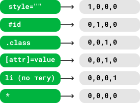
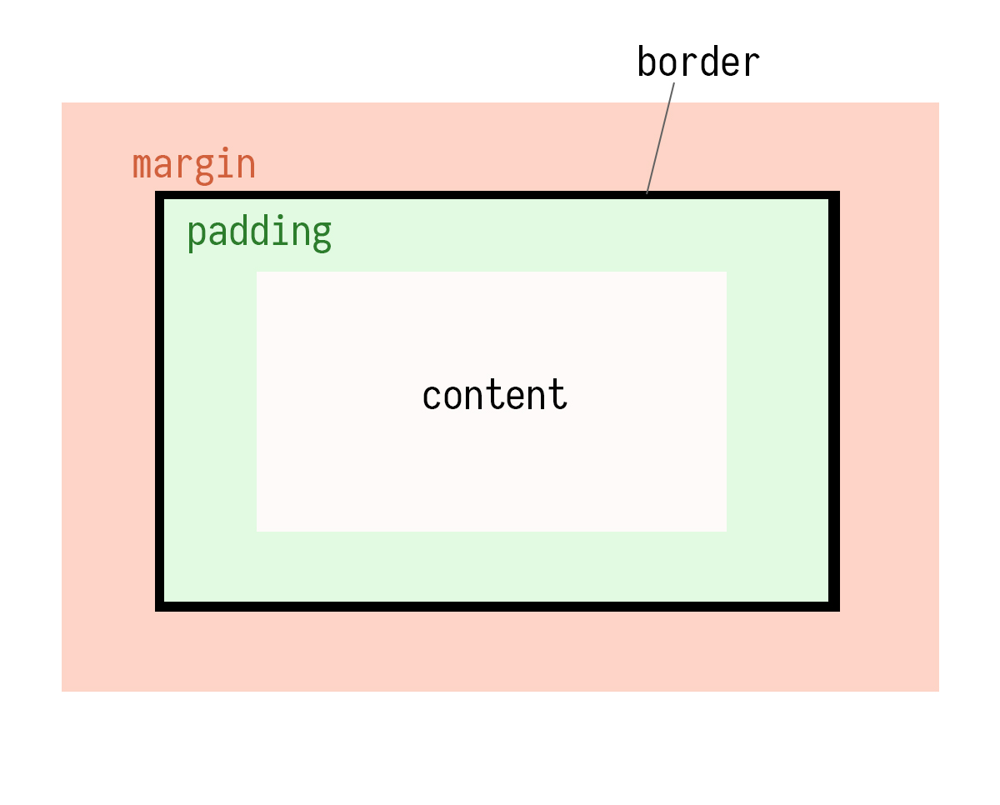
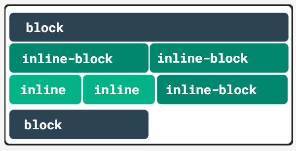
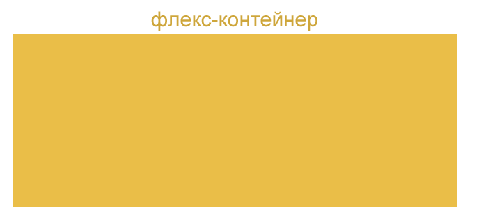
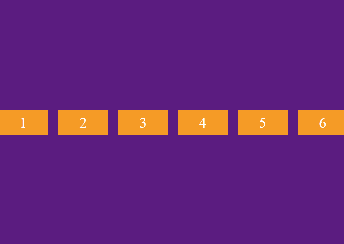

# Modul 6

### Selektoren kombinieren

|Selektorkombinator|Bedeutung|
|---|---|
|,|wählt alle passenden Knoten aus|
|Leerzeichen|wählt Elemente aus, die sich innerhalb des angegebenen Elements befinden (unabhängig von der Verschachtelungsebene)|
|>|wählt im Gegensatz zu Leerzeichen nur untergeordnete Elemente aus|
|~|wählt Elemente aus, die sich auf derselben Verschachtelungsebene nach dem angegebenen Element mit demselben übergeordneten Element befinden|
|+|wählt das Element unmittelbar nach dem angegebenen Element innerhalb desselben übergeordneten Elements aus|

### Selektorgewichtung



Mithilfe _!important_ kann man Gewichtung eines Selektors anheben. (Ist verboten zu benutzen).

### Maßen in CSS
|Einheiten|Beschreibung|
|---|---|
|px|Pixel|
|in|Zoll|
|cm|Centimetr|
|mm|Millimetr|
|pt|Punkt = 1/72 Zoll|
|pc|Pika = 12 Punkt|

__relative größen__
|Einheiten|Beschreibung|
|---|---|
|em|Schriftgröße des aktuellen Elements|
|ex|Zeichenhöhe x|
|ch|Zeichenbreite 0 des aktuellen Elements|
|rem|Schriftgröße des Stammelements|

|Einheiten|Beschreibung|
|---|---|
|vw|1% der Breite viewport|
|vh|1% der Höhe viewport|
|vmin|1% der min Änderung viewport|
|vmax|1% der max Änderung viewport|

### Block-Modell der CSS


### Position
Position - eine der Eigenschaften, mit der man Elemente in einer anderen Reihenfolge als im klassischen Dokumentenfluss anordnen kann.

Zusätzliche Eigenschaften, die die Position des Elements bestimmen:
- top
- right
- bottom
- left

Zusätzliche Eigenschaften funktionieren jedoch nur, wenn _position_ festgelegt ist.

|Wert der _position_|Bedeutung|
|---|---|
|position: static;|Das Element befindet sich in seinem normalen Zustand an seiner Stelle im Dokument. Die Eigenschaften _top_, _right_, _bottom_, _left_ und _z-index_ gelten nicht für ein solches Element. Dies ist der Standardwert.|
|position: relative;|Ein Element mit diesem Wert wird __relativ__ zu seiner normalen Position positioniert, indem die Eigenschaften _top_, _right_, _bottom_ und _left_ verwendet werden.|
|position: fixed;|Das Element wird relativ zum Ansichtsfenster positioniert, dh seine Position bleibt beim Scrollen immer gleich.|
|position: absolute;|Das Element wird relativ zu seinem nächsten Vorfahren positioniert (anstatt wie fixiert relativ zum Ansichtsfenster positioniert zu werden). Wenn ein absolut positioniertes Element keine positionierten Vorfahren hat, verwendet es den Hauptteil des Dokuments und bewegt sich mit dem Scrollen der Seite.|
|position: sticky;|Ein Element ist "klebrig", wenn der Darstellungsbereich der Seite eine bestimmte Position erreicht. Kann als "klebrige" Positionierung übersetzt werden.|

# Modul 7

## _display_-Property

Die _display_-Property steuert, wie ein HTML-Element angezeigt wird. 

- display: block;
- display: inline;
- display: inline-block;
- display: none;
- display: flex;
- display: grid;



___Blockelemente___ (\<div>, \<h1>-\<h6>, \<header>, \<p>) sind ein rechteckiger Bereich, der die gesamte mögliche Breite einnimmt. 

___Inline-Elemente___ (\, \<span>, \<a>, \<q>, \<code>) sind ein direkter Teil einer Zeile und werden verwendet, um das Erscheinungsbild von Text logisch hervorzuheben oder zu ändern. Daher entspricht ihre Breite in einer normalen Situation dem Inhalt plus Rahmen und Polsterung, und die Eigenschaften in Bezug auf Größen gelten nicht für sie.

### block
Bildschirmsperre; ändert die Situation für Inline-Elemente vollständig. Wie Sie im folgenden Beispiel sehen können, nimmt span, das normalerweise verwendet wird, um den Stil eines bestimmten Textelements zu ändern, jetzt die volle bereitgestellte Breite ein, und es kann eine Höhe angegeben werden. Ein Element, dessen Anzeigeeigenschaft auf Block eingestellt ist, verhält sich wie ein Blockelement, unabhängig davon, ob es tatsächlich ein Blockelement ist oder nicht.

### inline
Eigenschaftsanzeige: Inline; Stattdessen verhalten sich Elemente auf Blockebene wie Inline-Elemente. Wenn ein Element diesen Wert hat, verhält es sich wie ein Inline-Element (solche Elemente werden nacheinander in derselben Zeile platziert). Breite und Höhe eines Elements werden durch den Inhalt bestimmt und können nicht verändert werden. Sie können beliebige Größenwerte für ein leeres Element mithilfe von Padding und Rändern festlegen, wie dies im Beispiel unten getan wird.

### none
Ein Element mit __display: none;__ vollständig aus dem Layout der Seite verschwinden. Es wird kein Platz dafür reserviert, seine Anwesenheit kann nur aus der Dateistruktur erkannt werden. Diese Eigenschaft wird häufig verwendet, um Dropdown-Menüs auf Seiten zu organisieren. Es sollte nur sichtbar sein, wenn der Benutzer die Maus über ein Listenelement bewegt, ansonsten erscheint das Menü in keiner Weise. Das heißt, allen seinen Elementen wird die Eigenschaft __display: none;__ zugewiesen.

### inline-block
Eigenschaftsanzeige: Inline-Block; ermöglicht es dem Element, innerhalb der Linie zu bleiben, behält aber gleichzeitig eine Reihe von Blockeigenschaften bei, von denen die wichtigsten die Abmessungen sind.

### flex
Die Eigenschaft _display: flex_ wird nicht dem Element, der Positioniert werden soll, eingegeben. Sondern dem Container in dem Elemente plaziert werden müssen.

Es gibt 2 Achsen, Hauptachse:


und zusätzlich Achse:


Nach dem Hinzugüfen der Eigenschaft _display: flex;_ dem Container werden alle darin enthaltene Element entlang der Hauptachse ausgerichtet. Mit _flex-direction_ Position und Reihnfolge der Elemente bestimmen.

# Modul 8

## Transition

Animationen macht Design schöner, kann aber Performance beeinflussen.

Transition - ist eine CSS Eigenschaft für einfache Übergänge.

_transition_
```css
transition: background-color 1s ease 0.5s, padding 1s ease-out 0s;

/*background-color - Zeigt was verändert wird*/
/*1s - Zeit für die Animation*/
/*ease - Szenarium der Animation*/
/*0.5s - Zeit verzögerung, wann beginnt die Animation*/
```

_transition-duration_`
```css
/*Zeit für Animationsdauer*/
transition-duration: 1s;
```

_transition-property_
```css
/*Properties, die Animiert werden*/
transition-property: background-color, box-shadow;
```

_transition-delay_
```css
/*Verzögerung der Animation*/
transition-delay: 1s;
```

_transition-timing-function: ease-in-out_
```css
/*Wie die Animation verläuft, bei mehreren properties kann man mehrere Funktionen angeben*/
transition-timing-function: ease-in-out;
```

|Funktion|Bedeutung|
|---|---|
|ease|Функция по умолчанию, переход начинается медленно, разгоняется быстро и замедляется в конце. Соответствует cubic-bezier(0.25,0.1,0.25,1).|
|linear|Переход происходит равномерно на протяжении всего времени, без колебаний в скорости. Соответствует cubic-bezier(0,0,1,1).|
|ease-in|Переход начинается медленно, а затем плавно ускоряется в конце. Соответствует cubic-bezier(0.42,0,1,1).|
|ease-out|Переход начинается быстро и плавно замедляется в конце. Соответствует cubic-bezier(0,0,0.58,1).|
|ease-in-out|Переход медленно начинается и медленно заканчивается. Соответствует cubic-bezier(0.42,0,0.58,1).|
|cubic-bezier(x1, y1, x2, y2)|Позволяет вручную установить значения от 0 до 1 для кривой ускорения. Подробнее о cubic-bezier.|
|initial|Устанавливает значение свойства в значение по умолчанию.|
|inherit|Наследует значение свойства от родительского элемента.|


## CSS animation & @keyframes

@keyframes - ermöglicht eine Animation sehr komplex zu gestalten. Hiermit kann man verschieden Werte der CSS-Props in den verschiedenen Punkten/Fasen der Animation anzugeben. 
```css
@keyframes myAnimation {
    from {
        text-shadow: 0 0 3px black;
    }
    50% {
        text-shadow: 0 0 30px black;
    }
    to {
        text-shadow: 0 0 3px black;
    }
}
```

_animation-name_ - 
```css
<div class="myAnimation"></div>

body {  
  display: flex;
  align-items: center;
  justify-content: center;
  flex-direction: column;
  margin-top: 30px;
}
.myAnimation {
  background: lightblue;
  border-radius: 100%;
  width: 100px;
  height: 100px;
  animation: pulsing;
}
 
@keyframes pulsing {
  0% {
    transform: scale(0.5, 0.5)
  }
  50% {
    transform: scale(1.0, 1.0);
  }
  100% {
    transform: scale(0.5, 0.5);
  }
}
```

_animation-duration_ - Dauer der Animation
```css
body {  
  display: flex;
  align-items: center;
  justify-content: center;
  flex-direction: column;
  margin-top: 30px;
}
.myAnimation {
  background: lightblue;
  border-radius: 100%;
  width: 100px;
  height: 100px;
  animation: pulsing 2s;
}
 
@keyframes pulsing {
  0% {
    transform: scale(0.5, 0.5)
  }
  50% {
    transform: scale(1.0, 1.0);
  }
  100% {
    transform: scale(0.5, 0.5);
  }
}
```

_animation-iteration-count_ - Anzahl der Wiederhollungen der Animatin
```css
body {  
  display: flex;
  align-items: center;
  justify-content: center;
  flex-direction: column;
  margin-top: 30px;
}
.myAnimation {
  background: lightblue;
  border-radius: 100%;
  width: 100px;
  height: 100px;
  animation-iteration-count: infinite;
  animation-duration: 2s;
  animation-name: pulsing;
}
 
@keyframes pulsing {
  0% {
    transform: scale(0.5, 0.5)
  }
  50% {
    transform: scale(1.0, 1.0);
  }
  100% {
    transform: scale(0.5, 0.5);
  }
}

/*Kurzschreibweise*/
animation: pulsing 2s infinite;
```

_animation-play-state_ - Animationssteuerung _running_ und _paused_
```css
body {  
  display: flex;
  align-items: center;
  justify-content: center;
  flex-direction: column;
  margin-top: 30px;
}
.myAnimation {
  background: lightblue;
  border-radius: 100%;
  width: 100px;
  height: 100px;
  animation-iteration-count: infinite;
  animation-duration: 2s;
  animation-name: pulsing;
}
.myAnimation:hover {
  animation-play-state: paused;
}
 
@keyframes pulsing {
  0% {
    transform: scale(0.5, 0.5)
  }
  50% {
    transform: scale(1.0, 1.0);
  }
  100% {
    transform: scale(0.5, 0.5);
  }
}
``` 

_animation-fill-mode_ - was passiert mit dem Objekt nach der Animation
|||
|---|---|
|__none__|Objekt kehrt wieder zum Ursprungszustand|
|forwards|Objekt bleibt in dem Zustand der Animation bei 100%|
|backwards|Zustand bis zur Animation|
|both|


# Modul 10 (JavaScript)

## Arrays
```javascript
// type of array
typeof [];
"object"

// length
const arr =  [1, 2];
console.log(arr.length);
2

// Array.isArray()
const arr =  [1, 2];
console.log(Array.isArray(arr));
true
```

### Array-Methoden
_.push(...items), .unshift(...items)_ - Elemente am Ende / am Anfang des Arrys anfügen
_.pop(), .shift()_ - Elemente am Ende / am Anfang des Arrys löschen
_.splice(index[, deleteCount, elem1, ..., elemN])_ - Elemente löschen / anfügen
_.concat()_ - Arrays konkatenieren

```javascript
let arr = [ "orange"];
arr.unshift("apple");// arr = ["apple", "orange"];
arr.push("strawberry");// arr = ["apple", "orange", "strawberry"];
arr.shift(); //arr =  ["orange", "strawberry"];
arr.pop();// arr =  ["orange"];
```

_.map(function)_ - geht durch Array durch und bearbeitet die Elemente entsprechend der funktion (es entsteht eine neues Array)

```javascript
let result = arr.map(function(item, index, array) {

  // gibt eine neues Element zurück
  // item — aktueller Element des Arrays
  // index — Index des aktuellen Elements
  // array — Array

});
```

_.reduce(cb) или reduceRight(cb)_ - akkumuliert die Elemente des Arrays

```javascript
let result = arr.reduce(function(previousValue, item, index, array) {

  // ...
  // item — aktueller Element des Arrays
  // index — Index des aktuellen Elements
  // array — Array

}, [initial]);
```

## Schleifen

```javascript
for(let i = 0; i < 10; i++) {...}

for(let i in object) {...}

while(){...}

do {...} while()

arr.forEach(function(item, index, array) {
  ...
});
```

## Map
```javascript
// Kann beliebigen Typ als Schlüssel benutzen
let map = new Map(); // Map anlegen

map.set("1", "string"); // Wert anfügen

map.get(1); // Wert auslesen 

map.size; // größe erfahren

// schleife über map
for (let name of fruits.keys()) { // .keys() - gibt Schlüssel zurück
  console.log(name); // apple, strawberry, blueberry
}

for (let color of fruits.values()) { // .values() - gibt Werte zurück
  console.log(color); // green, red, blue
}

for (let elem of fruits) { // gibt Schlüssel Wert nach einander
   console.log(elem); // apple, green, strawberry, red, blueberry, blue
}
```