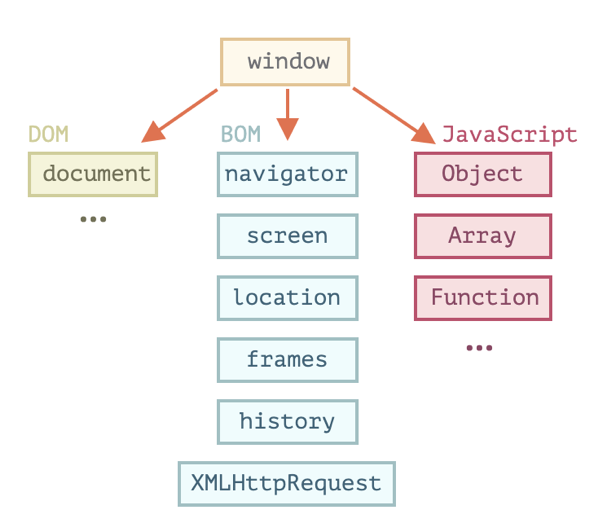
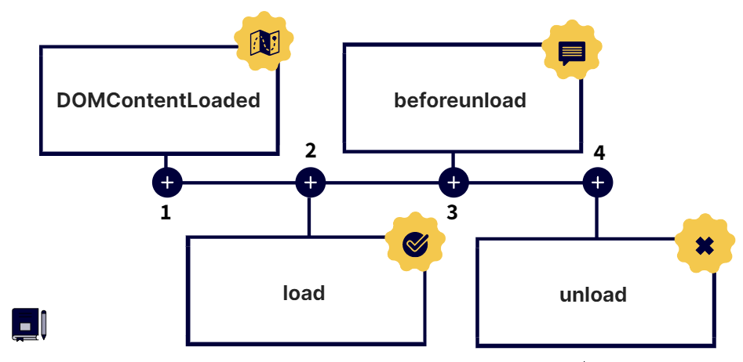
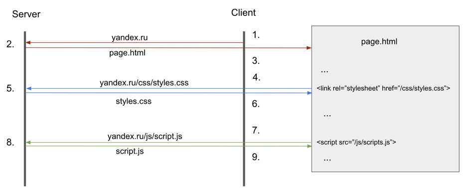
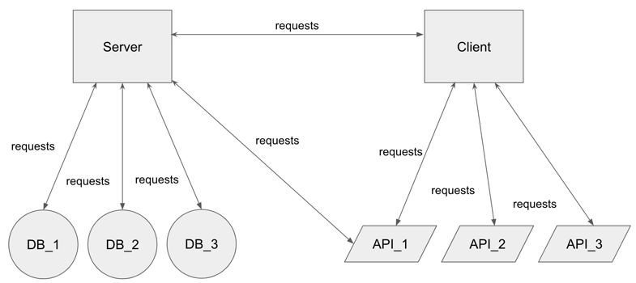
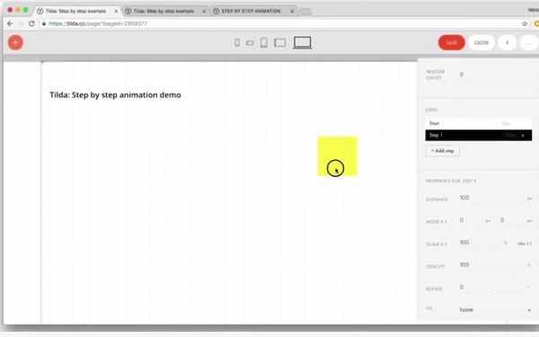
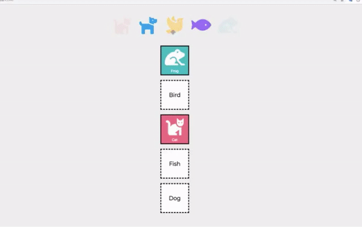
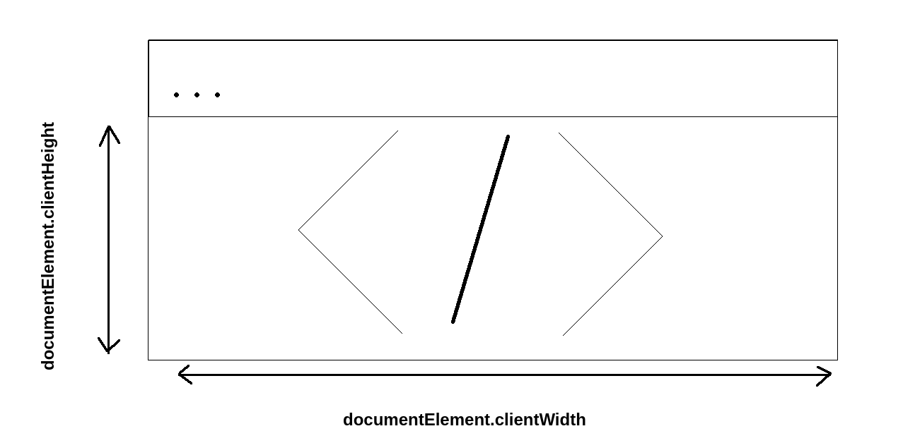

# Modul 10 (JavaScript)

## Arrays
```javascript
// type of array
typeof [];
"object"

// length
const arr =  [1, 2];
console.log(arr.length);
2

// Array.isArray()
const arr =  [1, 2];
console.log(Array.isArray(arr));
true
```

### Array-Methoden
_.push(...items), .unshift(...items)_ - Elemente am Ende / am Anfang des Arrys anfügen
_.pop(), .shift()_ - Elemente am Ende / am Anfang des Arrys löschen
_.splice(index[, deleteCount, elem1, ..., elemN])_ - Elemente löschen / anfügen
_.concat()_ - Arrays konkatenieren

```javascript
let arr = [ "orange"];
arr.unshift("apple");// arr = ["apple", "orange"];
arr.push("strawberry");// arr = ["apple", "orange", "strawberry"];
arr.shift(); //arr =  ["orange", "strawberry"];
arr.pop();// arr =  ["orange"];
```

_.map(function)_ - geht durch Array durch und bearbeitet die Elemente entsprechend der funktion (es entsteht eine neues Array)

```javascript
let result = arr.map(function(item, index, array) {

  // gibt eine neues Element zurück
  // item — aktueller Element des Arrays
  // index — Index des aktuellen Elements
  // array — Array

});
```

<div style="page-break-after: always"></div>

_.reduce(cb) или reduceRight(cb)_ - akkumuliert die Elemente des Arrays

```javascript
let result = arr.reduce(function(previousValue, item, index, array) {

  // ...
  // item — aktueller Element des Arrays
  // index — Index des aktuellen Elements
  // array — Array

}, [initial]);
```

## Schleifen

```javascript
for(let i = 0; i < 10; i++) {...}

for(let i in object) {...}

while(){...}

do {...} while()

arr.forEach(function(item, index, array) {
  ...
});
```
<div style="page-break-after: always"></div>

## Map
```javascript
// Kann beliebigen Typ als Schlüssel benutzen
let map = new Map(); // Map anlegen

map.set("1", "string"); // Wert anfügen

map.get(1); // Wert auslesen 

map.size; // größe erfahren

// schleife über map
for (let name of fruits.keys()) { // .keys() - gibt Schlüssel zurück
  console.log(name); // apple, strawberry, blueberry
}

for (let color of fruits.values()) { // .values() - gibt Werte zurück
  console.log(color); // green, red, blue
}

for (let elem of fruits) { // gibt Schlüssel Wert nach einander
   console.log(elem); // apple, green, strawberry, red, blueberry, blue
}
```
<div style="page-break-after: always"></div>

# Modul 11 (Funktionen und Objekte)

### Function Declaration (FD)
__Function Declaration__ Funktionen werden vom Interpreter erstellt, bevor der Code ausgeführt wird, sodass sie aufgerufen werden können, bevor sie deklariert werden.
```javascript
function sum() {
  const result = 1 + 2;
  console.log(result);
};
```

### Function Expression (FE)
__Function Expression__ Funktionen verhalten sich je nach verwendetem Operator unterschiedlich. Über FD deklarierte Funktionen verhalten sich immer gleich.
```javascript
const sum = function() {
  const result = 1 + 2;
  console.log(result);
};
```

Deklaration der Funktionen (Priorität)
1. Function Declaration
2. Function Expression mit __const__


### Parameter und Argumente
Die Funktionsparameter ist eine Liste von Bezeichnern, die zum Zeitpunkt der Deklaration angegeben werden, dh im folgenden Beispiel sind die Parameter a und b. Parameter werden durch Kommas getrennt aufgelistet. Wenn eine Funktion aufgerufen wird, wird ihr eine Liste von Werten übergeben, die als Argumente der Funktion bezeichnet werden.

Das __arguments__ Pseudo-Array kann auch verwendet werden, um auf Argumente zuzugreifen. Es enthält eine nummerierte Liste von Argumenten: arguments[0], arguments[1] usw. sowie eine _length_-Eigenschaft. In der Praxis wird es verwendet, wenn mehr Argumente als Parameter angegeben werden. Es ist wichtig, sich daran zu erinnern, dass, wenn ein Parameter angegeben ist, aber kein Argument an die Funktion übergeben wird, diese standardmäßig auf __undefined__ gesetzt wird.

<div style="page-break-after: always"></div>

### Funktion und Prozedur
Sowohl eine Prozedur als auch eine Funktion sind eine Reihe von Anweisungen, die in einer bestimmten Reihenfolge ausgeführt werden können. Der Unterschied besteht darin, dass eine Funktion immer einen Wert zurückgeben muss (eine strengere Definition erfordert auch, dass die Funktion immer eine Eingabe hat). Der Standardrückgabewert ist __undefined__.

### Higher-order function
_Higher-order function_ - Funktionen, die andere Funktionen als Argument annehmen und Funktionen als Wert zurückgeben können. In __JS__ sind alle Funktionen Objekte.

### Closure
Es ist eine Kombination aus der Funktion und allen lexikalisch erhaltenen übergeordneten Gültigkeitsbereichen. Durch diese gespeicherten Bereichsobjekte kann die Funktion jedoch freie Variablen verwenden. Mit anderen Worten, eine Closure ist eine Funktion zusammen mit allen ihr zur Verfügung stehenden externen Variablen. Theoretisch sind alle Funktionen in JavaScript Closures.

Wenn eine Funktion erstellt wird, erhält sie eine versteckte __[[Environment]]__-Eigenschaft, die sich auf den Geltungsbereich bezieht, in dem sie erstellt wurde. Wenn eine Funktion aufgerufen wird, wo immer sie im Code übergeben wird, sucht sie zuerst in sich selbst nach Variablen und dann in externen Gültigkeitsbereichen, die aus __[[Environment]]__ stammen.

### Callback-Function
Wenn nach dem _function_ ein Name steht, wird die Funktion benannt, andernfalls ist sie anonym. Wenn eine Funktion die als _Function Expression_ deklariert wurde einen Namen hat, kann man diesen Namen __nur__ im Falle einer _Rekurtion_ verwenden. 

Anonyme Funktionen werden als __Callback-Function__ verwendet, wenn eine Funktion über  _Function Expression_ und __IIFE__ (immediately invoked function expression) definiert wird.

__IIFE__ - Es wird eine Funktion als  _Function Expression_ deklariert und sofort aufgerufen.

```javascript
const func = function () {
  // ...
}();

(function () {
  // ...
}());

(function () {
  // ...
})();
```

<div style="page-break-after: always"></div>

__Wofür werden IIFE benutzt?__
1. Erstellen eines lokalen Geltungsbereichs (_scope_)

    Die erste, auf der alle anderen aufbauen, ist die Schaffung eines lokalen _scope_.
    ```javascript
    (function () {
      const local = 123;
      console.log(local);  // 123
    }());
    console.log(local);  // Uncaught ReferenceError: local is not defined
    ```
    Das Erstellen eines solchen Bereichs hält den globalen Bereich sauber: Wenn mehrere Skripte (z. B. Bibliotheken von Drittanbietern) den globalen Bereich verwenden, verwenden sie möglicherweise versehentlich denselben Namen für eine Variable, und aus diesem Grund funktionieren beide möglicherweise nicht mehr , weil erwartet wird, dass nur sie mit dieser Variable arbeiten können.

    Zweitens kann die JS-Engine solchen Code besser optimieren – ungenutzte lokale Variablen entfernen (z. B. die lokale Variable im obigen Beispiel).

    Drittens ermöglicht Ihnen der lokale Geltungsbereich Folgendes:
    ```javascript
    const count = function() {
      let counter = 1;
      function count() {
        console.log(counter);
        counter++;
      }
      return count;
    }();

    count();  // 1
    count();  // 2
    counter = 1;
    count();  // 3

    // Nach dem counter = 1 außerhalb der Funktion gesetzt wurde, hat es keine Einfluß auf der count() genommen, weil die Funktion und global verschiedene scopes haben.
    ```
2. Lösen der Konflikten der Variablen aus Bibliotheken
    Der zweite Anwendungsfall für IIFE besteht darin, Konflikte zwischen Variablen aus Bibliotheken zu lösen. Beispielsweise exportieren sowohl jQuery als auch Cash die $-Variable in den globalen Gültigkeitsbereich, sodass nicht klar ist, auf welche Bibliothek Sie sich im Skript beziehen. Dies lässt sich leicht beheben, wenn Sie IIFE mit Parametern als Wrapper verwenden:

    <div style="page-break-after: always"></div>

    ```javascript
    (function ($) { // nutzen $ und wissen, dass es jQuery ist.
    })(jQuery);
    ```

3. Modulmuster
    Und die dritte Option haben wir im Wesentlichen schon erfunden – das Modulmuster in JavaScript. Lassen Sie uns ein einfaches Modul schreiben, das die Variable MAX_COUNT aus dem globalen Bereich importiert und mehrere Zählfunktionen exportiert:
    ```javascript
    MAX_COUNT = 3;

    const counter = (function (max) {
      let current = 0;

      return {
        getCurrent() {
          return current;
        },

        increment() {
          if (current === max) {
            return;
          }
          current++;
        },

        decrement() {
          if (current === 0) {
            return;
          }
          current--;
        },
      };
    })(MAX_COUNT);

    counter.getCurrent();  // 0
    counter.decrement();
    counter.getCurrent();  // 0
    counter.increment();
    counter.getCurrent();  // 1
    counter.increment();
    counter.getCurrent();  // 1
    counter.increment();
    counter.getCurrent();  // 3
    counter.increment();
    counter.getCurrent();  // 3
    counter.decrement();
    counter.getCurrent();  // 2
    ```
    Wie inkapsulierung in OOP.

__Callback__ - eine Funktion, die am Ende der Operation ausgeführt wird, wenn alle anderen Operationen bereits abgeschlossen sind. Normalerweise wird eine Rückruffunktion als letztes Argument an die Funktion übergeben. Callbacks sind normale Javascript-Funktionen. Häufig wird eine Callback-Funktion als anonyme Funktion definiert.

__Usage der Callback__
1. Wenn Sie nach Abschluss einer asynchronen Aktion (z. B. Laden von Informationen aus einer Datenbank) Code ausführen müssen.
    ```javascript
    function loadData(url, cb) {
      let result = doSomethingAndGetResult(url)

      // onload wird ausgelöst, wenn result vollständig geladen ist und der Callback aufgerufen wird
      result.onload = function () {
        cb();
      }
    }

      loadData('url', function(){
      // code
      })
    ```

    Mit einem Rückruf steuern wir die Aktion.

2. Als Argument in vielen Array-Methoden.
    ```javascript
    const arr = [1, 2, 3]
    arr.forEach(function(item){
      console.log(item+1)
    })
    ```

3. Als Argument in __setTimeout__, __setInterval__ und anderen Methoden.

### Arrow funtion

Mit Hilfe von Function Expression können wir auch eine Pfeilfunktion deklarieren - Arrow Function. Es ist also nicht nötig, das Funktionsschlüsselwort zu schreiben. Wenn es nur einen Parameter gibt, werden keine geschweiften Klammern {} benötigt:
```javascript
const logText = text => console.log(text);

const sayHelloWorld = () => console.log('Hello, world!');

const sum = (a, b) => a + b;
```

Besonderheiten:
- Kurze Syntax.
- Keine Bindung dazu (dazu später mehr).
- Kann nicht als Konstruktor verwendet werden (dazu später mehr).
- Pseudo-Array ohne Argumente.

### Object

Ein Objekt ist eine ungeordnete Sammlung von Eigenschaften, wobei jede Eigenschaft aus einem Namen (Schlüssel) und einem zugeordneten Wert besteht. Objekte in JavaScript können als assoziative Arrays bezeichnet werden, da sie aus einem Schlüssel-Wert-Paar bestehen. Sie sind darauf ausgelegt, komplexe Datenstrukturen zu speichern.

Ein Objekt wird mit geschweiften Klammern {...} mit einer optionalen Liste von Eigenschaften erstellt. Eigenschaften werden als 'Schlüssel:Wert'-Paar geschrieben, wobei der Schlüssel eine Zeichenfolge ist und der Wert beliebig sein kann.

```javascript
// leer
const obj = {};

// zwei key:value - Paare
const obj2 = {
    a: 'hello',
    b: 123,
};

// mit new
const obj = new Object();
```

Wenn der Wert der Eigenschaft eines Objekts eine Funktion ist, wird diese Eigenschaft als Methode bezeichnet. Eine Methode ist eine Eigenschaft, die aufgerufen werden kann.

```javascript
const obj = {
    a: 1,
    f: function() {
        console.log(1);
    },
};
```
Aufrufe der Properties
1. dot notation
2. bracket notation

Mit der Klammernotation können Sie auch auf eine Eigenschaft verweisen, deren Name in einer Variablen gespeichert ist. Dies wird als berechnete Eigenschaft bezeichnet.

<div style="page-break-after: always"></div>

```javascript
const lang = prompt("Geben Sie den Namen der Programmiersprache ein", "javascript");
const collection = {
    [lang]: 'Die beste Programmiersprache!', // der Eigenschaftsname wird aus der Variablen übernommen lang
};
alert(collection.javascript);
```

__Arbeiten mit dem Objekten__
```javascript
// Objekt erstellen
const obj = {a: 1};
obj.a; // 1 – Wert erhalten
obj.a = 9; // neuen Wert zuweisen
console.log(obj.a); // 9
obj.b = 100; // neue Propertie b hinzufügen mit dem Wert 100
// obj['b'] = 100; new Propertie in bracket notation

// löschen der Propertie
const obj1 = {a: 1};
delete obj1.a; 
console.log(obj1) // {}

// Vergleich der Objekte wird nach der Referenz gemacht
// existiert Propertie in Object
const obj = {a: 1, c: undefined}; 
console.log('a'  in obj);
'a' in obj; // true
'b' in obj; // false
'c' in obj; // true

// durch Objekt iterieren mit for in
const obj = {a: 1, b: 2};
for (let key in obj) {
    // zeigt alle Properties/keys
    console.log(key);
}
// a
// b

for (let key in obj) {
    // zeigt alle Werte
    console.log(obj[key]);
}
// 1
// 2
```

<div style="page-break-after: always"></div>

# Modul 12 (DOM)
JavaScript wurde ursprünglich für Webbrowser entwickelt. Aber seitdem hat es sich erheblich weiterentwickelt und sich zu einer plattformübergreifenden Programmiersprache zur Lösung einer Vielzahl von Problemen entwickelt.

Heute kann JavaScript in einem Browser, auf einem Webserver oder in einer anderen Umgebung verwendet werden, sogar in einer Kaffeemaschine. Jede Umgebung stellt ihre eigene Funktionalität bereit, die die JavaScript-Spezifikation Umgebung nennt.

Die Umgebung stellt neben der Basissprache eigene Objekte und zusätzliche Funktionen zur Verfügung. Browser bieten beispielsweise die Möglichkeit, Webseiten zu verwalten. Node.js stellt einige serverseitige Funktionen zur Verfügung und so weiter.

Das folgende Bild zeigt allgemein, was für JavaScript in der Browserumgebung verfügbar ist:



Wobei __window__ ein globales Objekt ist, das alle verfügbaren Funktionen speichert. Es wird verwendet, wenn der Entwickler Methoden verwenden möchte, die vom Browser bereitgestellt werden.

__Window__ tritt sowohl als _Global Object_ für _JS_, als auch Browserfenster.

__Window__ enthält __DOM__, __BOM__ und __JS__.

__DOM__ (Document Object Model) ist das Dokumentobjektmodell. Ist eine Web-API, wie sie vom Browser bereitgestellt wird. Das DOM verwaltet eine objektorientierte Darstellung einer Webseite, wodurch es möglich ist, sie beispielsweise mit JavaScript zu ändern. Das Arbeiten mit dem _html_-Dokument wir über das Objekt _document_ ermöglicht. _Document_ enthält den Inhalt einer Webseite (den gesamten DOM-Baum) und bietet außerdem Funktionen, die für das _Document_ global sind (z. B. das Erstellen neuer Elemente). Von dort aus können Sie auf jeden Knoten (HTML-Element) zugreifen.

__BOM__ (Browser Object Model) ist eine Browserumgebung. Es bietet Funktionalität (Objekte und Funktionen), die JavaScript verwenden kann, zum Beispiel enthält BOM häufig verwendete Dinge wie:
- Location – gibt ein Location-Objekt mit Informationen über den aktuellen Ort des Dokuments zurück.
- Verlauf - bietet eine Schnittstelle zum Bearbeiten des Verlaufs der Browsersitzung (z. B. besuchte Seiten im aktuellen Tab).
- XMLHttpRequest - wird verwendet, um Anfragen an den Server zu erstellen.

## Nodes
Nodes sind einzelne Bestandteile des DOMs. Elemente sind HTML-Tags. Non-Elemente sind Texte, Kommentare...

### ParentNodes
Nodes werden in _ParentNodes_, _neighborNodes_ und _ChildrenNodes_. Für die Elements in dem __DOM__ gibt es zwei verschiedene Referenzen für alle Elemente (Texte und andere) und Elemente (HTML-Tags). Für das Arbeiten mit _Parents_ gibt es zwei Methoden _parentNode_ und _parentElement_.

### ChildrenNodes
Diese Kategorie wird in zwei Typen unterteilt:
- childNodes - beinhaltet, die Elemente, die in dem Element liegen, welcher angesprochen wird (Text, Kommentare...)
- children - beinhaltet alle Tag-Elemente in dem jeweiligen Tag

Für alle Nodes: _childNode, firstChild, lastChild_
Nur für Elemente: _children, firstElementChild, lastElementChild_

Parent-Nodes sind eindeutig. Um auf die zuzugreifen kann man _parentElement_ oder _parentNode_ benutzen, beide geben Parent-Node zurück. Wobei _parentElement_ gibt Node-Element zurück und _parentNode_ gibt einen beliebigen Parent zurück.

### firstChild & lastChild
- Mit den beiden Methoden kann man den ersten und den letzten Element aus dem _childNodes_-Pseudoarray holen.

- Mit der Methode _elem.hasChildNodes()_ kann man abfragen ob ein Element _childNodes_ beinhaltet.

- _childNodes_ ist ein Pseudoarray und kann mit _for ... of_ durchlaufen. (mit _for...in_ wird es nicht funktionieren)

- Array-Methoden für _childNodes_ funktionieren nicht. Aber _childNodes_ kann in ein Array mit __Array.from()__ umgewandelt werden.

### Siblings
- Siblings sind Nodes, die den selben Parent haben

- _nextSibling_, _previousSibling_ (_parentNode_) - für alle Nodes

- _previousElementSibling, nextElementSibling_ - nur für Elemente

## Suche der Elementen in DOM
|Funktion|Was|Erklärung|
|---|---|---|
|document.getElementById(id)|ID|Akzeptiert die _ID_ als Zeichenfolge. Gibt Element - Objekt zurück
|document.getElementsByTagName(tagName)|Tag|Akzeptiert den Tag-Namen als Zeichenfolge. Gibt ein Array von Elementen zurück.
|document.getElementsByClassName(className)|Class|Akzeptiert den Klassennamen als Zeichenfolge. Gibt ein Array von Elementen zurück.
|document.querySelector(selector)|CSS-Selector|Akzeptiert einen Selektor als Zeichenfolge, das erste Zeichen oder dessen Abwesenheit gibt den Selektor an (. (Punkt) - Klasse, # - ID, Abwesenheit - Tag-Name). Gibt das erste Element zurück.
|document.querySelectorAll(selector)|all CSS-Selectoren|Akzeptiert einen Selektor als Zeichenfolge, das erste Zeichen oder seine Abwesenheit gibt den Selektor an (. - Klasse, # - ID, Abwesenheit - Tag-Name). Gibt ein Array von Elementen zurück.


## Ändern der Elemente

|Funktion|Was|Erklärung|
|---|---|---|
|elem.innerHTML = "content"|Fügt Content an|Bevor Sie Inhalte einfügen, müssen Sie das Element mit speziellen Funktionen finden.|
|elem.setAttribute(attr, value)|Anfügt/Ändern des Attributs|Akzeptiert den Attributnamen als Zeichenfolge und den Wert für dieses Attribut als Zeichenfolge. Bevor Sie ein Attribut hinzufügen, müssen Sie das Element mithilfe spezieller Funktionen finden.|
|elem.style.property = "style"|Style anfügen|Bevor Sie einen Stil einfügen, müssen Sie das Element mit speziellen Funktionen finden.|

## Anfügen/Löschen der Elemente 
|Funktion|Was|Erklärung|
|---|---|---|
|document.createElement(elem)|Element anfügen|Akzeptiert den Tag-Namen und -Wert für dieses Attribut als Zeichenfolge.|
|elem.removeChild(child)|Element löschen|Akzeptiert _child_, das zu entfernende Element. _elem_ ist das übergeordnete Element, aus dem das _child_ entfernt wird.|

```javascript
// Element erstellen
const customDiv = document.createElement("div");
// mit Content füllen
customDiv.innerHTML = "<span id=\"custom\">Привет!</span>";
// suchen der Parentelement für den neuen Element
const parent = document.getElementById("id");

document.body.insertBefore(customDiv, parent);
```

_innerHTML_ kann auch Tags als Text in Tag bringen. 
```javascript
const content = "Hello!"
const parent = document.getElementById("id");
parent.innerHTML = `<div><span id="custom"> ${content}</span></div>`;
```

_insertAdjacentHTML(__position__, __html__)_ - diese Methode analysiert den angegebenen Text als HTML oder XML und fügt die resultierenden Knoten an der angegebenen Position in den DOM-Baum ein. Diese Funktion überschreibt keine bestehenden Elemente. 

__Position__ sagt wo das Element eingefügt wird.
|Position values|Explanation|
|---|---|
|beforebegin|vor dem Element|
|afterbegin|nach dem öffnenden Tag|
|beforeend|vor dem  schließenden Tag|
|afterend|nach dem Element|

```javascript
// Parentelement suchen und neues Element anfügen
const content = "Hello!"
const parent = document.getElementById("id");

parent.insertAdjacentHTML('afterend', `<div><span id="custom"> ${content}</span></div>`);
```

## Events
Event ist Signal vom Browser, dass etwas passiert ist. (Beispiele für Events: mausclick, pageloading...)


- __DOMContentLoaded__ - Der DOM-Baum wurde erstellt, aber die Skripte/Stile/Inhalte wurden noch nicht geladen. Feuert auf dem Dokumentobjekt ab, abgefangen mit addEventListener.
- __load__ - Vollständig geladene HTML-Seite. Sie können es verarbeiten, indem Sie auf die Eigenschaft _window.onload_ zugreifen.
- __beforeunload__ - Der Benutzer möchte die _window.beforeunload_-Seite verlassen. Sie können fragen, ob der Benutzer wirklich gehen möchte.
- __unload__ - Der Benutzer hat fast die _window.unload_-Seite verlassen. Sie können Metriken oder Statistiken zur Seitenanalyse senden.

Wenn wir auf ein Ereignis reagieren müssen, weisen wir einen __Handler__ zu. Das heißt, wir stellen eine Funktion ein, die funktioniert, sobald das Ereignis eingetreten ist. Dank Handler ist es möglich, dass JavaScript auf Benutzeraktionen reagieren kann.

<div style="page-break-after: always"></div>

### Variante 1
Benutzen eines Attributes eines Elements.
```html
// Attribut onclick, hierbei wir ausgeführt das was in "..." steht.
// Also muss Funktion mit () 
<button onclick="alert('Clicked!')">Press</button>

// oder 

<script>
  function clickMe() {
    alert('Clicked!')
  }
</script>

<button onclick="clickMe()">Press</button>

// Über onclick property wird eine Referenz einer Funktion übergeben
<button onclick="alert('HTML clicked')" id="btn">Press</button>
<script>
  btn.onclick = function() { // überschreibt den bestehenden Handler
    alert('JS clicked'); 
  };
</script>
```

Den Handler entfernen, indem man _elem.onclick = null_ zuweisen.

### Variante 2 mit addEventListener
Vorteil bei der Benutzung __addEventListener__ ist die Möglichkeit einem Element mehrere Handler zuzuweisen.

_element.addEventListener(event, handler [, phase]);_
- event — Name des Events, für den der Handler ausgeführt wird
- handler — code, Handler-Funktion, die gestartet wird
- phase — Phase (normalerweise nicht verwendet, Standard = false)
- phase true — das Ereignis wird auf dem Weg nach unten abgefangen
- phase false — das Ereignis wird auf dem Weg nach oben abgefangen

<div style="page-break-after: always"></div>

```html
<button id="btn">Press</button>
<script>
  function click1() {
    alert('Click1');
  };
  function click2() {
    alert('Click2');
  }
  btn.onclick = () => alert("The native handler");
  btn.addEventListener("click", click1); // Click1
  btn.addEventListener("click", click2); // Click2
</script>
```

## Event Object

Bei der Benutzung der Methode _addEventListener_ kann dem Handler ein _event object_ übergeben werden. Es ist ein Objekt, der vom Browser erstellt wird und wird in der Parameterliste der Funktion in Regel als _event_ oder _e_ bezeichnet. Die Eigenschaften des Objektes können über _event.prop_ oder _event[prop]_ aufgerufen werden. Häufig benutzt werden:
- event.type - Name des Events ('click')
- event.currentTarget - Element für Event eingegeben ist
- event.target - Element-Trigger, Auslöser des Events

Andere Evente:
- eventPhase — Zahl, die Zeigt in welcher Phase Event ist passiert (1-capturing, 2-on target, 3-bubbling)
- timestamp — Datum, wann Event gefeuert wurde
- bubbles — Returnt boolean-Wert, kann diese Event "auftauchen"
- defaultPrevented — prüft ob _preventDefault()_ Methode aufgerufen werden darf
- view — gibt Referenz zum Window-Object zurück, in dem Event aufgerufen wird

Zweiter Argument ist ein Callback, der gefeuert wird, wenn der Event eintritt

Dritter Argument ist ein Objekt/Boolean, der aussagt, wann die Funktion ausgeführt wird _capturing_ oder _bubbling_ (per default ist der Wert auf false eingestellt; entspricht _bubbling_)

Was bedeutet das? Ereignisse können aufgrund der Benutzer- oder Browserinteraktion mit jedem Teil eines Dokuments ausgelöst werden. Sie beginnen und enden nicht einfach am selben Ort; Sie zirkulieren im gesamten Dokument und durchlaufen ihren eigenen Lebenszyklus.


1. Wenn der Browser feuert einen Event, Element, auf dem diese Passiert, wird als Ziel markiert -_event.target_
1. Event bewegt sich nach unten von dem Root zu _event.target_ und ruft unterwegs alle Handler, die mit der _addEventListener(..., true)_ auf, wobei true = {capture: true}. Dieser Prozess heißt _capturing_
1. Als nächstes wird der Handler auf dem _event.target_ aufgerufen
1. Und als letztes bewegt sich das Event wieder zu Root und ruft unterwegs alle Handler, die mit der _addEventListener(..., false)_ auf, wobei false = {capture: false}. Dieser Prozess heißt _bubbling_
```
Wichtig!!! Fast alle Events sind _bubbling_ bis auf einige Ausnahmen wie focus
```
Meistens bubbling of Events ist störend. Deshalb existieren Methoden und diese zu unterbinden.

<div style="page-break-after: always"></div>

|Funktion|Explanation|
|---|---|
|event.stopPropagation()|stoppt das Bubbling des Events|
|event.stopImmediatePropagation()|Wenn ein Element mehrere Handler besitzt, wird mit der Methode nicht nur Bubbling unterbunden, sondern auch die Restlichen Handler werden nicht ausgeführt|
|event.preventDefault()|Unterbindet standard Benehmen des Events/Browsers|

### Einen Handler vom Element löschen
Dies kann mit der Methode _removeEventListener_ 
```js
element.removeEventListener(event, handler [, phase]);
```
- event - Typ des Events ('click')
- handler - Handler-Funktion, wobei es die selbe Referenz sein soll
- phase - ist meistens Default-Wert _false_

```html
 <!-- Richtig -->
<button onclick="click()" id="btn">Press</button>

<script>
  function click1() {
    alert('Click1');
  };

  btn.addEventListener("click", click1); // Click1
  btn.removeEventListener("click", click1); 
</script>

<!-- False -->
<button onclick="click()" id="btn">Press</button>

<script>
  btn.addEventListener("click", function() {
    alert('Click1');
  };); // Click1
  btn.removeEventListener("click", function() {
    alert('Click1');
  };); // 
</script>
```

<div style="page-break-after: always"></div>

# Modul 13 (OOP)

## [SOLID](https://techrocks.ru/2020/08/26/solid-principles-in-plain-russian/)
- __Single Responsibility Principle ("Grundsatz der Einzelverantwortung", SRP)__

  Das Single-Responsibility-Prinzip besagt, dass eine Klasse eine Sache tun sollte und es dementsprechend nur einen Grund geben sollte, sie zu ändern.

- __Open-Closed Principle ("Das Prinzip der Offen-Geschlossenheit", OCP)__

  Das Open-Closed-Prinzip erfordert, dass Klassen für Erweiterungen offen, aber für Änderungen geschlossen sind. Modifikation bedeutet, den Code bestehender Klassen zu ändern, und Erweiterung bedeutet, neue Funktionalität hinzuzufügen. Aber wie fügen Sie neue Funktionen hinzu, ohne die Klasse zu berühren? Dies geschieht normalerweise mithilfe von Schnittstellen und abstrakten Klassen.

- __Liskov Substitution Principle ("Das Substitutionsprinzip von Barbara Liskov", LSP)__

  Das Substitutionsprinzip von Barbara Liskov besagt, dass Unterklassen ihre Basisklassen ersetzen sollen.
  Dies bedeutet Folgendes. Wenn wir eine Klasse B haben, die eine Unterklasse von Klasse A ist, sollten wir in der Lage sein, ein Objekt der Klasse B an jede Methode zu übergeben, die ein Objekt der Klasse A erwartet, und diese Methode sollte in diesem Fall keine seltsame Ausgabe erzeugen.

- __Interface Segregation Principle ("Prinzip der Interface-Trennung", ISP)__

  Bei der Trennung geht es darum, Dinge voneinander getrennt zu halten, und bei der Schnittstellentrennung geht es um (Überraschung!) Trennung von Schnittstellen. Dieses Prinzip besagt, dass viele clientorientierte Schnittstellen besser sind als eine Allzweckschnittstelle. Kunden sollten nicht gezwungen werden, Funktionen zu implementieren, die sie nicht benötigen.

- __Dependency Inversion Principle ("Abhängigkeitsinversionsprinzip", DIP)__

  Das Abhängigkeitsinversionsprinzip besagt, dass unsere Klassen eher von Schnittstellen oder abstrakten Klassen als von konkreten Klassen und Funktionen abhängen sollten.

## Prototype Vererbung.

JS verwendet Prototype Vererbung – um die gemeinsamen Eigenschaften der Basisklasse zu erben, hat jedes Objekt eine spezielle Systemeigenschaft [[prototype]], die eine Referenz auf den Prototyp dieses Objekts speichert. Beim Versuch, die Eigenschaft eines Objekts abzurufen, sucht JS die Eigenschaft zuerst im Objekt selbst, dann in seinem Prototyp, dann im Prototyp des Prototyps und so weiter, bis im Prototyp __null__ angegeben ist. Um einen Verweis auf den Prototyp eines Objekts zu erhalten, können Sie __Object.getPrototypeOf__ verwenden, und um den Prototyp eines Objekts festzulegen, können Sie __Object.setPrototypeOf verwenden__.

<div style="page-break-after: always"></div>

```js
//setPrototype
const newObj = { b: 2 }
Object.setPrototypeOf(obj, newObj)
obj.b === newObj.b  // true
obj.b === 2  // true

//Wenn man bei newObj Änderung vornimmt, dann wir es sich auf obj auswirken.
const obj2 = {}
Object.setPrototypeOf(obj2, newObj)
obj2.b === 2 // true
 
newObj.b = 3
obj.b === 3  // true
obj2.b === 3  // true
```

### Wenn der Prototyp eines Objekts null ist, bedeutet dies, dass es keinen Prototyp hat, und das ist das Ende der Kette.

Alle eingebauten Objekte in JavaScript erben die Eigenschaften von Object über die Prototypkette. Sie können dies mit dem Operator obj instanceof Class überprüfen, der die Prototyp-Kette des linken Arguments (obj) durchläuft und jedes von ihnen auf Gleichheit mit der Prototyp-Eigenschaft des rechten Arguments (Class.prototype) prüft:

```js
const obj = {}
const arr = []
const date = new Date()
function func() {}

obj instaceof Object  // true
Object.getPrototypeOf(obj) === Object.prototype  // true
arr instaceof Object  // arr: Array -> Object -> null    => true
date instaceof Object  // true
func instaceof Object  // true
```

Beim Versuch, ein nicht vorhandenes doesNotExist-Attribut eines obj-Objekts abzurufen, schaut JS in die eigenen Attribute des Objekts, findet dieses Attribut dort nicht und sucht dann nach diesem Attribut entlang der Prototyp-Kette des obj-Objekts, wird es aber nicht finde es dort entweder und gibt undefiniert zurück:

```js
obj.doesNotExist === undefined  // true
```

<div style="page-break-after: always"></div>

### Um alle für ein bestimmtes Objekt verfügbaren Eigenschaften und Methoden zu durchlaufen, können Sie die Schleife __for ... in__ verwenden.

```js
for (const prop in obj) {
  console.log(prop)
}
```

### Mit der Funktion Object.hasOwnProperty können Sie herausfinden, ob ein Attribut ein natives Attribut eines Objekts ist oder durch einen Prototyp in JS geerbt wurde.

```js
obj.hasOwnProperty('a')  // true
superNewObj.hasOwnProperty('a')  // false
```

### Sie können auch die Funktion Object.getOwnPropertyNames verwenden, um eine Liste aller objekteigenen Attributnamen zu erhalten

### Mit Hilfe des betrachteten Mechanismus in JS wird der OOP-Vererbungsmechanismus implementiert.

```js
function createItem(price, remains) {
  return {
    price: price,
    remains: remains,
    isAvailableForDelivery() {
      return this.remains > 0  // как работает this будет объяснено чуть позднее
    }
  }
}

const item = createItem(100, 2)
item.isAvailableForDelivery()  // true
item.remains  // 2
item.price  // 100
item.remains = 0
item.isAvailableForDelivery()  // false

// set book as item inheritor

function createBookItem(price, remains, author, pages, year) {
  const baseItem = createItem(price, remains)
  const book = {
    author: author,
    pages: pages,
    year: year,
  }
  Object.setPrototypeOf(book, baseItem) // <---
  return book
}

const book = createBookItem(100, 2, 'Пушкин', 123, 1818)
book.isAvailableForDelivery()  // true
book.remains  // 2
book.price  // 100
book.year  // 1818
book.author  // 'Пушкин'
```

## Funktioniert als Objekte. Konstruktorfunktionen
Ein Aufrufkontext ist ein Objekt, dessen Methode eine Funktion ist.
```js
const obj = {
  method() {
    this  // hier this === obj beim Aufruf der obj.method() - Methode
  }
}
obj.method()
//this bekommt reference auf obj
```
Wenn wir eine Funktion ohne Objekt aufrufen, erhält sie das globale Laufzeitobjekt als Ausführungskontext. In den meisten Browsern ist dies das Window-Objekt, in Node.js das Global-Objekt. 

Auch Funktionen in JavaScript sind Objekte vom Typ Function, haben also den Prototyp Function.prototype.

Welche Eigenschaften sind in diesem Prototyp enthalten und damit für alle Funktionen verfügbar.

|Attribut/Methode|Beschreibung|
|---|---|
|name|function name|
|length|Anzahl der Argumente|
|bind(thisArg, ...other)|Ermöglicht es Ihnen, den Executioncontext, der als erstes Argument übergeben wird, und eine beliebige Anzahl von Argumenten, die von nachfolgenden Argumenten zum Binden übergeben werden, an eine Funktion "anzuhängen". Gibt eine neue Funktion mit festem Kontext und Argumenten zurück. Ergebnis neue Funktion|
|call(thisArg, ...other)|Ermöglicht den Aufruf einer Funktion mit dem als erstes Argument übergebenen Kontext und einer beliebigen Anzahl weiterer übergebener Argumente.|
|apply(thisArg, other)|Wie beim Aufruf werden nur Argumente als Array übergeben|

Tipp: Um eine "fremde" Funktion zu verwenden, können Sie ihre Aufrufmethode mit dem gewünschten Kontext aufrufen. So können Sie beispielsweise die Array-Methoden für das HtmlCollection-Objekt verwenden, das von DOM-Suchaufrufen zurückgegeben wird (z. B. document.querySelectorAll).

Besonderheit von Pfeilfunktionen: sie haben kein this. Wenn Sie also this in den Hauptteil einer Pfeilfunktion schreiben, wird es mithilfe eines Abschlusses an der Stelle abgerufen, an der die Pfeilfunktion definiert ist.

```js
function x() {
  console.log(this)
}

x.call(123)  // 123

const x = () => console.log(this)

x.call(123)  // Global/Window
```

Diese Funktionen, die wir oben geschrieben haben, erstellen neben dem Füllen mit Eigenschaften auch das Objekt selbst. Diese Funktionen sind nicht wirklich Konstruktoren, sondern Fabriken.

Um eine Funktion als Konstruktor zu verwenden, verfügt JS über ein spezielles neues Schlüsselwort, mit dem Sie ein Objekt aus dem im Prototypattribut der Funktion angegebenen Prototyp erstellen und diese Funktion als ihren Konstruktor im Kontext des neu erstellten Objekts aufrufen können. Und um die Vererbung zu implementieren, können Sie die Funktion Object.create verwenden, die ein neues Objekt basierend auf dem übergebenen Prototyp erstellt.

Also können wir den obigen Code mit new und Object.create umschreiben:
```js
function Item(price, remains) {  // Имена классов принято писать с большой буквы
  this.price = price
  this.remains = remains
}
Item.prototype.isAvailableForDelivery = function() {
  return this.remains > 0
}

function Book(price, remains, author, pages, year) {
  Item.call(this, price, remains)  // вызываем конструктор базового класса
  this.author = author
  this.pages = pages
  this.year = year
}
Book.prototype = Object.create(Item.prototype)  // теперь прототип объектов класса Book будет объектом класса Item и иметь в качестве прототипа Item.prototype

const item = new Item(100, 2)
item.isAvailableForDelivery()  // true
item.remains  // 2
item.price  // 100
item.remains = 0
item.isAvailableForDelivery()  // false

const book = new Book(100, 2, 'Пушкин', 123, 1818)
book.isAvailableForDelivery()  // true
book.remains  // 2
book.price  // 100
book.year  // 1818
book.author  // 'Пушкин'
```

## ES6 class
Stimmen Sie zu, es ist nicht sehr praktisch, separate Objektmethoden und separate Eigenschaften im Konstruktor zu schreiben und nach der Definition der Klasse deren Vererbung aufzubauen. Die Schöpfer des ES6-Standards hörten auf die Entwickler und fügten in der sechsten Version syntaktischen Zucker hinzu, um Klassen zu erstellen, die anderen Programmiersprachen ähneln.

Syntaktischer Zucker sind syntaktische Konstrukte in einer Programmiersprache, die es ermöglichen, dasselbe in einer für Menschen besser lesbaren Form zu schreiben.

__class__<br/>
Um eine Klasse zu definieren, schreiben Sie das Schlüsselwort _class_ gefolgt vom Namen der Klasse (der mit dem new-Operator verwendet wird).
```js
class A {
  // ...
}
const a = new A()
```

__extends__<br/>
Um eine Vererbungskette aufzubauen, müssen Sie die Elternklasse für diese Klasse (deren Prototyp geerbt wird) mit dem Schlüsselwort _extend_ angeben.
```js
class A extends B {
  // ...
}
```

__constructor__<br/>
Dann müssen Sie in geschweiften Klammern die Attribute und Methoden der Klasse angeben und ihren Konstruktor definieren. Ein Klassenkonstruktor wird durch eine Funktion mit dem speziellen Namen _constructor_ beschrieben.
```js
class A {
  property = 'value';  
  constructor() { ... }
  method() { ... }
}
```

__super__<br/>
Außerdem müssen wir den Namen der Elternklasse nicht mehr wiederholen, um ihren Konstruktor aufzurufen, die Autoren des Standards haben dafür ein spezielles Schlüsselwort _super_ vorgesehen, mit dem man den Konstruktor oder Methoden der Elternklasse aufrufen kann.
```js
class B {
  method() {
    // ...
  }
}

class A extends B {
  constructor() {
    super()
    // ...
  }

  method() {
    super.method()
    // ...
  }
}
```

Letzter Beispiel mit Klassen realisiert:
```js
class Item {  // create class Item
  constructor(price, remains) {  // create constructor
    this.price = price
    this.remains = remains
  }

  isAvailableForDelivery() {
    return this.remains > 0
  }
}

class Book extends Item {  // inherit class Book of class Item
  constructor(price, remains, author, pages, year) {
    super(price, remains)  // call constructor of super class
    this.author = author
    this.pages = pages
    this.year = year
  }
}

// rest funktioniert wie in dem Beispiel davor
const item = new Item(100, 2)
item.isAvailableForDelivery()  // true
item.remains  // 2
item.price  // 100
item.remains = 0
item.isAvailableForDelivery()  // false

const book = new Book(100, 2, 'Пушкин', 123, 1818)
book.isAvailableForDelivery()  // true
book.remains  // 2
book.price  // 100
book.year  // 1818
book.author  // 'Пушкин'
```

__static__<br/>
Wir können auch statische Methoden in der Klassendefinition mit dem Schlüsselwort static definieren. Es sie sind Methoden, die nicht die Erstellung eines Objekts erfordern, sondern zur Klasse gehören.
```js
//ohne static
function Cart() {
  this.items = []
}
Cart.prototype.totalPrice = function () {
  return this.items.reduce(
    (previous, current) => previous + current.price * current.number,
    0,
  )
}
Cart.loadForUser = function (user) {
  // загрузка корзины из БД или другого хранилища
}
Cart.compare = function (cart1, cart2) {
  return cart1.totalPrice() - cart2.totalPrice()
}

const ivansCart = Cart.loadForUser(ivan)
carts.push(ivansCart)
carts.sort(Cart.compare)

//mit static
class Cart {
  items = []

  totalPrice() {
    return this.items.reduce(
      (previous, current) => previous + current.price * current.number,
      0,
    )
  }

  static loadForUser(user) {
    // загрузка корзины из БД или другого хранилища
  }

  static compare(cart1, cart2) {
    return cart1.totalPrice() - cart2.totalPrice()
  }
}

const ivansCart = Cart.loadForUser(ivan)
carts.push(ivansCart)
carts.sort(Cart.compare)
```

Die Klassensyntax ermöglicht es Ihnen, private Eigenschaften und Methoden zu setzen - das sind Eigenschaften / Methoden, die nur dadurch innerhalb der Klasse verfügbar sind (Implementierung des Kapselungsprinzips).

```js
function createSmth(x = 0) {
  let privateProperty = x
  return {
    publicMethod() {
      return privateProperty
    }
  }
}

const smth = createSmth(123)
smth.publicMethod()  // 123
```

Jetzt ist es ausreichend # vor dem privaten Attribut zu schreiben:
```js
class Smth {
  #privateProperty = 0

  constructor(x) {
    this.#privateProperty = x
  }

  publicMethod() {
    return this.#privateProperty
  }
}

const smth = new Smth(123)
smth.publicMethod()  // 123
```

Beachten Sie! Im Gegensatz zu Funktionen "schweben" Klassendeklarationen nicht auf die gleiche Weise wie Variablen, die über let oder const deklariert werden, nicht "schweben". Das heißt, der Klassenname wird erst nach seiner Deklaration im Code bestimmt.

<div style="page-break-after: always"></div>

```js
const a = new A()  // OK
function A() {}

class A {}
const a = new A()  // OK

const a = new A()  // ReferenceError: A is not defined
class A {}
```

Es ist schöner und sauberer geworden, finden Sie? Tatsächlich hat sich nichts geändert: JS wird dasselbe tun, obwohl der Code deklarativer und kompakter geworden ist. Leider unterstützen einige ältere Browser den ES6-Standard und diese Klassensyntax nicht. Um diese Syntax auch mit ihnen zu verwenden, müssen Sie Polyfills oder Code-Übersetzer (z. B. Babel) verwenden.

## Implementieren von OOP-Prinzipien in JS

### Abstraktion
Diesem Prinzip sind wir in allen Beispielen der vorangegangenen Einheiten gefolgt. Wann immer wir dies oder eine Entität in einer separaten Klasse herausgegriffen haben, haben wir eine Software-Abstraktion eines realen Objekts erstellt. Wir haben nur die Eigenschaften von Objekten belassen, die für unsere Aufgabe notwendig waren, und die unwichtigen verworfen. Das ist Abstraktion.

Erinnern Sie sich an das Beispiel mit dem Benutzer: Uns ist egal, welche Haarfarbe er hat oder in welcher Stimmung er sich gerade befindet, dies ist für die Autorisierungsaufgabe nicht notwendig, also abstrahieren wir von dieser und vielen anderen Informationen, die bei nicht benötigt werden der Moment.

```js
function User(name, login, password, email) {
  this.name = name
  this.login = login
  this.password = password
  this.email = email
}
User.prototype.login = function() {
  // ...
}
User.prototype.logout = function() {
  // ...
}
User.prototype.register = function() {
  // ...
}
User.prototype.changePassword = function() {
  // ...
}
User.prototype.remindPassword = function() {
  // ...
}

// mit ES6-классов
class User {
  constructor(name, login, password, email) {
    this.name = name
    this.login = login
    this.password = password
    this.email = email
  }

  login() {
    // ...
  }
  logout() {
    // ...
  }
  register() {
    // ...
  }
  changePassword() {
    // ...
  }
  remindPassword() {
    // ...
  }
}
```

### Inkapsulierung
JavaScript hat keine expliziten Zugriffsmodifikatoren wie viele andere Sprachen, aber es gibt immer noch Möglichkeiten, dieses Verhalten zu implementieren. Wir haben uns bereits angesehen, wie man Methoden oder Eigenschaften privat macht, sowohl in einem funktionalen Stil als auch mit ES6-Klassen. Aber diese Methoden und Eigenschaften werden nicht vererbt. Es gibt in JavaScript keine Möglichkeit, eine geschützte Eigenschaft vererbbar zu machen.

Es gibt eine Konvention für solche Eigenschaften: sie mit einem Unterstrich zu benennen.

```js
function Car {
  this._fuel = 0
  this._mileage = 0
}
Car.consumption = 8
Car.maxFuelLevel = 40
Car.prototype.refuel = function (litres) {
  this._fuel += litres
  if (this._fuel > Car.maxFuelLevel) {
    this._fuel = Car.maxFuelLevel
  }
}
Car.prototype.drive = function (distance) {
  const drivedDistance = Math.min(this._fuel / Car.consumption, distance)
  this._mileage += drivedDistance
  this._fuel -= drivedDistance * Car.consumption
}

// то же самое в стиле ES6 классов
class Car {
  static maxFuelLevel = 40
  static consumption = 8

  _fuel = 0
  _mileage = 0

  refuel(litres) {
    this._fuel += litres
    if (this._fuel > Car.maxFuelLevel) {
      this._fuel = Car.maxFuelLevel
    }
  }

  drive(distance) {
    const drivedDistance = Math.min(this._fuel / Car.consumption, distance)
    this._mileage += drivedDistance
    this._fuel -= drivedDistance * Car.consumption
  }
}
```

Aber es gibt ein Problem: Wenn wir zum Beispiel den Code benötigen, der unsere Klasse verwendet, um den Kilometerstand herauszufinden, und wir _mileage in nur Kilometer umbenennen, dann erlauben wir möglicherweise dem Benutzer der Klasse, den Kilometerstand willkürlich zu ändern ( zum Beispiel auf Null drehen). Um dies zu verhindern, können Sie die Variable privat lassen, aber Getter und Setter für Variablen bereitstellen – spezielle Funktionen, die zum Abrufen bzw. Ändern von Daten verwendet werden.

```js
function Car() {
  // ...
  this._mileage = 0
}
Car.prototype.getMileage = function () {
  return this._mileage
}

// ES6
class Car {
  // ...
  _mileage = 0

  getMileage() {
    return this._mileage
  }
}
```

Sie können den gleichen Effekt erzielen, indem Sie integriertes JavaScript verwenden und Funktionen definieren, die aufgerufen werden, wenn versucht wird, auf eine Eigenschaft zuzugreifen oder diese zu ändern. Dazu können wir beim Deklarieren einer ES6-Klasse die Eigenschaftsdeskriptorschlüssel _get_ und _set_ oder die Schlüsselwörter get und set verwenden.
```js
function Car() {
  // ...
  this._mileage = 0
}
// ...
Object.defineProperty(Car.prototype, 'mileage', {
  get: function() { return this._mileage },
  writable: false,  // Ändern der Eigenschaft verbieten
  enumerable: true,
  configurable: true
});

// mit ES6
class Car {
  // ...
  _mileage = 0

  // ...
  get mileage() {
    return this._mileage
  }
}
```

## Vererbung
Dieses Thema wurde bereits in vorangegangenen Einheiten umfassend behandelt. Erinnern wir uns, wie die Prototypvererbung mithilfe des syntaktischen Zuckers implementiert wird, den uns die ES6-Klassen geben:
```js
function Fruit(weight) {
  this.weight = weight
}

function Apple(weight, color) {
  Fruit.prototype.call(this, weight)
  this.color = color
}
Apple.prototype = Object.create(Fruit.prototype)

// то же самое в стиле ES6 классов
class Fruit {
  constructor(weight) {
    this.weight = weight
  }
}

class Apple extends Fruit {
  constructor(weight, color) {
    super(weight)
    this.color = color
  }
}
```

## Polymorphismus
Beispiele für Polymorphismus wurden auch in früheren Einheiten behandelt. Erinnern Sie sich, wie Sie dieses Prinzip mithilfe von Prototypen und mithilfe von ES6-Klassen implementieren:
```js
function BaseSplitter(pattern) {
  this._pattern = pattern
}
BaseSplitter.prototype.split = function (str) {
  return str.split(this._pattern)
}

function RegexpSplitter(pattern) {
  BaseSplitter.call(this, pattern)
  this._regexp = new RegExp(this._pattern)
}
RegexpSplitter.prototype.split = function (str) {
  return str.split(this._regexp)
}

// mit ES6
class BaseSplitter {
  constructor(pattern) {
    this._pattern = pattern
  }

  split(str) {
    return str.split(this._pattern)
  }
}

class RegexpSplitter {
  constructor(pattern) {
    super(pattern)
    this._regexp = new RegExp(this._pattern)
  }

  split(str) {
    return str.split(this._regexp)
  }
}
```

# Modul 14 (AJAX)

## JSON vs XML
### WAS SIND ANFRAGEN UND WARUM SIE SIE BRAUCHEN

_AJAX (engl. Asynchronous JavaScript and XML – asynchronous JavaScript and XML) ist keine Technologie an sich, sondern ein Begriff, der einen „neuen“ Ansatz beschreibt, bestehende Technologien gemeinsam zu nutzen. AJAX umfasst: HTML oder XHTML, CSS, JavaScript, DOM, XML, XSLT und das XMLHttpRequest-Objekt._

Wenn diese Technologien in einem AJAX-Modell kombiniert werden, können Webanwendungen schnelle, inkrementelle Aktualisierungen der Benutzeroberfläche vornehmen, ohne dass der Browser die Seite vollständig neu laden muss. Anwendungen werden schneller ausgeführt und reagieren besser auf Benutzeraktionen.

Erinnern wir uns nun an das allgemeine Prinzip des Internets.

Das Internet kann man sich als riesiges Netzwerk verbundener Server vorstellen, die jede Seite (Website) speichern. Wenn Sie den Namen einer beliebigen Website (z. B. yandex.ru) in die Adressleiste eines Browsers eingeben, wird eine entsprechende Anfrage an den Remote-Server gesendet, deren Antwort eine HTML-Seite ist. Sobald der Browser die Antwort erhält, analysiert er den HTML-Code und rendert die Seite.

Anfragen sind der Hauptmechanismus zum Abrufen von Daten durch Ihre Anwendungen, sei es auf der Serverseite oder auf der Clientseite. Mit ihnen können Sie Daten in verschiedenen Formaten erhalten, auf die wir als nächstes eingehen werden.



1. Sie geben den Site-Namen ein (https://yandex.ru/) und eine Anfrage wird an den Server gestellt;
1. Der Server verarbeitet die Anfrage und sendet als Antwort HTML;
1. Der Browser empfängt und analysiert den HTML-Code und zeigt ihn Ihnen an.
1. Der Parsing-Prozess erreicht das ```<link>```-Tag, das die Anfrage stellt, in diesem Fall das CSS;
1. Der Server verarbeitet die Anfrage und sendet CSS als Antwort;
1. Der Browser empfängt und analysiert das CSS, wendet Stile an und gestaltet die Website;
1. Der Parsing-Prozess erreicht das ```<script>```-Tag, mit dem die Anfrage gestellt wird, in diesem Fall für JavaScript;
1. Der Server verarbeitet die Anfrage und sendet als Antwort JavaScript;
1. Der Browser empfängt und analysiert das JavaScript und führt es dann aus.

Der Browser verarbeitet das resultierende HTML, CSS und JavaScript. Sie können einige andere Arten von Daten mithilfe der JavaScript-Sprache und Schnittstellen verarbeiten, die von der Codelaufzeit bereitgestellt werden (für JavaScript ist dies der Browser oder Node.js).

### ANFRAGE AUSTAUSCH. WAS IST API
Im Zuge der Bewerbung werden laufend Anfragen gestellt. Die Daten werden angefordert:

- Browser von Servern,
- Server von anderen Servern,
- Datenbankserver.



### DATENÜBERTRAGUNGSFORMATE
Es gibt viele Datenübertragungsformate, und alle werden für bestimmte Zwecke verwendet. Oben haben wir die Übergabe von HTML, CSS und JS behandelt.

Es gibt auch Datenformate wie __XML__ und __JSON__ – Textformate, die zum Strukturieren, Speichern und Übertragen von Informationen dienen. Sie spielen die gleiche Rolle, der Unterschied liegt in ihrer Präsentation und Verarbeitung, auf die wir als nächstes eingehen werden.

### XML. Was ist das und wie funktioniert es
_XML (von engl. eXtensible Markup Language – „erweiterbare Auszeichnungssprache“) ist ein Textformat zum Strukturieren, Speichern und Übertragen von Informationen. Unterstützt die Speicherung komplexer Datenstrukturen. Die Sprache wird als erweiterbar bezeichnet, weil sie das in Dokumenten verwendete Markup nicht festlegt: Jeder Entwickler kann Markup gemäß den Anforderungen eines bestimmten Bereichs erstellen._

XML ist HTML ähnlich, aber sie dienen unterschiedlichen Zwecken. HTML löst das Problem der Darstellung von Daten, während XML das Problem der Strukturierung und des Transports von Daten löst.

XML besteht aus Tags, die Attribute haben und Text und andere Tags enthalten können. In HTML entsprechen die Tags der HTML-Dokumentation. In XML erstellen Sie Ihre eigenen Tags.
XML-Beispiel

```xml
<book category="CHILDREN">
  <title lang="en">Harry Potter</title>
  <author>J. K. Rowling</author>
  <year>2005</year>
  <price>29.99</price>
</book>
``` 

### XML-API
Um mit XML zu arbeiten, verfügt JavaScript über die DOMParser-Klasse, die eine Instanz für die Arbeit mit XML und HTML bereitstellt. Eine Instanz stellt eine Methode bereit.

_parser.parseFromString()_ - Konvertiert XML in ein JavaScript-DOM-Objekt.

Die weitere Arbeit mit der resultierenden DOM-Darstellung erfolgt unter Verwendung von Methoden zum Auffinden von Elementen im DOM und zum Erhalten von Elementattributen.

```js
/* 1. Daten vorbereiten */
// create DOMParser Objekt
const parser = new DOMParser();
// console.log('parser', parser);
// XML zum Parsen
const xmlString = `
  <book category="CHILDREN">
    <title lang="en">Harry Potter</title>
    <author>J. K. Rowling</author>
    <year>2005</year>
    <price>29.99</price>
  </book>
`;
// console.log('xmlString', xmlString);

/* 2. Get Data */
// Parsing XML
const xmlDOM = parser.parseFromString(xmlString, "text/xml");

// get all DOM-nodes
const bookNode = xmlDOM.querySelector("book");
const titleNode = bookNode.querySelector("title");
const authorNode = bookNode.querySelector("author");
const yearNode = bookNode.querySelector("year");
const priceNode = bookNode.querySelector("price");
// console.log('bookNode', bookNode);
// console.log('titleNode', titleNode);
// console.log('authorNode', authorNode);
// console.log('yearNode', yearNode);
// console.log('priceNode', priceNode);

// Get data from attribute
const categoryAttr = bookNode.getAttribute('category');
const langAttr = titleNode.getAttribute('lang');
// console.log('categoryAttr', categoryAttr);
// console.log('langAttr', langAttr);

/* 3. Daten in result Object schreiben */
const result = {
  category: categoryAttr,
  lang: langAttr,
  title: titleNode.textContent,
  author: authorNode.textContent,
  year: Number(yearNode.textContent),
  price: Number(priceNode.textContent),
};
console.log('result', result);
```

### JSON. Was ist das und wie funktioniert es
_JSON (JavaScript Object Notation - JavaScript Object Notation) ist ein textbasiertes Datenaustauschformat. JSON ist eine Syntax zur Darstellung komplexer Strukturen, Arrays von Daten verschiedener Typen als Strings. Im Vergleich zu XML benötigt es aufgrund des Fehlens von Markup-Tags weniger Speicherplatz._

Die JSON-Beschreibung ist im RFC4627-Standard dokumentiert. Es wurde ursprünglich für JavaScript erstellt, aber viele andere Sprachen haben auch Bibliotheken, die damit arbeiten können. Daher ist JSON für den Datenaustausch einfach zu verwenden, wenn der Client JavaScript verwendet und der Server in Ruby/PHP/Java oder einer anderen Sprache geschrieben ist.

JSON ist Objekten in JavaScript sehr ähnlich, aber sie sind nicht gleich. Objekte in JavaScript sind ein Datentyp und die Essenz der Sprache, während JSON eine reguläre Zeichenfolge mit einer bestimmten Reihenfolge von Zeichen ist, die bequem zu konvertieren ist und von der es bequem ist, Daten zu empfangen. JavaScript-Objekte können in JSON konvertiert werden und umgekehrt, wenn JSON gültig ist. JSON wird ungültig, wenn es ungültige Zeichen oder zusätzliche Zeichen enthält.

JSON-Beispiel:
```js
{
 "book": {
   "category": "CHILDREN",
   "title": {
      "lang": "en",
      "value": "Harry Potter"
    },
    "author": "J. K. Rowling",
    "year": "2005",
    "price": 29.99
  }
}
```

### JSON-API
Um mit JSON in JavaScript zu arbeiten, gibt es ein JSON-Objekt (sowohl in Browsern als auch in Node.js), das mehrere Methoden zum Konvertieren von JSON- in JS-Objekte und umgekehrt bereitstellt:

_JSON.stringify()_ -Konvertiert ein JavaScript-Objekt in einen JSON-String.

_JSON.parse()_ -Konvertiert JSON in ein JavaScript-Objekt.

```js 
/* 1. Daten vorbereiten */

// JSON, for parsing
const jsonString = `
{
  "book": {
   "category": "CHILDREN",
   "title": {
      "lang": "en",
      "value": "Harry Potter"
    },
    "author": "J. K. Rowling",
    "year": "2005",
    "price": 29.99
  }
}
`;
// console.log('jsonString', jsonString);

/* 2. Get Data */
const data = JSON.parse(jsonString);
// console.log('data', data);
const book = data.book;
// console.log('book', book);


/* 3. write result in object */
const result = {
  category: book.category,
  lang: book.title.lang,
  title: book.title.value,
  author: book.author,
  year: Number(book.year),
  price: Number(book.price),
};
console.log('result', result);
```

<div style="page-break-after: always"></div>

## XHR
### ABFRAGE-TOOLS IN JS
Es gibt zwei Haupttools zum Implementieren von Anfragen aus JavaScript-Code: XHR (XMLHttpRequest) und das modernere Fetch.

Es gibt andere Tools, die von Bibliotheken Dritter bereitgestellt werden, zum Beispiel:

- jQuery.ajax(),
- jQuery.getJSON(),
- Axios.

Aber sie alle implementieren Wrapper-Funktionen über die nativen Implementierungen von XHR und Fetch und bieten eine bequemere Funktionalität für die Arbeit mit Anfragen.

### XHR vs Fetch
- XHR funktioniert auf Callback-Basis. Fetch funktioniert auf Promisesbasis (wird weiter untersucht).
- Eine XHR-Anfrage kann synchron (wie normaler Code) oder asynchron (dazu später mehr) sein. Fetch implementiert nur asynchronen Code.

|||
|---|---|
|request.open|Initialisierungsfunktion anfordern|
|request.onload|Eine Eigenschaft, der eine Rückruffunktion zugewiesen werden kann, die ausgelöst wird, wenn die Anforderung erfolgreich war.|
|request.onprogress|Eine Eigenschaft, der eine Callback-Funktion zugewiesen werden kann, die während der Ausführung der Anfrage ausgelöst wird und Sie über den Fortschritt informiert.|
|request.onerror|Eine Eigenschaft, der eine Rückruffunktion zugewiesen werden kann, die ausgelöst wird, wenn die Anforderung fehlschlägt.|
|request.send|Übermittlungsmethode anfordern.|

Beispiel für eine XHR-Anfrage:
```js
const xhr = new XMLHttpRequest();

xhr.onload = function() {
  console.log(`Status: ${xhr.status}; Result: ${xhr.response}`)
};

xhr.onerror = function() {
  console.log('Request error');
};

xhr.open("get", "https://picsum.photos/v2/list", true);
xhr.send();
```
### Mehr über open
Die open Methode benötigt drei Hauptparameter:

1. HTTP-Anforderungsmethode. Es gibt viele Methoden, aber die wichtigsten sind GET und POST. Der Unterschied besteht in einigen Headern und dem Prinzip der Datenübertragung. Bei einem GET-Request werden die Daten im Query-String übergeben. Bei einer POST-Anforderung werden die Daten im Hauptteil der Anforderung übergeben. Nähere Informationen finden Sie in der Dokumentation zum HTTP-Protokoll von MDN.

1. Die URL, die Sie anfordern.

1. Synchrones/asynchrones Code-Flag. Sie können nichts angeben, der Standardwert ist asynchron (true).
Wichtig! Verwenden Sie in realen Projekten nur asynchrone Anfragen. Wenn Sie eine Anfrage synchron stellen, bleibt die Site hängen, bis sie eine Antwort auf die Anfrage erhält.

### Anfordern und Verarbeiten von JSON-Daten von einem Remote-Server
```js
let xhr = new XMLHttpRequest(); // create XMLHttpRequest object
// init request
xhr.open('GET', 'https://picsum.photos/v2/list/?limit=5');

// Adding a server response handler
xhr.onload = function() {
  if (xhr.status != 200) { // HTTP error?
    // If the status is not 200 (indicating that the request was successful),
    // then we process separately
    console.log('Статус ответа: ', xhr.status);
  } else {
    // We receive the response in JSON format, so it needs to be parsed
    // console.log('Ответ сервера JSON', xhr.response);

    // Parse and display server response
    console.log('Результат: ', JSON.parse(xhr.response));
  }
};

// Adding a load process handler
xhr.onprogress = function(event) {
  // Show load progress
  console.log(`Загружено ${event.loaded} из ${event.total}`)
};

// Adding an error handler
xhr.onerror = function() {
  // handle a non-HTTP error (e.g. no connection)
  console.log('Ошибка! Статус ответа: ', xhr.status);
};

xhr.send(); // Sending a request
```
Ein Beispiel für das Arbeiten mit XHR, das in eine Funktion eingeschlossen ist, und das Anzeigen des Ergebnisses
```js
function useRequest(url, callback) {
  var xhr = new XMLHttpRequest();
  xhr.open('GET', url, true);
  
  xhr.onload = function() {
    if (xhr.status != 200) {
      console.log('Статус ответа: ', xhr.status);
    } else {
      const result = JSON.parse(xhr.response);
      if (callback) {
        callback(result);
      }
    }
  };
  
  xhr.onerror = function() {
    console.log('Ошибка! Статус ответа: ', xhr.status);
  };
  
  xhr.send();
};

// We are looking for a node to insert the result of the query
const resultNode = document.querySelector('.j-result');
// We are looking for a button, upon clicking on which there will be a request
const btnNode = document.querySelector('.j-btn-request');

/**
  * Result processing function
  * apiData - request result object
  */
function displayResult(apiData) {
  let cards = '';
  // console.log('start cards', cards);
  
  apiData.forEach(item => {
    const cardBlock = `
      <div class="card">
        
        <p>${item.author}</p>
      </div>
    `;
    cards = cards + cardBlock;
  });
  
  // console.log('end cards', cards);
    
  resultNode.innerHTML = cards;
}

// add the handler on the button for the request
btnNode.addEventListener('click', () => {
  useRequest('https://picsum.photos/v2/list/?limit=5', displayResult);
})
```

### Einführung in die Asynchronie. Wie asynchroner Code funktioniert
Bei der asynchronen Programmierung in JavaScript geht es um die Arbeit mit der Ereignisschleife und der Anrufwarteschlange. Dies ist eines der Konzepte, die JavaScript so leistungsfähig und vielseitig machen. Um voranzukommen, müssen Sie ein klares Verständnis dafür haben, wie asynchroner Code in JavaScript funktioniert.

JavaScript ist eine Singlethread-Sprache, die jedoch Asynchronität implementieren kann.

Eine Singlethread-Programmiersprache (in unserem Fall JavaScript) kann nicht zwei Funktionen gleichzeitig ausführen. Alle Funktionen werden entsprechend ihrer Position in der Ausführungswarteschlange nacheinander ausgeführt.
Mit anderen Worten, wir haben eine Warteschlange (Anrufwarteschlange), in die alle von Ihrem Code ausgeführten Funktionen fallen. Und bis die vorherige Funktion ausgeführt wird, beginnt die nächste nicht mit der Ausführung.

Es gibt zwei Arten von Code in JavaScript: synchron und asynchron.

### Synchroncode
```js
// alle Funktionen sind hier synchron und werden in der Reihenfolge ausgeführt, in der sie im Code geschrieben sind.

function f1() { console.log("1") };
function f2() { console.log("2") };

f2(); f1(); f2(); // console: 2 1 2
```

### Asynchroner Code
Die einfachste und altbewährte Methode sind asynchrone Callback-Funktionen.
```js
// Hier arbeiten wir mit der Anrufwarteschlange. Es ist erwähnenswert, dass, wie im ersten Beispiel, der Code in den Funktionen f1 und f2 selbst synchron ist.
function f1() { console.log("1") };
function f2() { console.log("2") };

const btn = document.querySelector("button"); // button on the page

f2();
btn.addEventListener("click", f1); 
f2(); 
// 2 2 will be printed to the console.
// When we click on the button, the f1 function will be queued
// calls and will be executed. This will output 1 to the console.
```

Dies ist der Fall, wenn ein Benutzerereignis (Klick auf eine Schaltfläche) der Warteschlange eine neue Funktion zur Ausführung hinzufügt.

Einige Möglichkeiten zum Implementieren von asynchronem Code
Es gibt drei Haupttools zum Implementieren von asynchronem Code in einem Callback. Und zwei davon sind Ihnen bereits bekannt:
1. setTimeout,
1. setInterval,
1. XHR (XMLHttpRequest).

Erinnern Sie sich, dass setTimeout die Funktion nach einer gewissen Zeit einmal in die Ausführungswarteschlange stellt.

Die Funktion setInterval stellt eine Funktion regelmäßig nach einiger Zeit in die Ausführungswarteschlange.

```js
const id = setInterval(f, 1000);
// Der Aufruf von setInterval gibt eine Funktions-ID zurück, die das Beenden der Funktion ermöglicht.
clearInterval(id);
```

Beispiel:
```js
const btnStart = document.querySelector('.j-start');
const btnEnd = document.querySelector('.j-end');

// Variable to record the id of the running setInterval
let ID = null;

function f1() {
  console.log('1');
};

function f2() {
  console.log('2');
};

btnStart.addEventListener('click', () => {
  f2(); // Executed immediately
  if (!ID) {
    ID = setInterval(f1, 1000); 
  }
  f2(); // Executed immediately
});

btnEnd.addEventListener('click', () => {
  // stop function setInterval
  clearInterval(ID);
  ID = null;
});
```

## Datenspeichermechanismen auf dem Client
### Datenspeicherung und Speicherzuordnung
_In JavaScript wird Speicher dynamisch zugewiesen, wenn Entitäten (d. h. Objekte, Zeichenfolgen usw.) erstellt werden, und "automatisch" freigegeben, wenn sie nicht mehr verwendet werden. Dieser Vorgang wird Garbage Collection genannt. Nach dem Schließen der Anwendung (Browser-Tabs, Stoppen des Servers usw.) wird der gesamte zugewiesene Speicher gelöscht._

Oft ist es notwendig, Daten auch nach dem Schließen von Browser-Tabs zu speichern. Dazu verfügen Browser über separate APIs mit unterschiedlichen Arten der Datenspeicherung.

### Datenspeicherung auf Client-Seite (im Browser)
Browser verfügen über viele Tools zum Speichern von Daten auf dem Client:

|||
|---|---|
|sessionStorage| ist ein Mechanismus zum Speichern von Schlüssel-Wert-Paaren während einer Sitzung.|
|localStorage| ist ein Mechanismus zum Speichern von Schlüssel-Wert-Paaren, aber die Daten werden auch nach dem Schließen des Browsers nicht gelöscht.|
|Cookie | ein Mechanismus zum Speichern von Schlüssel-Wert-Paaren (kleine Daten) zum Kennzeichnen von Flags und anderen Dingen.|
|Cache| ist ein Speichermechanismus für Request/Response-Objekte.|
|IndexedDB| ist eine Datenbank im Browser.|

Der am häufigsten verwendete Mechanismus zum Speichern von Daten auf dem Client ist ein Cookie (Cookies). Dies liegt daran, dass „Cookies“ einfach in den Anforderungsheadern übertragen werden und keine unnötige Verwaltung von ihnen im Browser erfordern. Am häufigsten vom Server als Antwort auf Client-Anfragen abgelegt.

Schreiben Sie keine Daten in Cookies auf dem Client, es sei denn, dies ist unbedingt erforderlich! Sie dienen zum Speichern von Labels, Flags und Identifikatoren. Verwenden Sie andere Tools, um Daten zu speichern.

Die am zweithäufigsten verwendeten Mechanismen beziehen sich auf die Web Storage API. Dies sind localStorage (viel häufiger) und sessionStorage (in seltenen Fällen). Wir werden uns weiter unten mit der Arbeit mit localStorage befassen.

Die Ache-API und IndexedDB werden in komplexen Anwendungen verwendet, meistens in Verbindung mit einem Service Worker, damit die Anwendung auch bei fehlendem oder unterbrochenem Internetzugang funktioniert.

### Arbeiten mit _localStorage_ und _sessionStorage_
Die Arbeit mit _localStorage_ wird durch das _window.localStorage_-Objekt (oder nur _localStorage_) implementiert. Dieses Objekt bietet die folgenden Methoden zum Arbeiten:

|||
|---|---|
|localStorage.setItem("myKey", "myValue")|Schreiben Sie die Daten "myValue" mit dem Schlüssel "myKey".|
|localStorage.getItem("myKey")|Lesen von Daten durch Schlüssel "myKey"|
|localStorage.removeItem("myKey")|Löschen Sie den Schlüssel „myKey“ und alle Daten darauf.|
|localStorage.clear()|Räumen Sie den Tresor vollständig auf.|

Der sessionStorage-Mechanismus funktioniert genau so – er hat auch die Methoden setItem und getItem, aber er bereinigt sich selbst.

```js
// get data from localStorage by key
let myKey = localStorage.getItem('myKey');

// if localStorage was clear, no key is there.
// if loaclStorage was not clear, you will get value
console.log('1. myKey', myKey);

// save string in localStorage (only string is possible)
localStorage.setItem('myKey', 'myValue');

// JSON 
const jsonString = `
{
  "book": "Harry Potter"
}
`;

// save json to localStorage
localStorage.setItem('myJSON', jsonString);


// get data by key localStorage
myKey = localStorage.getItem('myKey');
console.log('2. myKey', myKey);

// data by key myJSON in localStorage
const myJSON = localStorage.getItem('myJSON');
console.log('3. myJSON', JSON.parse(myJSON));


// remove json by myJSON in localStorage
localStorage.removeItem('myJSON');

// check what data do we have
console.log('4. myKey', localStorage.getItem('myKey'));
console.log('5. myJSON', localStorage.getItem('myJSON'));

// clear localStorage
localStorage.clear();

// check that all data was delete
console.log('6. myKey', localStorage.getItem('myKey'));
console.log('7. myJSON', localStorage.getItem('myJSON'));
```

Beispiel für die Arbeit mit sessionStorage

```js
// Get data by key myKey in sessionStorage
let myKey = sessionStorage.getItem('myKey');

// If sessionStorage was cleared or all tabs of https://codepen.io/ were closed, then there will be no key.
// If it was not cleared, we get the value by key
console.log('1. myKey', myKey);

// write data to sessionStorage as a simple string
sessionStorage.setItem('myKey', 'myValue');

// Get data by key myKey in localStorage
myKey = sessionStorage.getItem('myKey');
console.log('2. myKey', myKey);
```

### Abrufen von Daten von der API und Schreiben in localStorage
Wir können die Arbeit mehrerer Tools kombinieren. Stellen Sie beispielsweise eine Anfrage mit XHR und fügen Sie die empfangenen Daten zu localStorage hinzu. Überprüfen Sie bei späteren Besuchen der Seite: Wenn sich Daten in localStorage befinden, nehmen Sie sie von dort. Wenn nicht, stellen Sie eine Anfrage.

```js
/**
  * Wrapper function over XMLHttpRequest that makes the request
  * url - url to which the request will be made
  * callback - a function that will be called on success
  * and the first parameter will receive the query result object
  */
function useRequest(url, callback) {
  var xhr = new XMLHttpRequest();
  xhr.open('GET', url, true);
  
  xhr.onload = function() {
    if (xhr.status != 200) {
      console.log('Статус ответа: ', xhr.status);
    } else {
      const result = JSON.parse(xhr.response);
      if (callback) {
        callback(result);
      }
    }
  };
  
  xhr.onerror = function() {
    console.log('Ошибка! Статус ответа: ', xhr.status);
  };
  
  xhr.send();
};

// We are looking for a button, upon clicking on which there will be a request
const btnRequestNode = document.querySelector('.j-btn-request');
// We are looking for a button, by clicking on which we clear localStorage
const btnClearNode = document.querySelector('.j-btn-clear');

// We hang the handler on the button for the request
btnRequestNode.addEventListener('click', () => {
  // Get data by key myJSON in localStorage
  const myJSON = localStorage.getItem('myJSON');
  
  if (myJSON) {
    // If there is data in localStorage, just output it
    console.log('localStorage JSON', JSON.parse(myJSON));
  } else {
    // If there is no data in localStorage, we make a request
    useRequest('https://picsum.photos/v2/list/?limit=1', (json) => {
      // Retrieve the data from the query
      console.log('request JSON', json);
      // Write the query result to localStorage
      localStorage.setItem('myJSON', JSON.stringify(json));
    });
  }
});

// We hang the handler on the button to clear localStorage
btnClearNode.addEventListener('click', () => {
  localStorage.clear();
  console.log('Данные из localStorage удалены');
});
```

### Arbeiten mit Cookies
Cookies können von zwei Seiten gehandhabt werden: Serverseite und Clientseite.

Serverseitig: Setzen des „Set-Cookie“-Headers in der Antwort auf Anfragen mit den Werten, welche Cookies für den Benutzer gesetzt werden sollen.

```js
"Set-Cookie: test_cookie_server=testCookie;"
```
Clientseitig: Schreiben in die cookie-Eigenschaft des Dokumentobjekts.

```js
document.cookie = "test_cookie_client=testCookie;"
```
Wichtig! Wenn ein Cookie mit document.cookie geschrieben wird, wird nur das besagte Cookie modifiziert. Zuvor gesetzte Cookies werden nicht geändert.
Beim Setzen von Cookies sowohl auf Server- als auch auf Clientseite können diese über die folgenden Eigenschaften konfiguriert werden:

|||
|---|---|
|domain| An welche Domain das Cookie gebunden wird (standardmäßig die Domain, auf der Sie sich befinden).|
|path| Der Pfad auf der Website, auf der das Cookie verfügbar sein wird.|
|expires| Datum des Cookie-Todes im GTM-Format.|
|max-age| Die Lebensdauer des Cookies im Timestamp-Format.|
|secure| Flag, dass Cookies nur über HTTPS übertragen werden können.|
|samesite|-Sicherheitseinstellung zum Verhindern von Angriffen.|

## Promises, async/await
Grundlegende Methoden zum Implementieren von asynchronem Code in JS
Einige der Möglichkeiten zum Implementieren von asynchronem Code wurden bereits besprochen. Lassen Sie uns sie strukturieren und über neue nachdenken.

Asynchrone Callback-Funktionen
- setTimeout
- setInterval
- XHR (XMLHttpRequest)
- Event handler (addEventListener)

Promise
- Promise
- Fetch
- async/await

Neben Event-Handling und individuellen „Hacks“ der Code-Optimierung mit setTimeout werden alle anderen Arbeiten mit asynchronem Code in modernen Anwendungen durch Promises umgesetzt. Dies liegt daran, dass „Promises“ moderner und bequemer zu verwenden sind und einige der Nachteile nicht aufweisen, die asynchronem Callback-Code innewohnen (z. B. Callback-Hölle).

Promise (Versprechen)
Promise ist ein Mechanismus, mit dem Sie asynchronen Code implementieren können. Es kann für eine verzögerte Auswertung verwendet werden, um den Hauptfluss des Programms nicht zu blockieren.
Um ein Promise zu erstellen, wird die Promise-Konstruktorklasse verwendet, die eine Rückruffunktion mit zwei Eingabeparametern akzeptiert: auflösen und zurückweisen.

Ein Beispiel für das Erstellen eines Promises
```js
const flag = true;

const myPromise = new Promise((resolve, reject) => {
  if (flag) {
    resolve("Успешное выполнение promise");
  } else {
    reject("Неуспешное выполнение promise");
  }
});
```
Wir haben ein neues Promise namens myPromise erstellt, aber es wurde noch nicht erfüllt. Die Auflösungsfunktion wird verwendet, um den Erfolg eines Promises zu signalisieren. Die Ablehnungsfunktion wird bei einem Fehler verwendet und löst einen Fehler (Ausnahme) aus.

__Wichtig! Sobald Ihr Promise erfüllt ist (ob erfolgreich oder nicht), geht es in den Status „Erfüllt“ über und kann nicht mehr erfüllt werden.__

```js
const myPromise = new Promise((resolve, reject) => {
  setTimeout(() => { reject() }, 1000);
  resolve();
}); 
// promise wird immer gelingen. Die Ausführung von "reject" führt zu keinem Ergebnis
```
Es gibt mehrere Methoden, um mit den Ergebnissen eines Promises umzugehen:
- then - wird verwendet, um den Erfolg eines Promises zu behandeln;
- catch - wird verwendet, um das Scheitern eines Promises zu behandeln.
- finally - wird immer ausgeführt 

__Wichtig! Es ist eine gute Praxis, Promise einzubeziehen und einzulösen. Mit der Methode catch können Sie Fehler bei der Ausführung von Promises behandeln, selbst wenn Sie sie nicht erwarten. Fehler können dazu führen, dass Ihr Code nicht mehr ausgeführt wird.__

```js
// Das Flag zum Auflösen oder Ablehnen von Anrufen. geschaltet werden kann
// um das Ergebnis zu ändern
let flag = false;

// create promise
const myPromise = new Promise((resolve, reject) => {
  if (flag) {
    resolve("Successful execution promise");
  } else {
    reject("Failed execution promise");
  }
});

// execute promise
myPromise
  .then((result) => {
    console.log('process resolve', result);
  })
  .catch((error) => {
    console.log('process reject', error);
  })
  .finally(() => {
    console.log('Always run');
  });
  ```
### Promiseketten und Methoden

Promise Chains werden verwendet, um Daten asynchron sequentiell zu verarbeiten. Beispielsweise könnten mehrere aufeinanderfolgende Anforderungen (unter Verwendung der Fetch-API) vorhanden sein, um das Lesen von Daten aus mehreren Dateien in Node.js zu verarbeiten. Sie bauen auf der zuvor besprochenen Funktionalität auf.

```js
// Стартовое значение
// Если startValue >= 2 - все пройдет успешно
// Если startValue === 1 - все начнется хорошо, но на 3ем then будет ошибка
// Если startValue === 0 - сразу будет ошибка
const startValue = 2;

// Создаем promise
const myPromise = new Promise((resolve, reject) => {
  if (startValue) {
    resolve({
      message: "Успешное выполнение promise",
      data: startValue,
    });
  } else {
    reject({
      message: "Неуспешное выполнение promise в самом начале"
    });
  }
});

// Выполняем promise
myPromise
  // then №1
  .then((result) => {
    console.log('Обрабатываем resolve', result.message);
    return result.data;
  })
  // then №2
  .then((data) => {
    console.log('Получаем данные из then №2', data);
    return data * 2;
  })
  // then №3, возвращающий новый промис
  .then((data) => {
    console.log('Мы можем создать новый промис', data);
    return new Promise((resolve, reject) => {
      if (data > 3) {
        resolve(data + 10);
      } else {
        reject({
          message: "Неуспешное выполнение promise на then №3"
        });
      }
    });
  })
  // catch для обработки ошибки
  .catch((error) => {
    console.log('Обрабатываем reject', error.message);
    // При ошибке возвращаем начальный результат
    return startValue;
  })
  // Завершающий then
  // Выполнится после then №3, если все прошло успешно
  // или после catch, если была ошибка
  .then((data) => {
    console.log('Итоговый результат', data);
  });
```

Es gibt bequeme Methoden für den Umgang mit mehreren Zusagen:

- Promise.all - akzeptiert ein Array mit einem Promise, gibt ein Array der Ergebnisse aller Promises zurück, wenn jedes erfolgreich ist, oder einen Fehler, wenn mindestens eines fehlschlägt.
- Promise.allSettled - akzeptiert ein Array mit einem Promise, gibt ein Array der Ergebnisse aller Promises für jedes Ergebnis von jedem von ihnen zurück.
- Promise.race - akzeptiert ein Array mit einem Promise, gibt das Ergebnis oder den Fehler des ersten erfüllten Promise zurück.

Es gibt auch zwei Methoden, die Promises zurückgeben:

- Promise.resolve – gibt sofort ein erfolgreiches Promise zurück;
- Promise.reject – Gibt das abgelehnte Promise sofort zurück.

### async/await-Konstrukt
Async/await macht das Arbeiten mit asynchronem Code noch komfortabler.

```js
asynchrone Funktion f1() {
  konstantes Ergebnis = warte auf f2 ();
  Ergebnis zurückgeben;
}
```

In diesem Beispiel deklarieren wir eine Funktion als asynchron, indem wir ihr das Schlüsselwort async voranstellen. Jetzt ist die Funktion asynchron und gibt ein Promise zurück.

Async/await ist ein „Syntax-Zucker“, ein bequemerer und verständlicherer Mechanismus für den Umgang mit Promises in JavaScript. Es ergänzt die Promisearbeit, ersetzt sie aber nicht.

Innerhalb der Funktion f1 wird die Funktion f2 aufgerufen. f2 ist auch eine asynchrone Funktion, daher müssen Sie auf das Ergebnis ihrer Ausführung warten. Dazu wird vor dem Aufruf einer asynchronen Funktion das Schlüsselwort await platziert, das besagt, dass wir eine asynchrone Funktion vor uns haben, wir führen sie aus und warten auf ihr Ergebnis. Nach Erhalt des Ergebnisses wird die Rückgabe ausgeführt.

```js
// create promise
const f1 = () => {
  return new Promise((resolve, reject) => {
    resolve("Successfull executed promise 1");
  });
};

const f2 = new Promise((resolve, reject) => {
  resolve("Successfull executed promise 2");
});

// declare async function
const usePromise = async () => {
  console.log('начало');
  
  // wait for f1
  const promiseResult1 = await f1();
  console.log('promiseResult1', promiseResult1);
  
  // wait for promise f2
  const promiseResult2 = await f2;
  console.log('promiseResult2', promiseResult2)
  
  console.log('end');
};

usePromise();
```

## Arbeiten mit HTTP (fetch, async/await)
### Datenübertragungsprotokolle. HTTP
Kommunikationsprotokolle sind eine Reihe von Konventionen für Kommunikationsformate, die Programme benötigen, um zu verstehen, wie sie miteinander kommunizieren.

Es gibt viele Protokolle und sie sind nach Ebenen unterteilt. Wir betrachten das HTTP-Protokoll und seine Derivate.

<div style="page-break-after: always"></div>

Beispiel für eine HTTP-Anfrage:
```
GET /wiki/HTTP/1.1-Seite
Host: en.wikipedia.org
User-Agent: Mozilla/5.0 (X11; U; Linux i686; ru; rv:1.9b5) Gecko/2008050509 Firefox/3.0b5
Akzeptieren: text/html
Verbindung: schließen
(leere Zeile)
```
Neben dem Hauptprotokoll HTTP gibt es seine erweiterte Version - HTTPS.

HTTPS - HTTP-Protokoll + Datenverschlüsselung. Dies vermeidet die Möglichkeit, nützliche Informationen aus den übertragenen Daten zu gewinnen, wenn sie abgefangen werden.

### Fetch als Ersatz für XHR mit Verspreche
Fetch ermöglicht es Ihnen, HTTP-Anforderungen zu stellen und sie als Promise zu verarbeiten.

```js
fetch('https://picsum.photos/v2/list/?limit=5')
  .then((response) => { return response.json(); })
  .then((data) => { console.log(data); })
  .catch(() => { console.log('error') });
```
Die Abwicklung erfolgt analog zum üblichen Promise. Im ersten _then_ wird die Antwort nach JSON konvertiert (wie bei XHR). Als nächstes kommt die Datenverarbeitung.

```js
const btn = document.querySelector('.j-btn');

btn.addEventListener('click', () => {
  // Making a request for data
  fetch('https://picsum.photos/v2/list/?limit=5')
    .then((response) => {
      // Request response object
      console.log('response', response);
      // We turn the object into JSON. We can't read it right away
      // must be given to the next then
      const result = response.json();
      console.log('result', result);
      return result;
    })
    .then((data) => {
      // Result object in JSON format
      console.log(data);
    })
    .catch(() => { console.log('error') });
});
```
Die Fetch-Methode hat ein Einstellungsobjekt, mit dem Sie die HTTP-Anforderung anpassen können:

```
const options = {
  method: 'GET', // choice of request method
  mode: 'cors', // query operation mode
  headers: { // additional headers for the request
    'Content-Type': 'application/json'
  },
  body: 'body', // request body
}

fetch('https://picsum.photos/v2/list/?limit=5', options)
```

### Kombinieren von Fetch und Async/await
Wie bei Promises können Sie die Logik für die Verwendung von fetch und die Verarbeitung der Anforderung mit anderem asynchronen Code trennen, der in async/await geschrieben ist.

```js
const btn = document.querySelector('.j-btn');

// function return fetch
const useRequest = () => {
  return fetch('https://picsum.photos/v2/list/?limit=5')
    .then((response) => {
      console.log('response', response);
      return response.json();
    })
    .then((json) => { return json; })
    .catch(() => { console.log('error') });
}

btn.addEventListener('click', async () => {
  console.log('start');
  
  const requestResult = await useRequest();
  console.log('requestResult', requestResult);
  
  console.log('end');
});
```
<div style="page-break-after: always"></div>

### Verschiedene Abfragemethoden und Abfrageanpassungen
Es gibt viele Abfragemethoden. Die wichtigsten sind GET und POST. Sie unterscheiden sich in der Art der Datenübertragung auf Anfrage.

- GET
  - Die Daten werden in der Anforderungs-URL selbst übergeben (z. B. https://picsum.photos/v2/list/?limit=5, wobei limit der übergebene Parameter ist).

- POST
  - При POST и других методах запроса данные передаются в теле запроса.

```js
const btn = document.querySelector('.j-btn');

btn.addEventListener('click', () => {
  // Einrichtung unserer Anfrage
  const options = {
    // Wir verwenden die POST-Methode
    method: 'POST',
    // Fügen Sie einen Anfragetext hinzu
    body: JSON.stringify({
      title: 'foo',
      body: 'bar',
      userId: 1
    }),
    // Zusätzlicher Header, der den Datentyp beschreibt,
     // die wir an den Server senden. In diesem Fall
     // Der jsonplaceholder-Server weiß, wie es geht
     // Anfrage bearbeiten
    headers: {
      "Content-type": "application/json; charset=UTF-8"
    }
  }
  //Daten anfordern
  fetch('https://jsonplaceholder.typicode.com/posts', options)
    .then(response => response.json())
    .then(json => console.log(json))
});
```

## FormData und URLSearchParams

Neben den Standard-JS-Methoden zum Auslesen von Daten aus Formularen (die wir im DOM-Modul durchgegangen sind) gibt es noch FormData.

FormData ist ein spezielles Objekt, das das Lesen von Daten aus HTML-Formularen erleichtert und es Ihnen ermöglicht, Formulardaten mit JS an den Server zu senden.

Das FormData-Objekt kann als Hauptteil verwendet werden, wenn eine Anfrage mit der Fetch-API oder XHR an den Server gesendet wird.

Der Browser initiiert die Anfrage genauso wie beim Absenden eines HTML-Formulars – unter Verwendung von Multipart/Form-Data-Codierung, als ob der Benutzer auf die ```<input type="submit">```-Schaltfläche auf dem ```<form>```-Tag mit Feldern geklickt hätte.

Das FormData-Objekt kann entweder ohne Argument im Konstruktor oder mit einem ```<form>```-Tag-Objekt als Argument erstellt werden. Wird der Konstruktor ohne Parameter aufgerufen, wird ein leeres Objekt erzeugt, wird er mit dem ```<form>```-Tag aufgerufen, wird ein Objekt erzeugt und Daten aus dem Formular eingelesen.

```js 
const data = new FormData()
data.get('field')  // undefined
```

```html
<form id="myForm">
  <input type="text" name="field" value="value">
  <!-- ... -->
</form>

<script>
  const myForm = document.getElementById('myForm')
  const data = new FormData(myForm)
  data.get('field')  // 'value'
</script>
```

FormData-Methoden:
|||
|---|---|
|.append(name, value)|Fügt einen neuen Wert durch den Namensschlüssel hinzu, speichert alle vorhandenen Werte mit dem Namensschlüssel.	|
|.append(name, blob, fileName)|Fügt eine Datei nach Schlüsselnamen mit dem Namen fileName hinzu, speichert alle vorhandenen Dateien mit dem Namen.|
|.set(name, value)|Fügt einen neuen Wert durch den Namensschlüssel hinzu, löscht alle vorhandenen Werte mit dem Namensschlüssel.|
|.set(name, blob, fileName)|Fügt eine Datei nach Schlüsselname mit dem Namen fileName hinzu, löscht alle vorhandenen Dateien mit dem Namen.|
|.delete(name)|Entfernt alle Werte für den Schlüsselnamen.|
|.get(name)|Gibt den Wert nach dem Namensschlüssel zurück.|
|.getAll(name)|Gibt alle Werte nach Schlüsselnamen zurück.|
|.has(name)|Überprüft, ob es einen Wert mit dem Schlüsselnamen gibt.|
|.entries()|Gibt einen Iterator über Schlüssel-Wert-Paare zurück.|
|.values()|Gibt einen Iterator über Werte zurück.|
|.keys()|Gibt einen Iterator über die Schlüssel zurück.|

Das FormData-Objekt unterstützt auch die Iteration über Schlüssel-Wert-Paare, ohne die Methode _.entries()_ aufzurufen:
```js
const data = new FormData(form)
for (let [name, value] of data) {
  console.log(name, value)
}
```

Einfache Formularübermittlungsoption über Fetch-API mit Text, Zahl, mehreren Datumsangaben und booleschen Feldern
Für den Server sieht dieses Formular genau so aus, als ob der Benutzer das Kontrollkästchen <input type="checkbox" name="checkbox"> im HTML-Formular aktiviert hätte:
```js
const data = new FormData()
data.append('text', 'value')
data.append('number', 1)  // all fields values will be implicitly converted to strings
data.append('checkbox', 'on')  // default checkbox checked value for chrome (may be any string, that your server recognized as true: 'true', 'yes', 't', '1', 'y', 'ok', 'on', etc)
data.append('dates', new Date().toISOString())
data.append('dates', '2022-07-12T17:10:39.595Z')  // add another date with the same field key, explicitly as a string
fetch('/', { body: data })
```

Formularübermittlungsoption mit zusätzlichem Textfeld und zusätzlichem Bild, das mit XHR auf Leinwand gezeichnet wurde
```js
const form = document.getElementById('myForm')
const canvas = document.createElement('canvas')
// ... draw image
canvas.toBlob((blob) => {  // get the image blob
  const data = new FormData(form)  // read data from form
  data.append('field', 'value')  // add new text field=value
  data.append('file', blob, 'file.jpg')  // add file field with name file.jpg

  const xhr = new XMLHttpRequest()
  xhr.open('POST', '/handleFormSubmission')
  xhr.send(data)  // send form data with XHR
})
```

Formularübermittlungsoption mit zusätzlichem Textfeld und zusätzlichem Bild, das mithilfe der Fetch-API auf Leinwand gezeichnet wird
```js
const form = document.getElementById('myForm')
const canvas = document.createElement('canvas')
// ... draw image
canvas.toBlob((blob) => {  // get the image blob
  const data = new FormData(form)  // read data from form
  data.append('field', 'value')  // add new text field=value
  data.append('file', blob, 'file.jpg')  // add file field with name file.jpg
  
  fetch('/handleFormSubmission', {
    method: 'POST',
    body: data,
  })
})
```

Schreiben Sie Code, um alle Werte des Formularfelds mit id="myForm" zu erhalten.
```js
const myForm = document.getElementById('myForm')
const data = new FormData(myForm)
data.getAll('field')
```

Es gibt auch ein spezielles URLSearchParams-Objekt in JS, mit dem Sie eine Zeichenfolge von GET-Parametern generieren können, die bereit sind, in eine URL eingefügt zu werden. Das URLSearchParams-Objekt kann entweder ohne Argument im Konstruktor oder mit einer GET-Parameterzeichenfolge oder einem GET-Parameterobjekt als Argument erstellt werden.

Wenn ein Konstruktor ohne Parameter aufgerufen wird, wird ein leeres Objekt erstellt.

```js
const params = new URLSearchParams()
params.get('field')  // undefined
```
Bei einem Aufruf mit einem GET-Parameter-Objekt wird ein Objekt erstellt und um diese Parameter ergänzt.
```js
const params = new URLSearchParams(window.location.search)  // '?field=value'
params.get('field')  // 'value'
```
|||
|---|---|
|.append(name, value)| Fügt einen neuen Wert durch den Namensschlüssel hinzu, behält alle vorhandenen Werte mit dem Namensschlüssel bei.|
|.set(name, value)| Fügt einen neuen Wert durch den Namensschlüssel hinzu, löscht alle vorhandenen Werte mit dem Namensschlüssel.|
|.delete(name)| Löscht alle Werte für den Schlüsselnamen.|
|.get(name)| Gibt den Wert zurück, der dem Schlüsselnamen gegeben ist.|
|.getAll(name)| Gibt alle Werte für den Schlüsselnamen zurück.|
|.has(name)| Überprüft, ob es einen Wert mit dem Schlüsselnamen gibt.|
|.entries()| Gibt einen Iterator über Schlüssel-Wert-Paare zurück.|
|.values()| Gibt einen Iterator über Werte zurück.|
|.sort()| Sortiert die Parameter in alphabetischer Reihenfolge der Schlüssel.
|.keys()| Gibt einen Iterator über die Schlüssel zurück.|
|.forEach((key, value, params) => { … })| Ermöglicht es Ihnen, die Parameter paarweise zu durchlaufen, ähnlich wie bei der Array.forEach-Methode. Aufmerksamkeit! Das URLSearchParams-Objekt erbt nicht von Array, obwohl es ähnliche Methoden hat, also hat es keine anderen Methoden wie .map, .filter, .reduce.|

Eine Variante zum Generieren von Parametern mit Hinzufügen eines neuen Werts zu den aktuellen GET-Parametern der Seite und Löschen des alten sowie Iterieren durch Parameter mit __for...of__:

```js
const params = new URLSearchParams(window.location.search)  // ?q=search&variant=slow
params.set('q', 'newSearch')  // set new parameter
params.delete('variant')  // delete parameter
params.toString()  // '?q=newSearch'
for (let [name, value] of x) {
    console.log(name, value)  // print each parameter
}
```

Eine Option zum Generieren von Parametern für eine Anfrage mit der Fetch-API aus einem vorgefertigten Objekt sowie zum Sortieren und Iterieren über Parameter mit forEach:

```js
const params = new URLSearchParams({
  b: 1,
  a: 2,
})

params.sort()
params.forEach((name, value) => {
  console.log(name, value)  // print each parameter
})

fetch(`/path${params}`)  // /path?a=2&b=1
```

<div style="page-break-after: always"></div>

# Modul 15 (Browser API)
## Drag & Drop
### Что такое Drag and Drop?
**Drag and Drop (Drag'n'Drop) — комбинация методов и обработчиков для реализации переноса элементов на странице с помощью зажатой кнопки мыши.**

*Drag'n'Drop состоит из нескольких этапов:*
1. Повесить обработчик *onMouseDown* на элемент, который хотим перетаскивать.
1. Обработчик должен вешать событие *onMouseMove* на курсор, чтобы следить за ним.
1. Если сработал onMouseDown, то считаем, что перенос начался, и теперь меняем координаты элемента в соответствии с координатами курсора.
1. Также вешаем обработчик *onMouseUp*, который будет всё отменять.
1. Когда сработал *onMouseUp*, перестаём менять координаты элемента и снимаем все обработчики, кроме *onMouseDown*.

В результате мы получаем переносимый на странице элемент.

Разберём каждое событие в отдельности:
* mousedown — срабатывает при нажатии на элемент. В механизме Drag’n’Drop это сигнал к активации обработчика-наблюдателя за перемещением мыши.
* mousemove — срабатывает при перемещении курсора. В механизме Drag’n’Drop после активации обработчика на нажатие кнопки мыши мы начинаем следить за этим событием и перемещать элемент на столько же пикселей, на сколько перемещается курсор мыши.
* mouseup — срабатывает при отпускании кнопки мыши. В механизме Drag’n’Drop это сигнал к завершению наблюдения за событием mousemove и снятию всех обработчиков для перемещения элемента.

Также механизм Drag’n’Drop может быть реализован на touch-события (для сенсорных экранов телефонов). Комбинируются события так же, только называются соответственно:

* touchstart,
* touchmove,
* touchend.

### Области применения
Drag’n’Drop применяется в разных областях. Несколько вариантов приложений с этой технологией:
* Трекер задач 


* Конструкторы сайтов, диаграмм, онлайн-рисовалки


* Тесты на соотнесение слов на образовательных платформах


В современном стандарте HTML5 есть поддержка Drag’n’Drop при помощи специальных событий. Но у них есть ряд ограничений, поэтому на практике используют Drag’n’Drop на основе событий мыши.

## SVG
SVG — язык разметки векторной графики, похожий на HTML, но имеющий свои теги и свои атрибуты. Также разные CSS-свойства действуют на него по-разному.

Ранее мы уже рассматривали SVG в модуле «Анимация и кроссбраузерная вёрстка». В этом модуле мы повторим основные моменты.

SVG часто используется для иконок и других мелких изображений. Так как это формат векторной графики, то при масштабировании изображение не теряет в качестве. Однако сильно детализированные SVG имеют значительно больший размер, чем изображения привычных форматов (PNG и других). Также SVG можно анимировать благодаря прямому доступу к тегам внутри SVG-картинки.

На практике есть два варианта работы с SVG:

1. Дизайнер предоставляет готовые иконки, и их надо просто вставить на сайт — это наиболее частая ситуация.
1. Нужно преобразовать SVG-файл или нарисовать с нуля что-то динамичное и эффектное (например, график) с применением JavaScript. 

<div style="page-break-after: always"></div>

### Основы синтаксиса
SVG-элемент всегда обёрнут в тег ```<svg>```. Это отправная точка для создания картинки.

Синтаксис:
```svg
<svg width="400" height="110"> … </svg>
```
SVG резервирует область заданной ширины и высоты и отображает только те элементы, которые вписываются в данную область. Координаты элементов внутри тега ```<svg>``` ведут свой отсчёт от левого верхнего угла, где x=0 и y=0.

### Основные фигурные теги
* ```<rect>``` — Rectangle — прямоугольник.
  ```svg
  <rect x="10" y="10" width="100" height="100"/>
  ```
  С помощью атрибутов *x* и *y* задаётся точка начала отрисовки прямоугольника. Атрибуты *width* и *height* задают размеры прямоугольника.

* ```<circle>``` — Circle —  круг.
  ```svg
  <circle cx="60" cy="60" r="50"/>
  ```
  С помощью атрибутов *cx* и *cy* задаётся точка центра круга. Атрибут *r* задаёт радиус круга.

* ```<ellipse>``` — Ellipse — эллипс.
  ```svg
  <ellipse cx="100" cy="50" rx="100" ry="50" />
  ```
  С помощью атрибутов *cx* и *cy* задаётся точка центра эллипсиса. Атрибут *rx* задаёт радиус круга по оси *X*. Атрибут *ry* задаёт радиус круга по оси *Y*.

* ```<line>``` — Line — линия.
  ```svg
  <line x1="0" y1="80" x2="100" y2="20" stroke="black" />
  ```
  С помощью атрибутов *x1* и *y1* задаётся точка начала линии, с помощью *x2* и *y2* задаётся точка конца линии. Атрибут *stroke* задаёт цвет границ линий. Также можно использовать атрибут *style*.

* ```<polyline>``` — Polyline — кривая линия.
  ```svg
  <polyline points="0,100 50,25 50,75 100,0" />
  ```
  С помощью атрибута *points* можно задать набор точек, по которым будет проходить линия. Точка состоит из пары чисел, разделённых запятой. Точки разделяются пробелом. Первая точка — начало линии, последняя — конец.

* ```<polygon>``` — Polygon — трёх и более сторонняя фигура.
  ```svg
  <polygon points="0,100 50,25 50,75 100,0" />
  ```
  Работает так же, как *polyline*, только соединяет начальную и конечную точки.

* ```<path>``` — Path — построение любых элементов на основе траектории.

### Теги и атрибуты
[список тегов](https://developer.mozilla.org/ru/docs/Web/SVG/Element)
```svg
<svg width="400" height="110">
  <rect width="300" height="100" style="fill:red;" />
</svg>
```
[список атрибутов](https://developer.mozilla.org/ru/docs/Web/SVG/Attribute)

### Добавление SVG-иконок в HTML
Когда вы работаете с макетами в Figma, Zeplin и других сервисах, вы можете выгрузить иконки в формате SVG.

## Canvas
Canvas — это инструмент для создания графики на JavaScript. Он состоит из тега ```<canvas>```, который реализует блок (полотно, холст), внутри которого можно отрисовать графические элементы. Внутри тега ```<canvas>``` можно создавать графики, анимации, фотографии (и их анимирование) и другие сложные графические элементы.

Первый этап — это вставка тега ```<canvas>```:

```html
<canvas id="canvas" width="300" height="300"></canvas>
```
Хорошая практика — задавать ширину и высоту холста, так как всё, что происходит внутри тега canvas, живёт отдельно от остальной HTML-страницы.

Далее идёт работа с  *JavaScript*. Необходимо выбрать контекст исполнения canvas. Для этого существует метод *getContext*.

```js
const canvas = document.getElementById("canvas");
const ctx = canvas.getContext("2d");
```

В данном случае мы объявили контекст 2d. Он создаёт объект CanvasRenderingContext2D, представляющий собой двумерный контекст для рисования 2D-графики. Есть и другие, более сложные контексты, но они используются намного реже. Для освоения навыков рисования ими необходимо много времени и погружение в нюансы технологии. Мы будем разбирать только контекст 2d.

2D-холст представляет собой координатную плоскость. Устанавливая width и height, мы задаём размер координатной плоскости. Обычно одна единица плоскости — это один пиксель. Начало координат располагается в левом верхнем углу полотна.

Для примера возьмём реализацию квадрата в canvas:

```js
ctx.strokeRect(10, 20, 30, 40);
```

Эта запись говорит о следующем:

1. Отступаем 10 единиц слева и 20 единиц вниз от точки начала координат;
1. Фигура будет иметь длину 30 единиц по оси X и 40 — по оси Y.

### Методы для рисования
Для рисования внутри 2D-холста есть множество методов. Мы рассмотрим некоторые из них:
* прямоугольники (самая простая фигура);
* контуры (механизм реализации всех остальных фигур).
Для прямоугольников существуют два метода:
```js
// Полый прямоугольник
ctx.strokeStyle = "yellow"; // Цвет границ прямоугольника
ctx.strokeRect(10, 20, 30, 40); // Метод отрисовки полого прямоугольника

// Залитый прямоугольник
ctx.fillStyle = "green"; // Цвет залитого прямоугольника
ctx.fillRect(70, 10, 50, 50); // Метод отрисовки залитого прямоугольника
```

Контур — это набор точек, которые, соединяясь в отрезки линий, могут образовывать различные фигуры, изогнутые или прямые, разной ширины и разного цвета.

<div style="page-break-after: always"></div>

Создание фигур с использованием контура происходит в несколько важных шагов:

1. Сначала вы создаёте контур.
1. Затем, используя команды рисования, рисуете контур.
1. Потом закрываете контур.
1. Созданный контур вы можете обвести или залить.

Нарисуем треугольник с помощью контура:
```js
ctx.beginPath(); // Создаёт новый контур
ctx.moveTo(75,50); // Перемещает перо в точку с координатами x и y
ctx.lineTo(100,75); // Рисует линию с текущей позиции до позиции, определённой x и y
ctx.lineTo(100,25);
ctx.fillStyle = "green"; // Заливает фигуру выбранным цветом
ctx.fill(); // Рисует фигуру с заливкой внутренней области.
```

Перечисленные выше инструменты показывают основы и возможности инструмента canvas. Canvas — это очень большая технология. Изучение всех её аспектов занимает много времени и требует понимания разных областей. Но изученные инструменты уже сейчас позволят вам добавлять определённые фигуры и делать небольшие графики.

## Geolocation. Notification. Screen size
Браузеры содержат большой список API.

Мы рассмотрим некоторые специфические, но часто используемые API, с которыми вы столкнётесь на своём пути:

1. [Geolocation](https://developer.mozilla.org/ru/docs/Web/API/Geolocation_API),
1. [Notification](https://developer.mozilla.org/ru/docs/Web/API/Notifications_API),
1. Определение ширины экрана.

### Geolocation

Этот API позволяет определить местоположение пользователя, если он даёт на то согласие. Работа с *Geolocation* осуществляется в несколько этапов.

Определить, есть ли доступ к этому API, можно с помощью проверки:
```js
if ("geolocation" in navigator) {
  /* местоположение доступно */
} else {
  /* местоположение недоступно */
}
```
Если API доступен, то запросить данные о геолокации можно с помощью метода getCurrentPosition. В результате работы метода появится окно с запросом разрешения на работу с geo-api у пользователя.  Если пользователь разрешит, то будет производиться попытка получения geo-данных. Она не моментальная, так что стоит подождать. Метод getCurrentPosition возвращает объект позиции, где есть координаты, с которыми уже можно работать (например, в картах).
```js
if ("geolocation" in navigator) {
  navigator.geolocation.getCurrentPosition((position) => {
    const { coords } = position;
    console.log(coords.latitude, coords.longitude);
  });
}
```
Также есть watchPosition — получение и регулярное обновление данных о положении.

### Notification
[Notification API](https://developer.mozilla.org/ru/docs/Web/API/Notifications_API) позволяет показывать браузерные уведомления, даже если вы находитесь не на вкладке с сайтом, который запрашивает уведомления. Часто Notification API используют в паре с более сложным — [Push API](https://developer.mozilla.org/ru/docs/Web/API/Push_API). Для работы с Notification API применяется класс [Notification](https://developer.mozilla.org/en-US/docs/Web/API/Notification). Для того чтобы показать пользователю уведомление, сначала необходимо получить от него разрешение на уведомления. Для запроса разрешения на уведомления имеется специальный метод Notification.requestPermission, который возвращает promise с результатом, разрешил ли пользователь отправку уведомлений.

```js
Notification.requestPermission().then(function(permission) {...});
```

Если пользователь дал доступ на отправку уведомлений, то можно отправлять сообщения пользователю, используя класс Notification.

```js
new Notification("Hello!")
```

Стандартный код проверки, есть ли у пользователя доступ к подписке, и отправка ему уведомления выглядят следующим образом:

```js
function notifyMe() {
  // Проверяем наличие Notification API в браузере
  if (!("Notification" in window)) {
    console.log("Нет поддержки Notification API");

  // Если Notification API и разрешение на отправку
  // есть, то отправляем уведомление
  } else if (Notification.permission === "granted") {
     new Notification("Hello!");

  // Если Notification API есть, но нет разрешения и нет
  // запрета, то можно запросить разрешение
  } else if (Notification.permission !== "denied") {
    Notification.requestPermission()
      .then(function (permission) {
         if (permission === "granted") {
           var notification = new Notification("Hi there!");
         }
      });
   }
  // Последний случай — пользователь запретил уведомления
  // Тогда показывать уведомления нельзя
}
```

### Ширина экрана
Часто в приложениях необходимо определить ширину экрана или браузера пользователя, чтобы правильно расположить элементы на странице, отобразить какую-нибудь анимацию и так далее. Для этого есть несколько инструментов.

#### Размеры и прокрутка окна
Как узнать ширину и высоту окна браузера? Как получить полную ширину и высоту документа, включая прокрученную часть? Как прокрутить страницу с помощью JavaScript?

Для большинства таких запросов мы можем использовать корневой элемент документа document.documentElement, который соответствует тегу <html>. Однако есть дополнительные методы и особенности, которые необходимо учитывать.

Ширина и высота окна
Чтобы получить ширину/высоту окна, можно взять свойства clientWidth/clientHeight из document.documentElement:



Например, эта кнопка показывает высоту вашего окна:

```js
<button onclick="alert(document.documentElement.clientHeight)">alert(document.documentElement.clientHeight)</button>
```

**Почему не рекомендуется использовать window.innerWidth/innerHeight**

Браузеры также поддерживают свойства window.innerWidth/innerHeight. Вроде бы похоже на то, что нам нужно. Почему бы не использовать их?

Если есть полоса прокрутки и она занимает какое-то место, то свойства clientWidth/clientHeight указывают на ширину/высоту документа без неё (за её вычетом). Иными словами, они возвращают высоту/ширину видимой части документа, доступной для содержимого. А window.innerWidth/innerHeight включают в себя полосу прокрутки.

В большинстве случаев нам нужна доступная ширина окна: для рисования или позиционирования. Полоса прокрутки «съедает» её часть. Поэтому следует использовать documentElement.clientHeight/Width.

**DOCTYPE — это важно**

Обратите внимание, что геометрические свойства верхнего уровня могут работать немного иначе, если в HTML нет <!DOCTYPE HTML>. Возможны странности. В современном HTML мы **всегда должны указывать DOCTYPE**.

**Ширина и высота документа**

Теоретически, так как корневым элементом документа является documentElement и он включает в себя всё содержимое, мы можем получить полный размер документа как documentElement.scrollWidth/scrollHeight.

Но именно на этом элементе эти свойства для страницы в целом работают не так, как предполагается. В Chrome, Safari и Opera, если нет прокрутки, documentElement.scrollHeight может быть даже меньше, чем documentElement.clientHeight! С точки зрения элемента это невозможная ситуация.

Надёжный способ получить полную высоту документа — взять максимальное из этих свойств:

```js
let scrollHeight = Math.max(
  document.body.scrollHeight, document.documentElement.scrollHeight,
  document.body.offsetHeight, document.documentElement.offsetHeight,
  document.body.clientHeight, document.documentElement.clientHeight
);
```
Это будет полная высота документа с прокручиваемой частью.

Эти несоответствия идут с «древних времён», глубокой логики здесь нет.

<div style="page-break-after: always"></div>

**Получение текущей прокрутки**

Обычные элементы хранят текущее состояние прокрутки в elem.scrollLeft/scrollTop.

Что же со страницей? В большинстве браузеров мы можем обратиться к documentElement.scrollLeft/Top, за исключением основанных на старом WebKit (Safari), где есть ошибка (5991), и там нужно использовать document.body вместо document.documentElement.

К счастью, нам совсем не обязательно запоминать эти особенности, потому что текущую прокрутку можно прочитать из свойств window.pageXOffset/pageYOffset:

```js
alert('Текущая прокрутка сверху: ' + window.pageYOffset);
alert('Текущая прокрутка слева: ' + window.pageXOffset);
```

**Прокрутка: scrollTo, scrollBy, scrollIntoView**

Важно! Для прокрутки страницы из JavaScript её DOM должен быть полностью построен. Для этого нужно либо использовать обработчик события загрузки, либо подключать скрипт перед закрывающим тегом ```</body>```.

Обычные элементы можно прокручивать, изменяя scrollTop/scrollLeft.

Мы можем сделать то же самое для страницы в целом, используя document.documentElement.scrollTop/Left (кроме основанных на старом WebKit (Safari), где, как сказано выше, используется document.body.scrollTop/Left).

Есть и другие способы, в которых подобных несовместимостей нет: специальные методы window.scrollBy(x,y) и window.scrollTo(pageX,pageY).

* Метод scrollBy(x,y) прокручивает страницу относительно её текущего положения: например, scrollBy(0,10) прокручивает страницу на 10px вниз.
  ```js
  <button onclick="window.scrollBy(0,10)">window.scrollBy(0,10)</button>
  ```

* Метод scrollTo(pageX,pageY) прокручивает страницу на абсолютные координаты (pageX,pageY). То есть, чтобы левый верхний угол видимой части страницы имел данные координаты относительно левого верхнего угла документа — это всё равно что поставить scrollLeft/scrollTop. Для прокрутки в самое начало мы можем использовать scrollTo(0,0).

  ```js
  <button onclick="window.scrollTo(0,0)">window.scrollTo(0,0)</button>
  ```

Эти методы одинаково работают для всех браузеров.

<div style="page-break-after: always"></div>

**scrollIntoView**

Для полноты картины давайте рассмотрим ещё один метод — elem.scrollIntoView(top).

Вызов elem.scrollIntoView(top) прокручивает страницу, чтобы elem оказался вверху. У метода есть один аргумент:

* если top=true (по умолчанию), то страница будет прокручена, чтобы elem появился в верхней части окна. Верхний край элемента совмещён с верхней частью окна.
* если top=false, то страница будет прокручена, чтобы elem появился внизу. Нижний край элемента будет совмещён с нижним краем окна.

Кнопка ниже прокрутит страницу так, что она сама окажется вверху:
```js
<button onclick="this.scrollIntoView()">this.scrollIntoView()</button>
```
А следующая кнопка прокрутит страницу так, что она сама окажется внизу:
```js
<button onclick="this.scrollIntoView(false)">this.scrollIntoView(false)</button>
```

**Запретить прокрутку**

Иногда нам нужно сделать документ «непрокручиваемым»: например, при показе большого диалогового окна над документом — чтобы посетитель мог прокручивать это окно, но не документ.

Чтобы запретить прокрутку страницы, достаточно установить **document.body.style.overflow = "hidden".**

```js
document.body.style.overflow = 'hidden'
document.body.style.overflow = ''
```

Первая кнопка останавливает прокрутку, а вторая возобновляет её.
Аналогичным образом мы можем «заморозить» прокрутку для других элементов, а не только для document.body.

Аналогичным образом мы можем «заморозить» прокрутку для других элементов, а не только для document.body.

Недостатком этого способа является то, что сама полоса прокрутки исчезает. Если она занимала некоторую ширину, то теперь эта ширина освободится и содержимое страницы расширится, текст «прыгнет», заняв освободившееся место.

Это выглядит немного странно, но это можно обойти, если сравнить clientWidth до и после остановки и, если clientWidth увеличится (значит, полоса прокрутки исчезла), добавить padding в document.body вместо полосы прокрутки, чтобы оставить ширину содержимого прежней.

<div style="page-break-after: always"></div>

```js
// Ширина/высота видимой части документа (ширина/высота области содержимого).
document.documentElement.clientWidth/Height

// Ширина/высота всего документа со всей прокручиваемой областью страницы.
let scrollHeight = Math.max(

document.body.scrollHeight, document.documentElement.scrollHeight,

document.body.offsetHeight, document.documentElement.offsetHeight,

document.body.clientHeight, document.documentElement.clientHeight);

// Получить прокрутку окна.
window.pageYOffset/pageXOffset

// Изменить текущую прокрутку — абсолютные координаты.
window.scrollTo(pageX,pageY)

// Прокрутка относительно текущего места.
window.scrollBy(x,y)

// Прокрутить страницу так, чтобы сделать elem видимым (выровнять относительно верхней/нижней части окна).
elem.scrollIntoView(top)
```

## Event Source, WebSocket
До этого мы рассматривали классический способ клиент-серверного взаимодействия request/response.

Вспомним алгоритм:
1. Открывается канал передачи данных.
1. Клиент отправляет запрос на сервер.
1. Сервер формирует и отправляет ответ клиенту.
1. Канал передачи данных закрывается.

Иногда в приложениях требуется постоянно держать канал данных открытым. В схеме request/response инициатором выступает клиент. Сервер не может отправить данные клиенту без инициативы со стороны клиента. Для реализации различных приложений, например чата или системы серверных уведомлений, необходимо, чтобы сервер мог отправлять данные клиенту **без запроса с его стороны**. Для это существует несколько инструментов.

### EventSource. Реализация и применение

Интерфейс EventSource используется для получения серверных событий (Server-sent events). Он устанавливает соединение с сервером по HTTP и получает события в формате *text/event-stream* без закрытия соединения.

<div style="page-break-after: always"></div>

Схема работы следующая:

1. Открывается канал передачи данных.
1. Соединение остаётся открытым. Сервер может отправлять события без дополнительных запросов со стороны клиента.
1. Канал передачи данных закрывается или клиентом, или сервером.

После установки EventSource-соединения отправлять сообщения клиенту по этому каналу может только сервер. Клиент может отправить данные только в момент установки соединения.

```js
// Открытие соединения на стороне клиента:

const eventSource = new EventSource("/url/");
// Подписка на получение данных с сервера
eventSource.onmessage = (event) => {
  console.log(JSON.parse(event.data))
}

// Поддержка открытого соединения на стороне сервера (пример с express.js):

.get("/url/", (req, res) => {
  res.writeHead(200, {
    "Content-Type": "text/event-stream",
    "Connection": "keep-alive",
    "Cache-Control": "no-cache"
  });
  res.write('data: "открытие соединения"\n\n');
})
```
EventSource используется в случаях, когда клиенту не нужно постоянно отправлять данные на сервер, но необходимо часто их получать. Это могут быть графики, обновляемые в реальном времени, слежение за отправкой уведомлений с сервера и прочее.

### WebSocket
WebSocket позволяет открыть постоянное двунаправленное сетевое соединение между браузером пользователя и сервером. С помощью его API вы можете отправить сообщение на сервер и получить ответ без выполнения HTTP-запроса, причём этот процесс будет событийно-управляемым.

Данный инструмент используют для:

* реализации чата;
* онлайн-редакторов (текста, кода, графики и так далее);
* различных инструментов банковской сферы;
* всего, что требует постоянного получения информации с сервера.

<div style="page-break-after: always"></div>

Работа с WebSocket в браузере представлена классом WebSocket. Для открытия WebSocket-соединения необходимо создать экземпляр класса WebSocket.

```js
const websocket = new WebSocket('wss://echo-ws-service.herokuapp.com/');
```

Есть несколько событий слежения за websocket-соединением:

* open — срабатывает, когда соединение готово отсылать и принимать данные;
* close — срабатывает, когда соединение закрывается;
* message — обрабатывает все получаемые сообщения;
* error — срабатывает, когда происходит ошибка соединения.

Также есть несколько методов:

* websocket.send(message) — отправка данных по WebSocket-соединению;
* websocket.close() — закрытие соединения.
