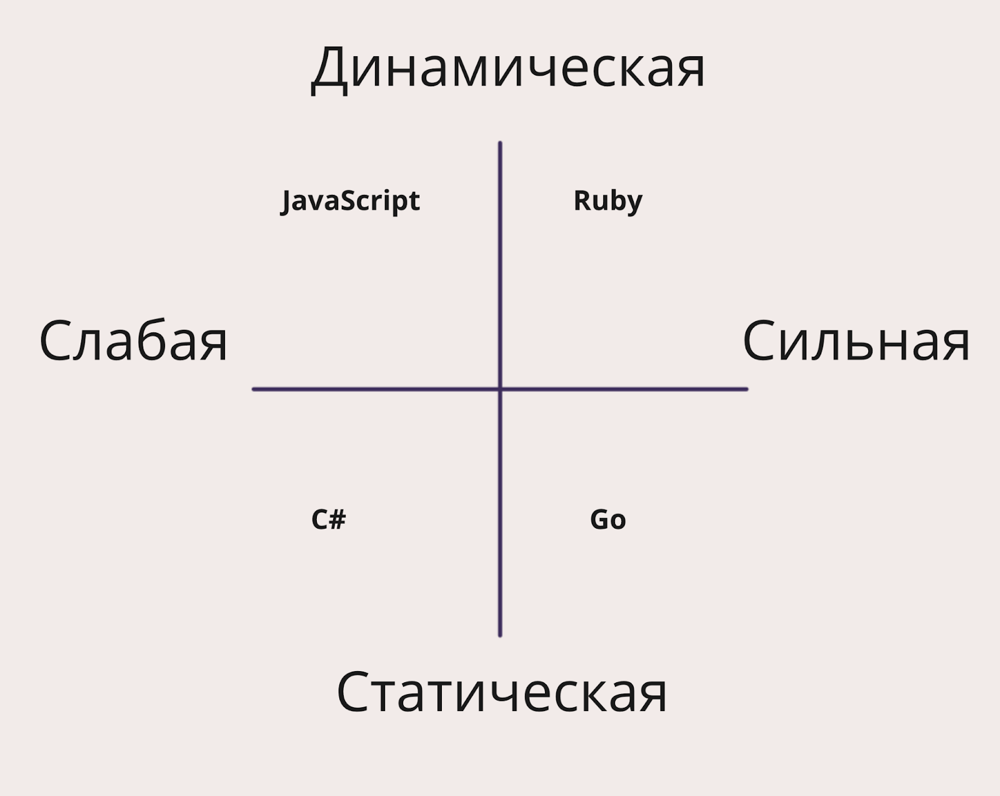
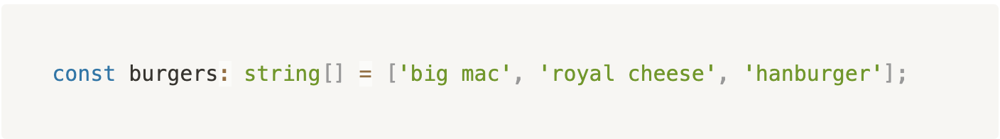
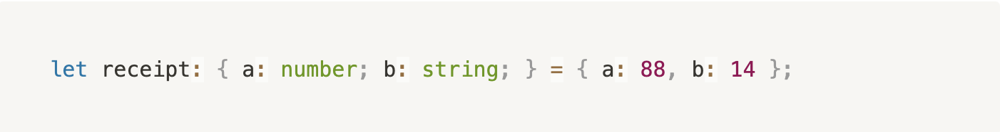

# TypeScript (Modul 18)

## Статическая и динамическая типизация в языках программирования

*Тип* — это множество возможных значений. 

*Система типов* — это наличие самих типов (строки, числа, объекты и так далее), а также различные правила работы с ними (например, правила конвертации из одного типа в другой и тому подобное).

Соответственно, все языки программирования можно разделить (относительно наличия типов в них) на 2 большие группы:

В основном программисты (вне зависимости от области — бэкенд, фронтенд или мобильная разработка) используют в своей практике типизированные языки программирования. Например, JavaScript (да-да, он типизированный, вопреки расхожему мнению, и далее вы узнаете об этом подробнее), Go, C#, Java, Swift и многие другие.

В отличие от языков программирования, не имеющих типов, все типизированные языки можно разделить на группы по разным признакам, которые касаются типизации. Это могут быть:
* сильные и слабые,
* статические и динамические,
* явные и неявные.

### ЯВНАЯ И НЕЯВНАЯ ТИПИЗАЦИЯ
В языках с явной типизацией при инициализации переменных или объявлении функций необходимо явно указывать тип. В отличие от языков с неявной типизацией, где тип устанавливается автоматически в зависимости от значений.

А вот пример с явной типизацией на Java:
```java
int numberOfDays = 7;
boolean myBool = true;
String myText = "Hello";
```

### СИЛЬНАЯ И СЛАБАЯ ТИПИЗАЦИЯ
Теперь перейдём к языкам с сильной (strong) и слабой (weak) типизацией (также употребляется выражение строгая и нестрогая типизация), в каждом языке есть правила, по которым разные типы приводятся к другим. И в каждом языке эти правила свои.

Например:
JavaScript является слабо типизированным языком.
PHP в некоторых моментах (например, при сравнении переменных с разными типами) строже. Но всё ещё позволяет проводить многие операции с типами, и также является слабым.
Python подходит к типизации ещё строже, чем PHP, и имеет сильную типизацию. Но всё равно в некоторых моментах слабее чем, например, Java. Например, в Python не обязательно указывать тип при объявлении переменных — он автоматически вычисляется сам.



Например:
* Ruby имеет динамическую и сильную типизацию;
* JavaScript имеет динамическую и слабую;
* Go имеет статическую и сильную;
* С# имеет статическую и слабую.

### СТАТИЧЕСКАЯ И ДИНАМИЧЕСКАЯ
Статическая типизация (или «статический анализ кода») — это анализ и выявление ошибок в коде ещё до его запуска (выполнения программы).

А динамическая типизация (или «динамический анализ кода») — это анализ и выявление ошибок в процессе выполнения программы.

Перед тем как программный код начинает выполняться, он проходит этап компиляции.

**Важно!** На самом деле JavaScript и некоторые другие языки только отчасти являются компилируемыми языками (а некоторые и вовсе не являются) и работают немного сложнее. Но так как это очень обширная и глубокая тема, то для простоты объяснения далее для всех языков программирования будет использоваться термин «компиляция».

В результате компиляции кода, написанного программистом, получается «машинный код», который уже выполняется в той или иной среде. Такими средами могут быть, например, браузер, сервер и тому подобное.

Таким образом, компиляция — это процесс преобразования программного кода в «машинный код». А временной промежуток, за который происходит эта конвертация, называется стадия компиляции или compile time.

После того как компиляция завершилась, начинается следующая стадия, выполнение программы — стадия исполнения или run time.

Вернёмся к определению статической и динамической типизации. С учётом знаний о стадиях компиляции и исполнения, можно дать более простые определения этим видам типизаций.

Другими словами, статический анализ (или статическая типизация) выполняет анализ кода на этапе компиляции. И в случае возникновения каких-либо синтаксических ошибок или ошибок, связанных с типизацией, останавливает компиляцию и не переходит к этапу исполнения.

В свою очередь, динамический анализ (или динамическая типизация) в любом случае проходит через стадию компиляции. И уже на стадии исполнения, во время выполнения программы, анализирует и исполняет код, где в случае возникновения каких-либо ошибок, отображает их и приостанавливает выполнение программы.

И очень важный момент: статический анализ кода анализирует, как код может выполняться, но не обязательно будет.

### ПОДХОДЫ К ТИПИЗАЦИИ
Теперь давайте проанализируем разные подходы к типизации и обратим внимание на плюсы и минусы каждого из них.

Начнём с сильной и слабой типизации. Сильная типизация (что логично) довольно сильно ограничивает количество способов приведения одних типов к другим, способы описания разных (можно даже сказать «экзотических») типов. Но эти ограничения приводят к меньшему количеству ошибок во время выполнения программы.

В свою очередь, слабая типизация практически не ограничивает конвертацию одних типов в другие, что даёт простор для фантазий и потенциальных ошибок во время выполнения программы. Эта проблема в целом решается наличием крепких знаний у разработчиков о приведении типов в разных ситуациях, но для этого нужно время и достаточно опыта.

Статическая типизация увеличивает время написания кода (необходимость корректно описывать все типы) разработчиками, но уменьшает количество потенциальных ошибок при выполнении программы.

Динамическая типизация предоставляет гораздо более высокие темпы разработки и возможность «обходить» некоторые моменты при типизации и конвертации типов, но увеличивает шансы на то, что при выполнении программы будут в разных местах появляться те или иные ошибки: связанные с типами или синтаксические.

В итоге многие компании и разработчики пришли к выводу: чем больше проект, над которым они работают, тем ценнее инструменты, позволяющие минимизировать различные ошибки при работе программы. Помогает в этом, например, применение в проектах инструментов и языков со статической типизацией. Помимо того, что они минимизируют само количество таких ошибок при работе программы, так ещё и помогают большим командам разработчиков синхронизировать контракты описания типов разной сложности в разных частях одного и даже нескольких проектов.

Одним из таких популярных сейчас инструментов является TypeScript. Он позволяет разработчикам также использовать JavaScript и все его преимущества в виде динамической типизации, скорости разработки и так далее. Плюс привносит статическую типизацию и продвинутую систему типов, которые можно использовать либо полностью, либо в определённых частях проекта.

## Начало работы с TypeScript
Этот набор типов с точно такими же характеристиками присутствует и в TypeScript:

* string — описывает любые строковые значения, такие как "Привет", "очень длинные строки", " " и тому подобное;
* number — описывает любые числовые значения, такие как 1, 2, 132, 12345, 0.1, 123.765 и так далее;
* boolean — описывает логический тип данных, который принимает значения true или false;
* undefined — это такой особый тип данных, который обозначает непреднамеренное (неумышленное) отсутствующее значение;
* null — как и undefined относится к особым типам данных, но означает преднамеренное (умышленное) отсутствующее значение.

Возможно, вы задались вопросом, а что с типами, которые появились в JavaScript не так давно, такими как Symbol и BigInt? Они также есть в TypeScript и полностью эквивалентны типам в JavaScript. Их можно и нужно использовать, когда появляется такая необходимость. Единственное отличие заключается в том, что они появились в более поздних версиях TypeScript (через какое-то время после появления в стандарте ECMAScript). И если ваш рабочий проект использует не самую новую версию, то такие типы не будут поддерживаться.

**Как же применять типы на практике?** 

Часто типы указываются при создании переменных или в объявлении функций при помощи определённой конструкции.

Как можно заметить, объявление переменной практически ничем не отличается от аналогичного на JavaScript, за исключением фрагмента : тип , который и отвечает за установку того или иного типа переменной.

Часто на практике для переменных, которые содержат примитивные значения, совсем не обязательно указывать явно тип. TypeScript сам понимает, какого типа перед ним значение, и устанавливает его для переменной. Исключением могут быть случаи, когда требуется объединить типы для какой-либо переменной.

Что такое и для чего нужно объединение типов? Например, вы как разработчик при проектировании типов решили, что переменная burgerType может быть как строковой (тип string), так и null (тип null). В таком случае используется объединение типов с помощью специального идентификатора — |.

Для массивов используется следующая конструкция — тип_элементов[] .



Как и в JavaScript, в TypeScript центральным и самым часто используемым типом является объект. Объекты описываются при помощи фигурных скобок {}, внутри которых перечисляются свойства и методы.




