# <u>Java</u>

### JDK
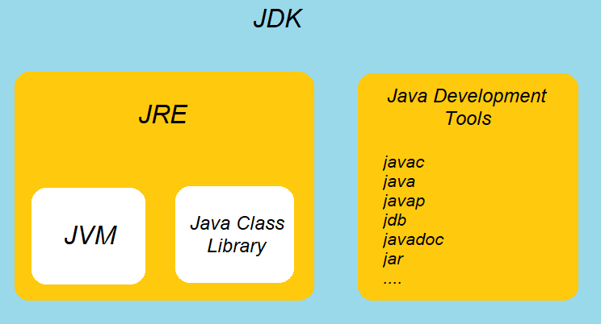

### JRE
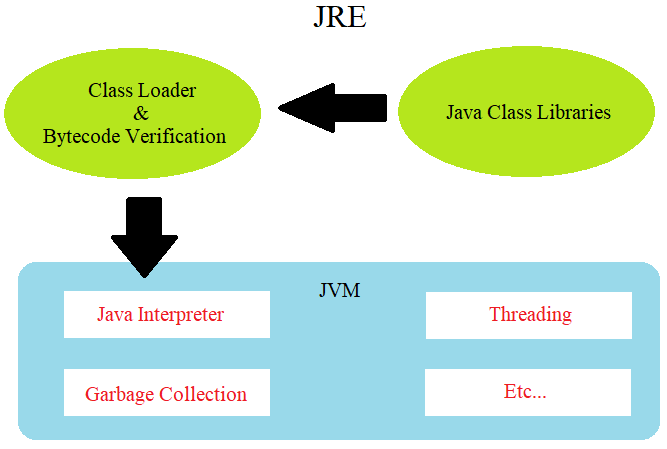


Abstraction

Incapsulation

Polymorphism - mehrere Formen. Ist eine Fähigkeit mithilfe eines Interfaces

Inheritance - ist ein Prozess bei dem ein Objekt bekommt Eigenschaften eines anderen Objektes. 

## Datatypes
|Type|Value|
|---|---|
|byte| min: -128|
|    | max:127
|short| min: -32 768
|     | max: 32 767
|int | min: -2 147 483 648
|     | max: 2 147 483 647
|long | min: -9 223 372 036 854 775 808
|     | max: 9 223 372 036 854 775 807
|float | min: -3.4E+38
|     | max: 3.4E+38
|double| min: -1.7E+308
|      | max: 1.7E+308
|char| min: 0
|     | max: 65536
|boolean| min: false
|       | max: true

### _if statement_
```java
if(statement) {

} else if (statement) {

} else {

}
```

### _switch statement_
```java
switch(statement) {
    case [check value]:
        ...
        break;
    case [check value]
        ...
        break;
    case[]:
    case[]:
    case[]:
        ...
        break;
    defautl:
        ...
        break;
}
```

# OOP (Modul 6)

### Vererbung (Inheritance)
Dies ist eine Eigenschaft des Systems, mit der Sie eine neue Klasse basierend auf einer vorhandenen Klasse mit teilweise oder vollständig geliehener Funktionalität beschreiben können.
### Verkapselung (Encapsulation)
Es ist eine Eigenschaft des Systems, mit der Sie Daten in einer Klasse kombinieren und Implementierungsdetails vor dem Benutzer verbergen können.
### Polymorphismus (Polymorphism)
Es ist eine Möglichkeit, verschiedene Formen anzunehmen. In der Programmierung bedeutet dies, dass derselbe Code je nach Bedingungen unterschiedlich ausgeführt werden kann. Polymorphismus ist statisch und dynamisch.

# Абстрактные классы. Интерфейсы (Modul 7)
## Класс Object — босс суперклассов
Раз этот класс — родитель любого другого класса, значит всем наследникам доступны его методы. Это действительно так, в классе Object определён некоторый набор методов, которые позволяют определить свойства, характерные для любого объекта.

## Абстрактные классы
Класс геометрической фигуры Figure. От него будем делать подклассы: треугольник, прямоугольник, ромб, многоугольник... 

У каждой фигуры должен быть метод, вычисляющий площадь, поэтому его надо записать в класс Figure. Но что он должен возвращать? Ноль? Ну это же неправда, у всех наших фигур площадь ненулевая. Да и отрицательная площадь — это вообще бред!

Можно и нужно отказаться от реализации метода «площадь» совсем, сделать его абстрактным, соответственно сделать абстрактным и класс. Для этого в языке Java есть ключевое слово abstract. Абстрактные методы не имеют тела. Никаких фигурных скобок, даже пустых. Только точка с запятой после скобок.

```java
// абстрактный класс
abstract class Figure { 
  //...  
    // абстрактный метод  
    abstract public double getArea();
    //...  
 }
```
Профит тройной!

Во-первых, мы не пишем неправду, возвращая то, чего быть не может в принципе.

Во-вторых, мы теперь не сможем создать «просто фигуру». Умными словами можно сказать «абстрактные классы не инстанцируются». Компилятор не разрешит теперь создать нам объект этого класса.

В-третьих, создавая подклассы и пытаясь создавать их объекты, компилятор будет требовать от нас реализовать функцию getArea(). По-честному, с фигурными скобками и return-ом. И мы не забудем это сделать.

## Интерфейсы
При помощи интерфейсов можно «научить» любой класс делать что-то дополнительное. При этом неважно, от чего он пронаследован.
```
Кстати, суффикс -able очень часто используется в названии интерфейсов. Например, интерфейс Cloneable в Java используется для того чтобы показать, что класс реализующий его внутри себя определяет метод Clone, позволяющий создать его копию (clone — клонировать, копировать). А интерфейс Comparable реализуют классы, объекты которых могут сравниваться с другими объектами (compare — сравнивать). 
```
Интерфейсы писать легко и приятно: ни одной строчки кода, только названия! Действительно, нам нужно описать, что должен уметь класс, который реализует интерфейс, а как он это умеет уже будет написано в самом классе.

По синтаксису интерфейсы очень похожи на абстрактные классы, только вместо ключевого слова class употребляется слово interface. В интерфейсе определяются только сигнатуры методов, то есть заголовки, имена методов и их параметры (в последних версиях Java есть возможность добавлять методам тела по умолчанию).

Можно считать, что методы интерфейса абстрактные, но мы не должны для них писать модификатор abstract. Кстати, все методы интерфейсов public, и это тоже можно не указывать.

((Soundable)a).sound(); — не много ли скобок? Многовато, но они тут нужны. Приведение к типу интерфейса  — сам интерфейс Soundable в скобках. А внешние скобки необходимы, потому что у приведения типов низкий приоритет. (Soundable)a.sound() не работает, потому что сначала Java хочет выполнить  точку, но не может, ведь  это ещё не Soundable...

Такое приведение работает и с классами. Мы можем узнать, что перед нами на самом деле объект подкласса, привести ссылку к нему и вызвать метод, который есть в подклассе, но которого нет в суперклассе. Но так делают гораздо реже, потому что удобство абстракции, которая реализуется через наследование и полиморфизм, как раз в том и состоит, чтобы управлять всеми объектами единообразно, а они сами будут выполнять наши команды по-разному.

Классы, которые реализуют интерфейс, должны реализовать все его методы. А их бывает немало. Например, кто может быть покупателем? Кто угодно: человек, инопланетянин, да хоть цирковой медведь, но ему нужно уметь делать минимум две вещи: уметь  выбирать товар и оплачивать. Возможно, таких вещей должно быть всего две, но покупатель, кто бы он ни был, должен обязательно уметь их обе, без этого покупка не состоится.

Классы, которые реализуют интерфейс, должны реализовать все его методы. А их бывает немало. Например, кто может быть покупателем? Кто угодно: человек, инопланетянин, да хоть цирковой медведь, но ему нужно уметь делать минимум две вещи: уметь  выбирать товар и оплачивать. Возможно, таких вещей должно быть всего две, но покупатель, кто бы он ни был, должен обязательно уметь их обе, без этого покупка не состоится.

Например, интерфейс мыши в графической библиотеке Swing состоит из целых пяти методов. Компонент, например кнопка, «рассказывает» другому объекту, своему «слушателю», о том, что мышка вошла в него, вышла, нажалась кнопка на мыши, когда она была в области компонента, отжалась, наконец, что произошел клик, то есть кнопка нажалась и отжалась пользователем без перемещения. Кнопка «рассказывает», вызывая функции интерфейса MouseListener. Для того чтобы ничего не поломалось, мы должны быть уверены, что все эти функции есть у слушателя, хотя бы и пустые, даже если мы хотим реагировать только на нажатие мыши.

Для того чтобы облегчить код и не писать много пустых функций, создают классы-адаптеры, которые как раз и реализуют все «пустыми скобками». 

Интерфейс может содержать поля, но они автоматически являются статическими (static) и неизменными (final). 

Все методы и переменные неявно объявляются как public, при этом не нужно специально писать ключевые слова.

Класс может реализовать несколько интерфейсов. Они перечисляются за ключевым словом implements и разделяются запятыми.

Если класс реализует интерфейс, но не полностью, не все его методы, то он должен быть объявлен как abstract. Кроме того, с помощью ключевого слова new нельзя создать экземпляр интерфейса:

```java
x = new SimpleInterface(...); // Нельзя!
```

Но можно объявлять переменные с типом интерфейса, которые будут хранить в себе ссылку на объект, реализующий этот интерфейс:

```java
SimpleInterface s = new Cat();
```

Кроме того, что интерфейсы могут содержать в себе сигнатуры методов и константы, в них также могут быть определены default-методы (методы по умолчанию) и static-методы (статические методы). Тела методов могут быть только у статических методов и методов по умолчанию.

Со статическими методами мы уже разобрались, давайте разберёмся, что такое дефолтные методы. Допустим, ваш класс реализует какой-то интерфейс SomeInterface. Спустя какое-то время вам понадобилось добавить новый метод в этот интерфейс. Теперь класс не может скомпилироваться, так как он уже не реализует полностью интерфейс SimpleInterface. Если этот класс и интерфейс разрабатываются вами, то новый метод легко можно туда добавить. А теперь представьте, что какой-то сторонний проект использует ваши классы, у разработчиков из того проекта уже нет возможности просто поменять код в вашем проекте. 

Если вам понадобилось добавить новый метод в интерфейс, то вам и другим программистам, использующим его, придётся добавить реализацию этого метода во все классы, которые реализуют этот интерфейс, поэтому старайтесь тщательно продумывать варианты использования вашего интерфейса с самого начала и описывать его полностью сразу.

Для решения проблемы выше есть два способа.

Вы можете создать новый интерфейс, расширяющий старый, и добавить новый метод в этот интерфейс:

```java
public interface ExtendedSomeInterface extends SomeInterface {
  void doSomething();
}
```

Начиная с Java 8, появились методы по умолчанию (default methods). Это методы с реализацией:

```java
public interface SomeInterface {
  void logic();

  // Новый метод
  default void doSomething() {
    // Некий код
  }
}
```

Для методов по умолчанию нужно обязательно указать реализацию. Эта реализация может вызывать другие методы из этого интерфейса и интерфейсов, от которых он наследуется. Теперь все классы, реализующие интерфейс SomeInterface, и интерфейсы, расширяющие его, получат метод doSomething(), и им не нужно будет изменять что-либо.

### Нестандартная сортировка массива строк
Java умеет сортировать (выстраивать по порядку) строки лексикографически. Для сортировки массивов в классе Arrays есть статический метод sort(). Мы можем написать:

```java
String[] array = {"баркас", "ёлка", "баржа", "арбузы", "тыква"};
Arrays.sort(array); 
```

И массив отсортируется в лексикографическом порядке.

Как быстро вывести результат? Конечно, можно использовать цикл, но обойдемся без него. В массивах toString() не переопределен, но в классе Arrays есть статический метод toString(), поэтому мы можем вывести массив так:

```java
System.out.println(Arrays.toString(array));
```
И на выводе мы увидим:

```
[арбузы, баржа, баркас, тыква, ёлка]
```
Сортируется как мы и предполагали.

А как отсортировать строки нестандартно, например, по длине? Сам алгоритм сортировки работает так: он постоянно сравнивает какие-то пары строк, и на основании результата сравнения делает вывод о том, какие строки переставить. Эту функцию сравнения выполняет сам класс String. Но можно её поменять.

В классе Arrays есть перегруженный вариант метода sort(), который вторым параметром принимает «сравниватель»: объект, реализующий сравнение двух объектов, реализующий интерфейс Comparator.

Этот интерфейс состоит из единственного метода compare(), который принимает два объекта и возвращает вердикт — целое число. Если с точки зрения компаратора объекты равны, метод должен возвратить 0. Если первый переданный объект компаратором считается «большим», возвращается положительное число. И, наконец, если второй объект считается “«большим», должно возвращаться отрицательное число. Часто это 1 и -1, но это необязательно.

Класс компаратора по длине строк можно объявить так:

```java
class ComparatorByLength implements Comparator<String> {

	@Override
	public int compare(String arg0, String arg1) {
        // считаем, что null-ссылки "больше всех"
        // при сортировке они должны уйти в конец
		if (arg0 == null)
			return 1;
		if (arg1 == null)
			return -1;
        // точно две не-null строки -- сравниваем по длине
		return arg0.length() - arg1.length();
	}
}
```

Действительно, если длина первой строки больше, возвратится положительное число, и наоборот. Соответственно, более короткие строки «переедут» ближе к началу, а длинные отправятся в конец.

Воспользоваться таким классом очень просто — нужно просто передать его объект в качестве параметра в метод sort():

```java
ComparatorByLength comp = new ComparatorByLength();
Arrays.sort(array, comp);
```

Или даже в одну строку, создав и передав в метод sort() безымянный объект:

```java
Arrays.sort(array, new ComparatorByLength());
```

Теперь массив отсортируется так:

```
[ёлка, баржа, тыква, баркас, арбузы]
```
Где разместить сам класс компаратора ComparatorByLength? Можно в том же файле, что и основной класс, можно в отдельном, добавив к нему модификатор public, а можно расположить его внутри основного класса, сделать внутренним классом. 

<hr>

## Чем абстрактный класс отличается от интерфейса? В каких случаях следует использовать абстрактный класс, а в каких интерфейс?
    
В Java класс может одновременно реализовать несколько интерфейсов, но наследоваться только 
от одного класса. Абстрактные классы используются только тогда, когда присутствует тип отношений «is a» (является). Интерфейсы могут реализоваться классами, которые не связаны друг с другом. Абстрактный класс - средство, позволяющее избежать написания повторяющегося кода, инструмент для частичной реализации поведения. Интерфейс - это средство выражения семантики класса, контракт, описывающий возможности. Все методы интерфейса неявно объявляются как public abstract или (начиная с Java 8) default - методами с реализацией по-умолчанию, а поля - public static final.

Интерфейсы позволяют создавать структуры типов без иерархии. Наследуясь от абстрактного, класс «растворяет» собственную индивидуальность. Реализуя интерфейс, он расширяет собственную функциональность. Абстрактные классы содержат частичную реализацию, которая дополняется или расширяется в подклассах. При этом все подклассы схожи между собой в части реализации, унаследованной от абстрактного класса и отличаются лишь в части собственной реализации абстрактных методов родителя. Поэтому абстрактные классы применяются в случае построения иерархии однотипных, очень похожих друг на друга классов. В этом случае наследование от абстрактного класса, реализующего поведение объекта по умолчанию может быть полезно, так как позволяет избежать написания повторяющегося кода. Во всех остальных случаях лучше использовать интерфейсы. Почему в некоторых интерфейсах вообще не определяют методов?
Это так называемые маркерные интерфейсы. Они просто указывают что класс относится к определенному типу. Примером может послужить интерфейс Clonable, который указывает на то, что класс поддерживает механизм клонирования. 

## Почему нельзя объявить метод интерфейса с модификатором final?
В случае интерфейсов указание модификатора final бессмысленно, т.к. все методы интерфейсов 
неявно объявляются как абстрактные, т.е. их невозможно выполнить, не реализовав где-то еще, а 
этого нельзя будет сделать, если у метода идентификатор final.

## Что имеет более высокий уровень абстракции - класс, абстрактный класс или интерфейс?
Интерфейс.

# Classes (Inner/Nested/Anonymous) (Modul 8)
Вложенные классы дают ряд преимуществ. Пожалуй, главное из которых — возможность прозрачно управлять своим внешним объектом. Классы, которые используются для решения мелких задач, можно делать анонимными и объявлять нужный класс прямо в выражении, после оператора new.
## Статические вложенные классы (Static nested classes)
Программировать легко и приятно, когда большой код разбит на маленькие фрагменты. Такой код намного проще и писать, и тестировать, и сопровождать. Раньше для этого использовали функции (конечно, и сейчас используют, всегда нужно тщательно продумывать, какие методы будут в классе). В ООП языках, а в Javа особенно, для этого используют классы. Есть новая задача? Отлично, разработаем класс, который ее и будет решать!

Для этого даже есть специальный термин, он был введён Робертом С. Мартином в одноимённой статье как часть принципов SOLID, ставших популярными благодаря его книге «Быстрая разработка программ. Принципы, примеры, практика».

В SOLID — буква «S» является аббревиатурой, которая образована сокращением от английского названия принципа единственной ответственности (SRP, Single Responsibility Principle).

Мартин определяет ответственность как причину изменения и заключает, что классы должны иметь одну и только одну причину для изменений. Например, представьте себе класс, который составляет и печатает отчёт. Такой класс может измениться по двум причинам:

1. Может измениться само содержимое отчёта
1. Может измениться формат отчёта. 

Логично, что оба аспекта этих причин на самом деле являются двумя разными ответственностями. SRP говорит, что в таком случае нужно разделить класс на два новых класса, для которых будет характерна только одна ответственность.

Причина, почему нужно сохранять направленность классов на единственную цель в том, что это делает классы более «здоровыми». Что касается класса Отчет: если произошло изменение в процессе составления отчёта, есть большая вероятность, что в негодность придет и код, отвечающий за печать. А если у нас будет один класс отвечать «только за своё», то все будет хорошо: если нужно изменить содержимое отчета, изменяем класс с содержимым. Нужно изменить вид — меняем класс вида. При этом другая часть кода точно не «сломается».

Часто бывает, что задача, решаемая классом, настолько мала, что для нее не хочется заводить новый файл, делать класс public с доступом отовсюду. Например, классы, которые мы обсуждали в предыдущем абзаце, имеют отношение только к отчёту. И можно их определить в файле класса Отчет. А можно даже не просто в файле, а внутри фигурных скобок, то есть сделать эти классы вложенными.

Мы обсуждали, что при сортировке постоянно используется сравнение элементов. Функцию сравнения передают с классом Comparator («сравниватель»), и оказывается, что здесь можно создать класс «на лету», прямо в скобках передачи параметров в метод сортировки сделать анонимный внутренний класс.

Виды вложенных классов можно представить диаграммой:

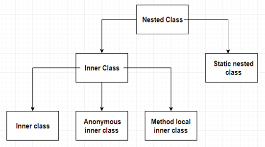

Можно сказать, что:

* Вложенные классы — это классы определенные внутри других классов.
* Внутренние классы — это классы, имеющие смысл только в контексте других классов.

### Статические вложенные классы
Наиболее слабой связью с внешним (Outer) классом обладают статические вложенные классы. Фактически, это обычные самостоятельные классы, просто помещенные внутри другого класса. Зачем? Основная цель — группировка по функциональности.

Опишем в виде класса современную материнскую плату, на которой могут быть USB-порты и второго, и третьего поколения:

```java
class MotherBoard {    
   // static nested class
   static class USB{
       public static String wikilink = "https://en.wikipedia.org/wiki/USB";
       int usb2;
       int usb3;
       int getTotalPorts(){
           return usb2 + usb3;
       }
       USB(int usb2, int usb3){
           this.usb2 = usb2;
           this.usb3 = usb3;
       }
   }
   USB usb = new USB(2, 3);  
}
```

В классе Motherboard объявлен и класс USB и объект этого класса — usb. Собственно, работа с классом USB осуществляется через его объект:

```java
// создаем объект типа MotherBoard
MotherBoard mb = new MotherBoard();
// работаем с объектом вложенного класса
System.out.println("Total Ports = " + mb.usb.getTotalPorts());
```

К статическим членам класса USB мы можем обратиться вне класса MotherBoard через указание внешнего класса:

```java
System.out.println("Wikipedia about USB: " + MotherBoard.USB.wikilink);
```

Почему класс USB объявлен внутри класса MotherBoard, а не отдельно? Видимо, потому что USB-разъемы располагаются на материнских платах (...и нигде больше?).

Впрочем, мы можем использовать класс USB и отдельно, ну, например, на производстве разъемов:

```java
MotherBoard.USB usb = MotherBoard.USB(10000, 20500) // разъемов в сутки
```
Здесь мы тоже работаем с классом через указание внешнего класса MotherBoard. На самом деле, в этом примере особенно непонятно, зачем мы делали класс USB вложенным, если хотим использовать его непосредственно.

**Единственная реальная причина для создания статического класса состоит в том, что такой класс имеет доступ к закрытым статическим членам своего содержащего класса.**

## Внутренние классы (Inner classes)
Кажется, что польза от применения статических классов невелика, потому что классы уже разделяются по пакетам. Наверное, единственная реальная причина для создания статического класса состоит в том, что такой класс имеет доступ к закрытым статическим членам своего содержащего класса.

А вот тесно связанные с объектом внутренние классы и анонимные классы используются часто.

### Внутренние классы
Очень часто бывает, что одни объекты управляют другими, скажем, пульт включает телевизор. Как это достигается?

Давайте разработаем простейшую модель телевизор-пульт и посмотрим:

```java
class TVset{
    
    int channel = 5;
    boolean isOn;
    
    public String toString(){
        if (!isOn){
            return "The TVset is OFF";
        }
        return "Channel " + channel + " is on the TVset now.";
    }
}
```
Вот такой телевизор должен управляться с пульта. Объектом класса Remote. Для того чтобы система работала, нужно, чтобы пульт «знал» о телевизоре. Для этого можно передавать ссылку на телевизор в объект пульта, и тогда он сможет работать через неё:

```java
class Remote{
    // храним ссылку на телевизор, которым управляем 
    private TVset tvSet;
    
    // связываем телевизор с пультом
    public void setTVset(TVset tvSet){
        this.tvSet = tvSet;
    }
    // переключаем каналы на телевизоре
    public void setChannel(int channel){
        tvSet.channel = channel;
    }
    // включаем телевизор 
    public void turnOn(){
        tvSet.isOn = true;
    }
    // выключаем телевизор  
    public void turnOff(){
        tvSet.isOn = false;
    }
}
```
Теперь можно создать телевизор и пульт и поуправлять телевизором с пульта:

```java
public class Main {

    public static void main(String[] args) {
        TVset tv = new TVset();
        Remote remote = new Remote();
        remote.setTVset(tv);
        System.out.println(tv);
        remote.turnOn();
        System.out.println(tv);
        remote.setChannel(2);
        System.out.println(tv);
        remote.turnOff();
        System.out.println(tv);
    }
}
```
Но вообще, этот код совсем не хорош. Замечаний, как минимум, два.

**Во-первых**, если сделать уровень доступа к данным в классе TVset приватным (а это надо сделать!):

```java
class TVset{
    
    private int channel = 5;
    private boolean isOn;
...
```
Всё перестанет работать. Действительно, пульт тогда потеряет к этим переменным доступ. Можно, конечно,  организовать сеттеры, но это раздувает код, и ещё тогда телевизором можно будет управлять, минуя пульт, что не очень правильно.

**Во-вторых**, система ненадежна. Если забыть связать пульт с телевизором (или намеренно не делать этого, ведь в реальном мире вполне можно понажимать кнопки на пульте просто так, без телевизора), то программа вылетит с ошибкой:

```cmd
Exception in thread "main" java.lang.NullPointerException
	at Remote.turnOn(Main.java:25)
	at Main.main(Main.java:40)
```
Обе проблемы хорошо решаются, если сделать пульт внутренним классом телевизора, поместив класс Remote в класс TVSet:

```java
class TVset{
    
    private int channel = 5;
    private boolean isOn;
    private Remote remote = new Remote();
    
    public Remote getRemote(){
        return remote;
    }
    
    class Remote{
        
        public void setChannel(int channel){
            TVset.this.channel = channel;
        }
        public void turnOn(){
            isOn = true;
        }
        public void turnOff(){
            isOn = false;
        }
    }
    
    public String toString(){
        if (!isOn){
            return "The TVset is OFF";
        }
        return "Channel " + channel + " is on the TVset now.";
    }
}
```

Теперь объекты класса Remote без проблем (и указания имени внешнего класса!) работают даже с private-данными TVset.

**Обратите внимание**: в классе TVset нужно все равно создавать объект внутреннего класса Remote. Мы работаем не с классом Remote, а именно объектом Remote, который создается при создании объекта TVset самим объектом. 

Как пользоваться внутренним классом? Очень просто:
```java
// покупаем телевизор
TVset tv = new TVset();
// и берем из коробки новенький пульт (он входит в комплект!)
TVset.Remote remote = tv.getRemote();
// и сразу начинаем пользоваться
remote.turnOn();
...
```
На самом деле, функцию getRemote() мы добавили для красоты. Можно было просто взять переменную remote из объекта tv и через неё управлять. Но ведь надо пользоваться инкапусляцией при каждой возможности. И да, в жизни так не хватает кнопки на телике «Найти пульт», пусть хоть в нашем примере будет!

Мы пользуемся полным именованием класса TVset.Remote всего два раза за всю программу. 

Первый  — когда «достаем пульт», объявляем переменную пульта вовне.

И ещё нужно обратить внимание на функцию setChannel():

```java
public void setChannel(int channel){
     TVset.this.channel = channel;
}
```
При обращении к переменной внешнего класса через this нужно употреблять конструкцию Outerclass.this.

А что со второй проблемой? Как будет себя вести пульт без телевизора, не сломается ли программа? Оказывается  — нет! На самом деле такое  — пульт без телевизора  — в принципе невозможно! Дело в том, что если мы захотим создать объект внутреннего класса, то нам надо создать объект внешнего класса.

Чтобы создать пульт, нужно сначала создать телевизор:
```java
TVset tv = new TVset();
TVset.Remote remote = tv.new Remote();
```
Можно, конечно, и в одну строку:
```java
TVset.Remote remote = new TVset().new Remote();
```
Но ведь при этом телевизор все равно создаётся, только безымянный. И мы к нему сможем обращаться только через пульт.

### Кратко и формально о внутренних классах:

* Внутренние классы объявляются внутри других классов без модификатора static:
* Объекты внутренних классов обращаются к членам внешнего объекта «как к своим», и наоборот (мы это не обсуждали на примерах). Синтаксис обращения к ним через this: OuterClass.this.
* Объекты внутренних классов существуют только внутри внешнего объекта. Обычно их создает сам внешний объект, но извне их тоже можно создать, используя синтаксис outerObject.new InnerClass().

### Внутренние локальные классы
Классы можно объявлять и внутри методов. Тогда ими можно пользоваться локально, внутри функции. В объявлении таких классов нельзя использовать модификаторы уровня  доступа. 

## Анонимные классы (Anonymous classes)
### Анонимные (безымянные) внутренние классы
Бывает, что классы выполняют очень маленькую задачу и при этом используются фактически один раз. В этом случае удобно их оформить в виде анонимного внутреннего класса.

Анонимные классы создаются на лету, описываются прямо в момент создания объекта, сразу после ключевого слова new.

Давайте отрефакторим два примера, которые мы рассматривали раньше, про сортировку и графическое окно. Сделаем классы, реализующие интерфейс, анонимными.

В примере с графическим окном мы реализовывали слушатель событий от мыши.

А вот как выглядит тот же функционал, реализованный анонимным классом:
```java
JFrame jf = new JFrame();
jf.setSize(400, 300);
jf.setVisible(true);
// передаем в качестве слушателя объект анонимного класса
//    =1= =2=                 =3= =4=
jf.addMouseMotionListener(new MouseMotionListener()  {
//=5=       
      @Override
	public void mouseMoved(MouseEvent e) {
	    		System.out.println(e.getX() + " " + e.getY());
	}
//=6=   
	@Override
	public void mouseDragged(MouseEvent arg0) {
		// TODO Auto-generated method stub
				
	}
//=7=
});
```
Выглядит очень непонятно на первый взгляд. Особенно последняя строка:
```
}); // ? Что?? Как это вообще? 
```
Но если разобрать по частям, то всё логично: 

=1= в метод addMouseMotionListenter(), в круглые скобки 

=2= передается объект класса, реализующего слушатель, который мы создаем сразу на месте, поэтому дальше следуют new и имя интерфейса MouseMotionListenter, который и будет реализовывать класс слушателя.  При этом мы не пишем слово implements, компилятор его восстанавливает сам, по контексту, потому что MouseMotionListenter  — это интерфейс. 

=3= Пустые круглые скобки  — создаем объект при помощи дефолтного конструктора. Сразу скажем, сделать свой конструктор у анонимного класса нельзя. Это разумно, ведь конструкторы должны называться по имени класса, а он у нас безымянный.

=4= Фигурной скобкой открывается описание нового класса

=5= и =6= и внутри, в принципе, там все как обычно, реализация функций стандартным синтаксисом.

=7= Ну и закрываем все это: сначала класс закрывающей фигурной скобкой, потом вызов функции, который мы начали в =1= закрывающей круглой, и, наконец, точка с запятой завершает всю команду, начинающуюся c jf.

Вызов функции, в ее параметрах создание объекта класса, реализующего интерфейс, описание нового класса, а в нем нужных методов. Игла в яйце, яйцо в утке, утка в зайце, заяц в ларце… Страшно, как в сказке. Но как Иван царевич победил Кощея, так и Java-программисты быстро привыкают к таким конструкциям. И в промышленном коде классы-слушатели очень часто реализуются реализуются именно так: анонимными классами.

Попробуйте разобраться в следующем коде (это рефакторинг сортировки строк по длине) самостоятельно:
```java
Arrays.sort(array, new Comparator<String>() {

	@Override
	public int compare(String arg0, String arg1) {
		if (arg0 == null) return 1;
		if (arg1 == null) return -1;
		return arg0.length() - arg1.length();
	}
});
		
System.out.println(Arrays.toString(array));
```

Зачем вообще использовать анонимные внутренние классы? Если привыкнуть к синтаксису, окажется, что они очень удобны. 

* Во-первых, они внутренние, то есть имеют возможность управлять своим внешним классом «прозрачно». 
* Во-вторых, имена — это хорошо. Но сколько времени порой тратится иногда на придумывание хорошего имени для переменной или метода, тем более класса. А тут имя не нужно в принципе. Нам нужен функционал для выполнения маленькой задачи, и мы его создаем прямо здесь и без всякого имени.
* В-третьих, мы определяем их прямо в том месте, где они нужны, например, объявляем классы прямо в момент передачи параметра-объекта в метод. Не нужно искать по коду, где же находится функционал слушателя. Всё тут, прямо перед глазами. Правда,  при этом код раздувается, и мы при чтении как раз уходим в сторону от основной «сюжетной линии» кода. Причем в буквальном смысле, ведь величина отступов возрастает с каждой строкой, погружаемся в детали...  Но обычно анонимные классы очень просты, в них переопределяется одна-две функции, и каждая занимает всего пару строк. Поэтому это мешает не очень сильно.

# Input- / OutputStream (Modul 10)
## Потоки данных. Классы InputStream, OutputStream
При работе с потоками нам неважно, с чем именно мы работаем: с клавиатурой, файлом или читаем данными из сети. Работа с разными источниками информации строится единообразно, командами «прочитать данные» и «записать данные».

Поток данных связан с некоторым источником или приемником данных, способным получать или предоставлять информацию. Соответственно, потоки делятся на входящие — читающие данные, и выходящие — передающие (записывающие) данные. 

В Java такой подход реализуется наследованием от базовых потоковых классов InputStream и OutputStream (а также Reader и Writer, которые умеют читать-записывать символы, о них мы поговорим в следующих юнитах). 

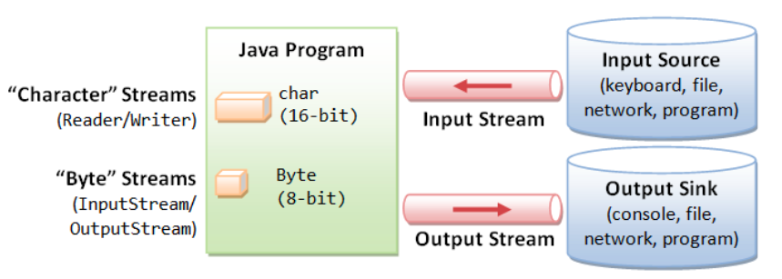

Это абстрактные классы, в которых описаны самые простые вещи: прочитать/записать байт и массив байтов. А их подклассы реализуют эти функции на конкретных источниках-приемниках данных, например, файлах.

## InputStream, FileInputStream
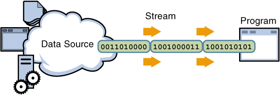

Итак, суперкласс для байтового ввода: InputStream. Что он умеет, вернее хочет, чтобы умели его конкретные подклассы?

|Метод|	Описание|
|---|---|
|int read()|	Возвращает очередной доступный байт во входном потоке в виде int. Если данные в потоке закончились, возвращает -1.|
|int read(byte b[])|	Чтение максимально b.length байтов из входного потока в массив b. Возвращает количество прочитанных из потока байтов.|
|int read(byte b[], int off, int len)|	Чтение len байтов в массиве b, начиная со смещения off. Возвращает количество реально прочитанных байтов.|
|long skip(long n)|	Пропуск во входном потоке n байтов. Возвращает количество пропущенных байтов.|
|int available()|	Получение количества доступных для чтения байтов.|
|void close()|	Закрытие источника ввода. Последующие попытки чтения из этого потока вызывают IOException.|
|void mark(int readlimit)|	Установка метки в текущей позиции входного потока, которую можно будет использовать до тех пор, пока из потока не будет прочитано readlimit байтов.|
|void reset()|	Перевод указателя потока на установленную ранее метку.|
|boolean markSupported()|	Проверка поддержки потоком операции mark/reset.|

Главные операции read() и операция close() — потоки следует обязательно закрывать после чтения.

Может показаться странным, что чтение побайтное, но read() возвращает int. Почему не byte? Это сделано для возможности возвращать -1  — сигнал конец потока. 
Но ведь в типе byte можно тоже хранить -1? Конечно, но в памяти эти числа будут представлены по-разному. 

Программа:
```java
byte x = -1;
int y = -1;
// в шестнадцатеричном представлении по 8 цифр
System.out.println(String.format("%08X and %08X", x, y));
```
Выведет:
```
000000FF and FFFFFFFF	
```

В классе InputStream только read() объявлен абстрактным, поэтому именно он должен быть определен в  подклассе, остальное  — опционально.

Самый важный подкласс InputStream   — FileInputStream, байтовый поток ввода из файлов.

Рассмотрим пример чтения из файла при помощи этого класса:
```java
import java.io.FileInputStream;
import java.io.IOException;

/*1*/public class FileInputStreamEx {

/*2*/   public static void main(String[] args) throws IOException {
           //чтение файла smallfile.txt из рабочей директории 
/*3*/      String fileName = "smallfile.txt";
/*4*/      FileInputStream fis = new FileInputStream(fileName);
/*5*/      int i;
/*6*/      while ((i = fis.read()) != -1) {
/*7*/               System.out.print((char) i);
           }    
/*8*/      fis.close();     
/*9*/      System.out.println();
       }
    } 
```

Обратите внимание: в этом примере и далее до раздела об исключениях мы используем конструкцию throws. То есть фактически игнорируем проблемы, которые могут возникать при вводе и выводе. Это делает код проще и позволяет сосредоточиться на самих операциях ввода-вывода. Мы вернёмся к теме исключений ввод-вывода позже в этом модуле, в разделе «Исключения».

Разберём код подробно.

**В строках 3-4** мы открываем файл на чтение, создаем поток ввода. У класса FileInputStream есть второй конструктор, использующий класс File, с которым мы работали в предыдущем модуле. Создание потока мы могли бы оформить так:
```java
File file = new File("smallfile.txt");
FileInputStream fis = new FileInputStream(file);
```
Такой способ выглядит немного лучше, потому что мы можем после создания объекта File проверить файл на существование и на возможность чтения из него, и только потом открывать. Впрочем, в этом нет особой необходимости, потому что мы можем обработать соответствующие исключения. Мы обязательно в следующих юнитах покажем как.

Здесь мы не указываем путь, будет прочитан файл из рабочей директории. Обычно это папка с классом (не с Java-файлом, а именно с откомпилированным классом, файлом с расширением .class), но при запуске из среды, например IntelliJ IDEA, это обычно папка с проектом.

**В строках 5-6** мы организуем цикл чтения. Условие цикла выглядит громоздко и немного непонятно. Это запись в стиле языка C (Си): мы одновременно читаем символ и проверяем результат на конец файла. Если «прочиталось», вернее вернулось -1  — файл закончен, и мы выходим из цикла. 

Этот фрагмент можно написать более понятно:
```java
int i = fis.read();
while (i != -1) {
      ...
      i = fis.read();
}
```
Но в этом случае операция чтения повторяется дважды, и поэтому обычно предпочитают первый вариант.

**Строка 7** — вывод полученного байта на экран. Стоит преобразовывать его именно в *char*, потому что byte при выводе через *System.out.println()* выводится как число, а *char*  — как символ. Но это будет хорошо работать только с английскими текстами файлами, записанными в однобайтной кодировке или *UTF-8*, в которой английские символы представляются тоже одним байтом. На самом деле для чтения текстовых файлов есть специальный класс *InputStreamReader*, который мы рассмотрим чуть позже в этом модуле. 

**Строка 8**  *fis.close()* —  закрытие потока. В принципе в этой конкретной программе в этом нет необходимости, потому что потоки ввода-вывода автоматически закрываются  после работы программы, а наша программа как раз заканчивается сразу после чтения файла. Но вообще об этом нужно не забывать и закрывать потоки после работы с ними.

## OutputStream, FileOutputStream
Здесь все абсолютно так же, только наоборот. В другую сторону.

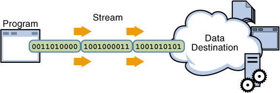

Методы OutputStream:

|Методы|Описание|
|---|---|
|void write(int c);|Записывает один байт информации. Тип int сужается до byte, лишняя часть просто отбрасывается.|
|void write(byte[] buff);|Записывает блок из массива байтов.|
|void write(byte[] buff, int from, int count);|Записывает часть массива байтов.|
|void flush();|Если есть данные, которые хранятся где-то внутри и ещё не записаны, то они записываются.|
|void close();|Закрывает поток, flush при этом вызывается автоматически.|

Здесь аналогично: абстрактный только *write(int b)*, его нужно переопределить, остальное — опционально.

Основным подклассом класса *OutputStream* является *FileOutputStrеam*, кто бы мог подумать. 

При создании объекта *FileOutputStream* автоматически создается файл, если он не был создан до этого. В конструкторе *FileOutputStream* можно передать объект класса File или строку, задающую путь к файлу, а также необязательный boolean-параметр, который задает, будет ли файл, если он уже есть,  перезаписываться или дозаписываться. 

Объекты *FileOutputStream* умеют не сильно больше их суперкласса. Даже если мы хотим вывести обычную строку, её надо выводить в файл побайтово. Хорошо, что в классе String есть метод *getBytes()*:
```java
import java.io.FileOutputStream;
import java.io.IOException;
public class FileOutputStreamEx {

	public static void main(String[] args) throws IOException {
		FileOutputStream fos = new FileOutputStream("test.txt");
		fos.write("Hello FileOutputStream world".getBytes());
        fos.close();    
	}
}
```

Здесь нужно быть осторожным, getBytes() хорошо отработает с английским текстом, а с русским, возможно,  нужно будет указать кодировку:

```java
fos.write("Привет FileOutputStream мир".getBytes("UTF-8"));
```
Узнать кодировку по умолчанию, то есть ту, в которой работает getBytes() с пустыми скобками, можно так:  

```java
System.out.println(System.getProperty("file.encoding"))
```
Давайте скопируем файл при помощи потоков (есть ещё волшебные методы класса Files из пакета NIO.2, которыми это тоже можно сделать, мы поговорим о них в следующих модулях). Будем для этого использовать блоковые read()-write(), которые позволяют за раз считывать-записывать целый массив байтов.

```java
private static void copyFileUsingStream(String source, String dest) throws IOException {

    InputStream fis = new FileInputStream(source);
    OutputStream fos = new FileOutputStream(dest);
    byte[] buffer = new byte[1024];
    int length;
    while ((length = fis.read(buffer)) > 0) {
            fos.write(buffer, 0, length);
    } 
    fis.close();
    fos.close(); 
}
```
Здесь файл копируется блоками по 1024 байта. Поэкспериментируйте на больших файлах, замерьте скорость копирования при разных размерах буфера.

## Reader и Writer: работа с символами
На самом деле в памяти нет никаких символов, только числа. 

При печати эти числа интерпретируются как символы и выводятся. Проблема в том, что таблиц и правил соответствия числовых кодов и символов, так называемых кодировок,  до недавнего времени существовало множество. 

Уже давно предпринята попытка стандартизировать кодировки. Для этого был придуман Unicode  — каждый символ получил свой единственный стандартный числовой код. И Java поддерживала его с первой версии. Но в мире софта осталось много программ, работающих с разными кодировками  и, конечно, текстов в разных кодировках. И с ними надо работать. 

Для этого и была разработана иерархия символьных потоков, на вершине которых абстрактные классы Reader и Writer. Работа с ними абсолютно аналогична работе с InputStream и OutputStream, только работают они не с отдельными байтами, которые во многих кодировках представляют собой лишь часть кода символа, а с «целыми» символами.

Давайте для примера напишем перекодировщик, который копирует файл и при этом меняет кодировку. Мы будем работать с двумя кодировками: Windows -1251 (это была родная кодировка в Windows до некоторого времени, в ней каждый символ представлялся в виде одного байта) и UTF-8 (фактически современным стандартом, в этой кодировке символ может представляться разным количеством байт).

Английские буквы обеих кодировках кодируются одинаково, а русские и, скажем, греческие — уже несколькими байтами. На Youtube есть очень классное видео о UTF-8 на канале [Computerphile](https://www.youtube.com/user/Computerphile). Оно на английском, но можно включить русские субтитры.

Немного адаптируем код примера копирования. Единственное, что мы изменим, это сами потоки, и сделаем массив буфера типа char.  

```java
import java.io.*;
import java.nio.charset.Charset;

public class Main {

    public static void main(String[] args) throws IOException {
        copyFileUsingStream(new File("src/win1251.txt"),
                Charset.forName("windows-1251"),
                new File("src/utf8.txt"),
                Charset.forName("utf-8"));
    }

    private static void copyFileUsingStream(File source, Charset sourceEnc, File dest, Charset descEnc) throws IOException {
        Reader fis = new FileReader(source, sourceEnc);
        Writer fos = new FileWriter(dest, descEnc);
        char[] buffer = new char[1024];
        int length;
        while ((length = fis.read(buffer)) > 0) {
            fos.write(buffer, 0, length);
        }
        fis.close();
        fos.close();
    }
}
```

Создадим файл с русским текстом, это можно сделать в самой среде IntelliJ IDEA. Нужно просто создать файл в директории src: выбрать src, File → new File и выбрать у него кодировку (File → File Encoding) Windows-1251.

К сожалению, такой код работает только на Java 11 версии. До этого конструкторов FileReader и FileWriter, принимающих кодировку, не существовало. Эти классы работали только в дефолтной кодировке системы. И приходилось писать так:
```java
Reader fis = new InputStreamReader(new FileInputStream(source), sourceEnc);
Writer fos = new OutputStreamWriter(new FileOutputStream(dest), descEnc);
```
Если у вас старая версия Java или вы пишете под Android, и поэтому не можете использовать Java последних версий, то вам тоже нужно написать так, чтобы код скомпилировался.

Но что это значит? Почему в конструктор потока передается другой поток?!

Давайте разбираться! Мы переходим к самому интересному разделу этого модуля! 

## Умные потоки ввода-вывода: матрешки
Потоковых классов множество:

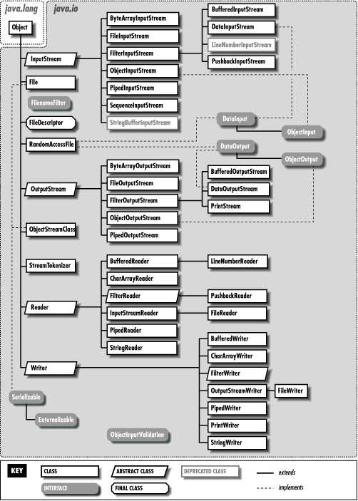

И здесь представлено не всё! Например, на диаграмме отсутствуют замечательные классы ZipInputStream и ZipOutputStream, которые позволяют просто работать с архивами.

С одной стороны, не все эти классы нужны постоянно. С другой… Классов потоков бывает существенно больше, чем показано на картинке, потому что их можно комбинировать. 

Как? Давайте посмотрим на примерах.

До появления Scanner-a чтобы ввести строку с клавиатуры, приходилось писать так:

```java
BufferedReader reader = new BufferedReader(new InputStreamReader(System.in));
String string = reader.readLine();
```

System.in читает с клавиатуры байт за байтом.

Если ввести букву национального алфавита, которая не может кодироваться одним байтом, то каждый составляющий её байт будет прочитан по отдельности. Именно этим и занимается InputStrеamReader — забирает полученные от System.in байты и соединяет их в символы.

BufferedReader получает уже готовые символы от своего InputStreamReader-a.

Класс BufferedReader буферизует ввод, обеспечивая считывание из потока ввода (клавиатура это или файл — не важно) целых строк, что делает процесс более быстрым. Ну и при этом он умеет readLine()  — читать до перевода строки до Enter-a и возвращать собранную строку.

Выражение BufferedReader reader = new BufferedReader(new InputStreamReader(System.in)); есть сокращенная запись от:
```java
InputStream a = System.in;
InputStreamReader b = new InputStreamReader(a);
BufferedReader reader = new BufferedReader(b);
```
* Объекту *reader* передается заказ: получи строку и отдай нам.
* Объект *reader* многократно дает заказ своему *InputStreamReader*-у: давай, друг, символы. И делает так до тех пор, пока не получит Enter, то есть \n от него. 
* А что *InputStreamReader*? Он постоянно дергает свой *System.in*, а последний уже работает с клавиатурой, принимая от неё байты.

Но самое главное, что если мы теперь заменим в нашей матрешке *System.in* на *FileInputStream*, мы сможем читать строки из файла, а если заменим на сетевой поток, то и из сети!

Конечно, с появлением *Scanner*-a в Java 1.5, которая получила название 5.0, жизнь стала проще. Хотя целых семь лет программисты успешно обходились без *Scanner*-a. Но идея композиции осталась: *Scanner*-у нужно передать поток,  любой *InputStream*. 

Передадим файловый  — будем также просто читать из файла.
```java
Scanner in = new Scanner(new FileInputStream("src/numbers.txt"));
System.out.println(in.nextInt() + in.nextInt());
```
Вот так можно сложить два числа, которые расположены в текстовом формате. Расширение .txt тут значения не имеет. Главное, что они записаны символами-цифрами. А вот, кстати, потоки *DataInputStream* и *DataOutputStream* позволяют работать с данными, записанными в бинарном формате, что значительно компактнее.  

Мы разобрались с потоками ввода и вывода. 

## Итоги

Потоки  — как трубы, но по ним течет не вода, а данные. Соответственно, есть те, из которых данные «втекают» — потоки ввода, и те, из которых «вытекают» — потоки вывода.

На вершине иерархии байтовых потоков лежат абстрактные классы *InputStream* и *OutputStream*. 

Конкретные их подклассы должны прежде всего определить функции *read()* и *write()*, которые будут читать-писать один байт с конкретного источника данных (с клавиатуры, из файла из Сети).

Есть аналогичная иерархия символьных потоков, в вершине которой располагаются классы *Reader* и *Writer*. Они позволяют работать с символами, которые в разных кодировках могут быть записаны при помощи нескольких байт.

После работы с потоком его обычно нужно закрыть функцией *close()*.

В стандартной библиотеке Java есть много классов потоков, но еще их можно комбинировать, «оборачивать» одни потоки в другие, добиваясь нужной функциональности. 

В каждой программе мы добавляли конструкцию throws.  Это сильно облегчало код. Но в реальной программе так делать точно не стоит. Если файл не доступен для чтения, при попытке его прочитать возникнет исключение и программа упадет. А пользователи очень не любят, когда программы падают. В программе, обрабатывающей файл, стоит перехватывать возникающие исключения, работать над ошибками прямо во время работы программы. И во многих случаях удасться исправить ситуацию, избежать неприятного падения.

В следующем модуле мы обсудим исключения и научимся работать с ними.

# Exception (Modul 11)
## Error и Exception: первый взгляд на Throwable
Исключительные ситуации (исключения) и ошибки возникают в процессе выполнения программы, когда что-то идет не так. Например, попытка обратиться к элементу массива, индекс которого лежит за пределами массива, или же вызов метода у объекта, значение которого равно null. 

В момент возникновения проблемы в приложении создается объект, который описывает это событие. Затем выполнение приложения останавливается, и включается механизм обработки исключений. При этом ссылка на объект-исключение передается обработчику исключений, который пытается решить возникшую проблему и продолжить выполнение программы. 

В своей программе мы можем сами перехватить, обработать исключение, поймать ошибку и сделать что-то, например, сообщить пользователю о возникшей проблеме и попытаться продолжить нормальную работу. 

Все объекты исключительных ситуаций  — наследники класса Throwable. Иерархия сразу делится на две ветви: наследников класса Error (ошибки) и Exception (исключения).

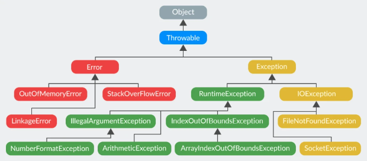

**Ошибки (Errors)** — это серьёзные проблемы, которые, согласно спецификации Java, не следует пытаться обрабатывать в собственной программе, поскольку они связаны с проблемами уровня JVM.

Исключения такого рода возникают, например, когда заканчивается память, которая доступна виртуальной машине.  Мы не сможем выделить больше памяти, поэтому в любом случае JVM остановит свою работу. Это ошибка OutOfMemoryError. Другая частая ошибка, StackOverFlowError, возникает при бесконечной рекурсии, когда функция многократно вызывает сама себя.

Ошибку перехватывать поздно, программа все равно не сможет «вернуться к нормальной жизни», все совсем плохо. Но можно понять, где именно произошла ошибка, мы научимся делать это в юните про **стек ошибок** (*Stack Trace*).

**Исключения (Exceptions)** происходят в результате возникновения проблем в программе, которые, в принципе, решаемы.

Например, произошло деление на ноль в целых числах.  В этом случае программа может продолжить нормальную работу. Например, если возникла проблема получения данных по сети из-за того, что отвалился Wi-Fi, можно вывести сообщение о том, что связь временно прервалась, дождаться возобновления связи и продолжить загрузку данных.

Exception — это и есть классическое исключение, которое генерируется вследствие неправильной работы программы, которое мы можем обрабатывать. Здесь иерархия тоже делится на две больших ветви: подклассы RuntimeException — ошибки программирования, и остальные, самые главные из которых — IOExceptions — ошибки ввода вывода, мы подробно рассмотрим в этом модуле.

Исключения делятся также на две группы: checked и unchecked (проверяемые и непроверяемые).

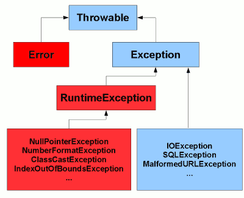

На диаграмме красным цветом выделены непроверяемые, мы не должны писать никакого дополнительного кода для их обработки. Но можем.

А вот если код может выбросить проверяемое исключение, это нужно обязательно обрабатывать. 

Давайте рассмотрим пример исключений. И нем покажем, как и зачем можно перехватывать исключения.

### IndexOfBoundsException. Программа для гаданий

Это исключение очень часто возникает в программах. Например, в такой:

```java
int[] array = {1, 2, -1, 5, 3};
int s = 0, i;
for (i = 0; i <= array.length; i++);
{
    s += array[i];   
}
System.out.println(s);
```
Этот фрагмент должен выводить сумму элементов массива, но при запуске программа падает с ошибкой:

```cmd
Exception in thread "main" java.lang.ArrayIndexOutOfBoundsException: Index 5 out of bounds for length 5
	at Main.main(Main.java:16)
```

ArrayIndexOutOfBoundExсeption — это подкласс класса IndexOfBoundsException.

Тут не много строк, но вывод подсказывает, какая ошибка возникла и где. Уверены, вы очень быстро найдете здесь ошибку и после исправления программа начнет работать правильно.

Программа упадет с ошибкой IndexOutOfBoundsException. Исправить ситуацию можно двумя способами: добавить в программу if или перехватить исключение.

В первом случае делаем так:
```java 
int n = in.nextInt();
if (n < lines.size()) {
       System.out.println("Вот предсказание для вас:\n" + lines.get(n));
}
else {
     System.out.println("Вы ввели недопустимый номер..." ); 
}
```

Во втором так:
```java
int n = in.nextInt();
try {
       System.out.println("Вот предсказание для вас:\n" + lines.get(n));
}
catch (Exception e) {
     System.out.println("Вы ввели недопустимый номер..." ); 
}
```

Здесь мы поступаем таким образом: «попробуем взять строку с номером n (блок в скобках после слова try, англ. пытаться) и, если не получится, то … (блок в скобках после слова catch, англ. ловить)».

Какой из способов лучше? Кажется, что первый. Возможно. Но иногда причин того, что программа сработает неверно, бывает несколько, и нужно городить целую батарею из if-ов. И в этих случаях удобно перехватывать исключения.  Кстати, вариант с if-ом всё ещё легко сломать, если ввести отрицательное число, мы эту проверку упустили.

## Класс RuntimeException и его подклассы
Класс RuntimeException и его подклассы относятся к непроверяемым исключениям. Компилятор не проверяет, может ли метод генерировать эти исключения. Исключения типа RuntimeException генерируются при возникновении ошибок во время выполнения приложения. Почему возникла необходимость деления исключений на проверяемые и непроверяемые? 
Посмотрим на конкретные unchecked исключения: 

* деление в целочисленных типах вида a/b при b=0 генерирует исключение ArithmeticException; 
* индексация массивов. Выход за пределы массива приводит к исключению ArrayIndexOutOfBoundException;
* вызов метода на ссылке вида obj.toString(), если obj ссылается на null порождает NullPointerException.

Если бы возможность появления перечисленных исключений проверялась на этапе компиляции или запуска, то любая попытка проверки массива на индекс или каждый вызов метода требовали бы или блока обработки исключения, или оператора проверки всего метода. Такой код был бы практически непригоден для понимания и поддержки. Именно поэтому часть исключений была выделена в группу непроверяемых, и ответственность за защиту приложения от последствий их возникновения возложена на программиста.

Перечислим часто встречаемые unchecked exception:

|Тип исключения|	С чем связана ошибка|
|---|---|
|ArithmeticException|	Выполнение арифметических операций (например, деление на ноль).|
|ArrayIndexOutOfBoundsException|	Индекс массива выходит за допустимые границы.|
|ArrayStoreException|	Присвоение элементу массива значения несовместимого типа.|
|ClassCastException|	Попытка выполнить приведение несовместимых типов.|
|NegativeArraySizeException|	Попытка создать массив отрицательного размера.|
|NullPointerException|	Некорректное использование ссылок (обычно, когда мы вызываем метод объектной переменной, которая содержит пустую ссылку).|
|NumberFormatException|	Преобразование строки к числовому значению (когда в число преобразуется строка, содержащая некорректное текстовое представление числа).|
|StringIndexOutOfBoundsException|	Неверное индексирование при работе с текстовой строкой.|

## Класс IOException и его подклассы
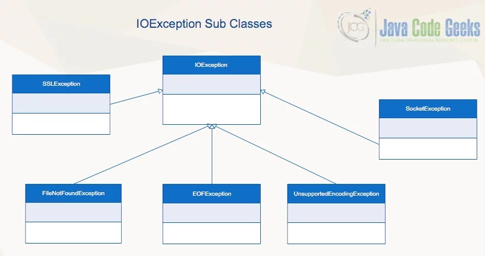

Ошибки ввода вывода, возникающие при чтении из сети и из файлов  — это подклассы IOException. Они нуждаются в обработке. 

Пожалуй, самыми частыми здесь являются FileNotFoundException и сам IOException. Так как первый является  подклассом второго, достаточно бывает обработать только IOException, потому что оно практически всегда нуждается в обработке. Ведь, мы открывали файл для чтения или для записи, для чего же еще?!

### Работа с исключениями
Что можно делать с исключениями? С непроверяемыми можно ничего не делать, а проверяемые нужно обязательно обрабатывать, иначе программа не скомпилируется.

Какие у нас варианты?
**throws…  — отказаться от ответственности**

Самый простой способ обработки исключений  — не обрабатывать их. Мы поступали именно так в первой части модуля.

Если в методе может возникнуть исключение какого-то типа, то можно просто добавить в заголовок этого метода throws этого исключения или его подкласса, и все — забота об обработке лежит на вызвавшем методе.

Вернёмся к примеру из первой части модуля.

```java
import java.io.FileOutputStream;
import java.io.IOException;
public class FileOutputStreamEx {

	public static void main(String[] args) throws IOException {
		FileOutputStream fos = new FileOutputStream("test.txt");
		fos.write("Hello FileOutputStream world".getBytes());
        fos.close();    
	}
}
```
Здесь мы можем получить исключения IOException и FileNotFoundException. В throws указывать несколько возможных исключений через запятую. Но в данном случае это не нужно, потому что IOException более общее.

### Обработка try-catch-finally
Но можно и по-честному обработать.

В примерах мы уже видели, что для обработки исключений есть специально зарезервированные ключевые слова: 

try {...}  —  ключевое слово, определяющее участок кода, в котором может произойти исключение (ошибка).
catch (тип_исключения){...} — ключевое слово, определяющее участок кода, который отвечает за обработку исключения. Этот блок может быть использован несколько раз. 
И ещё есть: 

finally {...} — ключевое слово, определяющее дополнительный участок кода, который выполняется в любом случае. Этот блок реализуется после последнего блока catch. Как правило, этот блок используется для освобождения ресурсов, например, закрытия файлов.
Общий алгоритм обработки исключений имеет следующий вид:

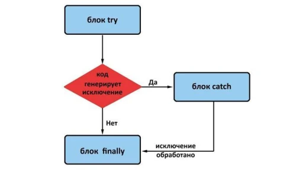

Сначала определяем потенциально опасный участок кода нашей программы и заключаем его в блок try. Если код все-таки генерирует исключение по какой-то причине, то в дело вступает код, который нацелен на обработку ошибки определенного типа. Далее смотрим на наличие блока finally. Если этот блок присутствует, то выполняется код из него. Обычно в блоке finally размещают код сохранения данных, чтобы, если уж программа упала с ошибкой, в любом случае хотя бы не повредить, то что есть. Если нет, то действия по обработке исключения закончены.

Зачем же вообще блок finally, если мы до него «доезжаем» в любом случае?
Дело в том, что исключение может возникнуть и в блоке catch(), и тогда мы вывалимся с ошибкой, и finally выполнен не будет.

разные варианты этой конструкции:

1. Стандартный блок try{} catch(){} finally{}:
```java
try {
//здесь пишем код, который потенциально может привести к ошибке

} 
catch(SomeException e ) { //в скобках указывается класс конкретной ожидаемой ошибки  //здесь пишем код, направленный на обработку исключений
}
finally {
//выполняется в любом случае ( блок finally не обязателен)
}
```

2. Блок без обработки возможного исключения:
```java
try {
//здесь пишем код, который потенциально может привести к ошибке
} 
finally {
//выполняется в любом случае
}
```
3. Отлавливание исключений с обработкой нескольких исключений:
```java
try {
//здесь пишем код, который потенциально может привести к ошибке
} 
catch(SomeException e ) { //в скобках указывается класс конкретной ожидаемой ошибки  //здесь пишем код, направленный на обработку исключений
} 
catch(AnotherException e ) { //в скобках указывается класс конкретной ожидаемой ошибки 
 //здесь пишем код, направленный на обработку исключений типа AnotherException
}
```

В данном примере мы попытаемся привести строку к числу с помощью класса NumberFormat. Для этого мы заведомо дадим неправильные данные.
```java
try {
   	NumberFormat nf = NumberFormat.getInstance();
   	//специально создаем ситуацию, которая приведет к исключению
   	System.out.println(nf.parse("NOT A NUMBER"));
} 
catch (ParseException e) {
   	System.out.println(e.getMessage());
}
System.out.println("Конец программы!"); 
```

В результате мы получим информацию о том, что была совершена ошибка, которую при желании сможем обработать и вывести ответ пользователю в нужном нам виде. Попробуйте убедиться в этом, запустив код из примера у себя в среде разработки.

Теперь попытаемся получить символ строки по странному индексу:
```java
String string = "123";
try
{
    char chr = string.charAt(10);
}
catch(StringIndexOutOfBoundsException ex)
{
   System.out.println(ex.toString());
}
System.out.println("Конец программы!");
```
В обоих примерах на выводе мы увидим на выводе “Конец программы!”. То есть благодаря обработке исключения программа не упала, а доработала до конца.

### Обработка нескольких исключений
На практике часто складывается такая ситуация, когда в одном блоке try может быть выброшены исключения нескольких типов. В таком случае нам необходимо использовать несколько блоков catch, если мы не отлавливали ошибки по классу Exception (что делать не рекомендуется). Такая конструкция имеет следующий вид (проще посмотреть на примере:
```java
public void doAction() {
   try {
       int a = (int)(Math.random() * 2);
       System.out.println("a = " + a);
       int c[] = { 1/a }; // опасное место #1
       c[a] = 71; // опасное место #2
   } catch(ArithmeticException e) {
       System.err.println("деление на 0" + e);
   } catch(ArrayIndexOutOfBoundsException e) {
       System.err.println("out of bound: " + e);
   } // окончание try-catch блока
   System.out.println("after try-catch");
}
```
В данном примере строка int c[] = { 1/a }; является потенциально опасной потому, что строкой выше а генерируется случайным образом, и может принять значение 0 или 1. Если значение будет равнятся 0, то получим ошибку деления на ноль. Если а=1, то в этой строке c[a] = 71; выйдем за границы массива.

Подклассы исключений, которые используются в блоках catch, должны следовать перед любым из их суперклассов, иначе суперкласс будет перехватывать эти исключения.
Давайте рассмотрим пример: 
```java
try { /* код, который может вызвать исключение */
} catch(IllegalArgumentException e) {...
} catch(PatternSyntaxException e) {... } /* никогда не может быть вызван: ошибка компиляции */
```

В данном примере PatternSyntaxException представляет собой подкласс класса IllegalArgumentException. Правильная конструкция будет иметь следующий вид:

```java
try { /* код, который может вызвать исключение */ 
    } catch (PatternSyntaxException e) { ...
    } catch (IllegalArgumentException e) { ...}
```
То есть в данном примере обязательно нужно было поменять местами блоки catch.

На практике иногда возникают ситуации, когда инструкций catch несколько, и обработка производится идентичная, например, вывод сообщения об исключении в журнал.

```java
try {
// Любые действия, которые могут породить исключения
       } catch (NumberFormatException e) {
           e.printStackTrace();
       } catch (ClassNotFoundException e) {
           e.printStackTrace();
       } catch (InstantiationException e) {
           e.printStackTrace();
       }
```
В седьмой версии Java появилась возможность сокращения кода, избавляя код от избыточности, используя для разделения оператор |.
```java
try {
//Любые действия, которые могут породить исключения
       } catch (NumberFormatException | ClassNotFoundException | InstantiationException e) {
           e.printStackTrace();
       }
```

### try-with-resources  — о закрытии потоков можно не думать!
В Java7 (вот к чему эти постоянные отсылки к истории, кто вообще сейчас программирует на Java до 8-й версии!), так вот, в Java 7 появилась возможность открывать потоки в скобках try, и закрывать их тогда не надо!

Вот такой метод, решающий маленькую задачу чтения единственной строки из файла, приходится писать в миллион строк.
```java
static String readFirstLineFromFileWithFinallyBlock(String path) {
   BufferedReader br = null;
   try {
        br = new BufferedReader(new FileReader(path));   
        return br.readLine();
    } catch (IOException e) {
        e.printStackTrace();
    } finally {
        if (br != null) {
            // и снова try-catch потому что...
            try {
                br.close();
            } catch (IOException e) {
                e.printStackTrace();
            }
        }
        return null;
    }
}
```
А с использованием **try-with-resources** получается вполне компактно:

```java
static String readFirstLineFromFileWithTryWithResources(String path) {
   // открывается прямо на месте, а закрывается само!
   try ( BufferedReader br = new BufferedReader(new FileReader(path))){
           return br.readLine();
       } catch (IOException e) {
           e.printStackTrace();
       }
   return null;
}
```
В этих программах используется метод printStackTrace(). Это очень полезный метод, выводящий много полезной информации о возникшей ошибке. Мы его обсудим в следующем юните.

### Стектрейс. Учимся понимать, что случилось
И все-таки программа сломалась и на экране появилось это:
```cmd
Exception in thread "main" java.lang.NullPointerException at com.example.myproject.Book.getTitle(Book.java:16) at com.example.myproject.Author.getBookTitles(Author.java:25) at com.example.myproject.Bootstrap.main(Bootstrap.java:14)
```
Или это:
```cmd
Exception in thread "main" java.lang.IllegalStateException: A book has a null property at com.example.myproject.Author.getBookIds(Author.java:38) at com.example.myproject.Bootstrap.main(Bootstrap.java:14) Caused by: java.lang.NullPointerException at com.example.myproject.Book.getId(Book.java:22) at com.example.myproject.Author.getBookIds(Author.java:36) ... 1 more
```
И во всем этом можно разобраться?

Нужно!
**Stack Trace** — очень полезный информативный инструмент для отладки приложений. *Stack Trace* указывает место, где было выброшено исключение. Он показывает стек методов, в которых приложение было, когда исключение возникло.

Обычно приложение работает так: одни методы вызывают другие, те, в свою очередь, третьи, третьи вызывают четвертые… 

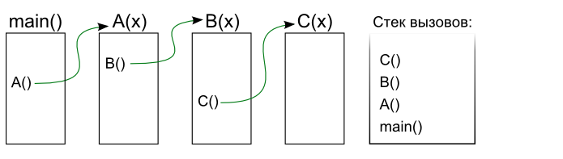

И вот в пятых или в седьмых, или в сотых возникает ошибка. Stack Trace и показывает весь путь до ошибки. 

Рассмотрим модельный пример:
```java
public class ErrorChecking {
    public static void main(String[] args) {
        System.out.println("Метод main() успешно запущен");
        method1();
        System.out.println("Метод main() заканчивает свою работу");
    }

    static void method1() {
        System.out.println("Первый метод передаёт привет!");
        method2();
    }

    static void method2() {
        System.out.println("Второй метод передаёт привет!");
    }
}
```
В нашем классе реализовано три метода: main(), method1() и method2().

Как только приложение было запущено, метод main помещается в стек, становится его вершиной (занимает 1 позицию). В методе Main мы вызываем метод Method1, где затем вызывается метод method2. Как вы уже могли догадаться, метод method2 становится на вершину стека. После выполнения метода method2 начинаем возвращать управление методам. 
На экране мы получим следующий ряд сообщений:
```
Метод Main успешно запущен
Первый метод передаёт привет!
Второй метод передаёт привет!
Метод Main заканчивает свою работу
```
```java
public class ErrorChecking {
    public static void main(String[] args) {
        System.out.println("Метод Main успешно запущен");
        method1();
        System.out.println("Метод Main заканчивает свою работу");
    }

    static void method1() {
        System.out.println("Первый метод передаёт привет!");
        method2();
    }

    static void method2() {
        int x = 10;
        int y = 0;
        double z = x / y;
        System.out.println( z );
        System.out.println("Второй метод");
    }
}
```
Запустите программу и посмотрите, что выдаст вам программа:
```
Метод Main успешно запущен
Первый метод передаёт привет!(method1)
Exception in thread "main" java.lang.ArithmeticException: / by zero

	at errorhandling.errorChecking.method2(<u>errorChecking.java:17</u>)
	at errorhandling.errorChecking.method1(<u>Solution.java:11</u>)
	at errorhandling.errorChecking.main(<u>>Solution.java:5</u>)	
```
Теперь давайте изменим метод method1() так:
```java
try {
    System.out.println("Первый метод передаёт привет!");
    method2();
}
catch (ArithmeticException err) {
    System.out.println(err.getMessage());
}
```
Теперь мы обернули метод method2 в блок try.В блоке catch отловим исключение ArithmeticException.

Запустим код снова. В итоге на выходе получим:
```
Метод Main успешно запущен
Первый метод передаёт привет!
/ by zero
Метод Main заканчивает свою работу
```
Стоит обратить внимание на то, что на экран вывелось лишь: / by zero. Метод method2 не был выполнен полностью, а был остановлен, когда возникла ошибка. После этого контроль был передан обратно методу method1(). Это произошло из-за того, что блок catch сам распознавал ошибку. JVM (Java Virtual Machine) не обращалась к стандартному обработчику ошибок, а вывела сообщение находящееся между фигурными скобками блока catch.

Обратите внимание, что сама программа не была остановлена. Контроль, как обычно перешел к методу main(), откуда method1() был вызван. И последняя строка метода main() смогла вывести на экран: Метод Main заканчивает свою работу.

У всех Throwable есть метод printStackTrace(), который и выводит стек вызовов. Им часто пользуются в блоке catch. Сама среда генерирует этот вызов.

### Собственные исключения, throw
Вам мало стандартных исключений? Можно создать свои и выбрасывать их!

Главный вопрос: Зачем?

Созданное исключение повышает читабельность и восприятие кода. Часто  можно встретить такой код:
```java
public void getBookIds(int id) {
    try { 
    book.getId(id); 
    } catch (NullPointerException e) { 
        throw new CustomException("A book has a null property", e) 
    }
}
```
Мы перехватываем противный NullPointerException и тут же возбуждаем новое, свое, приятное глазу и дополняем его информативным сообщением.

Внимание! Не путать throw (выбросить, возбудить исключение) и throws (здесь мы сообщаем о ненадежности функции, что она может и взбрыкнуть).

Чтобы создать своё собственное исключение, мы должны расширить класс Exceptions или его подклассы. 

Давайте рассмотрим пример создания своего собственного исключения:
```java
public class MyException extends Exception {
   private int detail;
   public MyException(int detail, String message) {
        super(message);
        this.detail = detail;
   }
   @Override
   public String toString() {
        return "MyException{"
               + "detail=" + detail
               + ", message=" + getMessage()
               + "} ";
   }
}
```
При реальном программировании создание собственных классов исключений позволяет разработчику выделить важные аспекты приложения и обратить внимание на детали разработки.

**Что произойдет, если поместить оператор return или System.exit () в блок try/catch?**
Это очень популярный вопрос «на засыпку» по Java. Хитрость его в том, что многие программисты считают, что блок finally выполняется в любом случае. Данный вопрос ставит эту концепцию под сомнение путем помещения оператора return в блок try/catch или вызова из блока try/catch оператора System.exit ().

Ответ на этот каверзный вопрос: блок finally будет выполняться при помещении оператора return в блок try/catch, и не будет выполняться при вызове из блока try/catch оператора System.exit ().

**Предположим, есть блок try-finally. В блоке try возникло исключение и выполнение переместилось в блок finally. В блоке finally тоже возникло исключение. Какое из двух исключений «выпадет» из блока try-finally? Что случится со вторым исключением?**
В данном примере в любом случае отобразится на экране исключение, которое выбрасывается в блоке finally.

**Предположим, есть метод, который может выбросить IOException и FileNotFoundException. В какой последовательности должны идти блоки catch? Сколько блоков catch будет выполнено?**

Общее правило — обрабатывать исключения нужно от «младшего» к старшему. Т.е. нельзя поставить в первый блок catch(Exception e) {}, иначе все дальнейшие блоки catch() уже ничего не смогут обработать, т.к. любое исключение будет попадать под ExceptionName extends Exception.

Таким образом сначала нужно обработать public class FileNotFoundException extends IOException, а затем уже IOException.

**Есть метод, в котором есть блок try-catch-finally. В блоке try возвращается 1, в catch — 2, finally — 3. Какое значение вернется в итоге выполнения метода?**
Правильный ответ:  3. Вернётся то значение, которое находится в блоке finally — 3 .

# Generics / Collections (Modul 12)
## Generic
С помощью Generics, введённых в Java в версии 1.5 у программиста появилась возможность параметризовать кастомные типы (class и interface).  Это упрощает работ с коллекциями так как в не параметризованную коллекцию мы  можем добавить что угодно. Но если написать List<String>, то в такой List можно будет добавить только String, что упрощает работ с данными.   <> — по-английски это называется «diamond operator». В нем мы определяем, какой тип данных будет хранить наша коллекция. Определив таким образом нашу коллекцию, Java в compile-time будет «ругаться», если мы попробуем положить в неё что-то кроме String:

```java
Queue<String> stringsQueue = new LinkedList<>();
stringsQueue.add(4);

Error:(13, 26) java: incompatible types: int cannot be converted to java.lang.String
```

### Generic-классы
Важно понимать, что не все классы могут быть инициализированы при помощи generic type , помещенным между символами < и >.

Давайте в качестве примера заглянем в стандартную библиотеку Java и посмотрим, как выглядят файлы классов Number и Collection:

```java
public abstract class Number implements java.io.Serializable {
   // код класса
}

public interface Collection<E> extends Iterable<E> {
    boolean add(E e);
    Iterator<E> iterator();
    // код класса
}
```

Сигнатура класса Number не содержит <>, в то время как класс Collection содержит. Класс, содержащий в себе diamond operator, называется параметризованным классом. Буквой E называется параметризованный тип. По-английски — generic type. Когда вы создаете объект, имплементирующий данный интерфейс, тип E заменяется типом, который вы указали в <> при создании объекта. Также в методах интерфейса add() и iterator происходит замещение E на нужный тип.

Необязательно параметризованный тип называть буквой E, существует конвенция, какие буквы для каких случаев использовать:

|Буква типа|Применение|
|---|---|
|E|элемент|
|K|ключ в Map|
|V|значение в Map|
|N|номер|
|T|для типа generic|
|S, U, V|когда объявлено несколько типов generic|

### Наследование и Generics
У нас есть такой интерфейс, и мы хотим его унаследовать в своем классе:

```java
public interface Shippable<T> {
    void ship(T stuff);
}
```
У нас есть 3 способа сделать это:

1. Определить класс как не параметризованный, но указать тип в наследуемом интерфейсе, тогда пользователь уже знает, с каким типом будет работать этот класс:
    ```java
    public class ShippableRobot implements Shippable<Robot> {
        void ship(Robot robot);
    }
    ```
1. Определить класс так же, как параметризованный, и оставить пользователю выбор типа при создании экземпляра класса. Здесь важно отметить новый параметризованный тип другой заглавной буквой во избежание коллизии:
    ```java
    public class ShippableThing<U> implements Shippable<T> {
        void ship(U thing);
    }
    ```
1. И последняя опция — в наследуемом классе не определять параметризованный тип вовсе — тогда тип автоматически превратится в Object. Это старый тип написания класса. Такой класс называется «сырым», так как в наследовании мы потеряли способность определять параметризованный тип самостоятельно. В современной Java настоятельно не рекомендуется писать такие классы, так как теряется функциональность кода:
```java
public class ShippableRaw implements Shippable {
    void ship(Object object);
}
```
### Generic-методы
о настоящего момента мы видели применение параметризованного типа на уровне класса. Этот тип мы также можем определить и на уровне методов, как статических, так и объектных.

Объектные методы с параметризованным типом мы уже видели на примере класса Collection и его методов boolean add(E e) и Iterator```<E>``` iterator. В этом случае тип E — это тот же самый тип, что у указан на уровне интерфейса Collection```<E>```. Однако, параметризованный тип в методе может и не соотноситься с типом, объявленным на уровне класса. Взгляните на такой пример:

```java
public static <T> Crate<T> ship(T stuff) {
    System.out.println("Preparing " + stuff);
    return new Crate<T>();
}
```

Пользователь, вызывающий этот метод, может передать аргументом метода любой тип, и этот тип будет замещать параметризованный тип T данного метода.

Запомните, что ```<T>``` на уровне метода должен **обязательно** стоять перед возвращаемым типом, иначе код не будет компилироваться, то есть например ```T <T> processStuff(T stuff)``` не сработает (T в данном примере — возвращаемый тип).

### Upper Bound Types
Верхняя граница позволяет нам использовать в методе не только тип Т, но и его наследников

Напишем вот такой код:
```java
public static <T extends Number> void ship(T number) {
   double value = number.doubleValue();
   System.out.println("Preparing " + value);
}
```
```<T extends Number>``` - Эта структура говорит о том, что мы можем передавать в этот метод объекты класса Number и его наследников.

### Bounds and Wildcards
Как определить границы параметризованного типа при работе с параметризованным классом? Нужно разобраться с наследованием.

Давайте разберемся с таким кодом:

```java
public static void main(String[] args) {
   Queue<String> keywords = new LinkedList<>();
   keywords.add("Java");
   printList(keywords); // не компилируется
}

private static void printList(Queue<Object> keywords) {
   for (Object o : keywords) {
       System.out.println(o);
   }
}
```

Почему не компилируется вызов метода printList(keywords)? Аргумент является типом ```Queue<String>```, а параметр — типом ```Queue<Object>```. String является наследником Object, почему же тогда Java выбрасывает ошибку компиляции?

Дело в том, что ```Queue<String>``` не является наследником ```Queue<Object>```, и поэтому не может быть аргументом метода printList. Наследниками ```Queue<String>``` могут быть ```ArrayDeque<String>``` или ```LinkedList<String>```.

То есть наследование работает по типам, а не по дженерикам этих типов. Поэтому тут нужен немного другой подход — с использованием понятия **Wildcard**, которое в Java помечается знаком **?**. **Wildcard** вы можете переводить как «любой тип».

Перепишем код, используя Wildcard:

```java
public static void main(String[] args) {
   Queue<String> keywords = new LinkedList<>();
   keywords.add("Java");
   printList(keywords);
}

private static void printList(Queue<?> keywords) {
   for (Object o : keywords) {
       System.out.println(o);
   }
}
```
Теперь код компилируется без ошибок. Queue<?> keywords означает «принимаю Queue с любым параметризованным типом», поэтому ```Queue<String>``` может быть передан в метод.

Как и с верхней границей типа, ? тоже может быть определен с граничными условиями.

### Upper-bounded Wildcard
Пример:

```java
public static long total(List<? extends Number> list) {
   long count = 0;
   for (Number number : list) {
       count += number.longValue();
   }
   return count;
}
```
List хранит элементы, наследуемые от типа Number, поэтому можем пользоваться методами этого типа при работе с элементами листа.

### Lower-bounded Wildcard
Пример:

```java
public static void addSound(List<? super String> list) {
   list.add("Meow");
}
```
С верхней границей все более-менее понятно, а для чего нужна нижняя? Если верхняя граница позволяет нам знать, с каким типом элементов мы работаем, то нижняя граница позволяет нам модифицировать параметризованный класс.

Представьте, если мы бы в данном случает пользовались верхней границей ``List<? extends Number>``. Тогда получается, что мы можем класть в этот лист все, что наследуется от класса Number (например, Double, Integer, Long):

Пример:
```java
private static void modifyList(List<? extends Number> list) {
   list.add(5.6d); // does not compile
   list.add(131232134342344L); // does not compile
   list.add(118); // does not compile
}
```
А теперь вызовем этот метод и передадим в него, скажем, ``LinkedList<Double>``. Или ``LinkedList<Integer>``. Видите проблему? Код в методе ломается, так как в ``LinkedList<Double>`` нельзя добавить long или в ``LinkedList<Integer> — double``. Поэтому нам и нужна в данном случае нижняя граница.

Например, ```List<? super Integer>``` — в этот лист можно класть только классы, от которых наследуется Integer, и типы выше по древу наследования. Теперь у нас есть гарантия того, что в этот лист можно класть все объекты класса Integer или классов, для которых Integer является наследником (Number, Object).


# Datenstrukturen
__Datenstruktur__ - Daten werden in einer bestimmten Art und Weise angeordnet. Es gibt dabei verschiedene Datenstrukturen, jede hat Vor-und Nachteile. Eine bekannte Datenstruktur ist zum Beispiel das Array. Dort werden die Daten quasi in einer Tabelle hinterlegt. Zugriff auf die Daten erfolgt über den Index.

__Algorithmus__ - Ein Algorithmus ist eine Kette von Anweisungen um ein Problem zu lösen. Zum Beispiel, sobald man etwas bei google suchst, sucht ein Algorithmus die Informationen. Im Grunde ist ein Algorithmus eine Funktion / Methode, welches ein bestimmtes Problem löst.

__O-Notation__ - Die O-Notation sagt etwas über die Performance eines Algorithmus aus. Die Performance gibt Auskunft darüber wie lange ein Algorithmus braucht um ein bestimmtes Problem / Aufgabe zu lösen.

__BubbleSort__
Beim Bubblesort Algorithmus wird ein Array – also eine Eingabe-Liste – immer paarweise von links nach rechts in einer sogenannten Bubble-Phase durchlaufen. Man startet also mit der ersten Zahl und vergleicht diese dann mit ihrem direkten Nachbarn nach dem Sortierkriterium. Sollten beide Elemente nicht in der richtigen Reihenfolge sein, werden sie ganz einfach miteinander vertauscht. Danach wird direkt das nächste Paar miteinander verglichen, bis die gesamte Liste einmal durchlaufen wurde. Die Phase wird so oft wiederholt, bis der gesamte Array vollständig sortiert ist.

__Rekursion__
Eine Methode, die sich selbst aufruft.

### Komplexität O-Notation
 - O(1) Konstant
 - O(n) Linear
 - O(log_2 n) Logarithmisch
 - O(n^2) Quadratisch
 - O(n^3) Kubisch
 - Ο(n log n) n log n


### Collection Übersicht
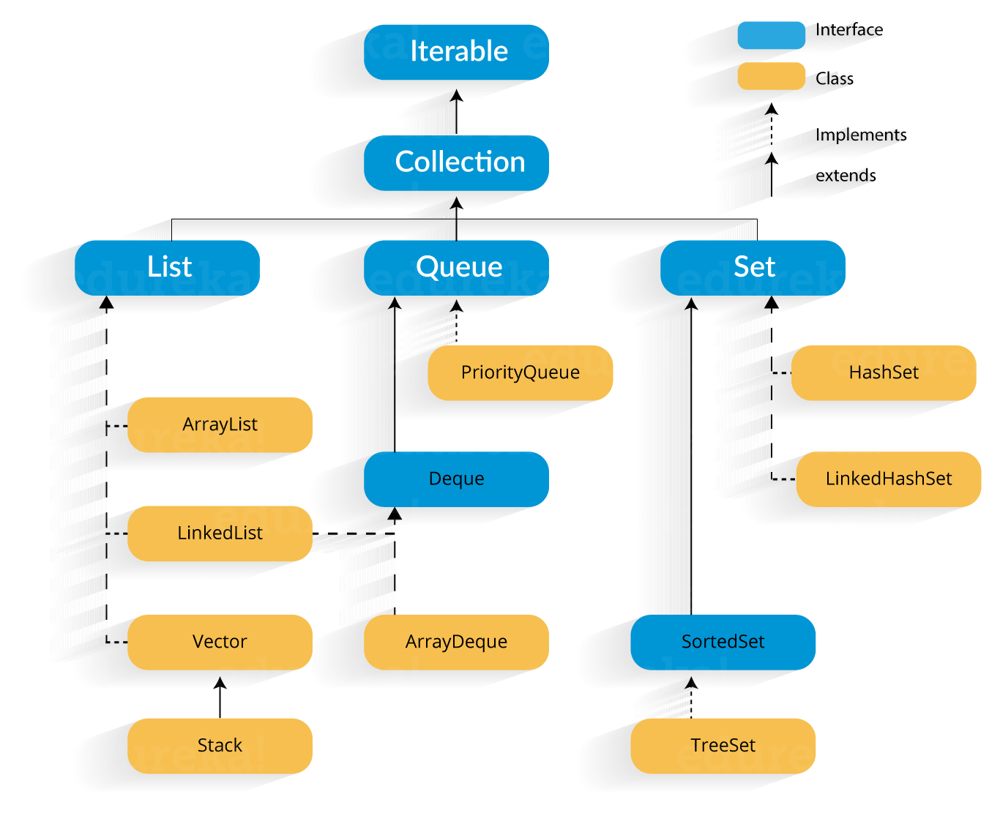

### __List__
__ArrayList__
ArrayList ist im Inneren ein Array. Der Unteschied von Array lieg daran, dass ArrayList das Array intern erweitert, wenn wir mehr Platz für neue Elemente benötigen. Bei dem ausruf
```java
List<String> list = new ArrayList<>();
```
wird intern ein Array mit der Größe 10 erstellt. Wenn man die Größe beeinflußen möchte, kann man eine Überladung des Konstruktors aufrufen.
```java
List<String> list = new ArrayList<>(25);
```
Außer dem ist es auch möglich bei der Initialisierung gleich eine Collection zu übergeben
```java
Queue<String> queue = new LinkedList<>();

queue.add(“John”);
queue.add(“Sam”);
queue.add(“Mary”);
queue.add(“Smith”);
queue.add(“Adam”);

List<String> list = new ArrayList<>(queue);
```
Bei der Arbeit kann man nicht auf inneres Array zugreifen. Man arbeitet nur mit den Daten die in ArrayList hinzugefügt wurden. Wenn innere Array volle größe erreicht hat, vergrößert sich das Array automatisch. Normalerweise verdoppelt sich die Größe.

__LinkedList__
LinkedList ist eine Datenstruktur, die gleich zwei Interfaces implementiert: Queue und List. Im Inneren ist es keine Array sondern eine Kette der Objekte der Klasse Node.
```java 
private static class Node<E> {
   E item;        // Referenz zum Objekt in dem Node
   Node<E> next;  // Referenz zum nächsten Objekt der Klasse Node
   Node<E> prev;  // Referenz zum vorherigen Objekt der Klasse Node

   Node(Node<E> prev, E element, Node<E> next) {
       this.item = element;
       this.next = next;
       this.prev = prev;
   }
}
```


Wenn wir ein Element in LinkedList einfügen, prüfen wir, ob die Liste leer ist. Wenn die Liste leer ist, wird ein Node-Objekt erstellt, das keine Verknüpfungen zu den vorherigen und nächsten Node hat. Bei der nächsten Hinzufügung wird jeder vorhandene Node überprüft, um zu sehen, ob es einen Link zum nächsten Node gibt. Wenn also ein solcher Link für einen bestimmten Node null ist, dann ist der Knoten der letzte in der Sammlung, und das hinzugefügte Element kann daran „angehängt“ werden. Dasselbe passiert mit der Suche, nur vergleichen wir jetzt das gewünschte Element mit dem Element im Knoten und folgen bei Ungleichheit dem Link zum nächsten Knoten.

__Vergleich ArrayList и LinkedList__

|Operation|ArrayList|LinkedList|
|---|---|---|
|Anfügen/Löschen am Anfang|O(n)|O(1)|
|Anfügen/Löschen am Ende|O(1)|O(n)|
|Element per Index|O(1)|O(n)|
|Contains|O(n)|O(n)|

Wenn man Elemente häufig am Anfang ändern möchten, verwendet man LinkedList.
In anderen Fällen ist es besser, ArrayList den Vorzug zu geben.

### Set
Das Hauptmerkmal der Set-Interfaces ist das Fehlen von Duplikaten in dieser Sammlung. Ein einzigartiger Satz von Elementen ist das Hauptmerkmal dieser Datenstruktur. Schnelles Hinzufügen, Entfernen und Finden im Set ist ein ebenso wichtiges „Feature“. Vorteil dieser Struktur besteht darin, schnell zu überprüfen, ob ein Objekt in der Menge vorhanden ist, schnell ein Objekt zu diesert Menge hinzuzufügen und zu entfernen. Die Einzigartigkeit der Elemente hilft uns, alle oben genannten Operationen in einer __konstanten  Zeit__ auszuführen.


Eine Hash-Tabelle ist ein Java-Array. Darin liegen die Elemente des HashSets. Aber unter welchem Index. Um den Index des Objektes zu berechnen wird __hash-function__ benutzt. Sie wird benötigt, um die Objekte  möglichst gleichmäßig über das interne Array zu verteilen. Die __hash-function__ benutzt das Objekt um den Index zu berechnen. Die __hash-function__ kann in jeder Klasse überschrieben werden (geerbt von Object-Klasse -> hashCode). 

 Bei der Generierungs des Indexes für Hash-Table müssen in der __hash-function__ nicht veränderbare Felder eines Objektes benutzt werden. Innerhalb desselben Programms darf sich das Ergebnis eines hashCode()-Aufrufs nicht ändern. Wenn die Methode equals() true zurückgibt, müssen Aufrufe von hashCode() für diese beiden gleichen Objekte dasselbe Ergebnis zurückgeben. Dies bedeutet, dass hashCode() entweder alle oder weniger der in equals() verwendeten Variablen zum Vergleich verwenden kann. Wenn equals() false zurückgibt, sind hashCode()-Aufrufe nicht erforderlich, um unterschiedliche Ergebnisse zurückzugeben.

__Kollisionen in einer Hash-Tabelle__

In dem Fall, wenn zwei verschiedene Objekte zufällig gleichen _hash code_ liefern, kann es zu einer Kollision kommen. Das erste Element passt problemlos in die Tabelle, aber das zweite geht am selben Index vorbei und sieht, dass die Zelle bereits belegt ist. In diesem Fall vergleicht Java das Objekt in der Tabelle am Index mit dem Objekt, das wir einfügen möchten. Wenn die Elemente gleich waren, ist alles einfach - Sie müssen nichts eingeben.

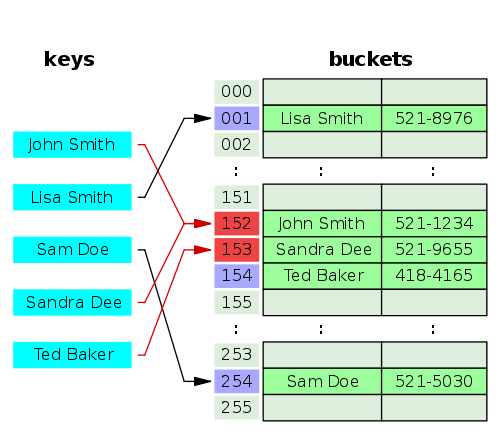

In dieser Abbildung sehen wir, dass hashCode() für John Smith und Sandra Dee gleich berechnet wurde. Dies sind verschiedene Objekte, und jetzt muss die Implementierung der Hash-Tabelle selbst bestimmen, wo das neue Element platziert werden soll. In diesem Beispiel sehen wir, dass wir den nächsten Index der Reihe nach genommen und dort platziert haben. Wenn in diesem Fall der nächste Index bereits ein Objekt enthält, wird die Operation wiederholt (Vergleich und Auswahl des nächsten Index). Als Ergebnis stellt sich heraus, dass wir bei einer Kollision in der Tabelle beim Füllen und Suchen iterativ vorgehen müssen, was die Laufzeit des Algorithmus verschlechtert.

Daher ist eine gute Hash-Tabelle eine, die ein gutes Verhältnis zwischen gefüllten Zellen und leeren Zellen aufweist, die Verteilung der Elemente gleichmäßig ist und keine langen Gruppen benachbarter Indizes gibt, in denen keine freien Zellen vorhanden sind.

Wie korreliert die berechnete Hash-Funktion mit dem Index der Hash-Tabelle? Schließlich kann das Ergebnis der Funktion beispielsweise die Zahl 725 sein, und die Größe der Tabelle ist auf 50 Elemente begrenzt.

In diesem Fall kann __%__ benutzt werden, dabei wird das Ergebnis auf die Länge geteilt mit __%__.

Es gibt mehrere Möglichkeiten, die Anzahl der Kollisionen zu reduzieren. Eine davon besteht darin, die berechnete Funktion mit einer Primzahl (z. B. 7 oder 13) zu multiplizieren. Eine andere besteht darin, einen anderen Tabelleniterationsschritt zu verwenden, wenn eine Kollision auftritt (z. B. nicht 1, sondern 5).

__HashSet__

HashSet ist die am häufigsten verwendete Implementierung der Set-Schnittstelle, es arbeitet mit einer internen HashMap (es unterscheidet sich von einer Hash-Tabelle durch die Möglichkeit, Null hinzuzufügen, und durch fehlende Synchronisation). Aus diesem Grund ist es nicht garantiert, dass die Reihenfolge beibehalten wird, in der die Elemente hinzugefügt wurden (aufgrund derselben Hash-Tabelle).

```java
//Ein leerer Satz wird erstellt, und darin wird ein hashMap-Objekt mit einer Anfangsgröße von 16 und einem standardmäßigen (Standard-)Füllfaktor von 0,75 erstellt. Wenn 75% der Größe belegt ist verdoppelt sich die Größe
Set<String> set = new HashSet<>();

//Eine leere Menge wird mit einer Anfangsgröße gleich dem übergebenen Argument erstellt.
Set<String> set = new HashSet<>(25);

//Ein leerer Satz wird mit der anfänglichen Größe und dem Füllfaktor gleich den übergebenen Argumenten erstellt.
Set<String> set = new HashSet<>(25, 0.9);

//Mit anderen Collection
List<String> list = new ArrayList<>();
list.add("John");
list.add("Sam");
list.add("Mary");
list.add("Smith");
list.add("Adam");

Set<String> set = new HashSet<>(list);
```

__LinkedHashSet__

LinkedHashSet — Implementierung einer Hash-Tabelle und einer LinkedList zur gleichen Zeit bewahrt dieses Objekt zusätzlich zu Funktionen wie in HashSet die Reihenfolge der hinzugefügten Elemente.

__TreeSet__

TreeSet — Implementierung von NavigableSet, ermöglicht es Ihnen, die Elemente in der Reihenfolge zu speichern, die der "normalen Sortierung" entspricht. Was sehr wichtig zu wissen ist: nicht alle Objekte können dem Set dieser Implementierung hinzugefügt werden, sondern nur Objekte der Klassen, die das Interface __java.lang.Comparable__ implementieren.


### Map
Map - speichert Key-Value - Paar

__HashMap__

Meist benutzte Implementierung der Map ist HashMap.
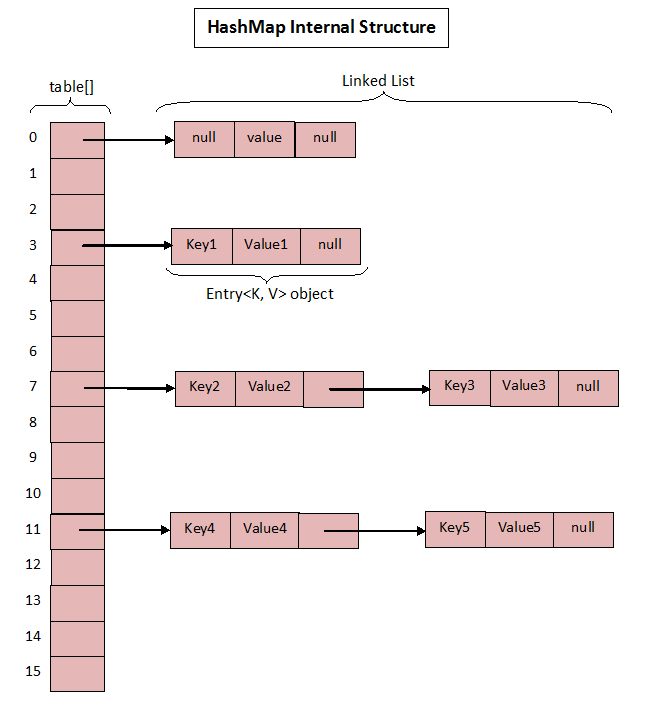

Links (table[]) ist die Hash-Tabelle. Beim Hinzufügen eines Schlüssel-Wert-Paares zur Map wird der HashCode für den Schlüssel berechnet, daraus der Index des internen Arrays berechnet und das Node-Objekt dort platziert:


* int hash — hashCode() ключа;
* K key — объект-ключ (ключ должен следовать контракту определения методов equals() и hashCode());
* V value — значение;
* Node<K, V> next — ссылка на следующую ноду.

Давайте разберем немного подробнее, что такое Node<K, V> next.

Итак, мы кладем ключ-значение в нашу HashMap. У ключа высчитывается hash-функция, по полученной функции получается индекс в hash-таблице. Мы идем туда, и тут есть три варианта развития событий:

1. Индекс не занят

    Тогда создается новый объект Node, у которого инициализируются все поля, кроме поля Next, и кладется по этому индексу.

1. Индекс занят, ключ существующей ноды по занятому индексу равен ключу добавляемой пары «ключ-значение»

    Тогда создается новый объект Node, у которого инициализируются все поля, кроме поля Next, этот объект «перетирает» старый в Map.

1. Индекс занят, ключ существующей ноды по занятому индексу не равен ключу добавляемой пары «ключ-значение»

    В этом случае у нас происходит коллизия. Как мы справлялись с коллизиями когда говорили о Set? Мы находили другой незанятый в hash-таблице индекс и клали добавляемый элемент туда. С Map немного иначе, вместо этого создается новый объект Node, у которого инициализируются все поля, кроме поля Next, и ссылку на эту новую ноду мы присваиваем к переменной Next существующей ноды. Таким образом, у нас получается классический LinkedList.

Начиная с Java 8, есть изменение в способе хранения коллизий. До этой версии коллизии хранились в LinkedList. Насколько мы знаем, чтобы находить/добавлять/удалять нужную ноду по ключу в LinkedList, необходимо итерироваться по его ссылкам, что дает нам линейную временную сложность алгоритма O(n) (напомним, что это не совсем хорошая сложность, есть алгоритмы быстрее, например O(1) или O(logN)). Чтобы ускорить данный алгоритм, разработчики видоизменили внутреннюю имплементацию, и теперь по достижении определенного порога количества элементов в коллизии структура данных LinkedList заменяется другой структурой данных — сбалансированное дерево. Эта структура помогает ускорить время выполнения алгоритма с O(n) до O(logN)!

Рассмотрим конструкторы данной имплементации:

|Пример вызываемого конструктора|Описание|
|---|---|
|Map<String, String> map = new HashMap<>();|Создается пустой объект HashMap c первоначальным размером 16 и с дефолтным коэффициентом заполненности 0.75 (отношение количества элементов к размеру — при превышении создается новый объект HashMap с размером в 2 раза больше предыдущего).|
|Map<String, String> map = new HashMap<>(25);|Создается пустой объект с первоначальным размером, равным передаваемому аргументу.|
|Map<String, String> map = new HashMap<>(25, 0.9);|Создается пустой объект с первоначальными размером и коэффициентом заполненности, равными передаваемым аргументам.|
|Map<String, String> map = new HashMap<>();<br>map.put("father", "John");<br>map.put("brother", "Sam");<br>map.put("mother", "Mary");<br>map.put("uncle", "Smith");<br>map.put("grandfather", "Adam");<br>Map<String, String> newMap = new HashMap<>(map);<br>|В данный конструктор мы передаем в качестве аргумента другую Map, и теперь наш HashMap содержит все элементы этой Map.|

### LinkedHashMap
LinkedHashMap — имплементация одновременно hash-таблицы и LinkedList, данный объект, помимо функций, как в HashMap, сохраняет порядок добавленных элементов.

### TreeMap
TreeMap — имплементация NavigableMap, позволяет хранить элементы в порядке, соответствующем «нормальной сортировке». Внутри реализована как структура данных «красно-черное дерево».

Узнать про эту структуру и не только можно, посмотрев отличный плейлист на Youtube: [Алгоритмы и структуры данных](https://www.youtube.com/watch?v=IgeJmTKQlKs&list=PLpPXw4zFa0uKKhaSz87IowJnOTzh9tiBk&index=2)

**Что очень важно знать**: не все объекты могут быть ключами в Map этой имплементации, а только объекты тех классов, которые имплементируют интерфейс java.lang.Comparable

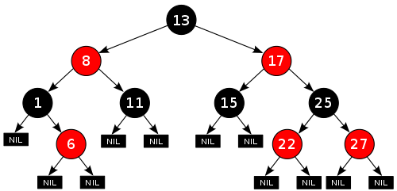

**Сравнение временной сложности алгоритмов для имплементаций Map**

|Операция|HashMap|LinkedHashMap|TreeMap|
|---|---|---|---|
|добавление элемента<br>map.put(key, elem);|O(1)* |O(1)* |О(logN)|
|удаление элемента по ключу<br>map.remove(key);|O(1)* |O(1)* |О(logN)|
|проверка на содержание ключа<br>map.contains(key);|O(1)* |O(1)* |О(logN)|

``*`` — зависит от распределения элементов по hash-таблице, на практике чуть хуже.

## Сравнение и сортировка объектов
### Интерфейс Comparable

Помните, когда мы рассматривали классы TreeSet и TreeMap, было упомянуто, что не все объекты могут быть объектами (или, для Map — ключами) в данных коллекциях? Эти объекты должны быть сортируемыми.

Представим, что мы создали наш кастомный класс Product:

```java
import java.time.LocalDateTime;
import java.util.Objects;

public class Product {

   private final String brand; // бренд
   private final String name; // имя продукта
   private final long serialNumber; // его серийный номер
   private final LocalDateTime creationDate; // дата производства

   public Product(String brand, String name, long serialNumber, LocalDateTime creationDate) {
       if (brand == null || name == null || serialNumber == 0 || creationDate == null) {
           throw new IllegalArgumentException();
       }
       this.brand = brand;
       this.name = name;
       this.serialNumber = serialNumber;
       this.creationDate = creationDate;
   }

   public String getBrand() {
      return brand;
   }

   public String getName() {
      return name;
   }

   public long getSerialNumber() {
      return serialNumber;
   }

   public LocalDateTime getCreationDate() {
      return creationDate;
   }

   @Override
   public boolean equals(Object o) { // определяем равенство по полям brand, serialNumber и name
       if (this == o) return true;
       if (o == null || getClass() != o.getClass()) return false;
       Product product = (Product) o;
       return serialNumber == product.serialNumber &&
               brand.equals(product.brand) &&
               name.equals(product.name);
   }

   @Override
   public int hashCode() { // по тем же полям считаем hash
       return Objects.hash(brand, name, serialNumber);
   }

   @Override
   public String toString() {
       return "Product{" +
               "brand='" + brand + '\'' +
               ", name='" + name + '\'' +
               ", serialNumber=" + serialNumber +
               ", creationDate=" + creationDate +
               '}';
   }
}
```

И теперь мы хотим положить объект класса в TreeSet:

```java
public static void main(String[] args) {
   Set<Product> set = new TreeSet<>();
   set.add(new Product("СуперБренд", "Колбаса", 3435425455L, LocalDateTime.now()));
}
```

Вот что мы увидим в консоли после запуска:

```cmd
Exception in thread "main" java.lang.ClassCastException: class Product cannot be cast to class java.lang.Comparable
	at java.base/java.util.TreeMap.compare(TreeMap.java:1291)
	at java.base/java.util.TreeMap.put(TreeMap.java:536)
	at java.base/java.util.TreeSet.add(TreeSet.java:255)
	at com.nikolai.module15.unit7.Main.main(Main.java:11)
```
Перед тем как разобраться с ошибкой, давайте подумаем, почему мы не можем добавить объект класса Product в TreeSet? Все просто: класс этого объекта (в данной реализации) является несортируемым. И действительно, как Java может понять, как мы хотим сортировать этот объект в коллекции? По дате создания в порядке убывания или, может, по серийному номеру в порядке возрастания? А может по тому и другому сразу?

Для определения логики сортировки объекта служит интерфейс java.lang.Comparable. Вот как он выглядит:

```java
public interface Comparable<T> {
    public int compareTo(T o);
}
```

```
Метод принимает объект того же типа, что и сравниваемый объект, и возвращает число типа int.

Рассмотрим допустимые возвращаемые числа:

число больше нуля — когда текущий объект (объект, на котором вызывается данный метод) больше, чем аргумент метода;
число меньше нуля — когда текущий объект меньше, чем аргумент метода;
ноль — когда объекты равны между собой.
```

Давайте перепишем наш класс следующим образом:

```java
import java.time.LocalDateTime;
import java.util.Objects;

public class Product implements Comparable<Product> {

   private final String brand;
   private final String name;
   private final long serialNumber;
   private final LocalDateTime creationDate;

   public Product(String brand, String name, long serialNumber, LocalDateTime creationDate) {
       if (brand == null || name == null || serialNumber == 0 || creationDate == null) {
           throw new IllegalArgumentException();
       }
       this.brand = brand;
       this.name = name;
       this.serialNumber = serialNumber;
       this.creationDate = creationDate;
   }

   public String getBrand() {
       return brand;
   }

   public String getName() {
       return name;
   }

   public long getSerialNumber() {
       return serialNumber;
   }

   public LocalDateTime getCreationDate() {
       return creationDate;
   }

   @Override
   public boolean equals(Object o) {
       if (this == o) return true;
       if (o == null || getClass() != o.getClass()) return false;
       Product product = (Product) o;
       return serialNumber == product.serialNumber &&
               brand.equals(product.brand) &&
               name.equals(product.name);
   }

   @Override
   public int hashCode() {
       return Objects.hash(brand, name, serialNumber);
   }

   @Override
   public String toString() {
       return "Product{" +
               "brand='" + brand + '\'' +
               ", name='" + name + '\'' +
               ", serialNumber=" + serialNumber +
               ", creationDate=" + creationDate +
               '}';
   }

   @Override
   public int compareTo(Product o) {
       return brand.compareTo(o.brand);
   }
}
```

Сейчас мы имплементировали интерфейс Comparable и в методе compareTo() сказали, что будем сравнивать бренды по возрастанию (класс String тоже имплементирует данный интерфейс, строки сортируются в алфавитном порядке по возрастанию).

Снова добавим теперь уже 3 объекта в TreeSet:

```java
public static void main(String[] args) {
   Set<Product> set = new TreeSet<>();
   set.add(new Product("СуперБренд", "Колбаса", 3435425245L, LocalDateTime.now()));
   set.add(new Product("ЛучшийБренд", "Сыр", 434323434L, LocalDateTime.now()));
   set.add(new Product("ХорошийБренд", "Сыр", 4343111111L, LocalDateTime.now()));
   for (Product product : set) {
       System.out.println(product.getBrand());
   }
}
```

Продукты в TreeSet теперь лежат в алфавитном порядке их брендов.

**Очень важно иметь согласованные между собой методы equals() и compareTo(), то есть объекты обязательно должны быть равны между собой в случае, если метод compareTo() возвращает 0.**

### Интерфейс Comparator
Из предыдущей темы ясно, что сортируемые объекты должны имплементировать интерфейс Comparable. Но на практике не всегда это удобно и даже возможно. Почему?

Метод compareTo() определяет лишь одну логику сортировки. Представьте, что объекты из класса Product выше мы в одном случае хотим сравнивать только по брендам, а в другом — по брендам в сочетании со сравнением поля «серийный номер». Имея лишь один метод compareTo() интерфейса Comparable , это не представляется возможным.
Что если мы сравниваем не наш кастомный класс, а сторонний, библиотечный? Конечно, мы можем наследоваться от него и переопределить compareTo() под нашу логику, однако это требует создания отдельного Java класса, что не всегда удобно.
Что если сторонний класс вообще не сравниваемый (не имплементирующий Comparable)? Тогда без других инструментов нам невозможно произвести сравнение.
На помощь нам приходит другой Java-интерфейс — java.util.Comparator:

```java
public interface Comparator<T> {
   int compare(T o1, T o2);
}
```
В отличие от интерфейса Comparable, этот интерфейс принимает в себя сразу два сравниваемых объекта.

Преимущество данного метода в том, что теперь мы вызываем метод не у самого сравниваемого объекта, а у любого объекта, имплементирующего интерфейс Comparator. Плюс в этом: теперь мы можем написать сколь угодно много способов сравнения объектов одного типа.

Давайте создадим две имплементации Comparator и сравним продукты, используя их:
```java
public class NameComparator implements Comparator<Product> {
   @Override
   public int compare(Product o1, Product o2) {
       return o1.getName().compareTo(o2.getName());
   }
}

public class SerialNumberComparator implements Comparator<Product> {
   @Override
   public int compare(Product o1, Product o2) {
       return Long.compare(o1.getSerialNumber(), o2.getSerialNumber());
   }
}
```
Первый Comparator сравнивает продукты по имени в алфавитном порядке по возрастанию, а второй — по серийному номеру в арифметическом порядке но по уменьшению чисел.

Добавим в TreeSet используя оба компаратора:
```java
public static void main(String[] args) {
   Set<Product> products = new TreeSet<>(new NameComparator());
   products.add(new Product("СуперБренд", "Колбаса", 1L, LocalDateTime.now()));
   products.add(new Product("ЛучшийБренд", "Сыр", 2L, LocalDateTime.now()));

   for (Product product : products) {
       System.out.println(product.getName());
   }
}
```
```
Колбаса
Сыр
```
```java
public static void main(String[] args) {
   Set<Product> products = new TreeSet<>(new SerialNumberComparator().reversed());
   products.add(new Product("СуперБренд", "Колбаса", 1L, LocalDateTime.now()));
   products.add(new Product("ЛучшийБренд", "Сыр", 2L, LocalDateTime.now()));

   for (Product product : products) {
       System.out.println(product.getSerialNumber());
   }
}
```
```
2
1
```
Обратите внимание, что у объекта new SerialNumberComparator() был вызван дополнительно метод reversed(), который возвращает новый компаратор, у которого инвертирована логика сортировки, в данном случае сортировка типа long будет не в порядке возрастания чисел, как в обычном компараторе, а наоборот.

**Сравнение Comparable и Comparator**

|Разница|Comparable|Comparator|
|---|---|---|
|Имя пакета|java.lang|java.util|
|Должен ли сравниваемый класс имплементировать этот интерфейс?|да|нет|
|Имя метода в интерфейсе|compareTo|compare|
|Количество параметров|1|2|

# Multithreading (Module 13)
## Процессы и потоки
Современные операционные системы серьезно относятся к безопасности. Программы, запущенные без специальных полномочий, не имеют возможности вмешиваться в работу других программ, изменять память, выделенную другой программе. Они представляют собой процессы.  

У каждого процесса есть свое собственное пространство в оперативной памяти. У процесса свой исполняемый код. У каждого процесса заданы минимальные и максимальные границы по использованию памяти, чтобы этот процесс при большой загрузке не претендовал на ресурсы других процессов и не замораживал работу. 

Когда мы стартуем приложение  — процесс, у него создается главный поток. В нем можно запустить другие потоки, программы, которые будут работать сообща, то есть делить общие ресурсы, работать в общем адресном пространстве. Потоки одного процесса могут взаимодействовать друг с другом напрямую.

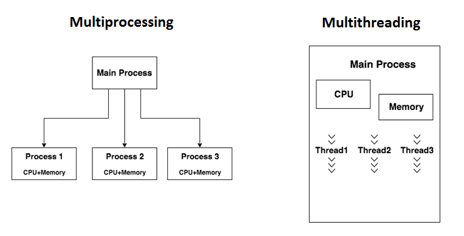

Можно сказать, что процесс  — это приложение (программа), которое работает самостоятельно. А поток  — это код, который работает под управлением процесса, обеспечивая его работу.
В этом модуле мы не будем касаться межпроцессорного взаимодействия, управлять другими процессами из нашей Java-программы. Здесь мы поговорим о том, как организовать работу нескольких потоков в одной Java-программе, в рамках одного процесса.

Схематично можно представить работу Java-программы, в которой запущено несколько потоков, так:

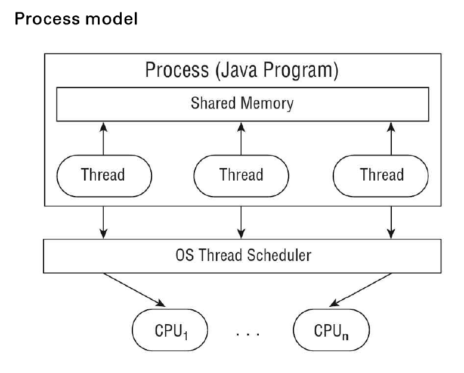

Когда у нас в распоряжении процессор с одним  ядром, исполняется лишь один поток какого-либо процесса в данный момент времени. Как система решает, что исполнять в данный момент в многопоточной среде? Для этого операционные системы используют так называемый планировщик потоков (thread scheduler). В его задачу входит определение, какой именно поток какого процесса должен выполняться в данный момент. 

Как показано на рисунке, он распределяет потоки по ядрам процессора. Один из алгоритмов работы планировщика очень прост: каждый поток в системе получает равную долю циклов исполнения процессором (потоки «посещают» процессор по кругу). Если у нас 10 потоков, каждый может получить 100 миллисекунд для выполнения, при этом процессор возвращается к первому потоку после исполнения последнего по кругу. 

Когда выделенное процессором время работы потока заканчивается, но поток не завершил свою работу, происходит переключение контекста (context switch). Это сохранение текущего состояния потока и последующее восстановление, когда процессор снова берется выполнять этот поток. Переключение контекста — довольно «дорогая» операция с точки зрения затрат времени на сохранение и восстановление состояния потока. 

Несмотря на то, что многоядерные процессоры — уже обыденность в наши дни, процессоры с одним ядром были стандартом на протяжении многих лет. На протяжении этого времени операционные системы разработали сложные алгоритмы планировщиков потоков и переключателей контекста, которые позволили пользователям исполнять десятки, а то и сотни потоков на одном ядре. Такие алгоритмы создавали иллюзию для пользователей, что потоки исполняются одновременно. Так как количество потоков все равно значительно превышает количество доступных ядер процессора в наши дни, эти алгоритмы работают до сих пор.

## Все программы на Java — многопоточные!
Вы можете удивиться, но все программы, которые мы с вами видели в курсе — многопоточные. Даже самая простейшая программа, выводящая в консоль "Hello World!" Чтобы понять почему, введем понятия системных и пользовательских потоков.

JVM сама создаёт потоки, они называются системными. Например, поток сборщика мусора — системный поток, помогающий освобождать более неиспользуемую память. В большинстве случаев исполнение системных потоков невидимо для пользователей. Когда системный поток обнаруживает проблему и не может после нее восстановиться, он бросает Java Error, в отличие от Exception. Напомним, что не стоит отлавливать ошибки, наследуемые от Error в коде, так как очень редко приложение может быть восстановлено от системной ошибки. 

Для простоты обычно называют Java-приложение однопоточным, если есть один пользовательский поток, не учитывая системные потоки, к которым пользователи практически не обращаются.
В этом модуле мы будем создавать пользовательские потоки, используя команды в программе. 

Давайте научимся запускать дополнительные потоки в программе.

## Запуск потока
### Класс Thread
Самый простой способ запустить новый поток — использовать класс java.lang.Thread. 

Нам нужно:

1. Создать подкласс класса Thread и в нем переопределить метод run(). Именно этот метод и будет выполняться, когда поток запустится.
1. Создать экземпляр этого нового класса
1. Запустить поток командой start().

### Пример «Биржа криптовалют»
Представим, что мы хотим увеличить капитал, а тут подвернулась отличная возможность: появилась новая криптовалюта, которая обещает сумасшедший рост. И есть брокер, через которого и можно в неё вложиться. Причем сумма вложения смешная — 1000 рублей.

Софт брокера написан на Java и он, собственно, предлагает просто запустить вот такой поток:
```java
public class StockAccount extends Thread {
   int money = 1000;
   @Override
   public void run() {
       while(true){
           money++;
       }
   }
}
```
То есть ваши деньги будут увеличиваться постоянно и очень быстро: по рублю за итерацию.

И что? Тут нет подвоха? В договоре, как и положено в таких случаях случаях, очень мелким шрифтом написана информация о рисках: доход на самом деле образует волну, после достижения очень больших размеров Integer.MAX_VALUE (+2,147,483,647) ваш доход станет Integer.MIN_VALUE (-2,147,483,648), то есть вы становитесь должны брокеру два миллиарда рублей… Но потом ваш долг начнет быстро уменьшаться, и очень скоро вы снова выйдете в огромный плюс. При этом можно зафиксировать прибыль в любой момент (про эту проблему машинной арифметики можно почитать здесь).

Для работы на бирже каждому клиенту предлагается такой софт:
```java
public class Main {
   public static void main(String[] args) {
       //заводим счет на бирже
       StockAccount stockAccount = new StockAccount();
       //счет начинает работать
       stockAccount.start();
       //прибыль
       long profit = 0;
       //блок управления
       Scanner in = new Scanner(System.in);
       String command = "";
       while (!command.equals("exit")) {
           command = in.next();
           switch(command){
               case "check":
                   System.out.println(stockAccount.money);
                   break;
               case "fix":
                   //Фиксируем прибыль
                   profit += (long)stockAccount.money - 1000;
                   System.out.println("Profit is " + profit);
                   //На счету остается минимальный остаток
                   stockAccount.money = 1000;
           }
       }
   }
}
```
У клиента запускается цикл, который принимает команды check и fix от пользователя до тех пор, пока он не введет команду exit.

Команда check проверяет состояние счета, команда fix фиксирует текущую прибыль.

Попробуйте поработать с этой программой из двух классов, получить прибыль. Скорее всего, часто ваша прибыль будет уменьшаться и станет отрицательной. Такова сущность быстрых денег. Но давайте, всё-таки, не об экономике, а о программировании.

Кстати, зачем в строке
```java
profit += (long)stockAccount.money - 1000;
```
приведение к типу long?

Если клиентский счет близок к минимуму Integer.MIN_VALUE, вычитание в int создаст огромный профит. Значения зациклены в обе стороны: если к максимальному прибавить — результат уйдет в минус, и если из минимального вычитать — в плюс.

В нашей программе работает два цикла одновременно. Конечно, здесь и далее под этим словом мы подразумеваем «имитируют одновременную работу». Впрочем, для циклов это так и есть: реальная программа постоянно переключается с одного цикла на другой, поэтому слово «одновременно» здесь вполне подходит.

Зачем это?

Клиент, желающий разбогатеть  — страшный тормоз. Пока клиент не закончит команду, не нажмет на Enter  — сканер его ждет, программа стоит на месте. Счет должен расти без задержек. Даже если пользователь вообще не отдает ни одной команды, биржа работает независимо, и счёт постоянно меняется.

Критически важно на экземпляре класса Thread вызвать метод start(). Именно он ответственен за создание и запуск нового потока. Если вы вызовете метод run() вместо start() в обоих случаях, то код выполнится в одном main() потоке. Попробуйте заменить в нашей программе start() на run(), и вы не сможете вводить команды. Метод run() класса StockAccount будет запущен в главном потоке. И пока он не закончится (а он не закончится никогда!) даже сканер создан не будет.

Простой класс потока, который принимает число и в методе run() выводит его:
```java
class TestStart extends Thread {
  int i;

   public TestStart(int i) {
       this.i = i;
   }

   @Override
   public void run() {
       System.out.print(i);
   }
}
```
Как вы думаете, что будет выведено в консоль кодом ниже?
```java
for (int i = 0; i < 10; i++) {
   new TestStart(i).start();
}
```
Проверьте. Запустите программу несколько раз.

Обычно эта программа выводит 0123456789, но иногда получается другой результат. Как мы узнали выше, когда стартуют потоки зависит от системы, в которой мы работаем. Если бы код был сложнее и разные потоки стартовали бы в main-потоке в разных местах с разными задачами, то была бы больше вероятность увидеть «рассинхрон».

Главное правило: не надейтесь, что ваши потоки будут работать в том порядке, в котором вы их стартовали. 

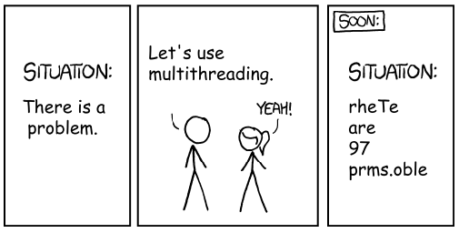

### Интерфейс Runnable
Другой способ запустить поток в своей программе  — использовать интерфейс Runnable:
```java
public interface Runnable {
   public abstract void run();
}
```
Благодаря ему можно любой класс, уже пронаследованный от другого класса (не от Thread), сделать потоком.

Для запуска потока при помощи Runnable нужно:

1. Реализовать интерфейс в каком-нибудь классе.
1. Создать экземпляр этого  класса.
1. Создать экземпляр класса Thread, передав ему в конструкторе созданный экземпляр (то есть создать объект класса поток).
1. Запустить поток вызовом метода start().

### Итоги
Итак, поток можно запускать при помощи класса Thread и при помощи интерфейса Runnable, в этом случае нужно всё равно создавать из него объект типа Thread. Кстати, сам класс Thread тоже реализует интерфейс Runnable. 

Какой способ предпочтительнее? 

Так как Java не позволяет множественное наследование, наследование от Thread ограничивает вас в наследовании от других классов, с интерфейсом Runnable такой проблемы нет.

Запускать поток нужно именно методом start(). Если вызвать метод run() непосредственно, он будет запущен в том же потоке.

## Прерывание работы потока
Часто бывает, что результат одного потока нужен в другом.

Представим, что у нас есть поток, который изменяет static-счетчик, и поток-main ждет, пока первый поток не увеличит значение этого счетчика до значения более 100. 

Оформим этот код при помощи анонимного класса, это очень часто делают при разработке классов с маленьким количеством методов, которые надо переопределить. У нас всего один метод run(). Ещё более удобный способ использовать лямбда-выражения, мы рассмотрим их в модуле, посвященном возможностям Java 8.
```java
public class CheckResults {
   private static int counter = 0;

   public static void main(String[] args) {
       new Thread() {
           public void run(){
                 for (int i = 0; i < 100; i++) {
                    CheckResults.counter++;
                 }
           }
       }.start();
       while (CheckResults.counter < 100) {
           System.out.println("Not reached yet");
       }
       System.out.println("Reached");
   }

}
```

Сколько раз будет исполнен вывод на консоль сообщения "Not reached yet"? Мы не знаем! Может быть в консоли 0 строк, 100 строк, миллион строк. Почему? Мы сами «не рулим» переключением потоков.

Использовать цикл для проверки неких данных другого потока без какой-либо задержки — очень плохая практика, так как мы расходуем ресурсы процессора попусту. 

### Метод sleep()
Познакомимся с таким методом, как sleep(long millis). Этот метод заставляет перейти поток в спящий режим на определенное в параметре время. 

Теперь дополним код так:
```java
public class CheckResults {
   private static int counter = 0;

   public static void main(String[] args) throws InterruptedException {
     new Thread() {
           public void run(){
                 for (int i = 0; i < 100; i++) {
                    CheckResults.counter++;
                 }
           }
       }.start();
       while (CheckResults.counter < 100) {
           System.out.println("Not reached yet");
           Thread.sleep(1000); // 1 секунда
       }
       System.out.println("Reached");
   }

}
```
Теперь мы добавили задержку потока в 1 секунду. То есть тот поток, который исполняет этот код и встречает вызов метода *sleep()*, замирает на определенное время. В данном примере 1 секунда задержки — это немного, но зато мы не расходуем ресурсы процессора, предотвращаем возможность исполнения бесконечного цикла и блокирования программы. 

Также заметьте, что в сигнатуре метода появилось checked исключение *InterruptedException*. Это исключение выбрасывается, если посылается команда прервать поток — таким образом мы можем остановить его работу. Как останавливать работу потока, мы рассмотрим позже.

**Метод join()**
 
Другой механизм синхронизации последовательности работы потоков — метод *join()*. Рассмотрим такой пример:

```java
public class JoinExample {
   private static int counter = 0;
   public static void main(String[] args) throws InterruptedException {
      new Thread() {
           public void run(){
                 for (int i = 0; i < 50000000; i++) {
                   JoinExample.counter++;
                 }
           }
       }.start();

       System.out.println("Counter value: " + counter); // Counter value: 0
   }
}
```

Здесь один поток в цикле увеличивает счетчик на 1, а второй распечатывает его значение в консоль. Программа работает не так, как задумывалось: наиболее вероятный результат в консоли — 0. 

Конечно, в такой простой задаче хватило бы одного потока для выполнения последовательно увеличения счетчика и вывода конечного результата. Но может быть и такая ситуация, когда нужно в main() делать другую работу параллельно, и только после ее окончания дождаться конечного результата от другого потока. Недостаток метода sleep() — нужно периодически проверять, закончил ли работу поток. Одной секунды может не хватить. И тогда надо ждать вторую секунду, третью...

Добавим строчку в код:
```java
public class JoinExample {
    private static int counter = 0;
    public static void main(String[] args) throws InterruptedException {
        Thread thread = new Thread() {
            public void run() {
                for (int i = 0; i < 1000000000; i++) {
                    JoinExample.counter++;
                }
            }
        };
        thread.start();
        thread.join(); // main() поток блокируется и ждет, пока не завершится поток thread
        System.out.println("Counter value: " + counter); // Counter value: 1000000000
    }
}
```

Теперь мы дожидаемся пока не завершит работу второй поток, и только затем main() продолжает работу. Вывод этой программы всегда одинаковый  — миллиард. 

Также есть сигнатура метода *join(long millis)*, позволяющая задавать время ожидания завершения работы потока.

Метод *join()* обычно используют, когда ожидание планируется очень недолгим. Например, остановка — это не мгновенная операция, поэтому после вызова *interrupt()* мы должны вызвать *join()*, чтобы дождаться окончания остановки.

Жизненный цикл потока в Java
Выделяют 6 состояний потока в Java-приложении:

1. New

    Поток создан, но ещё не стартовал. Он остается в таком состоянии, пока не будет вызван метод start().

2. Runnable

    Поток в активной фазе. Он либо исполняет операции пользуясь временем, данным ему планировщиком потоков, либо ждет, когда планировщик потоков выделит ему процессорные ресурсы.

3. Blocked

    Поток в данный момент не может продолжать работу. Он находится в таком состоянии, когда не может получить доступ к коду, который синхронизирован и заблокирован работой другого потока (про синхронизацию поговорим в другой теме).

4. Waiting

    Поток ждет, пока другой поток или потоки не выполнят определенные действия. Например, текущий поток находится в режиме ожидания, когда на другом потоке вызван метод join().

5. Timed_Waiting

    То же, что и Waiting, только время ожидания определено заранее. Примеры: методы join(long millis), sleep(long millis).

6. Terminated

    Это состояние завершившего работу потока. Причем завершившего работу нормально или с ошибкой — неважно. Помните, что после того как поток вошел в эту стадию, снова запустить его не получится! Java в этом случае бросит ошибку в Runtime. Создавайте новый объект Thread и запускайте его.

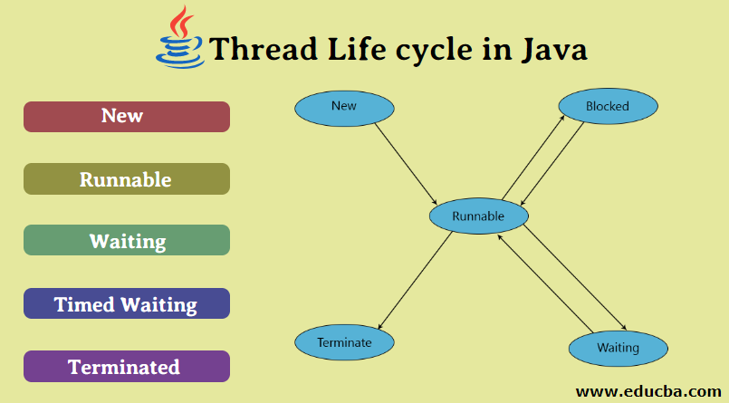

Обратите внимание: обратного пути из состояния Terminated нет! Остановленный поток невозможно запустить повторно. Если это необходимо, нужно создавать ещё один объект потока и запускать его.

## Метод interrupt()
Есть два варианта завершения работы потока:

* Поток завершает работу сам или бросает Runtime exception.
* Поток прерывается при вызове метода thread.interrupt().

Важно! Есть ещё метод stop(), прекращающий поток немедленно. Этот метод считается устаревшим, его никогда не надо использовать, потому что потоку бывает нужно закончить работу или корректно её прервать. Например, поток записывал файл, и если его немедленно прервать, то файл может быть поврежден. 
Если с первым пунктом все понятно, то как реализовать прерывание извне? 

Когда мы командуем потоку interrupt(), возможны две ситуации.

### 1. Поток находится в состоянии Waiting и Timed Waiting
В этом случае выкидывается исключение InterruptedException.

Рассмотрим код:
```java
public class InterruptExample {

   public static void main(String[] args) throws InterruptedException { // 4
       Thread threadToInterrupt = new Thread({
           public void run(){
             while (true) {
                 System.out.println("Working hard");
                 try {
                     Thread.sleep(1000); // 1
                 } catch (InterruptedException e) {
                     System.out.println("Interrupted!");
                     break; // 2
                 }
             }
           }
       });

       threadToInterrupt.start();
       Thread.currentThread().sleep(2500); // 3
       threadToInterrupt.interrupt(); // 5
   }
}
```

```cmd
Working hard
Working hard
Working hard
Interrupted
```

Подробно прокомментируем программу:

1. В потоке в бесконечном цикле мы каждый раз замораживаем поток на 1 секунду. Метод бросает InterruptedException, который мы можем отловить в методе run().
1. Когда мы обрабатываем исключение, просто выходим из цикла. Тогда метод run() дойдет до конца метода, и поток завершит работу.
1. Главный поток мы тоже блокируем, для наглядности на 2.5 секунды.
1. Обратите внимание: так как на строке 3 мы вызвали операцию sleep(), мы должны так же и в главном потоке обработать InterruptedException. Но в этом нет необходимости, так как мы не собираемся писать логику прерывания главного потока из-за отсутствия необходимости его прерывать в нашем приложении. Так как метод main() — наш созданный метод, мы можем прописать в его сигнатуре любые checked exceptions, что мы и сделали, прописав InterruptedException.
1. Метод для прерывания созданного пользовательского потока.

### 2. Поток в состоянии Runnable
А что будет, если в предыдущей программе убрать sleep() вместе с try-catch? 

Вот так:
```java
public class InterruptExample {

   public static void main(String[] args) throws InterruptedException { // 4
       Thread threadToInterrupt = new Thread(){
           public void run(){
             while (true) {
                 System.out.println("Working hard");
             }
           }
       };

       threadToInterrupt.start();
       Thread.currentThread().sleep(2500); // 3
       threadToInterrupt.interrupt(); // 5
   }
}
```
Ничего не произойдет! Поток не остановится и будет с большой скоростью продолжать печатать сообщение “Working hard”. Так происходит потому, что вызов interrupt() на самом деле не останавливает поток, а лишь устанавливает флаг, который сам поток может проверить и завершить работу.  Например, так:
```java
public class InterruptExample {

   public static void main(String[] args) throws InterruptedException { // 4
       Thread threadToInterrupt = new Thread(){
           public void run(){
                while (!isInterrupted()) {
                    System.out.println("Working hard");
                }
                try {
                    Thread.sleep(500);
                } catch (InterruptedException e) {
                    //Перехватываем молча
                }
                System.out.println("All done");
           }
       };

       threadToInterrupt.start();
       Thread.currentThread().sleep(2500); // 3
       threadToInterrupt.interrupt();        
       threadToInterrupt.join();
       System.out.println("Thread finished");
   }
}
```
В этом варианте поток в цикле сам проверяет свою прерванность методом isInterrupted() и, если метод возвращает true, завершает цикл, то есть корректно заканчивает программу.

Перед выводом “Thread finished” мы в этой программе делаем join() для того, чтобы дождаться реального окончания работы потока. Оно произойдет быстро, но не мгновенно. Попробуйте его.

### Итоги
Потоки можно приостанавливать на определенное время статическим методом sleep() класса Thread. Можно приостановить текущий поток, вызвав для другого потока метод join(). Текущий поток при этом приостанавливается до завершения второго потока.

Ни в коем случае не стоит останавливать поток методом stop(). Нужно использовать метод interrupt(), который выбросит исключение, если поток приостановлен. Если же поток в работающем состоянии, то он сам должен отследить свое состояние при помощи метода isInterrupted() и закончить работу корректно самостоятельно.

## Методы класса Thread
В заключение рассмотрим класс Thread подробно.

### Конструкторы класса Thread
```
Thread();
Thread(Runnable target);
Thread(Runnable target, String name);
Thread(String name);
```
Помимо двух первых конструкторов, которыми мы пользовались на протяжении модуля, есть конструкторы, которые сразу задают потоку имя. Это можно сделать и после создания методом setName().

Потоки можно объединять в группы. Группировка потоков позволяет управлять несколькими потоками одновременно. Например, в случае остановки чат-сервера нужно остановить все клиентские потоки. Очень удобно делать это, когда все они объединены в одну группу.  В классе Thread есть соответствующие конструкторы, создающие поток сразу в группе. В этом модуле мы не будем рассматривать группы потоков. 

### Методы класса Thread
Перечислим наиболее часто используемые методы класса Thread для управления потоками.

У каждого потока есть имя и id (числовой идентификатор), их можно узнать:
* long getId() — получение идентификатора потока;
* String getName() — получение имени потока.

А имя установить в конструкторе и после создания методом:
* void setName() — установка имени потока.

Методы управления потоками:
* void interrupt() — прерывание выполнения потока;
* boolean isAlive() — проверка, выполняется ли поток;
* void join() — ожидание завершения потока;
* void join(millis) — ожидание millis милисекунд завершения потока;
* void sleep(int) — приостановка потока на заданное время;
* void start() — запуск потока.

Методы для синхронизации потоков:
* void notify() — «пробуждение» отдельного потока, ожидающего «сигнала»;
* void notifyAll() — «пробуждение» всех потоков, ожидающих «сигнала»;
* void wait() — приостановка потока, пока другой поток не вызовет метод notify();
* void wait(millis) — приостановка потока на millis милисекунд, или пока другой поток не вызовет метод notify().

Мы будем обсуждать их работу в следующем модуле.

В заключение приведем еще  одну забавную программу, отвечающую на один из главных вопросов мировой философии, в которой используются многие из методов класса Thread.

Каждый поток высказывает свое мнение после небольшой задержки, формируемой методом getTimeSleep(). Побеждает тот поток, который последним говорит свое слово.

```java
import java.util.Random;

class ChickenEgg extends Thread {

	public ChickenEgg(String name) {
		super(name);
	}

	@Override
	public void run() {
		for (int i = 0; i < 5; i++) {
			try {
				// Приостанавливаем поток
				sleep(getTimeSleep());
				System.out.println(getName());
			} catch (InterruptedException e) {
			}
		}
	}

	final Random random = new Random();

	int getTimeSleep() {

		return random.nextInt(300);
	}
}

public class Main {

	public static void main(String[] args) {
		// Создание потоков с именами
		ChickenEgg chicken = new ChickenEgg("Курица");
		ChickenEgg egg = new ChickenEgg("Яйцо");
		System.out.println("Начинаем спор: кто появился первым?");
		// Запуск потоков
		chicken.start();
		egg.start();
		// Пока оба потока работают
		while (chicken.isAlive() || egg.isAlive()) {
			try {
				// Приостанавливаем поток "судьи"
				Thread.sleep(100);
				System.out.println("Курица");
			} catch (InterruptedException e) {
			}
		}
		// Cказало ли яйцо последнее слово?
		if (egg.isAlive()) {
			try {
				// Прерываем яйцо
				egg.interrupt();
				// Ждем, пока яйцо закончит высказываться
				egg.join();
			} catch (InterruptedException e) {
			}

			System.out.println("Первым появилось яйцо!");
		} else {
			try {
				// Прерываем курицу
				chicken.interrupt();
				// Ждем, пока курица закончит высказываться
				chicken.join();
			} catch (InterruptedException e) {
			}
			System.out.println("Первой появилась курица!");
		}
		System.out.println("Спор закончен");
	}
}
```

При выполнении программы в консоль было выведено следующее сообщение:
```cmd
Начинаем спор: кто появился первым?
Курица
Курица
Яйцо
Курица
Яйцо
Яйцо
Курица
Курица
Яйцо
Яйцо
Первым появилось яйцо!
Спор закончен
```
Невозможно точно предсказать, какой поток закончит высказываться последним. При следующем запуске «победитель» может измениться. Асинхронность обеспечивает независимость выполнения потоков. 

Вы можете поэкспериментировать с этой программой в Codeboard (там все тексты на английском). Что будет, если, например, убрать блоки с interrupt() в главном классе?

## Практическая работа: скорость выполнения
Давайте на практике проверим, насколько быстрее или медленнее будет работать программа с длительными вычислениями, если ее разделить на несколько параллельных потоков.

Рассмотрим программу, которая решает следующие задачи: ищет максимум в массиве чисел из 10 миллионов элементов, сортирует другой массив чисел, заполненный от 10 миллионов до 1, и убирает все элементы с последнего индекса из ArrayList, содержащего 10 миллионов чисел.
```java
import java.util.*;

public class MainOneThread {

   public static void main(String[] args) {
	   
       long start = System.currentTimeMillis();

       // 1 часть
       
       List<Integer> numbers = new ArrayList<>();
       for (int i = 1; i <= 10000000; i++) {
           numbers.add(i);
       }
       int  max = Collections.max(numbers);
       System.out.println("Max found: " + max);

       // 2 часть
       
       List<Integer> unsorted = new ArrayList<>();
       for (int i = 10000000; i >= 1; i--) {
           unsorted.add(i);
       }
       Collections.sort(unsorted);
       System.out.println("List is sorted now");

       // 3 часть
       
       List<Integer> list = new ArrayList<>();
       for (int i = 1; i <= 10000000; i++) {
           list.add(i);
       }
       while (list.size() != 0) {
           list.remove(list.size() - 1);
       }
       System.out.println("List cleared");
       
       // Итог

       long end = System.currentTimeMillis();

       System.out.println("Total time: " + (end - start) + " ms");
   }
}
```
Реализуйте тот же самый функционал, но синхронно в потоке main(). Измерьте и это время и сравните результаты. Простейший способ замерить время — вызвать System.currentTimeMillis в начале и конце операций и вычислить их разницу.

# Синхронизация потоков. Потокобезопасные коллекции (Modul 14)
## Проблема.

Построим банк «Momento», который выдаёт мгновенные кредиты. 

Мгновенность состоит не только в том, что деньги выдаются мгновенно, но и в том, что деньги нужно немедленно вернуть. Конечно, если денег в банке не хватает, деньги не выдаются и не возвращаются.

**Попробуйте создать такую систему:**

* Класс Bank, в котором есть целочисленная переменная money.
* И класс клиентов Client, подкласс класса Thread, которые в бесконечном цикле берут из банка кредит $1000 (уменьшают money) и тут же возвращают (увеличивают money). 
```java
public class Bank {
	private int money = 10000;

	int getMoney() {
		return money;
	}
	
	void take(int money) {
		this.money -= money;
	}
		
	void repay(int money) {
		this.money += money;
	}
	
	class Client extends Thread{
		@Override
		public void run() {
            while(true) {
		        take(1000);
		    	repay(1000);
		    }   
		}
	}
	
	public Bank() {
		new Client().start();
		new Client().start();
		new Client().start();
	}
}
```
Хотя можно было реализовать и «классическим способом», передавая ссылку на банк в конструктор клиента. Возможно, вы вообще сделали переменную money статической. И в этом случае клиенты обращаются к ней просто по имени класса. Мы рассмотрим этот способ в следующих юнитах.

Остаётся создать банк и следить за его работой:
```java
public static void main(String[] args) throws InterruptedException {
	Bank bank = new Bank();
	while(true) {
		System.out.println(bank.getMoney());
		Thread.sleep(1000);
	}
}
```
Раз в секунду будем выводить состояние банка.

Если в банке изначально $10000, а клиентов всего три, как должен изменятся счёт в банке? Конечно, быть где-то в диапазоне от $7000 (если проверка происходит в момент, когда все три клиента взяли и ещё не вернули деньги) до $10000 (когда все деньги возвращены).

Запустим программу. 

При разных запусках мы получим разные результаты. Чаще всего сумма быстро скатывается в ноль, а иногда и увеличивается, становится больше $10000, а иногда и вовсе становится отрицательной. Наверно, последнее совсем непонятно, мы же всегда проверяем, перед тем как взять!

Почему так происходит?

Ответить на этот вопрос достаточно сложно, если не знать. Дело в том, что на самом деле выдача и возврат кредитов  — дело вовсе не моментальное.

Строка:
```java
this.money -= money;
```
Выполняется не за одно действие, а фактически за три:

1. Берется текущее значение, копируется в **специальную область для операций**).
1. Значение уменьшается.
1. Результат записывается обратно в this.money.

И если работают два потока, то они не синхронизируют эти действия. То есть выполняют их в произвольном порядке.  И что будет, если два потока будут выполняться так: 
||||
|---|---|---|
|Шаг №1|1|1|
|Шаг №2|2|2|
|Шаг №3|3|3|

Значение уменьшится всего на тысячу вместо двух. А возврат сработает «правильно»: сначала один поток сделает 1, 2, 3, а за ним второй. И тогда количество денег в банке увеличится.

Но как возможно уйти в минус по этой схеме?

Вот так
Оба потока могут проверить, что в банке есть достаточно денег, одновременно. А там, допустим, всего тысяча, и потом оба «её» возьмут. 

## Атомарность операций
**Атомарность** (atomicity) или **атомарная операция** (atomic operation) — это целостная (неделимая) операция с точки зрения выполнения. 

Рассмотрим операцию инкремента:
```java
count++;
```
В плане синтаксиса эта операция кажется простой, но как она выглядит на самом деле?
```java
count = count + 1;
```
То есть запись ++ — это лишь сокращение и упрощение записи выше. Вот что происходит при выполнении этой строки:

1. Считывается из памяти значение переменной count.
1. Прибавляется к значению 1.
1. Записывается новое значение в память.

Вместо одной операции у нас их три. Вот как это выглядит с точки зрения потоков:

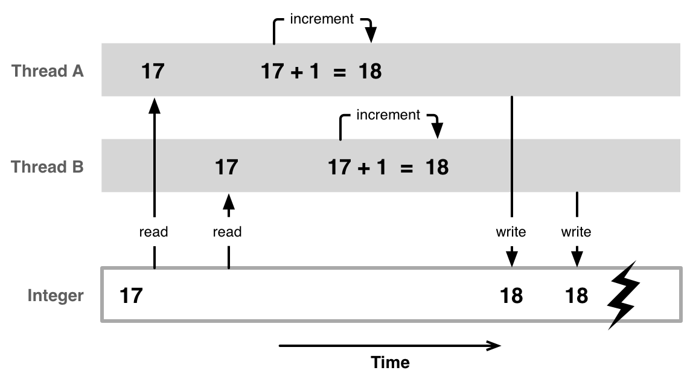

Поток *А* считывает значение счетчика в свою локальную память (17). Но что может произойти дальше? А дальше поток *B* может считать то же самое значение 17 из общей памяти. Вот тут и возникает проблема, так как у двух потоков оказались копии числа из общей памяти. Теперь они увеличивают значения своих копий на 1 и записывают значение обратно в общую память. Так как у обоих итоговый результат 18, то он и записывается в память. Но мы ожидали, что будет параллельная работа, и один из них увеличит значение с 17 до 18, а другой — с 18 до 19. Так мы, по сути, потеряли значение при работе двух потоков.

Ситуация может быть даже хуже, например, один поток успевает увеличить значение на 2 и записать его в общую память, а затем второй поток попросту перетирает новое значение на свое уже «несвежее», так как не работал с актуальным на данный момент значением.

Для того чтобы решить данную проблему, нужно добиться того, чтобы операция увеличения переменной стала атомарной. То есть такой, чтобы для других потоков она была бы целостной и неделимой. В таком случае другие потоки не смогут выполнять данную операцию, пока она не будет полностью выполненной одним потоком. Для этого используют ключевое слово **synchronized**.

## Ключевое слово synchronized
**Ключевое слово synchronized в заголовке метода гарантирует нам, что только один поток может исполнять метод в определенный момент времени.**

Добавьте его к методам take() и repay() банка. Теперь мы получаем ожидаемый ответ от программы каждый раз, когда запускаем ее.

Для того чтобы выполнить синхронизированный метод (то есть метод, объявленный с ключевым словом synchronized), он  должен дождаться, пока другой метод его не «освободит». Естественно, получение блокировки объекта  — это атомарная операция в Java, два потока не смогут заблокировать объект одновременно. 

Потоки, находящиеся в состоянии ожидания получения блокировки, находятся на этапе Blocked жизненного цикла.

### Как можно пользоваться synchronized
1. Вариант synchronized в методе объекта (нестатическом методе класса)
    ```java
    private synchronized void increment() {
       count++;
    }
    ```
    В этом случае тот поток, который вызывает этот метод первым, блокирует объект, на котором вызывается данный метод. В примере с банком мы синхронизировались по объекту самого банка.
1. Вариант synchronized в статическом методе класса
    ```java
    private static synchronized void doAtomic() {}
    ```
    Тут мы блокируем объект класса Class (у самого класса есть экземпляр, то есть объект в памяти).

    Отрефакторим класс Bank так, чтобы money стала статической:
    ```java
    public class Bank {

        private static int money = 10000;
        
        static int getMoney() {
            return money;
        }
        
        static synchronized void take(int money) {
            Bank.money -= money;
        }
            
        static synchronized void repay(int money) {
            Bank.money += money;
        }
        
        static class Client extends Thread{
            @Override
            public void run() {
                while(true) {
                    take(1000);
                    repay(1000);
                }   
            }
        }
        
        public static void main(String[] args) throws InterruptedException {
            new Client().start();
            new Client().start();
                new Client().start();
            while(true) {
                System.out.println(Bank.money);
                Thread.sleep(1000);
            }
        }
    }
    ```
    В модуле про вложенные классы мы утверждали, что пользы от статических классов не много. В этом коде есть причина того, чтобы сделать класс Client статическим. Дело в том, что мы вообще не создаем объект банка в этой версии, а объекты внутренних классов нельзя создать без внешнего объекта. Впрочем, вполне можно вынести класс Client из класса Bank и убрать слово static из его объявления.
1. Вариант synchronized-блок

    У нас две коллекции и потоки работают с ними. То с одной, то с другой. Естественно, доступ необходимо синхронизировать.
    ```java
    import java.util.ArrayList;
    import java.util.List;

    public class Worker {

        private List<String> list1 = new ArrayList<>();
        private List<String> list2 = new ArrayList<>();

        synchronized void addToListOne() {
            for (int i = 0; i < 100000; i++)
                list1.add("One"); // добавляем в первый лист значение
        }		

        synchronized void addToListTwo() {
                for (int i = 0; i < 100000; i++)
                list2.add("Two"); // добавляем во второй лист значение

        }
        
        class Process extends Thread {
            public void run() {
                for (int i = 0; i < 300; i++) { // 300 раз вызываем оба метода
                    addToListOne();
                    addToListTwo();
                }
            }
        }

        public static void main(String[] args) throws InterruptedException {
            Worker worker = new Worker(); // строка 1
            Thread t1 = worker.new Process();
            Thread t2 = worker.new Process();


            long start = System.currentTimeMillis();

            t1.start();
            t2.start();

            t1.join();
            t2.join();

            long finish = System.currentTimeMillis();

            System.out.println("list 1 size is: " + worker.list1.size());
            System.out.println("list 2 size is: " + worker.list2.size());
            // замеряем время выполнения
            System.out.println("Time taken: " + (finish - start) + " ms");	
        }
    }
    ```
    ```
    list 1 size is: 60000000
    list 2 size is: 60000000
    Time taken: 8502 ms
    ```
    В данном примере мы в двух потоках заполняем коллекции элементами. 

    При этом каждый из потоков вызывает как первый метод synchronized, так и второй. Так как оба метода требуют получают блокировку всего объекта worker, то параллельной работы потоков добиться не получится (если первый поток зашел в первый метод, то второй поток не может вызывать второй метод). 

    Поэтому в консоли видим, что время такое же, как если бы мы реализовали функционал в одном потоке. По коду мы видим, что каждый из методов работает со своей собственной коллекцией, поэтому нужно добиться того, чтобы эти два метода могли исполняться параллельно разными потоками. 

    Для этого изменим код так:

    ```java
    ...
    private void addToListOne() {
		synchronized (list1) 
		{   
		  for (int i = 0; i < 100000; i++)
			 list1.add("One"); // добавляем в первый лист значение
			
		}
	}

	private void addToListTwo() {
		synchronized (list2) 
		
		{
			for (int i = 0; i < 100000; i++)
			  list2.add("Two"); // добавляем во второй лист значение
		}
	}
    ...
    ```
    То есть перенесем слово **synchronized** внутрь метода.

    Синтаксис здесь немного сложнее: 

    synchronized(/* объект для блокировки */){
        /* действия, обычно с заблокированным объектом */
    }
    Мы строим блок synchronized, в фигурных скобках которого действие, при выполнении которого блокируется объект в круглых. 

    synchronized-блок позволяет определять, на каком именно объекте мы хотим синхронизировать доступ к коду. При работе мы получаем такой результат:
    ```
    list 1 size is: 60000000
    list 2 size is: 60000000
    Time taken: 4963 ms
    ```
    Теперь каждый из потоков может работать с одним из двух методов параллельно, так как существует синхронизация на двух разных объектах. Конечно, от запуска к запуску результат и первой, и второй версии будет отличаться, но видно, что второй вариант в среднем намного быстрее.

### Какой из вариантов выбрать?
Что лучше, блокировать объект, делая synchronized-метод, или ограничиться блоком синхронизации? Зависит от ситуации. 

Если блокировка всего объекта не критична, то вполне можно использовать синхронизированные методы. Как минимум такой код проще читать.

Если же потоки могут обращаться к разным частям объекта, лучше использовать блок синхронизации. Если, например, метод выполняется долго, но критичная секция, в которой поток использует данные совместно с другими потоками, совсем небольшая, то нужно, конечно, использовать блок синхронизации.   

В нашем банке мы не можем синхронизироваться по переменной money, потому что она не объект, а переменная примитивного типа. Но мы можем создать ещё один объект в банке, по которой и устраивать блокировку:
```java
public class Bank {

	private int money = 10000;
      // переменная, по которой и будем синхронизироваться  
	private Object lock = new Object();
	
	int getMoney() {
		return money;
	}
	
	void take(int money) {
		synchronized (lock) {
			this.money -= money;
		}
	}
		
	void repay(int money) {
		synchronized (lock) {
			this.money += money;
		}
	}
	
	class Client extends Thread{
		@Override
		public void run() {
		     while(true) {
		   		 take(1000);
		    		 repay(1000);
		    	 }
		     }   
		}
	}
	
	public Bank() {
		new Client().start();
		new Client().start();
		new Client().start();
	}
	
	public static void main(String[] args) throws InterruptedException {
		Bank bank = new Bank();
		while(true) {
			System.out.println(bank.money);
			Thread.sleep(1000);
		}
	}

}
```
Такая версия тоже работает корректно. В банке всегда не меньше $7000 и не больше $10000. Конечно, в нашем модельном примере синхронизация по дополнительной переменной при помощи synchronized-блока  — это стрельба из пушки по воробьям.

### Ключевое слово volatile
Помимо проблемы атомарности, есть еще один возможный нежелательный эффект. Рассмотрим такой код:
```java
class Processor extends Thread {

   private boolean running = true;

   @Override
   public void run() {
       while (running) {
           System.out.println("Processing...");
           try {
               Thread.sleep(100);
           } catch (InterruptedException exception) {
               exception.printStackTrace();
           }
       }
   }

   public void shutDown() {
       running = false;
   }
}

public class App {

   public static void main(String[] args) throws InterruptedException {
       Processor processor1 = new Processor();
       processor1.start();

       Thread.sleep(1000);

       processor1.shutDown();
   }

}
```
Пользовательский поток проверяет в цикле boolean-переменную и с задержкой выводит строку в консоль. При этом поток main() после паузы пытается остановить пользовательский поток, изменяя boolean-переменную. При запуске код работает как и задумывалось, и поток останавливается успешно. 

Но мы не можем гарантировать, что на каждой машине, на каждой архитектуре процессора и памяти JVM даст нам такой результат. Есть еще вариант развития событий: хоть main() и меняет boolean-переменную, поток может проигнорировать это изменение! Он может продолжить работу и дальше вплоть до необходимости убивать процесс извне.

Почему так происходит? Все дело в организации оперативной памяти компьютера:


Помимо RAM, у каждого ядра процессора есть свои собственные области памяти для ещё более быстрого к ней обращения. Так как поток выполняется в каком-то определенном ядре процессора, есть вероятность, что данные, с которыми работает поток, будут сохранены в кэш-памяти этого ядра. Таким образом JVM пытается оптимизировать работу с памятью. В большинстве случаев такая модель отлично подходит, но во избежание возможной проблемы в примере кода выше, в Java существует ещё одно ключевое слово — **volatile**.

Добавим его в пример выше:

```java
private volatile boolean running = true;
```
volatile — это инструкция для JVM не сохранять и читать из кэш-памяти потока, а всегда сохранять и читать из общей памяти. В таком случае любые изменения с переменной извне будут видны действующему потоку и напротив, все изменения, которые проводит действующий поток с переменной, будут сразу видны другим потокам.

## Immutable-объекты
Константы нельзя синхронизировать, ведь их по-любому не изменишь? Ещё как можно!
```java
final ArrayList<Integer> a = new ArrayList<>() 
a.add(1);
```
Скомпилируется и отработает, глазом не моргнув! Ключевое слово final означает, что нельзя поменять ссылку, а сам объект по ссылке — запросто!

И все же в этом изменяемом из разных потоков мире есть по-настоящему постоянные объекты. Например, мы говорили, почему программа:

```java
String s = "";
for (int i = 0; i < 1000000; i++){
    s += "A";
}
```
Работает крайне долго. Как раз потому, что String  — immutable, неизменяемый. Создав строку, её невозможно изменить. Код выше — лишь иллюзия, как в матрице: «Видишь ложку? А её нет!». На самом деле миллион раз создается новая неизменяемая строка, а старая уничтожается. 

Кажется, что в программе банка мы можем заменить строку: 
```java
private int money = 10000;
```
На:
```java
private Integer money = 10000;
```
Сделать переменную money объектом и синхронизироваться по нему. Вот так:
```java
public class Bank {

	private Integer money = 10000;
	
	
	int getMoney() {
		return money;
	}
	
	void take(int money) {
		synchronized (this.money) {
			this.money -= money;
		}
		
	}
		
	void repay(int money) {
		synchronized (this.money) {
			this.money += money;
		}
	}
...
```
Код скомпилируется, но будет работать неправильно, как будто никакой синхронизации нет. Проверьте!

Integer — immutable класс. И при изменении money на самом деле создается новый объект, и «синхронизация» происходит уже по новому объекту, то есть фактически никакой синхронизации нет.

Зачем вообще immutable-объекты? В многопоточной среде очень даже есть зачем! Такие объекты не требуют никакой синхронизации в многопоточном приложении.Такой тип ещё называют read-only типом (с англ. «только для чтения»). Мы можем, например, такие объекты передавать в методы и быть уверены, что они точно не изменятся из кода другого потока.  

Создать свой immutable-класс в принципе несложно. Нужно соблюдать правила:

1. Используйте конструктор, чтобы установить значения всех полей объекта. Нам нужно определить все параметры будущего объекта в конструкторе, так как после этого будет невозможно изменять поля.
1. Обозначьте все переменные объекта ключевыми словами private и final (private — для инкапсуляции переменных, final — чтобы не было возможности внутри класса случайно переопределить ссылочную переменную).
1. Не определяйте никаких setter-ов. По понятным причинам — объект должен быть неизменяем на протяжении всего жизненного цикла.
1. Не возвращайте при запросах ссылки на изменяемые объекты внутри неизменяемого объекта, создавайте копию и возвращайте её.
1. Предотвратите возможность для переопределения методов. Представьте, что это было бы разрешено. Тогда возможно унаследовать immutable класс и переопределить его так, чтобы была возможность видоизменять другие переменные в унаследованном классе, таким образом скрывая private-переменные родительского класса.

Вот пример правильно определенного immutable-класса:
```java
import java.util.ArrayList;
import java.util.List;

public final class Animal {

   private final String species;
   private final int age;
   private final List<String> favoriteFoods;

   public Animal(String species, int age, List<String> favoriteFoods) {
       this.species = species;
       this.age = age;
       this.favoriteFoods = new ArrayList<>(favoriteFoods);
   }

   public String getSpecies() {
       return species;
   }

   public int getAge() {
       return age;
   }

   public List<String> getFavoriteFoods() {
       return new ArrayList<>(favoriteFoods);
   }
}
```
Этот класс удовлетворяет всем свойствам immutable-класса. Работу 4-го условия нам демонстрирует поле List<String> favoriteFoods. При создании неизменяемого объекта с ссылкой на изменяемый объект всегда требуется делать копию данного объекта. Иначе тот, кто создает экземпляр такого класса, имеет ссылку на его изменяемый объект. Также и при методе get() нужно отдавать не сам объект, а его копию по той же самой причине. 

Заметим, что копию внутреннего объекта String species делать не нужно, так как он сам является неизменяемым объектом. То есть ему изменение в принципе «не угрожает».

## Проблемы в многопоточной среде
Рассмотрим две основные проблемы, которые возникают при неправильном использовании многопоточности, кроме порчи данных из-за неатомарности операций. 

Когда Concurrency API, которое мы рассмотрим в следующих юнитах, вы увидите, что он помогает уменьшить шанс возникновения этих проблем, но не помогает от них избавляться. Поэтому важно иметь в виду возможные ошибки при написании многопоточного кода.

### Deadlock  — мертвая блокировка

Это часто так называемая «liveness-проблема».

**Liveness-проблемы** — это такие проблемы, из-за которых приложение становится «зависающим» и «заторможенным». На практике такие проблемы бывает очень сложно отловить.
**Deadlock** происходит, когда два или более потока находятся в фазе Blocked вечно, при этом один из потоков ждет, когда другой разблокирует объект, и наоборот. 

Представьте, что в зоопарке  в одной клетке живут две лисы. Первая лиса любит сначала поесть, а потом выпить воду, а другая наоборот — сначала выпить воды, а затем поесть. Лисы не хотят делить друг с другом миски, и они закончат трапезу только лишь тогда, когда у них будет доступ ко всем двум мискам. 

Работник зоопарка ставит миску с водой в одном углу клетки, а миску с едой — в другом. Хоть наши лисы и быстрые, им требуется 100 миллисекунд, чтобы добежать от одной миски к другой. Что произойдет, если вначале первая лиса доберется до своей миски а вторая — до своей? 

Посмотрим в коде:

```java
class Food {}

class Water {}

public class Fox {

  private void eatAndDrink(Food food, Water water) {
    synchronized(food) { // ждем высвобождения объекта Food
      System.out.println("Got food!");
      move();
      synchronized(water) { // ждем высвобождения объекта Water
        System.out.println("Got water!");
      }
    }
  }

  private void drinkAndEat(Food food, Water water) {
    synchronized(water) { // ждем высвобождения объекта Water
      System.out.println("Got water!");
      move();
      synchronized(food) { // ждем высвобождения объекта Food
        System.out.println("Got food!");
      }
    }
  }

  private void move() {
    try {
      Thread.sleep(100);
    } catch(InterruptedException exception) {
      // обработать, если требует логика
    }
  }

  public static void main(String[] args) {
    Fox fox1 = new Fox();
    Fox fox2 = new Fox();
    Food food = new Food();
    Water water = new Water();
    Thread t1 = new Thread() {
      public void run() {
        fox1.eatAndDrink(food, water);
      }
    };
    Thread t2 = new Thread() {
      public void run() {
        fox2.drinkAndEat(food, water);
      };
    };
    t1.start();
    t2.start();
  }
}
```

Запустите этот код и получите следующий вывод в консоль:

```cmd
Got food!
Got water!
```
Программа продолжает работать, пока вы ее не убьете. Это типичный пример deadlock, так как оба потока заблокированы навечно, каждый из них ждет освобождения объекта, который никогда не будет освобожден.

Работу этой программы можно проиллюстрировать картинкой:
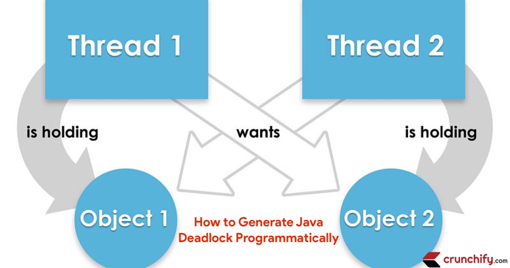

Опасность такой ситуации заключается в том, что программа не бросила никакой ошибки, а просто перестала отвечать и выполнять какую-либо полезную работу. Это может быть очень большой проблемой на проектах, так как про deadlock могут подумать в последнюю очередь при поиске проблемы. 

Какие есть способы исправить deadlock, когда он случился? Неутешительный ответ — в большинстве случаев просто никак. С другой стороны, есть несколько стратегий, как его избежать. 

Для начала избегайте ситуаций, когда один поток получает lock сразу на нескольких объектах.

```java
// ...

private void eatAndDrink(Food food, Water water) {
   synchronized (food) { // один поток получает первый lock
       System.out.println("Got food!");
       move();
       synchronized (water) { // и затем второй lock
           System.out.println("Got water!");
       }
   }
}

// ...
```
Этот код блокирует один объект и потом, не отпуская его, блокирует другой. Вернее, хочет заблокировать, а это удастся не всегда. Если второй объект (миска с водой) уже заблокирован другим объектом, остается ждать. Возможно, вечно.

Также необходимо, чтобы все потоки получали и освобождали объекты в одинаковом порядке.
В нашем примере deadlock бы не случился, если бы обе лисы хотели сначала пить, а затем есть. Когда одна лиса пьет, вторая ждет миску с водой. Когда первая лиса закончила пить, она освобождает миску для второй лисы, и так же происходит с миской еды. Потоки работают согласованно (в данном случае — последовательно) и поэтому не блокируют друг друга. Сделайте потоки одинаковыми, и всё закончится хорошо.

### Race condition
**Race condition** — это нежелательный эффект, когда две задачи, задуманные выполняться последовательно, выполняются параллельно.

Мы уже встречали эту проблему, когда говорили про увеличение значения счетчика на 1 двумя разными потоками. Без должной синхронизации результат непредсказуем. 

Представьте еще один пример: существует большая онлайн-платформа с фотографиями диких животных со всего мира. Двое новых пользователей — Olivia и Sophia — регистрируются на этом сайте. Оба они хотят использовать одинаковое имя аккаунта — ZooFan, и они одновременно шлют запрос на сервер сайта для создания нового профиля с одним и тем же именем:


Вот возможные результаты такого хода событий:

1. Обоим пользователям удается создать аккаунт с одинаковым именем.
1. Обоим пользователям не удается создать аккаунт — им возвращается сообщение об ошибке.
1. Одному пользователю удается создать аккаунт, в то время как другой получает сообщение об ошибке.

Какой из этих результатов наиболее благоприятен с точки зрения сервера? Первый вариант может вызвать серьезные проблемы и сломать ограничения, налагаемые на сохранение пользователей. Например, если имя пользователя является ключом поиска и добавления в базе данных, как она различит два одинаковых имени? Во втором варианте удастся защитить данные сервера от поломок и дать возможность пользователям снова попробовать зарегистрироваться, используя это имя. Третий вариант самый благоприятный для нас и соответствует нормальной логике работы программы.

Ещё раз вернемся к программе с банком: 

```java
public class Bank {

	private int money = 10000;
	private Object lock = new Object();
	
	int getMoney() {
		return money;
	}
	
	void take(int money) {
		synchronized (lock) {
			this.money -= money;
		}
		
	}
		
	void repay(int money) {
		synchronized (lock) {
			this.money += money;
		}
	}
	
	class Client extends Thread{
		@Override
		public void run() {
		     while(true) {
		    	       take(1000);
		    		 repay(1000);
		    	 }
		     }   
		}
	}
	
	public Bank() {
		new Client().start();
		new Client().start();
		new Client().start();
	}
	
	public static void main(String[] args) throws InterruptedException {
		Bank bank = new Bank();
		while(true) {
			System.out.println(bank.money);
			Thread.sleep(1000);
		}
	}

}
```
У нас было всего три клиента. А что будет, если их станет 20? Денег на всех не хватит. Периодически на консоли будет появляться не только ноль, но и отрицательные числа. Конечно, нужно выдавать деньги, только если они есть в кассе.

Кажется хорошим решением добавить в метод run() простой if:

```java
class Client extends Thread {
    @Override
    public void run() {
        while (true) {
            // выдаем кредит, только если 
            // есть свободные средства
            if (getMoney() >= 1000) {
                take(1000);
                repay(1000);
            }
        }
    }
}
```
Запустите программу. Кажется, все работает хорошо. Но на самом деле нет.

Если мониторить состояние счета почаще, то можно увидеть на выводе отрицательное число. Это происходит как раз из-за race condition. Есть вероятность, что несколько потоков получат результат от метода getMoney(), на счету окажется всего одна тысяча, и они её возьмут каждый себе. То есть несколько раз.

Как быть? Сделать метод getMoney() синхронизированным — не выход, потоки вполне и могут выполнить его по очереди и лишь потом взять.

Нужно проверку и взятие денег сделать атомарной операцией. Например, поместить if в синхронизированный метод take() или блок synchronized в нём.

Итак, во избежание различных нежелательных результатов работы в многопоточной среде, всегда синхронизируйте доступ к общим ресурсам, обеспечивайте верный порядок работы потоков и предотвращайте возможность deadlocks, livelocks и starvation на этапе проектирования приложений.

## Пакет java.util.concurrent

### Atomic-классы
В Java был добавлен целый пакет для упрощения работы с многопоточностью. Одна из групп таких классов помогает координировать доступ потоков к примитивам и ссылочным типам.

```java
public class App {

   private int count = 0;

   void increment() { // синхронизируем доступ к операции
       count++;
   }

   public static void main(String[] args) throws InterruptedException {
       App app = new App(); // строка 1
       app.doWork();
   }

   private void doWork() throws InterruptedException {
       Thread t1 = new Thread() {
           public void run() {
              for (int i = 0; i < 10000; i++) {
                 increment();
              }
           }
       };

       Thread t2 = new Thread() {
           public void run() {
              for (int i = 0; i < 10000; i++) {
                 increment();
              }
          }
       };

       t1.start();
       t2.start();

       t1.join();
       t2.join();

       System.out.println("Count is: " + count); // Count is: 20000
   }
}
```
Что выведет эта программа?

Это же наш банк, только упрощенный! Выведено будет… почти что угодно, 20000 мы увидим очень редко. Потому что операция ++ — неатомарная.

Вместо примитивного типа int мы можем объявить переменную count как ссылку на объект класса java.util.concurrent.atomic.AtomicInteger:

```java
import java.util.concurrent.atomic.AtomicInteger;

public class App {

   private AtomicInteger count = new AtomicInteger(0); // используем новый класс AtomicInteger

   public static void main(String[] args) throws InterruptedException {
       App app = new App();
       app.doWork();
   }


   private void doWork() throws InterruptedException {
       Thread t1 = new Thread() {
           public void run() {
              for (int i = 0; i < 10000; i++) {
                 count.incrementAndGet(); // атомарно увеличивает значение на 1

              }
           }
       };

       Thread t2 = new Thread() {
           public void run() {
              for (int i = 0; i < 10000; i++) {
                 count.incrementAndGet(); // атомарно увеличивает значение на 1

              }
          }
       };

       t1.start();
       t2.start();

       t1.join();
       t2.join();

       System.out.println("Count is: " + count); // Count is: 20000
   }
}
```

Класс AtomicInteger потокобезопасен и не требует дополнительной синхронизации доступа. Любая операция на объекте данного класса атомарна, и тем самым результат выполнения этого кода всегда будет одинаковым. Проверьте!

В пакете java.util.concurrent.atomic есть классы:

|Класс|Описание|
|---|---|
|AtomicBoolean|Содержит boolean-значение, с которым возможно работать атомарно.
|AtomicInteger|Содержит integer-значение, с которым возможно работать атомарно.
|AtomicIntegerArray|Содержит значение массива типа int, с которым возможно работать атомарно.
|AtomicLong|Содержит long-значение, с которым возможно работать атомарно.
|AtomicLongArray|Содержит значение массива типа long, с которым возможно работать атомарно.
|```AtomicReference<T>```|Содержит значение параметризованного типа, с которым возможно работать атомарно.
|``AtomicReferenceArray<T>``|Содержит значение массива параметризованного типа, с которым возможно работать атомарно.

Это что же получается? В программе про банк было достаточно всего лишь заменить строку:
```
int money = 10000;
```
На:
```
AtomicInteger money;
```
И всё заработает?

Не совсем. Нужно еще заменить обращение к этой переменный. Обычные +=, -=, даже обычное присваивание работать не будет.

Каждый Atomic-класс включает несколько методов, которые эквивалентны примитивным операциям, например присваивание или increment (++).

Опишем эти методы в таблице:
|Имя метода|Описание|
|---|---|
|get()|	Возвращает текущее значение.|
|set()|	Устанавливает значение, передаваемое в параметр. Эквивалентно присваиванию (=).|
|getAndSet()|	Устанавливает новое значение и возвращает предыдущее.|
|incrementAndGet()|	Для числовых типов, пре-инкремент (++value).|
|getAndIncrement()|	Для числовых типов, пост-инкремент (value++).|
|decrementAndGet()|	Для числовых типов, пре-декремент (--value).|
|getAndDecrement()|	Для числовых типов, пост-декремент (value--).|
|addAndGet(delta)|	Аналог incrementAndGet(), но увеличение происходит на delta.|
|getAndAdd(delta)|	Аналог getAndIncrement(), но увеличение происходит на delta.|

Еще раз уточним, что все методы атомарны, то есть являются целостными операциями, и другие потоки не могут вмешаться в их выполнение.

### Использование коллекций в многопоточном приложении

Помимо атомарных классов, Concurrency API включает в себя интерфейсы и классы, помогающие координировать доступ к коллекциям для нескольких потоков.

Но вы спросите, зачем ещё и специальные классы для коллекций? Мы же можем использовать ключевое слово synchronized для методов и блоков кода, так почему бы не использовать это и для коллекций?

Ответ — мы можем использовать и synchronized в том числе. Посмотрите на данный пример:

```java
import java.util.HashMap;
import java.util.Map;

public class ZooManager {

   private Map<String, Object> foodData = new HashMap<>();

   public synchronized void put(String key, String value) {
       foodData.put(key, value);
   }

   public synchronized Object get(String key) {
       return foodData.get(key);
   }
}
```
Проблем с потоками тут не возникнет. Ну и зачем нужны специальные классы-коллекции для синхронизации?

1. Они очень удобные.
1. Помогают нам не делать ошибок, которые могут возникнуть при самостоятельной синхронизации коллекций.
1. Эти коллекции часто имеют улучшения по производительности. Но сразу скажем, они работают медленнее обычных коллекций, поэтому их стоит использовать только в многопоточных приложениях.

Перепишем пример, используя одну из таких коллекций:

```java
import java.util.Map;
import java.util.concurrent.ConcurrentHashMap;

public class ZooManager {

   private Map<String, Object> foodData = new ConcurrentHashMap<>();

   public void put(String key, String value) {
       foodData.put(key, value);
   }

   public Object get(String key) {
       return foodData.get(key);
   }
}
```

Всё, что мы сделали — использовали новый объект типа ConcurrentHashMap, у которого все обращения к нему будут синхронизированы.

### Ошибки при работе с памятью

Цель коллекций из нового Concurrency API — решать memory consistency errors. Такие ошибки случаются, когда у двух и более потоков разное представление о том, что можно считать одинаковыми данными. Мы добиваемся того, чтобы записи, которые делает один поток, были доступными другому потоку, если он обращается к коллекции, в которую были сделаны эти записи.

Когда два потока пытаются видоизменить одну и ту же обычную коллекцию, JVM может бросить ConcurrentModificationException. Кстати, это может произойти и в однопоточном режиме:

```java
Map<String, Object> foodData = new HashMap<>();
foodData.put("penguin", 1);
foodData.put("flamingo", 2);
for (String key : foodData.keySet()) {
   foodData.remove(key);
}
```

Такой код как раз-таки бросит это исключение при запуске, так как итератор у keySet() не обновляется после того, как мы убираем элементы.

```java
Map<String, Object> foodData = new ConcurrentHashMap<>();
foodData.put("penguin", 1);
foodData.put("flamingo", 2);
for (String key : foodData.keySet()) {
   foodData.remove(key);
}
```
А вот здесь такой ошибки не случится. Объект класса ConcurrentHashMap упорядочивает доступ на запись/чтение, и таким образом работа согласована. Теперь итератор у keySet() обновляется, как только изменяется Map.

Коллекции из нового Concurrency API были созданы, чтобы помочь избежать типичных проблем, когда много потоков добавляют, либо убирают объекты из одной и той же коллекции. В любой момент времени все потоки должны иметь согласованный вид на структуру и содержание коллекции.

### Новые коллекции
Перечислим основные коллекции.

Блокируемые операции — когда поток, вызывающий данную операцию на коллекции, переходит в фазу Waiting. Например, поток ждет, когда требуемый элемент будет доступен в коллекции.

|Имя класса|Интерфейс|Элементы упорядочены|Элементы отсортированы|Блокируемые операции|
|---|---|---|---|---|
|ConcurrentHashMap|ConcurrentMap|нет|нет|нет|
|ConcurrentLinkedDeque|Deque|да|нет|нет|
|ConcurrentLinkedQueue|Queue|да|нет|нет|
|CopyOnWriteArrayList|List|да|нет|нет|
|CopyOnWriteArraySet|Set|нет|нет|нет|
|LinkedBlockingDeque|BlockingDeque<br>BlockingQueue|да|нет|да|
|LinkedBlockingQueue|BlockingQueue|да|нет|да|

Блокирующие коллекции
Как вы могли заметить, в таблице есть два класса, которые имплементируют блокирующие интерфейсы. BlockingQueue — это обычный Queue, но с дополнительными методами, которые ждут определенное количество времени завершение операции. Вот они:

|Имя метода|Описание|
|---|---|
|boolean offer(E e, long timeout, TimeUnit unit)|Добавляет элемент в очередь, если нет свободного места, то ждет определенное время и возвращает false, если время истекло.|
|E poll(long timeout, TimeUnit unit)|Убирает из очереди и возвращает пользователю элемент, ждет определенное время, до того как элемент станет доступным, возвращает null, если время истекло.|

Рассмотрим пример в коде:

```java
try {
   BlockingQueue<Integer> blockingQueue = new LinkedBlockingQueue<>();

   blockingQueue.offer(39);
   blockingQueue.offer(3, 4, TimeUnit.SECONDS); // добавление с ожиданием доступного места
   // (если очередь фиксированной длины)

   System.out.println(blockingQueue.poll());
   System.out.println(blockingQueue.poll(10, TimeUnit.MILLISECONDS)); // удаление с ожиданием пока
   // требуемый элемент не станет доступным
} catch (InterruptedException exception) {
   // обработка прерывания
}
```
LinkedBlockingDeque — это связный список элементов который имплементирует BlockingDeque интерфейс, которые имеет такие методы:

|Имя метода|Описание|
|---|---|
|boolean offerFirst(E e, long timeout, TimeUnit unit)|Добавляет элемент в начало коллекции, если нет свободного места, то ожидает определенное время, возвращает false, если время истекло.|
|boolean offerLast(E e, long timeout, TimeUnit unit)|Добавляет элемент в конец коллекции, если нет свободного места, то ожидает определенное время, возвращает false, если время истекло.|
|E pollFirst(long timeout, TimeUnit unit)|Удаляет и возвращает пользователю элемент с начала коллекции, ждет определенное время, до того как элемент станет доступным, возвращает null, если время истекло.|
|E pollLast(long timeout, TimeUnit unit)|Удаляет и возвращает пользователю элемент с конца коллекции, ждет определенное время, до того как элемент станет доступным, возвращает null, если время истекло.|

Рассмотрим пример в коде:

```java
public static void main(String[] args) {
   try {
       BlockingDeque<Integer> blockingDeque = new LinkedBlockingDeque<>();
       blockingDeque.offer(91);
       blockingDeque.offerFirst(5, 2, TimeUnit.MINUTES); // добавление в начало с ожиданием доступного места
       // (если очередь фиксированной длины)
       blockingDeque.offerLast(47, 100, TimeUnit.MICROSECONDS); // добавление в конец с ожиданием доступного места
       // (если очередь фиксированной длины)
       blockingDeque.offer(3, 4, TimeUnit.SECONDS); // добавление в конец с ожиданием доступного места
       // (если очередь фиксированной длины)

       System.out.println(blockingDeque.poll());
       System.out.println(blockingDeque.poll(950, TimeUnit.MILLISECONDS)); // удаление с начала с ожиданием пока
       // требуемый элемент не станет доступным
       System.out.println(blockingDeque.pollFirst(200, TimeUnit.NANOSECONDS)); // удаление с начала с ожиданием пока
       // требуемый элемент не станет доступным
       System.out.println(blockingDeque.pollLast(1, TimeUnit.SECONDS)); // удаление с конца с ожиданием пока
       // требуемый элемент не станет доступным
   } catch (InterruptedException exception) {
       // обработка прерывания
   }
}
```

### CopyOnWrite-коллекции

CopyOnWriteArrayList и CopyOnWriteArraySet отличаются от остальных синхронизированных коллекций.

Объекты этих классов копируют все элементы в новое внутреннее хранение каждый раз, когда элемент добавляется, изменяется, либо удаляется из коллекции.

Под изменением подразумевается замена ссылки на новый элемент. Хотя данные и копируются в новую внутреннюю структуру данных, ссылка на саму коллекцию не меняется. Это очень эффективно в мультипоточной среде, когда необходимо итерироваться по коллекции. Любой итератор, полученный из коллекции до её модификации, не увидит впоследствии новых изменений, и поэтому итерация будет происходить по старому набору элементов. 

Рассмотрим пример:
```java
List<Integer> list = new CopyOnWriteArrayList<>(Arrays.asList(4, 3, 52));
for (int item : list) {
   System.out.print(item + " ");
   list.add(9);
}

System.out.println(); // 4 3 52
System.out.println("List size: " + list.size()); // 6
```
Несмотря на то, что мы добавляем элементы в коллекцию при итерации, мы не получаем при запуске ConcurrentModificationException. 


# Особенности Java 8 (Modul 15)

## DateTime API
_java.util.Date_ ist Deprecated dafür muss man jetzt _java.time_ benutzen. 

|Typ|Beschreibung|
|---|---|
|LocalDate| Objekt des Types enthält nur Datum (ohne Uhrzeit)|
|LocalTime| Objekt des Types enthält nur Uhrzeit (ohne Datum)|
|LocalDateTime| Objekt des Types enthält Datum und Uhrzeit|
|ZonedDateTime| Objekt des Types enthält Datum, Uhrzeit und Zeitzone|

Für das erstellen der Objekt der Klassen werden _static_ - Methonden benutzt:

|Estellen|Beispiel|
|---|---|
|LocalDate.now()|2007-12-03|
|LocalTime.now()|10:15:30|
|LocalDateTime.now()|2007-12-03T10:15:30|
|ZonedDateTime.now()|2007-12-03T10:15:30+01:00 Europe/Paris|

Andere Konstruktoren der Klassen:

|Konstruktor|Beispiel|
|---|---|
|public static LocalDate of(int year, int month, int dayOfMonth)|LocalDate.of(2013, 2, 22)|
|public static LocalDate of(int year, Month month, int dayOfMonth)|LocalDate.of(2013, Month.February, 22)|
|public static LocalTime of(int hour, int minute)|LocalTime.of(6, 15)|
|public static LocalTime of(int hour, int minute, int second)|LocalTime.of(6, 15, 54)|
|public static LocalDateTime of(int year, int month, int dayOfMonth, int hour, int minute)|LocalDateTime.of(2013, 2, 22, 6, 15)|
|public static LocalDateTime of(int year, int month, int dayOfMonth, int hour, int minute, int second)|LocalDateTime.of(2013, 2, 22, 6, 15, 54)|
|public static ZonedDateTime of(LocalDate date, LocalTime time, ZoneId zone|ZonedDateTime.of(LocalDate.of(2013, 2, 22), LocalTime.of(6, 15), ZoneId.of("US/Eastern"))|
|public static ZonedDateTime of(LocalDateTime localDateTime, ZoneId zone)|ZonedDateTime.of(LocalDateTime.of(2013, 2, 22, 6, 15), ZoneId.of("US/Eastern"))|

Für alle verfügbare TimeZones - _ZoneId.getAvailableZoneIds()_

|Methonden für mathematische Operationen mit der Zeit (gibt auch mit _minus_):|
|---|
|LocalDate plusDays(long days)|
|LocalDate plusMonths(long months)|
|LocalDate plusWeeks(long weeks)|
|LocalDate plusYears(long years)|
|LocalTime plusHours(long hours)|
|LocalTime plusMinutes(long minutes)|
|LocalTime plusSeconds(long seconds)|
|LocalTime plusNanos(long nanos)|
|LocalDateTime plusYears(long years)|
|LocalDateTime plusNanos(long nanos)|
|ZonedDateTime plusYears(long years)|
|ZonedDateTime plusNanos(long nanos)|

|Methoden für das Setzen der einzelne Werte:|
|---|
|LocalDate withDayOfMonth(int day)|
|LocalDate withDayOfYear(int day)|
|LocalDate withMonth(int month)|
|LocalDate withYear(int year)|
|LocalTime withHour(int hour)|
|LocalTime withMinute(int minute)|
|LocalTime withSecond(int second)|
|LocalTime withNano(int nano)|
|LocalDateTime withYear(int year)|
|LocalDateTime withNano(int nano)|
|ZonedDateTime withYear(int year)|
|ZonedDateTime withNano(int nano)|

Objekte der Typen sind Immutable - alle Änderungen müssen einer neuen Variable zugebwiesen werden.

### _Period und Duration_
_java.time.Period_ 
|Konstruktoren|Beispiel|
|---|---|
|public static Period ofYears(int years)|Period.ofYears(1) - 1 Jahr|
|public static Period ofMonths(int months)|Period.ofMonths(10) — 10 Monate|
|public static Period ofWeeks(int weeks)|Period.ofWeeks(3) — 3 Wochen|
|public static Period ofDays(int days)|Period.ofDays(11) — 11 Tage|
|public static Period of(int years, int months, int days)|Period.of(3, 4, 16) — 3 Jahre, 4 Monata und 16 Tage|

_java.time.Duration_
|Konstruktoren|Beispiel|
|---|---|
|public static Duration ofHours(long hours)|Duration.ofHours(21) — 21 Stunden|
|public static Duration ofMinutes(long minutes)|Duration.ofMinutes(30) — 30 Minuten|
|public static Duration ofSeconds(long seconds)|Duration.ofSeconds(45) — 45 Sekunden|

Diese Klasse werden für das Ändern der Objekte der Klassen _LocalDate_, _LocalTime_, _LocalDateTime_, _ZonedDateTime_ verwendet.

_Konvertierung zwischen alten und neuen API_

Dafür wurde in der neuen API ein klasse _java.time.Instant_ implementiert

|Konstruktor|Beschreibung|
|---|---|
|public static Instant now()|Instant now = Instant.now(); Estellt ein Objekt mit aktueller Zeit|
|public ZonedDateTime atZone(ZoneId object)|Instant -> ZoneDateTime|
|Instant toInstant()| ZonedDateTime -> Instant|
|Instant toInstant()| Date -> Instant|

Convert Date to LocalDateTime:
```java
public LocalDateTime convertToLocalDateTimeViaInstant(Date dateToConvert) {
    return dateToConvert.toInstant()
      .atZone(ZoneId.systemDefault())
      .toLocalDateTime();
}
```

## Lambda-Function
 
Lambda-Funktionen bauen auf _Functional-Intefaces_ auf. _Functional-Inteface_ ist ein Interface, das nur eine abstrakte Methode enthält.

### Lambda syntax 
```java
//Concise
n -> System.out.print(n);
//Expanded
(String n) -> System.out.print(n);
//Verbose
(String n) -> { System.out.print(n); }
```
Link sind Parameter des _Functional-Interface_, Rechts ist die Logik.

|Fall|Regel|Beispiel|
|---|---|---|
|Keine Parameter|Immer Klammer|() -> new Integer(12)|
|Eine Variable ohne Typ|mit oder ohne Klammern| s -> s.contains("m");|
|||(s) -> s.contains("m")|
|Variable mit Typ|immer Klammern|(String s) -> s.length()|
|mehrere Parameter (gleicher Typ)|immer klammern|(s, t) -> s + t|
|mehrere Parameter mit Typ|immer Klammern|(String a, int b) -> a.substring(b)|
|Eine Code Zeile|Kann vereinfacht werden|(int b) -> b + 12|
|||(int b) -> System.out.print(b)|
|||(int b) -> {return b + 12;}|
|Mehrere Zeilen|Nur im Block|(String s) -> {return s.length();}
|||(String s) -> {
|||    System.out.print(s); 
|||    return s;
|||}

!Wichtig:
- Parameter (links) dürfen nicht neudefiniert werden
- Lambda hat zugang zu den Variablen und Parameter der Funktion, in der diese definiert ist. Aber die müssen faktisch _final_ sein. Also man könnte die Variablen/Parameter _final_ setzen und es kommt kein Fehler.

### Standart _functional-intefaces_ (java.util.function)
|Name|Parameter|Return|Methode|Beschreibung|
|---|---|---|---|---|
|Supplier<T>|0|T|get|Liefert Werte. 
|Consumer<T>|1 (T)|void|accept|Consumer, In 1 return 0
|BiConsumer<T, U>|2 (T, U)|void|accept|
|Predicate<T>|1 (T)|boolean|test| 1 параметр и возвращает true-false («проверяльщик»)
|BiPredicate<T, U>|2 (T, U)|boolean|test|принимает 2 параметра и возвращает true-false («двойной проверяльщик»)
|Function<T, R>|1 (T)|R|apply| 1 параметр и возвращает результат другого типа («функция»)
|BiFunction<T, U, R>|2 (T, U)|R|apply|	принимает 2 параметр и возвращает результат другого типа («двойная функция»)
|UnaryOperator<T>|1 (T)|T|apply|	принимает 1 параметр и возвращает результат такого же типа («оператор»)
|BinaryOperator<T>|2 (T, T)|T|apply|	принимает 2 параметра и возвращает результат такого же типа («двойной оператор»)

Method reference - Vereinfachter Lambdaausdruck.

## Interface Default und static-Methoden

Default - Methode ist normale Methode. Die Befindet sich im Interface und hat Schlüsselwort _default_. _Default_ Methoden sind für alle Objekte der Klassen (die dierekt oder indierekt das Interface implementi) verfügbar. Die Methoden könn überschrieben werden und die Methode muss nicht implementiert werden. Wie jede _static_ Methode werden diese über _Interface.methode_ aufgerufen. Wie jede Statische-Methode kann die nicht geerbt werden.

## _Optional< T >_
Ein Optional ist eine Objekt, das man sich als Datenbehälter vorstellen kann, der entweder einen Wert enthält oder leer (empty) ist. Leer ist hier auch nicht gleichbedeutend mit null!

```java
Optional<String> oe = Optional.empty();              // leeres Optional
Optional<String> os = Optional.of("Hallo Welt!");    // enthält den String "Hallo Welt!"

Optional<String> on = Optional.of(null);             // NullPointerException
Optional<String> onb = Optional.ofNullable(null);    // leeres Optional

Optional<Double> optional = Optional.of(22.4d);      // erstellt Optional ohne null Möglichkeit
Optional<Double> optional = Optional.ofNullable(22.4d);  //erstellt Optional mit null Möglichkeit
Optional<Double> optional = Optional.ofNullable(null);
Double nullDouble = null;
Optional<Double> optional = Optional.ofNullable(nullDouble);

// Beispiel
import java.util.Optional;

public class Main {
   public static Optional<Double> average(int... scores) {
       if (scores.length == 0) {
           return Optional.empty();
       }
       int sum = 0;
       for (int score : scores) {
           sum += score;
       }
       return Optional.of((double) sum / scores.length);
   }
}
```

|Methoden|Wenn Optional.empty()|Wenn Optional.of(value)|
|---|---|---|
|get()|throw Runtime| return value|
|ifPresent(Consumer c)||call Consumer with value|
|isPresent()|return false|return true|
|orElse(T other)|return other| return value|
|orElseGet(Supplier s)|return call Supplier|return value|
|orElseThrow(Supplier s)|throw exception of Supplier|return value|

## Stream API

Streams sind aufeinander folgende Bearbeitung einer Collection.
Stream pipeline besteht aus 3 Operationen:
- Source
- Intermediate operations
- Terminal operation

Stream kann nur 1 MAL benutzt werden. Wenn Terminal operation abgeschlossen ist, kann stream nicht noch mal gestartet werden. 

Stream verfolgt lazy Prinzip. Intermediat operations werden nur dann ausgeführt, wenn Terminal operation definiert ist.

### Stream erstellen
```java
Stream<String> empty = Stream.empty(); // leerer Stream
Stream<Integer> singleElement = Stream.of(1); 
Stream<Integer> anyElements = Stream.of(1, 2, 3); 
Stream<Integer> fromArray = Arrays.stream(new Integer[] {1, 2, 3});
Stream<Integer> fromCollection = collection.stream();

List<String> list = Arrays.asList("a", "b", "c");
Stream<String> listStream = list.stream();
```

### Source
Source kann beliebige Collection sein.

### Intermediate operations
```java
// gibt Element zurück, die dem Predicate entsprechen
Stream<T> filter(Predicate<? super T> predicate);

// liefert Stream mit uniq Werten zurück
Stream<T> distinct();

// verkürzt den Stream
Stream<T> limit(long maxSize);
Stream<T> skip(long n);     //überspring die ersten n Elemente

// transformiert die Stream-Elemente
<R> Stream<R> map(Function<? super T, ? extends R> mapper);
<R> Stream<R> flatMap(Function<? super T, ? extends Stream<? extends R>> mapper);

// Stream sortieren
Stream<T> sorted();
Stream<T> sorted(Comparator<? super T> comparator);
```

### Terminal operations
```java
// prüft ob alle Elemente dem Predicate entsprechen
boolean allMatch(Predicate<? super T> predicate);

// prüft ob ein Element dem Predicate entspricht
boolean anyMatch(Predicate<? super T> predicate);

// prüft ob alle Elemente dem Predicate nicht entsprechen
boolean noneMatch(Predicate<? super T> predicate);

// kombiniert alle stream-Elemente in mutable-Objekt
<R, A> R collect(Collector<? super T, A, R> collector);

// gibt Anzahl der Elemente in Stream
long count();

// gibt ein Element aus dem Stream zur+ck
Optional<T> findAny();
Optional<T> findFirst();

// macht etwas mit jedem Stream-Element
void forEach(Consumer<? super T> action);

// gibt min/max Stream-Element
Optional<T> min(Comparator<? super T> comparator);
Optional<T> max(Comparator<? super T> comparator);

// Kombiniert alle Elemente zu einem Primitiv oder Objekt
<R> R collect(Supplier<R> supplier, BiConsumer<R, ? super T> accumulator,  BiConsumer<R, R> combiner);

// reduce Kombiniert alle Elemente
int[] numbers = {1, 2, 3, 4, 5, 6, 7, 8, 9, 10};

// 1st argument, init value = 0
int sum = Arrays.stream(numbers).reduce(0, (a, b) -> a + b);

System.out.println("sum : " + sum);

// toArray()
Erstellt einen Array aus dem Ergebenis
```

- IntStream - arbeitet mit int, short, byte, char
- LongStream - arbeitet mit long
- DoubleStream - arbeitet mit double

```java 
// erstellt ein Stream von ... bis ... obere Grenze nicht eingeschlossen
public static IntStream range(int startInclusive, int endExclusive)

public static LongStream range(long startInclusive, final long endExclusive)

// Stream, obere Grenze mit eingeschlossen
public static IntStream rangeClosed(int startInclusive, int endInclusive)

public static LongStream rangeClosed(long startInclusive, final long endInclusive)

// erstellt Stream nach Builder-Prinzip
public static Builder builder()

DoubleStream ds = DoubleStream.builder()
.add(3d)
.add(5.6d)
.add(8d)
.build(); // 3 5.6 8

// erstellt eine Summe von allen Streamelementen
int sum();
long sum();
double sum();

IntStream range = IntStream.range(1, 5);
range.sum(); // 10

// erstellt einen Type ähnlich wie Optional
OptionalDouble average();
DoubleStream ds = DoubleStream.of(2d, 4d, 6d);
ds.average().orElse(Double.NaN); // 4
```

```java
//Collectors
Stream<String> ohMy = Stream.of("lions", "tigers", "bears");
String result = ohMy.collect(Collectors.joining(", ")); // lions, tigers, bears

Stream<String> ohMy = Stream.of("lions", "tigers", "bears");
Double result = ohMy.collect(Collectors.averagingInt(String::length)); // 5.33333333333333333

Stream<String> ohMy = Stream.of("lions", "tigers", "bears");
TreeSet<String> result = ohMy
       .filter(s -> s.startsWith("t"))
       .collect(Collectors.toCollection(TreeSet::new)); // [tigers]

Stream<String> ohMy = Stream.of("lions", "tigers", "bears");
Map<String, Integer> map = ohMy.collect(Collectors.toMap(
       s -> s, String::length
)); // {lions = 5, bears = 5, tigers = 6}
```

## NIO.2 - Non-bloking I/O

- Java 1.4 -> NIO
- Java 1.7 -> NIO.2

### Path
Neu Path alt File
```java
// erstellt relativ Pfad
Path path1 = Paths.get("pandas/cuddly.png");

// erstellt absolut Pfad
Path path2 = Paths.get("c:\\zooinfo\\November\\employees.txt");

// erstellt absolut Pfad bei UNIX
Path path3 = Paths.get("/home/zoodirector");
```

```java
//URI
Path path1 = Paths.get(new URI("file:///c:/zooinfo/November/employees.txt"));
Path path2 = Paths.get(new URI("http://www.wiley.com"));
```

Alt in neu konvertieren
```java
File file = new File("pandas/cuddly.png");
Path path = file.toPath(); // in Path

Path path2 = Paths.get("cuddly.png");
File file2 = path2.toFile(); // in File
```

### Files
```java
// prüfet ob File existiert
boolean exists1 = Files.exists(Paths.get("/ostrich/feathers.png"));
boolean exists2 = Files.exists(Paths.get("/ostrich"));

// prüft ob Filelink stimmt
try {
   Files.isSameFile(Paths.get("/user/home/cobra"), Paths.get("/user/home/snake")); // true
   Files.isSameFile(Paths.get("/user/tree/../monkey"), Paths.get("user/monkey")); // true
} catch (IOException e) {
   // Handle file I/O exception
}

// create directory
try {
   Files.createDirectory(Paths.get("bison/field"));
   Files.createDirectories(Paths.get("bison/field/pasture/green"));
} catch (IOException e) {
   // Handle file I/O exception
}

// copy files
try {
   Files.copy(Paths.get("/panda"), Paths.get("/panda-save"));
   Files.copy(Paths.get("panda/bamboo.txt"), Paths.get("panda-save/bamboo.txt"));
} catch (IOException e) {
   // Handle file I/O exception
}

// verschieben der Files/Ordner
try {
   Files.move(Paths.get("c:\\zoo"), Paths.get("c:\\zoo-new"));
   Files.move(Paths.get("c:\\zoo\\addresses.txt"), Paths.get("c:\\zoo-new\\addresses.txt"));
} catch (IOException e) {
   // Handle file I/O exception
}

// löschen
try {
   Files.delete(Paths.get("vulture/feathers.txt"));
   Files.deleteIfExists(Paths.get("pigeon"));
} catch (IOException e) {
   // Handle file I/O exception
} 

// Files lesen und schreiben
Path path = Paths.get("/animals/gopher.txt");
try (BufferedReader reader = Files.newBufferedReader(path, StandardCharsets.US_ASCII)) { // Выбираем кодировку файла
   // читаем со стрима
   String currentLine = null;
   while ((currentLine = reader.readLine()) != null) {
       System.out.println(currentLine);
   }
} catch (IOException e) {
   // Handle file I/O exception
}

// File lesen
Path path2 = Paths.get("/animals/gorilla");
List<String> data = new ArrayList<>();
try (BufferedWriter writer = Files.newBufferedWriter(path2, Charset.defaultCharset())) {
   writer.write("Hello World");
} catch (IOException e) {
   // Handle file I/O exception
}

// file lesen allLines
Path path = Paths.get("fish/sharks.log");
try {
   List<String> lines = Files.readAllLines(path); // сохраняем строки из файла в лист
   for (String line : lines) {
       System.out.println(line); // выводим содержимое на консоль
   }
} catch (IOException exception) {
   // Handle file I/O exception
}
```

# Memory model und Garbage Collection (Modul 16)
Speicher einer Anwendung, welche mit _JVM_ gestartet wurde, wird als _native memory_ bezeichnet. Die besteht aus verschiedenen Bereichen. Zwei davon sind __heap__ und __stack__.

__Heap__ ist für Objekte und Klassen vorgesehen:
- alle Threads haben den globalen Zugang zu _heap_ - jeder Thread kann auf jeden Objekt im _heap_ bekommen
- _heap_ wird mit dem Start einer Anwendung erstellt und mit dem Beenden der Anwendung gelöscht
- _heap_ Größe kann sich wehrend der Laufzeit ändern

__Stack__ wird für das Speichern der Ausführungsreihenfolge der Threads benutzt. Jeder _stack_ funktioniert nach dem __LIFO__ Prinzip .
- _stack_ wird bei Thread initialisierung erstellt
- vor jeder Aufruf einer Methode wird ein _stack frame_ erstellt, dieser wird für das Speichern der lokalen Variablen/Parameter (Primitiv) und Links auf Objekt in _heap_
- nach dem Beenden einer Methode wird _stack frame_ gelöscht und Speicher kann für andere Methoden benutzt werden
- nach dem Beenden eines Threads wird auch sein _stack_ gelöscht

__stack__ und __heap__ manuel angeben:
- -Xms{size}, -Xmx{size} - min bis max Größe für _heap_, wenn zuwenig Speicher _java.lang.OutOfMemoryError_
- -Xss{size} - max Größe für _stack_, wenn zuwenig Speicher _java.lang.StackOverflowError_
- size kann in Gigabyte (G/g) oder Megabyte (M/m) oder Kilobyte (K/k) angegeben werden (Beispiel: -Xmx3g / -Xmx3072m /-Xmx3145728)

Beispiel:
```java
//heap
import java.util.*;

public class OOMExample {
   public static void main(String[] args) {
       List<Object> objects = new LinkedList<>();
       for (int i = 0; i < 100; i++) {
           objects.add(new byte[1024 * 1024]);
       }
       System.out.println("Success!");
   }
}

//stack
public class SOExample {
   public static void main(String[] args) {
       // рекурсивный вызов глубиной в
       // 50 тысяч фреймов
       loop(50_000);
       System.out.println("Success!");
   }

   public static void loop(int repeats) {
       if (repeats > 0) {
           loop(repeats - 1);
       }
   }
}
```
```shell
% javac OOMExample.java
% java -Xmx100m OOMExample
Exception in thread "main" java.lang.OutOfMemoryError: Java heap space
       at OOMExample.main(OOMExample.java:7)
% java -Xmx200m OOMExample
Success!

% javac SOExample.java
% java -Xss1m SOExample    
Exception in thread "main" java.lang.StackOverflowError
       at SOExample.loop(SOExample.java:8)
       at SOExample.loop(SOExample.java:8)
       at SOExample.loop(SOExample.java:8)
       ...
% java -Xss3m SOExample
Success!
```

## Native Memory
__Native Memory Tracking ([NMT](https://docs.oracle.com/en/java/javase/14/troubleshoot/diagnostic-tools.html#GUID-1F53A50E-86FF-491D-A023-8EC4F1D1AC77))__ - Tool für das Beobachten des Speicherverbrauchs
-XX:NativeMemoryTracking={mode} (mode - ditalisierung der Ausgabe, _off_, _summary_ und _detail_)
Mit dem Tool _jps_ kann man Prozessindentifikator erfahren. Dieser wird für den Tool [_jcmd_](https://docs.oracle.com/en/java/javase/14/docs/specs/man/jcmd.html) benötigt um damit einen Bericht für den Prozess aufzurufen.

```cmd
Prozess kompilieren und starten mit NTM
% javac NMTExample.java
% java -XX:NativeMemoryTracking=detail NMTExample

Prozess ID abrufen
% jps
19248 NMTExample
22225 Jps

Bericht für NMTExample ansehen
% jcmd 19248 VM.native_memory

9248:

Native Memory Tracking:

Total: reserved=5620109KB, committed=667801KB
-                 Java Heap (reserved=4061184KB, committed=561152KB)
                           (mmap: reserved=4061184KB, committed=561152KB)  
 
-                     Class (reserved=1056879KB, committed=4975KB)
                           (classes #474)
                           (  instance classes #401, array classes #73)
                           (malloc=111KB #574)  
                           (mmap: reserved=1056768KB, committed=4864KB)  
                           (  Metadata:   )
                           (    reserved=8192KB, committed=4352KB)
                           (    used=141KB)
                           (    free=4211KB)
                           (    waste=0KB =0.00%)
                           (  Class space:)
                           (    reserved=1048576KB, committed=512KB)
                           (    used=8KB)
                           (    free=504KB)
                           (    waste=0KB =0.00%)
 
-                    Thread (reserved=31947KB, committed=1599KB)
                           (thread #31)
                           (stack: reserved=31808KB, committed=1460KB)
                           (malloc=105KB #188)  
                           (arena=34KB #60)
 
-                      Code (reserved=247725KB, committed=7585KB)
                           (malloc=37KB #398)  
                           (mmap: reserved=247688KB, committed=7548KB)  
 
-                        GC (reserved=208309KB, committed=78425KB)
                           (malloc=23809KB #14174)  
                           (mmap: reserved=184500KB, committed=54616KB)  
 
-                  Compiler (reserved=239KB, committed=239KB)
                           (malloc=74KB #66)  
                           (arena=165KB #5)
 
-                  Internal (reserved=578KB, committed=578KB)
                           (malloc=542KB #998)  
                           (mmap: reserved=36KB, committed=36KB)  

-    Native Memory Tracking (reserved=502KB, committed=502KB)
                           (malloc=176KB #2497)  
                           (tracking overhead=326KB)
```
- _reserved_ - reservierter Speicher
- _committed_ - benutzter Speicher

## Garbage Collector
Solange ein Thread am Leben ist, alle Objekte, die in seinem _stack frame_ verlinkt sind, werden nicht gelöscht. In dem Kontext werden Threads und deren _stack frames_ als __gc roots__.

Codeblock ist Code, der von geschweiften Klammern umgeben ist. Sobald der Thread die Ausführung im verschachtelten Block beendet hat, stehen die Variablen dem äußeren Block nicht mehr zur Verfügung. Wenn die lokale Variable Referenztyp ist, hat die JVM nachdem die Variable den Gültigkeitsbereich verlassen hat, das Recht, die Referenz zu löschen (aber nicht das Objekt, auf das sie zeigt).

Ein Objekt, das den Root-Status hat, wird automatisch als erreichbar betrachtet, und der Garbage Collector hat nur dann das Recht, es zu löschen, wenn dieser Status verloren geht.
Die vollständige Liste der __gc roots__ lautet wie folgt:
- Aktive Threads und Referenzen, die auf ihrem _stack frame_ liegen (sowohl lokale Variablen als auch Methodenparameter).
- Vom Systemklassenloader geladene Klassen.
- Objekte, auf die von Low-Level-Code verwiesen wird, der mit nativer Schnittstelle (JNI) geschrieben oder von der virtuellen Maschine selbst verwendet wird (implementierungsspezifisch).

Der Garbage-Collection-Prozess kann in zwei Phasen unterteilt werden:
- Erstellen eines Erreichbarkeitsdiagramms, ausgehend von den Wurzeln, mit dem Markieren von Objekten als erreichbar (Mark) 
- Das Löschen aller Objekte, die nicht in diesem Diagramm enthalten sind (Sweep).

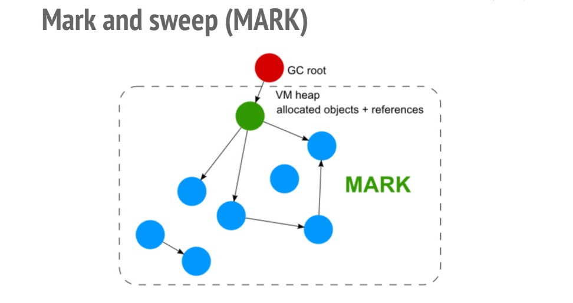

### Stop The World
Eine der häufigsten Nebenwirkungen der Garbage Collection ist das Anhalten der Welt (Stop The World oder stw-pause). In verschiedenen Phasen der Arbeit des Sammlers muss er die Anwendung möglicherweise unterbrochen werden. Die Pausen selbst sind nicht notwendig, aber sie vereinfachen das Leeren des _heaps_ erheblich. Die meisten Java Virtual Machines können keine Pausen verarbeiten. Der Grund für Pausen ist die Dynamik des Erreichbarkeitsgraphen. Während seiner Durchquerung können zuvor markierte Objekte unzugänglich werden, und der Garbage Collector entfernt möglicherweise nicht, was gerade zu Garbage wurde. Oder umgekehrt – die Wurzel kann auf ein neues Objekt verweisen und der Garbage Collector muss dies berücksichtigen, um die verwendeten Objekte nicht versehentlich zu löschen.

__Generationshypothese__
Der einfachster Weg die Zeit zu sparen ist weniger sinnlose Arbeit zu erledigen. Im Falle der Garbage Collection kann nutzlose Arbeit als unnötiges Durchlaufen von Objekten angesehen werden, die höchstwahrscheinlich kein Garbage sind. Basierend auf empirischen Beobachtungen für objektorientierte Sprachen wurde die sogenannte Generationshypothese formuliert. Im Allgemeinen enthält diese Hypothese zwei Axiome:
- Die Lebensdauer der meisten Objekte ist extrem kurz und sie „sterben jung“.
- Die Zahl der Verweise auf „junge“ Objekte von „alten“ ist gering.

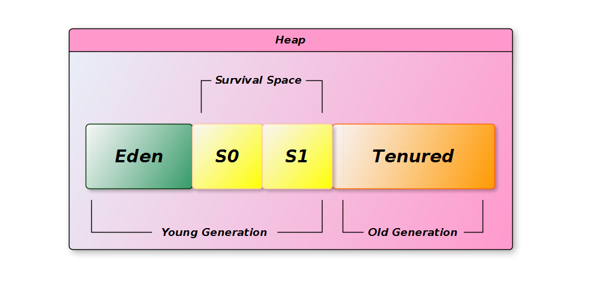

__Der Algorithmus der Arbeit von Garbage Collectors, der auf der Hypothese von Generationen basiert, kann wie folgt beschrieben werden:__

- Alle Objekte sind Eden zugeordnet.
- Wenn in Eden nicht genügend Speicherplatz vorhanden ist, wird der Garbage Collector ausgelöst. Alle verbleibenden Live-Objekte werden auf S0 kopiert. Das gesamte Eden-Gebiet wird geräumt.
- Wenn in S0 nicht genügend Speicherplatz vorhanden ist, findet ein Garbage Collector unter den verbleibenden Objekten statt. Alle verbleibenden Objekte von S0 werden nach S1 verschoben, S0 wird gelöscht und diese Bereiche werden umgekehrt.
- Wenn Objekte im Survivor Space genügend Bauzyklen durchlaufen haben, um als alt zu gelten, werden sie in die alte Generation verschoben.
- Wenn in der alten Generation nicht genügend Speicherplatz vorhanden ist, findet dort ein Garbage Collector statt. Zusätzlich zum Löschen von Objekten können sie komprimiert werden, um die Speicherfragmentierung zu beseitigen.
- Wenn keine Objekte mehr in die alte Generation platziert werden können, tritt ein Speicherfehler (java.lang.OutOfMemoryError) auf. Denken Sie daran, dass dieser Fehler bei Threads auftritt, die versucht haben, ein Objekt zuzuweisen.

_Es ist erwähnenswert, dass es Situationen gibt, in denen junge Objekte vorzeitig in die alte Generation fallen können. Wenn beispielsweise die Größe eines Objekts die Größe von Eden überschreitet, kann es sofort in der alten Generation zugewiesen werden. Dasselbe gilt für Survival._

Bei einigen Garbage Collectors kann ein Speichermangel nicht nur dann auftreten, wenn es physikalisch unmöglich ist, ein Objekt zuzuordnen, sondern auch, wenn der Garbage Collector die meiste Zeit der Anwendung in Anspruch nimmt, wenn die Anzahl der zu löschenden Objekte gering ist . Diese Situation wird _gc overlimit_ genannt und tritt normalerweise auf, wenn der Garbage Collector mehr als 98 % der Zeit in Anspruch nimmt und nicht mehr als 2 % des Heapspeichers durch der Garbage Collector freigegeben werden.

## Memory leak. Heapdump
Ein Speicherleck ist eine Situation, in der sich Objekte auf dem Heap befinden, die nicht mehr verwendet werden, der Garbage Collector sie jedoch nicht entfernen kann, was zu einer Verschwendung von Speicher führt.

Lecks sind Probleme, da sie Speicherressourcen sperren, was mit der Zeit zu einer Verschlechterung der Performance führt. Und wenn es nicht behoben wird, erschöpft die Anwendung ihre Ressourcen und wird mit einem __java.lang.OutOfMemoryError__-Fehler beendet.

Es gibt zwei Arten von Heap-basierten Objekten: solche, die aktive Referenzen in der Anwendung haben, und solche, auf die von keiner Variablen des Referenztyps verwiesen wird.
Der Garbage Collector entfernt regelmäßig Objekte, die keine aktiven Verweise mehr haben, entfernt jedoch niemals Objekte, auf die verwiesen wird.

### Memory leak durch Inner-Class

None static inner Klassen (anonym) erfordern immer eine Instanz der äußeren Klasse, um initialisiert zu werden. Jede nichtstatische innere Klasse hat standardmäßig einen impliziten (verborgenen) Verweis auf die Klasse, in der sie sich befindet. Wenn wir dieses Objekt der inneren Klasse in unserer Anwendung verwenden, wird es auch nach Abschluss der Arbeit des Objekts der äußeren Klasse nicht vom Garbage Collector zurückgefordert.

### Memory leak durch Static-Fields

Systemloader/Classloader ist __root__ für GC und initialisierte static fields der geladenen Klassen sind aus dem Classloader erreichbar, also darf der GC die nicht entsorgen, weil es immer noch ein Link auf die Felder existiert.

### Memory leak durch nicht geschloßen Resource

Immer wenn men eine neue Verbindung erstellt oder einen Thread öffnet, weist die JVM Speicher für diese Ressourcen zu. Dies können Datenbankverbindungen, eingehende Streams oder Sitzungsobjekte sein. Indem man vergisst, diese Ressourcen zu schließen, kann man Speicher sperren, wodurch sie für den Garbage Collector nicht verfügbar sind. Dies kann selbst dann passieren, wenn eine Ausnahme auftritt, die das Programm daran hindert, den Code auszuführen, der für das Schließen der Ressourcen verantwortlich ist.

# [Maven](https://maven.apache.org/guides/introduction/introduction-to-the-lifecycle.html#Lifecycle_Reference) (Modul 21)


Apache Maven, ein deklaratives Build-Automatisierungssystem, ist weit verbreitet. Auch Maven nutzt das XML-Format, aber pom.xml (die Hauptdatei für Maven) enthält keine einzelnen Befehle, sondern eine Beschreibung des Projekts. Auf den Aufbau der pom-Datei gehen wir später noch genauer ein.

Die Vorteile von Maven gegenüber Ant sind:

- automatisches Abhängigkeitsmanagement;
- gut strukturierte Projekte;
- eine einfachere Montagebeschreibung.

Maven lässt sich auch gut in alle wichtigen Entwicklungsumgebungen integrieren. Um im Fall von Ant ein Projekt ohne IDE zu erstellen, müssen Build-Skripte unterstützt werden. Das Erstellen von Maven kann über die Befehlszeile erfolgen.

Die Nachteile dieses Systems sind normalerweise die Lernschwierigkeiten und die Schwierigkeit, Montageprobleme zu diagnostizieren. Zu beachten ist auch, dass es schwierig ist, die richtigen Plugins zu finden und zu konfigurieren.

Die Übersichtstabelle zeigt die wichtigsten Vor- und Nachteile von Maven:

|Vorteile | Nachteile|
|---|---|
|Abhängigkeitsmanagement|Lernschwierigkeiten|
|Build aus der Befehlszeile|Schwierigkeiten beim Diagnostizieren von Problemen|
|Gute Integration mit vielen IDEs| Schwierigkeiten beim Auffinden von Plugins und Anpassungen|
|Aussagekräftige Beschreibung||
|Erweiterung der Funktionalität mit Plugins||

## Anweisungen zur Installation von Maven unter Windows
1. Laden Sie die Datei bin.zip mit der neuesten Version von der offiziellen Website herunter.
1. Entpacken Sie den Ordner in ein beliebiges Verzeichnis, in dem Sie Maven haben möchten.
1. Fügen Sie M2_HOME=your_maven_path zu Ihren Umgebungsvariablen hinzu (genauso wie Sie JAVA_HOME hinzugefügt haben).
1. Fügen Sie %M2_HOME%\bin zu PATH hinzu, damit Sie Maven-Befehle von überall ausführen können.
1. Führen Sie den Befehl aus:
   ```cmd
   mvn-Version
   ```
1. Wenn alles richtig gemacht wurde, wird die Maven-Version angezeigt.

### Maven-Integration mit Intellij Idea
Als einen der Vorteile von Maven haben wir die gute Integration mit der IDE hervorgehoben. Im Video sehen wir uns an, was so großartig an der Arbeit mit Maven in Intellij Idea ist.

## pom.xml-Struktur. Archetypen
POM (Project Object Model) ist die Hauptdatei für Maven. Die Datei pom.xml enthält Projektinformationen und Konfigurationsdetails, die Maven zum Erstellen des Projekts benötigt. Die Datei pom.xml muss sich im Projektverzeichnis befinden.

Die folgenden Elemente können in pom.xml eingebunden werden:

- Abhängigkeiten;
- Plugins;
- Aufgaben;
- Profile;
- Projektversion;
- weitere Informationen zum Projekt.

Pom-Struktur
Schauen wir uns noch einmal die Struktur der Pom-Datei an, die Idea in der letzten Einheit für uns erstellt hat (die Werte der einzelnen Elemente sind in der folgenden Tabelle aufgeführt):

```xml
<?xml version="1.0" encoding="UTF-8"?>
<project xmlns="http://maven.apache.org/POM/4.0.0"
         xmlns:xsi="http://www.w3.org/2001/XMLSchema-instance"
         xsi:schemaLocation="http://maven.apache.org/POM/4.0.0
                             http://maven.apache.org/maven-v4_0_0.xsd">
    <modelVersion>4.0.0</modelVersion>
    <groupId>org.example</groupId>
    <artifactId>greeting</artifactId>
    <version>1.0.0-SNAPSHOT</version>
</project>
```
Eine solche Struktur ist die minimal erforderliche Pom-Dateistruktur. Betrachten Sie die Werte der einzelnen Elemente in der Tabelle.

|Element|Beschreibung|
|---|---|
|```<Projekt>```| Das Stammelement der Pom-Datei. Wenn Sie es manuell erstellen, müssen Sie hier die grundlegenden XML-Schemaeinstellungen angeben, z. B. das Apache-Schema und die w3.org-Spezifikation. Wenn Sie in IntelliJ IDEA erstellen, werden alle Schemas automatisch angegeben.|
|```<modelVersion>``` |Gibt die aktuelle POM-Version an. Derzeit wird nur 4.0.0 unterstützt, daher wird immer nur diese Version aufgeführt.|
|```<groupId>```| Gibt die Gruppen-ID des Projekts an. Beispielsweise ist org.springframework die ID einer Gruppe von Projekten, die sich auf das Spring Framework beziehen.|
|```<artifactId>```| Gibt den Namen des Projekts an. Zum Beispiel Gruß oder Federkern.|
|```<Version>```| Gibt die Version des Projekts an. Im Beispiel wird -SNAPSHOT auch zur Projektversion hinzugefügt, was bedeutet, dass die Version nicht endgültig ist, sie befindet sich in der Entwicklung.|

Jede erstellte _Pom_-Datei erbt die Konfiguration, die im sogenannten _Super-POM_ definiert ist, das in Maven definiert ist. Tags, die nicht in der für unser Projekt generierten pom.xml definiert sind, verwenden den Standardwert aus dem _Super-POM_.

Sie können das kombinierte Pom (Werte, die in der pom.xml des Projekts angegeben sind, + nicht angegebene Werte, die aus dem _Super-POM_ stammen) anzeigen, das vom Projekt verwendet wird, Sie können den Befehl verwenden:

```cmd
mvn help:effective-pom
```
Beispiel für pom.xml:
```xml
<?xml version="1.0" encoding="UTF-8"?>
<project xmlns="http://maven.apache.org/POM/4.0.0"
         xmlns:xsi="http://www.w3.org/2001/XMLSchema-instance"
         xsi:schemaLocation="http://maven.apache.org/POM/4.0.0         http://maven.apache.org/xsd/maven-4.0.0.xsd">
    <modelVersion>4.0.0</modelVersion>
    <properties>
      <project.build.sourceEncoding>UTF-8</project.build.sourceEncoding>
      <maven.compiler.source>1.8</maven.compiler.source>
      <maven.compiler.target>1.8</maven.compiler.target>
    </properties>

    <groupId>org.example</groupId>
    <artifactId>greeting</artifactId>
    <version>1.0-SNAPSHOT</version>
    <packaging>war</packaging>

    <name>Greeting application</name>  
    <url>http://example.org</url>  
    <description>Greeting application</description>  
    <dependencies>
        <dependency>
            <groupId>org.apache.commons</groupId>
            <artifactId>commons-lang3</artifactId>
            <version>3.11</version>
        </dependency>
    </dependencies>

    <build>
        <sourceDirectory>src</sourceDirectory>
        <resources>
            <resource>
                <directory>resources</directory>
            </resource>
        </resources>
        <plugins>
            <plugin>
                <groupId>org.apache.maven.plugins</groupId>
                <artifactId>maven-compiler-plugin</artifactId>
                <version>3.8.1</version>
                <configuration>
                    <source>1.8</source>
                    <target>1.8</target>
                </configuration>
            </plugin>
        </plugins>
    </build>
</project>
```
Betrachten wir die zusätzlichen Elemente, die im Beispiel aufgetreten sind.

|Element|Beschreibung|
|```<packaging>```| Gibt den Dateityp an, der vom Build generiert wird. Mögliche Optionen: JAR, WAR, EAR. Das Tag ist optional. Wenn nicht vorhanden, ist der Standardwert JAR.|
|```<properties>```| Dieser Block spezifiziert Einstellungen wie die Dateicodierung und die Version des verwendeten Compilers.|
|```<name>```| Gibt einen beschreibenden Namen für das Projekt an.|
|```<url>```| Enthält die URL des Projekts.|
|```<Beschreibung>```| Kurze Beschreibung des Projekts. Die Tags <name>, <url>, <description> werden häufig beim Erstellen von Dokumentationen verwendet.|
|```<dependencies>```| Enthält eine Liste aller Abhängigkeiten, die im Projekt verwendet werden. Jede Abhängigkeit enthält dieselben Tags wie das Projekt: Gruppen-ID, Artefakt-ID, Version.|
|```<build>```| Enthält Build-Informationen.|
|```<sourceDirectory>```| Gibt den Pfad zum Quellcode an. Der Standardwert ist: src/main/java. Denken Sie daran, dass wir im Tutorial beim Erstellen des Maven-Projekts genau eine solche Struktur erstellt haben.|
|```<resources>```| Gibt Pfade zu Ressourcendateien an. Standardverzeichnis: src/main/resources.|
|```<outputDirectory>```| Gibt das Verzeichnis an, in dem die kompilierten Dateien gespeichert werden. Standardwert: Ziel/Klassen.|
|```<finalName>```| Der Name der resultierenden Assemblydatei. Standardwert: artifactId-version.|
|```<plugins>```| Der Abschnitt definiert die Verwendung von Plugins von Drittanbietern.|

### Archetyp
Neben den bereits besprochenen Erstellungsmethoden (von Hand und mit der IDE) kann die Datei pom.xml auch mit dem Archetyp erstellt werden.

Ein Archetyp ist eine Art Projektvorlage, die die Struktur und Stubs von Quell- und Konfigurationsdateien enthält. Der Archetyp wird verwendet, um die Projektstruktur zu standardisieren und schnell ein Projekt aus einer bestehenden Vorlage zu erstellen.
Ein Archetyp ist ein reguläres Maven-Projekt, das eine zusätzliche Datei archetype-metadata.xml enthält, die sich im Ordner META-INF/maven befindet und eine Beschreibung enthält, wie die Projektstruktur aussehen wird.

Beispiel für die Datei archetype-metadata.xml:
```xml
<archetype-descriptor
... name="example-archetype">
  <fileSets>
    <fileSet packaged="true">
        <directory>src/main/java</directory>
    </fileSet>
    <fileSet packaged="true">
        <directory>src/test/java</directory>
    </fileSet>
  </fileSets>
</archetype-descriptor>
```

Das fileSet gibt die zu erstellende Struktur und die zu kopierenden Dateien an. Das heißt, in unserem Fall wird die Ordnerstruktur src/main/java für das erste fileSet erstellt.

Die Eigenschaft packaged=true gibt an, dass die Dateien dem durch den Paketparameter angegebenen Ordner hinzugefügt werden.

Für die Erstellung der Projektstruktur und der pom.xml gibt es eine Vielzahl vorgefertigter Archetypen. Beispielsweise generiert maven-archetype-webapp eine Projektstruktur für Webanwendungen. Das Ergebnis ist folgende Struktur:


Und maven-archetype-simple erstellt die Struktur eines regulären Maven-Projekts:


Führen Sie dazu einfach den Befehl aus:

```cmd
mvn archetype:generate -DarchetypeGroupId=org.apache.maven.archetypes -DarchetypeArtifactId=maven-archetype-plugin -DarchetypeVersion=1.4
```
wo

- in -DarchetypeGroupId müssen Sie die groupId des Archetyps angeben,
- -DarchetypeArtifactId gibt die Artefakt-ID des Archetyps an,
- in -DarchetypeVersion ist seine Version.

Die _ArtifactId_ der offiziellen Maven-Archetypen finden Sie in der Tabelle. Sie beziehen sich alle auf die ```gruppen-gd org.apache.maven.archetypes```.

Die auf diese Weise erstellte Projektstruktur ähnelt der, __Idea__ in der letzten Einheit für uns erstellt hat, als wir mit __Idea__ ein Maven-Projekt erstellt haben.

Sie können einen Archetyp auch manuell erstellen, indem Sie eine Projektdeskriptordatei archetype-metadata.xml oder aus einem vorgefertigten Projekt erstellen. Um einen Archetyp aus einem Projekt zu erstellen, müssen Sie den folgenden Befehl ausführen:

```cmd
mvn archetype:create-from-project
```

Der generierte Archetyp befindet sich in target/generated-sources/archetype.

## Erstellen Sie Ihren eigenen Archetyp.

1. Verwenden Sie dazu den vorgefertigten Archetyp des Archetyps. Führen Sie den Befehl aus, um ein Projekt basierend auf einem Archetyp aus der Theorie zu erstellen, und geben Sie den Archetyp -DarchetypeArtifactId=maven-archetype-archetype an.
Als Ergebnis erhalten Sie mit der Deskriptordatei die Struktur des fertigen Archetyps.

1. Ändern Sie in archetype-metadata.xml den Namen des generierten Archetyps in Ihren eigenen und ersetzen Sie die generierte Projektstruktur. Fügen Sie zum Beispiel die Ordner src/main/java/db hinzu (für eine hypothetische Datenbankverbindung werden wir keine Verbindung herstellen, erstellen Sie einfach einen Archetyp für Projekte, wo es benötigt wird) und src/main/java/entity (für eine hypothetische Entitätssatz). Die Struktur wird im Tag ```<fileSets>``` angegeben.
1. Erstellen Sie den erstellten Archetyp und fügen Sie ihn dem lokalen Repository hinzu, indem Sie den folgenden Befehl ausführen:
```cmd
mvn clean install
```
Stellen Sie sicher, dass Ihr Archetyp in .m2/repository/archetype-catalog.xml erscheint.

Erstellen Sie ein Projekt mit dem soeben erstellten Archetyp. Dazu können Sie den Befehl zum Erstellen eines Projekts aus einem Archetyp aus der Theorie verwenden, indem Sie den Namen Ihres Archetyps angeben.

## Abhängigkeitsmanagement. Eigenschaften
Eines der Hauptmerkmale von Maven ist das Abhängigkeitsmanagement. In dieser Einheit sehen wir uns an, wie Abhängigkeiten in Maven definiert werden, welche Eigenschaften Abhängigkeiten haben und wie Konflikte mit Versionen gelöst werden.

Alle Abhängigkeiten sind in der pom-Datei im Abschnitt <dependencies/> definiert.

Zum Beispiel:
```xml
<dependency>
    <groupId>org.springframework</groupId>
    <artifactId>spring-core</artifactId>
    <version>5.2.9.RELEASE</version>
</dependency>
```
Für Artefakte, die zur selben Gruppe gehören, ist es praktisch, Variablen zu verwenden. Anstatt beispielsweise für jede Bibliothek aus Spring eine Version definieren zu müssen, können Sie eine Variable definieren und diese in allen Spring-spezifischen Abhängigkeiten verwenden.

```xml
<properties>
    <spring.version>5.2.9.RELEASE</spring.version>
</properties>

<dependencies>
     
    <dependency>
        <groupId>org.springframework</groupId>
        <artifactId>spring-data</artifactId>
        <version>${spring.version}</version>
        <scope>test</scope>
    </dependency>
         
    <dependency>
       <groupId>org.springframework</groupId>
       <artifactId>spring-core</artifactId>
       <version>${spring.version}</version>
    </dependency>
         
 </dependencies>
 ```

Wenn Sie einen Maven-Befehl ausführen, versucht Maven, alle Abhängigkeiten zu installieren, indem es sie aus dem lokalen Repository herunterlädt, und wenn sie nicht im lokalen Repository gefunden werden, werden sie aus dem zentralen Repository heruntergeladen und im lokalen gespeichert.

Mit Maven können Sie eine Bibliothek verwenden, die sich weder im zentralen noch im lokalen Repository befindet. Dies sind beispielsweise proprietäre Bibliotheken. Geben Sie dazu im Tag <systemPath> einfach den Pfad zur Bibliothek des Drittanbieters an und definieren Sie den Geltungsbereich <scope> als system.

Zum Beispiel:
```xml
<dependency>
  <groupId>myDependency</groupId>
  <artifactId>myDependency</artifactId>
  <scope>system</scope>
  <version>1.0</version>
  <systemPath>${basedir}\libs\myDependency.jar</systemPath>
</dependency>
```
Die Abhängigkeit hat Eigenschaften: GroupId, ArtifactId und Version, ähnlich den Eigenschaften des Projekts, die wir bereits in der letzten Einheit betrachtet haben. Überlegen Sie, welche zusätzlichen Eigenschaften eine Abhängigkeit haben kann.

### Scope
Insgesamt gibt es sechs Arten von _scope_ oder _Sichtbarkeitsbereiche_. Sie bestimmen, in welchen Phasen des Builds oder der Programmausführung die Abhängigkeit sichtbar wird.

|||
|---|---|
|compile | Der Standardbereich. Die Abhängigkeit ist in allen Phasen des Builds verfügbar und wird in den Build eingeschlossen. |
|provided | Gibt eine Abhängigkeit an, die zur Laufzeit vom JDK oder Container bereitgestellt wird. Eine solche Abhängigkeit ist nur zur Kompilierzeit verfügbar. Die Abhängigkeit gelangt nicht in die Assembly. |
|runtime | Eine Abhängigkeit mit diesem Umfang wird zur Kompilierzeit nicht benötigt, sondern nur zur Laufzeit. |
|test | Gibt eine Abhängigkeit an, die beim Kompilieren und Ausführen von Tests sichtbar ist. |
|system | Maven sucht solche Abhängigkeiten nicht im Repository, sie sind im System vorhanden. |
|import | Dieser Bereich ist nur für den Abhängigkeitstyp pom verfügbar. Wird verwendet, um Abhängigkeiten von anderen pom zu importieren.|

### Classifier
Es gibt Fälle, in denen das Teilen durch groupId, artifactId und Version nicht ausreicht und dann der Classifier <classifier> verwendet wird. Classifier kann in Fällen verwendet werden, in denen Artefakte für die Verwendung in unterschiedlichen Umgebungen (Entwicklung, Test, Produktion) auf unterschiedlichen Betriebssystemen erstellt werden oder wenn Artefakte für unterschiedliche JDKs funktionieren sollen.

Zum Beispiel gibt es dieselbe Bibliothek, die mit verschiedenen JDKs funktionieren soll: JDK 8 und JDK 11. Diese Bibliothek hat dieselbe Artefakt-ID, aber der Klassifikator ist unterschiedlich.

Ein Beispiel für die Verwendung der Bibliothek zum Arbeiten mit JDK 8:

```xml
<dependency>
    <groupId>org.example</groupId>
    <artifactId>greeting</greeting>
    <version>1.0.0</version>
    <classifier>jdk8</classifier>
</dependency>
```

Wenn für das Projekt ein Klassifizierer angegeben ist, wird sein Wert zum Assemblynamen hinzugefügt. In diesem Fall erhält das Artefakt den Namen Greeting.1.0.0-jdk8.jar.

### Optional
Eine Abhängigkeit kann als optional deklariert werden. Fügen Sie dazu einfach das Tag ```<optional>``` mit dem Wert true hinzu. Dies wird verwendet, wenn eine Abhängigkeit nur für bestimmte Funktionen benötigt wird, und ist optional, wenn der Rest des Projekts verwendet wird. Beispielsweise gibt es Projekt A mit Abhängigkeit B. Abhängigkeit B ist als optional deklariert. In meinem C-Projekt füge ich Abhängigkeit A hinzu, aber Abhängigkeit B wird nicht automatisch geladen. Wenn ich in Projekt C Funktionen benötige, die Abhängigkeit B verwenden, muss ich sie als direkte Abhängigkeit zum pom hinzufügen.

Ein Beispiel für das Deklarieren einer Abhängigkeit als optional:

```xml
<dependency>
    <groupId>org.example</groupId>
    <artifactId>greeting</artifactId>
    <version>1.0.0</version>
    <optional>true</optional>
</dependency>
```

### Abhängigkeitsbaum

Um eine Liste aller Abhängigkeiten im Projekt anzuzeigen, einschließlich der transitiven, führen Sie einfach den folgenden Befehl aus:

```xml
mvn dependency: tree 
```

Ein Beispiel für ein Fragment des konstruierten Abhängigkeitsbaums:
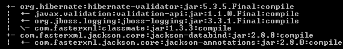

Hier sehen wir zwei transitive Abhängigkeiten: hibernate-validator und jackson-databind. Hibernate-Validator enthält wiederum Abhängigkeiten: Validation-Api, JBoss-Logging, FasterXml und Jackson-Databind enthält Jackson-Anmerkungen.

### Abhängigkeiten beseitigen

Es gibt zwei Arten von Abhängigkeiten in Maven: direkt und transitiv.

Direkte Abhängigkeiten sind diejenigen, die wir explizit in den Abschnitt ```<dependencies>``` schreiben.
Transitive Abhängigkeiten sind Abhängigkeiten, die die Abhängigkeiten verwenden, die wir in das Projekt aufnehmen.

Transitive Abhängigkeiten Maven lädt auch automatisch.

Dabei können wir auf das Problem von Versionskonflikten stoßen. Sie besteht darin, dass eine bestimmte Abhängigkeit als transitiv dargestellt wird und die Version 1.0.0 hat, und wir im Projekt die neuere Version 2.0.0 verwenden wollen. Maven kann nur eine Abhängigkeit mit derselben Gruppen- und Artefakt-ID in ein Projekt aufnehmen. Um einen solchen Konflikt zu vermeiden, können wir die Abhängigkeit mit dem Tag ```<exclusion>``` ausschließen und als direkte Abhängigkeit hinzufügen.

```xml
<dependency>
    <groupId>junit</groupId>
    <artifactId>junit</artifactId>
    <version>${junit.version}</version>
    <scope>test</scope>
</dependency>
<dependency>
    <groupId>org.dbunit</groupId>
    <artifactId>dbunit</artifactId>
    <version>${dbunit.version}</version>
    <scope>test</scope>
    <exclusions>
        <!--Exclude transitive dependency to JUnit-3.8.2 -->
        <exclusion>
            <artifactId>junit</artifactId>
            <groupId>junit</groupId>
         </exclusion>
    </exclusions>
</dependency>
```

## Assembly-Lebenszyklus

In früheren Einheiten haben wir häufig den Befehl zum Erstellen des Projekts verwendet:

```cmd
mvn clean install 
```

Es ist Zeit herauszufinden, was genau dahinter steckt. Überlegen Sie, was der Baugruppenlebenszyklus ist und was sie sind.

Es gibt 3 Lebenszyklen in Maven:

- default – erstellt die Anwendung und stellt sie bereit.
- clean - entfernt alle seit dem letzten Build generierten Dateien.
- site - erstellt Dokumentation für das Projekt.

Der Lebenszyklus wird durch das Lösen einer Kette von Aufgaben erreicht. In diesem Fall hat der Lebenszyklus keine abzurufenden Befehle. Wie wird es dann durchgeführt?

Jede Aufgabe wird innerhalb einer Phase (Phase) durchgeführt. Somit ist der Lebenszyklus eine logische Vereinigung von Phasen.

Der Befehl mvn clean install fordert Sie auf, die Bereinigungs- und Installationsphasen auszuführen.

Der Lebenszyklus von Default besteht aus 23 Phasen, Clean - von 3, Site umfasst 4 Phasen. Jede Phase ist für eine bestimmte Aufgabe verantwortlich.

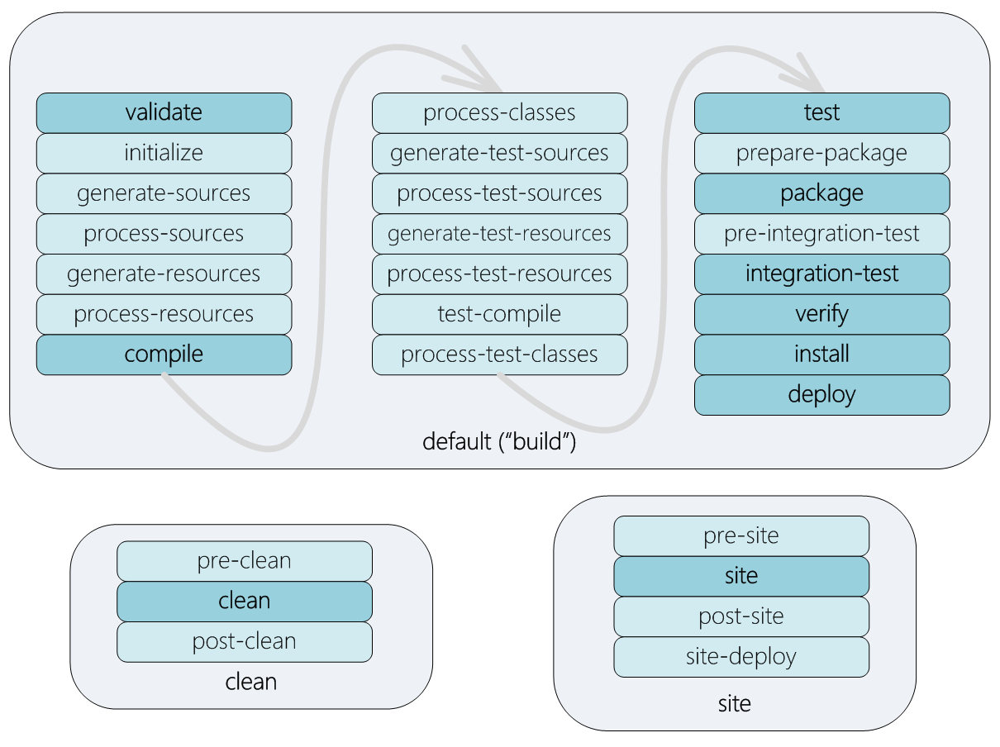

Die Reihenfolge der Phasen im Zyklus ist nicht zufällig, in dieser Reihenfolge werden die Phasen ausgeführt. Wenn eine Phase beginnt, werden alle Phasen vor der gestarteten Phase ausgeführt. 

Zum Beispiel, wenn Sie den Befehl aufrufen:

```cmd
mvn clean install
```
Nennt man zunächst den __Clean__-Lebenszyklus, der von Anfang an bis zur __Clean__-Phase läuft, es gibt also nur zwei Phasen: __Pre-Clean__ und __Clean__. Dann ruft derselbe Befehl die Installationsphase aus dem Standardlebenszyklus auf, was dazu führt, dass alle Phasen dieses Zyklus von der Überprüfung bis zur Installation ausgeführt werden und die Bereitstellungsphase nicht ausgeführt wird, da sie nach der Installationsphase kommt.

### Default
Werfen wir einen Blick auf die beliebtesten und nützlichsten Phasen der Standardschleife.

|||
|---|---|
|validate| Überprüft, ob die Projektkonfiguration korrekt ist, und stellt sicher, dass die erforderlichen Abhängigkeiten verfügbar sind.|
|compile| Verantwortlich für das Kompilieren der Quelldateien des Projekts.|
|test-compile| Verantwortlich für das Kompilieren von Testquelldateien.|
|test| Führt Komponententests aus.|
|package| Setzt kompilierte Dateien in Abhängigkeit vom angegebenen Build-Typ (JAR, WAR, EAR) zu einem Archiv zusammen.|
|integration-test| Führt Integrationstests aus.|
|install| Kopiert das erstellte Artefakt in das lokale Repository. Es wird für den Bau anderer lokaler Projekte verfügbar.|
|deploy| Kopiert ein Artefakt in ein Remote-Repository zur Verwendung in anderen Projekten.|

Die Reihenfolge der Phasen in der Tabelle ist nicht zufällig, in dieser Reihenfolge werden die Phasen ausgeführt. Wenn eine Phase beginnt, werden alle Phasen vor der gestarteten Phase ausgeführt. Zum Beispiel, wenn wir den Befehl ausführen

```cmd
mvn package
```
Die folgenden Phasen werden ausgeführt: _validate, compile, test-compile, test_, das heißt, bevor das Projekt erstellt wird, validiert Maven zuerst das Projekt, kompiliert die Projekt- und Testdateien, führt die Tests aus und erstellt erst dann das Projekt.

### Clean

Der Bereinigungszyklus löscht alle Dateien, die während des vorherigen Builds erstellt wurden: .CLASS, .JAR usw. Im Allgemeinen ist dies das Entfernen des Zielordners

Der Zyklus umfasst 3 Phasen:

|||
|---|---|
|pre-clean|Vorbereiten zur Entnahme. Standardmäßig enthält die Phase keine Ziele (das Konzept eines Ziels wird weiter unten besprochen).|
|clean|Eigentlich die Entfernung selbst.|
|post-clean|Es impliziert die Ausführung einiger Aufgaben nach dem Löschen. Standardmäßig enthält eine Phase keine Ziele.|

Es wird empfohlen, vor einem neuen Projektaufbau immer zu bereinigen, um die Verwendung von Dateien aus einem früheren Build zu vermeiden.

### Site
Die Site-Schleife dient zum Erstellen von Dokumentationen. Besteht aus 4 Phasen:

|||
|---|---|
|Pre-Site| Vorbereitung für die Erstellung.|
|site| Direktes Erstellen von Dokumentationen.|
|Post-Site| Vorbereitung für die Bereitstellung.|
|site-deploy| Stellt die Dokumentation auf einem Webserver bereit.|

### Goals 
Jede Phase wiederum ist eine Reihe von Zielen (Zielen).

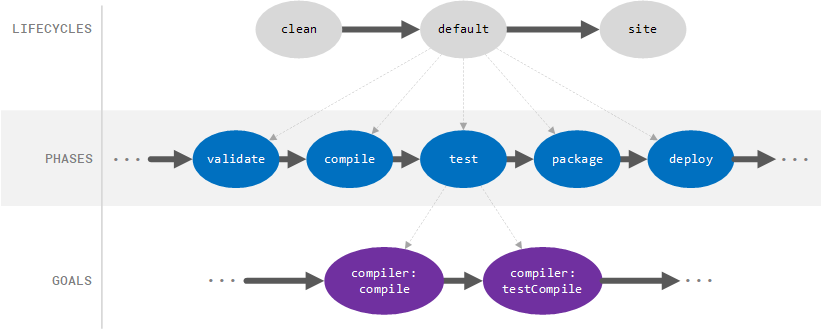

GoalS sind Aufgaben, die ausgeführt werden, um eine bestimmte Phase abzuschließen. Ein Ziel kann zu mehreren Phasen gehören oder zu keiner.

Ein Beispiel, bei dem sich das Ziel in keiner Phase befindet, ist der Befehl mvndependency:tree, den wir in der vorherigen Einheit ausgeführt haben, um den Abhängigkeitsbaum anzuzeigen. Der Zweck vondependency:tree bezieht sich nicht auf irgendeine Phase.

Ein Beispiel für ein Ziel, das sich über mehrere Phasen erstreckt:

```cmd
mvn compiler: compile
```

Es kann sowohl in der Testphase (test) als auch in der Kompilierphase (compile) ausgeführt werden.

Die Besonderheit des Ziels besteht darin, dass bei Erfüllung eines bestimmten Ziels nur dieses Ziel erfüllt wird, im Gegensatz zu der Phase, in der zusätzlich alle vorherigen Phasen durchgeführt werden.
Wenn Sie beispielsweise ein JAR-Ziel ausführen, das kompilierte Dateien in eine JAR-Datei kompiliert, und Sie die Dateien vorher nicht kompiliert haben, den Kompilierungsbefehl nicht ausgeführt haben, tritt ein Fehler auf, das Ziel wird nicht ausgeführt – die JAR-Datei target wird einfach keine kompilierten Dateien haben, um sie zu erstellen.

Ziele werden dank Plugins erfüllt. Das Maven-Plugin ist grob gesagt eine Reihe von Zielen. Beispielsweise können Sie in den Standardzielen und ihrer Bindung an Phasen sehen, dass in der Clean-Phase das Clean-Ziel vom Clean-Plugin ausgeführt wird.

Das Ziel kann über die Befehlszeile ausgeführt werden, indem der Befehl wie folgt zusammengesetzt wird:

```cmd
mvn plugin:goal
```
Um eine Liste von Zielen und Plugins anzuzeigen, die sich auf ein bestimmtes Ziel beziehen, müssen Sie den Befehl help:describe mit einer Phase ausführen. Wie zum Beispiel für die Compile-Phase:

```cmd
mvn help:describe -Dcmd=compile
```

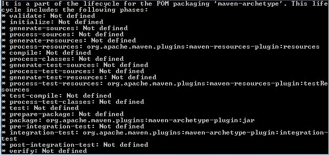

Wie wir sehen können, werden für einige Phasen keine Ziele definiert. Dies bedeutet, dass dieser Phase standardmäßig kein Ziel zugeordnet ist, Sie können das Ziel jedoch selbst binden.

## Häufig verwendete Plugins

Das Thema Plugins haben wir bereits kurz angesprochen. Lassen Sie uns nun genauer untersuchen, was es ist, wie es in Maven verwendet wird, und die beliebtesten betrachten.

In der vorherigen Einheit haben wir gesagt, dass ein Plugin eine Reihe von Zielen ist. In einem Maven-Plugin ist das Ziel ein Mojo (Main Plain Old Java Object), das eine Java-Klasse sein kann. Mojo stellt alle notwendigen Informationen über das Ziel bereit: den Namen des Ziels, die Phase, in der es ausgeführt wird, und Konfigurationsoptionen. Ein Plugin besteht aus einem oder mehreren Mojos.

Mojo-Beispiel, das einen Bericht generiert:

```java
public class ReportExampleMojo extends AbstractMojo {

   @Parameter(property = "reportName", required = false, defaultValue = "Report")
   private String reportName;
 
   @Parameter(property = "targetPath", required = true)
   private String targetPath;
 
   @Parameter(property = "locales")
   private String[] locales;
 
   public void execute() throws MojoExecutionException {
       ...
   }
}
```
Diesem Plugin können 3 Parameter gegeben werden (@Parameter): reportName (Berichtsname), targetPath (Pfad, wo der Bericht generiert wird), locales (Sprachen, in denen der Bericht generiert wird). Erforderliche Parameter haben das Flag required = true. Für optional können Sie den Standardwert setzen, wie im Beispiel: defaultValue = "Report".

Sie können zusätzliche Parameter für das Plugin im Tag <configuration> in pom.xml festlegen. Die so eingestellten Parameter werden den Feldwerten in Mojo hinzugefügt.

Die oben beschriebene Beispiel-POM-Datei für Mojo würde folgendermaßen aussehen:

```xml
<project>
 ...
 <build>
   <plugins>
     <plugin>
      <groupId>org.example</groupId>
       <artifactId>maven-reportexample-plugin</artifactId>
       <version>1.0</version>
       <configuration>
         <reportName>my_report</reportName>
         <targetPath>${basedir}/target/reports</targetPath>
              <locales>
                <locale>ru</locale>
                <locale>en</locale>
                <locale>de</locale>
                <locale>fr</locale>
              </locales>
       </configuration>
     </plugin>
   </plugins>
 </build>
 ...
</project>
```

Im Allgemeinen gibt es zwei Arten von Plugins in Maven:

Assembly-Plugins. Plug-ins werden während des Projekterstellungsprozesses ausgeführt und müssen innerhalb des <build>-Blocks angegeben werden.
Plugins melden. Sie werden während des Dokumentationsgenerierungsprozesses durchgeführt und müssen innerhalb des <reporting>-Blocks angegeben werden.
Plugins werden in der Datei pom.xml innerhalb des Blocks <plugins></plugins> angegeben, wie im obigen Beispiel.

Sie werden auf ähnliche Weise wie Abhängigkeiten deklariert. Erforderliche Informationen für Plugins auch: Gruppen-ID, Artefakt-ID und Version.

Wenn Sie ein Plugin deklarieren, können Sie es an eine bestimmte Phase binden und Ziele angeben.

Zum Beispiel:

```xml
<plugin>
   <groupId>org.apache.maven.plugins</groupId>
   <artifactId>maven-compiler-plugin</artifactId>
   <version>3.8.0</version>
   <executions>
      <execution>
         <id>default-compile</id>
         <phase>compile</phase>
         <goals>
            <goal>compile</goal>
         </goals>
      </execution>
      <execution>
         <id>default-testCompile</id>
         <phase>test-compile</phase>
         <goals>
            <goal>testCompile</goal>
         </goals>
      </execution>
   </executions>
</plugin>
```

Das maven-compiler-plugin enthält zwei Ziele: „compile“, das an die „compile“-Phase gebunden ist, und „test-compile“, das an die „test-compile“-Phase gebunden ist.

Sie können das Plugin aus dem obigen Beispiel mit der Befehlszeile ausführen:
```cmd
mvn compiler:compile 
rem oder
mvn compiler:testCompile
```
Im Allgemeinen sieht der Plugin-Ausführungsbefehl wie folgt aus:
```cmd
mvn groupId:artifactId:version:goal 
```
n diesem Fall kann die Version normalerweise weggelassen werden, dann wird die neueste Version des Plugins ausgewählt.

Hinweis: Gemäß der Namenskonvention sollten generierte Plugins ```<yourpluginname>```-maven-plugin heißen. Namen wie maven-```<pluginname>```-plugin beziehen sich nur auf offizielle Maven-Plugins.

Rufen Sie das Ziel „compiler:compile“ mit dem vollständig qualifizierten Plug-in-Namen auf.
```cmd
mvn org.apache.maven.plugins:maven-compiler-plugin:3.8.1:compile 
```

Die Liste der auf dem Computer installierten Maven-Plugins kann im Verzeichnis eingesehen werden
```${M2_HOME}/repository/org/apache/maven/plugins.```

Und die Liste der Plugins, die standardmäßig mit dem Projekt verbunden sind, mit dem Befehl:
```Cmd
mvn help:effective-pom
```
Betrachten Sie einige Maven-Plugins
|Plugin|Beschreibung|
|---|---|
|maven-clean-plugin|Entfernt generierte Dateien beim Erstellen des Projekts.|
|maven-compiler-plugin|Kompiliert Projekt- und Testquelldateien.|
|maven-surefire-plugin|Führt Tests durch und generiert Berichte über die Ergebnisse ihrer Ausführung.|
|maven-jar-plugin|Erstellt ein JAR-Archiv für das Projekt.|
|maven-war-plugin|Erstellt ein WAR-Archiv für das Projekt.|
|maven-javadoc-plugin|Entwickelt, um eine Dokumentation zum Quellcode des Projekts mit dem Standard-Javadoc-Dienstprogramm zu erstellen.|

[Weitere Plugins](https://maven.apache.org/plugins/index.html#supported-by-the-maven-project)

## Profile verwenden

Maven bietet die Funktionalität zum Erstellen mehrerer Konfigurationssätze, die zum Festlegen oder Überschreiben der standardmäßigen Maven-Build-Werte verwendet werden können. Dadurch können Sie verschiedene Builds erstellen, die jeweils darauf abzielen, einige spezielle Probleme zu lösen, beispielsweise für verschiedene Umgebungen (development  [lit. „Entwicklung“], training  [lit. „Training“, „Testen“], production  [ lit. "Produktion"]).

Diese Funktionalität wird als __Maven-Profil__ bezeichnet.

Es gibt 3 Profiltypen in Maven:

- Projektprofile. Definiert in pom.xml.
- Benutzerprofil. Definiert in der Datei settings.xml. ```(%USER_HOME%/.m2/settings.xml)```
- globale Profile. Definiert in der globalen settings.xml-Datei.

Sehen wir uns an, wie Profile in pom.xml erstellt werden. Das Profil wird durch das Tag <profile> im Abschnitt <profiles> definiert. Das Hauptelement des Profils ist die Profilkennung <id>. Sie können mehrere Profile erstellen, indem Sie verschiedene IDs angeben.

```xml
<profiles>
    <profile>
        <id>local</id>
    </profile>
    <profile>
        <id>production</id>
    </profile>
</profiles>
```

Innerhalb jedes Profils können Sie Abhängigkeiten, Plugins, Ressourcen usw. angeben und so das Profil für bestimmte Aufgaben anpassen.

Profilaktivierung
Um ein Profil verwenden zu können, muss es aktiviert werden. Ein Maven-Build-Profil kann auf folgende Weise als aktiv angegeben werden:

- das Standardprofil ist angegeben;
- Parameter auf der Kommandozeile;
- das Vorhandensein/Fehlen/Wert einer Umgebungsvariablen;
- JDK-Version
- Version oder Typ des Betriebssystems;
- das Vorhandensein oder Fehlen einer bestimmten Datei.

Alle diese Verfahren werden der Reihe nach unten besprochen. Um eine Aktivierungsmethode auszuwählen, geben wir das Tag ```<aktivierung>``` direkt im Profil an und geben darin die Aktivierungsmethode an.

Es gibt Profile, die nicht gleichzeitig verbunden werden sollten, da sie miteinander in Konflikt geraten, z. B. Profile für die Testumgebung und für die lokale Umgebung. Es ist, als würde man im selben Raum versuchen, die Wände in einer schönen Farbe zu streichen und gleichzeitig die Tapete zu kleben – eine sinnlose Übung. Nur bei Test- und lokalen Umgebungsprofilen werden sie höchstwahrscheinlich einfach nicht gestartet oder funktionieren nicht richtig.

Es gibt Profile, die gleichzeitig verbunden werden können, da sie auf unterschiedliche Aufgabengruppen ausgerichtet sind. Es ist, als würde man gleichzeitig einen Elektriker und einen Klempner anrufen – beide arbeiten an Heimwerkerarbeiten, aber sie werden keine Konflikte über Arbeitsprobleme haben.

### Standard Profil 
Im Pom können Sie ein Profil definieren, das standardmäßig aktiv ist, indem Sie das Tag ```<activeByDefault>``` im Abschnitt ```<activation>``` verwenden, das auf __true__ gesetzt sein muss.

```xml
<profile>
    <id>integration-tests</id>
    <activation>
        <activeByDefault>true</activeByDefault>
    </activation>
</profile>
```

Danach können Sie den Profilparameter während des Builds nicht mehr in der Befehlszeile angeben. Wenn wir aber ein anderes Profil als das Standardprofil aktivieren wollen, muss dieses Profil im Parameter angegeben werden, und dann wird das angegebene Profil anstelle des Standardprofils verwendet. Dazu später mehr.

### Build Parameter
Sie können ein Profil aktivieren, indem Sie es während des Builds als Parameter angeben:
```cmd
mvn package -P dev
rem -P bedeutet, dass dies ein Profilparameter ist, 
rem dev ist der Name unseres Profils.
```
Sie können mehrere Profile aktivieren. Dazu genügt es, sie durch Kommas getrennt anzugeben:
```cmd
mvn package -P integration-tests,test
```

### Abhängig von der Systemvariable
Ein Profil kann auch abhängig vom Vorhandensein einer Systemvariablen aktiviert werden. Beispielsweise wird ein Profil aktiv, wenn es eine Systemvariable (die wir im Tag ```<property>``` angeben) mit dem Namen local (die wir im Tag ```<name>``` angeben) gibt:

```xml
<profile>
    <id>example</id>
    <activation>
        <property>
            <name>local</name>
        </property>
    </activation>
</profile>
```
Ein solches Profil kann durch Ausführen des Befehls aktiviert werden, wobei -D den Namen der Systemvariablen angibt:

```cmd
mvn package -Dlocal
```
Im Gegenteil, Sie können angeben, dass das Profil aktiv wird, wenn die Variable nicht angegeben ist.

```xml
<property>
    <name>!local</name>
</property>
```

Oder geben Sie den Wert an, den die Variable annehmen soll (im Beispiel haben wir die Umgebungsvariable angegeben, der der Wert local zugewiesen wurde):

```xml
<property>
    <name>environment</name>
    <value>local</value>
</property>
```
Ein solches Profil kann durch Ausführen des folgenden Befehls aktiviert werden:

```Cmd
mvn package -Denvironment=test
```

*In diesem Fall ist der Namenstest nur ein Beispiel. Eine solche Umgebung ist jedoch standardmäßig vorhanden, sie wird zum Ausführen von Tests benötigt (wir werden später ausführlich auf Tests eingehen).

Sie können auch einen Wert angeben, den die Variable nicht annehmen darf, damit das Profil aktiv wird:

```xml
<property>
    <name>environment</name>
    <value>!local</value>
</property>
```

### Abhängig von der JDK-Version
Das Profil kann abhängig von der angegebenen JDK-Version aktiv werden.
```xml
<profile>
    <id>active-on-jdk-11</id>
    <activation>
        <jdk>11</jdk>
    </activation>
</profile>
```

### Abhängig vom Betriebssystem
Oder je nach Betriebssystem. Sie können ein Profil erstellen, das nur auf einem bestimmten Betriebssystem aktiv ist.
```xml
<profile>
    <id>active-on-windows-10</id>
    <activation>
        <os>
            <family>Windows</family>
            <name>windows 7</name>
            <version>7.0</version>
        </os>
    </activation>
</profile>
```

### Abhängig vom Vorhandensein/Fehlen der Datei
Die letzte Option ist die Aktivierung, wenn die Datei im System vorhanden/nicht vorhanden ist. Das folgende Beispiel demonstriert die Aktivierung eines Profils, wenn keine Datei test.xml im Zielverzeichnis vorhanden ist:

```xml
<activation>
    <file>
        <missing>target/test.xml</missing>
    </file>
</activation>
```
Das Tag ```<exists>``` wird verwendet, um zu aktivieren, wenn die Datei existiert.

### Deaktivierung des Profils

Zum Beispiel durch Ausführen des Befehls:
```cmd
mvn compile -P -active-on-jdk-8
```
Um zu sehen, welche Profile aktiv sind, können Sie den Befehl verwenden:
```cmd
mvn help:active-profiles
```

# Modul 22 (JDBC)
## Взаимодействие с БД из прикладных программ
В большинстве случаев работы прикладных программ нам требуется _сохранять их данные_. Как мы знаем, лучше всего на данную роль подходят БД. Запись и чтение в них из прикладных программ обычно не видны пользователю, и могут не иметь никакого графического интерфейса.

Интерфейс обычно обеспечивает само прикладное приложение. Как правило, это окно с набором полей для ввода данных и кнопками для управления ими. Также с помощью приложения мы можем выводить данные с нескольких таблиц или баз, и мы можем скрыть некоторые данные, если они вдруг стали неактуальными. В итоге интерфейс представляет данные пользователю в понятной и информативной форме.

У различных языков программирования обычно разные стандарты для взаимодействия с БД.

Например, в Python используется Python DB-API, благодаря которой можно подключаться к различным БД с примерно одинаковыми конструкциями. Скорее это набор правил, которым должны следовать несколько библиотек.

Ниже показана небольшая таблица о соответствии библиотеки и БД:

|База данных|DB-API модуль|
|---|---|
|SQLite|sqlite3|
|PostgreSQL|psycopg2|
|MySQL|mysql.connector|
|ODBC|pyodbc|

Интерфейс подключения в Java, называется JDBC (Java Database Connectivity). Предоставляется он самой платформой и, также как и в других языках, не привязан к какой-либо конкретной СУБД.  JDBC реализован в виде **пакета java.sql**, входящего в состав Java SE. Но помимо интерфейса нам также потребуются **драйверы баз данных**.

### Немного о драйверах
Драйвер для PostgreSQL можно получить через Maven. Это такое место в интернете — репозиторий, в котором хранятся библиотеки.

В принципе, можно создать пустой Maven-проект и сразу сделать вставку в pom.xml, как показано ниже:

**PostgreSQL:**
```xml
<dependency>
    <groupId>org.postgresql</groupId>
    <artifactId>postgresql</artifactId>
    <version>42.2.18</version>
</dependency>
```

**Oracle:**
```xml
<dependency>
   <groupId>com.oracle</groupId>
   <artifactId>ojdbc6</artifactId>
   <version>11.2.0.3</version>
</dependency>
```

**MSSQL:**
```xml
<dependency>
    <groupId>com.microsoft.sqlserver</groupId>
    <artifactId>mssql-jdbc</artifactId>
    <version>8.4.1.jre14</version>
</dependency>
```

**MySQL:**
```xml
<dependency>
   <groupId>mysql</groupId>
   <artifactId>mysql-connector-java</artifactId>
   <version>5.1.38</version>
</dependency>
```

Для эффективного решения задач, связанных с базами данных, есть достаточно простой паттерн **DAO** (Data Access Object). Сам по себе **DAO** — это абстрактный класс или интерфейс, в котором обычно описывают методы добавления, обновления, удаления и т.д. в базу данных. Основная его задача — **абстрагировать доступ** к различным БД.

Основное его предназначение — уменьшить количество переписываемого кода в случае, когда нам потребуется сменить базу данных или логику приложения. Данный класс не конечный и может дополняться различными методами в зависимости от нужд реализации. Рассмотрим самый простой пример.

Создаём класс — условную «коробку», в которой будем хранить данные:
```java
public class Box {
    private String boxname;
}
```

```java
//Дальше создаем наш интерфейс DAO:
import java.util.List;
import java.util.Optional;

public interface Dao<T> {
    Optional<T> get(long id);
    List<T> getAll();
    void save(T t);
    void update(T t, String[] params);
    void delete(T t);
}
```

```java
//И теперь реализуем пользовательский интерфейс DAO:
import java.util.List;
import java.util.Optional;

public class BoxDao implements Dao<Box>{

    @Override
    public Optional<Box> get(long id) {
        return Optional.empty();
    }

    @Override
    public List<Box> getAll() {
        return null;
    }

    @Override
    public void save(Box box) {
    }

    @Override
    public void update(Box box, String[] params) {
    }

    @Override
    public void delete(Box box) {
    }
}
```

Понятно, что в методах save, update и delete мы должны описать взаимодействие с БД. Сделаем это в следующих юнитах .

Ну и пример реализации в основном коде программы:
```java
public class Main {
     private static Dao boxdao;
     public static void main(String[] args) {
         boxdao = new BoxDao();
         boxdao.save(new Box("TestNameBox"));
    }
}
```

Как становится ясно, данный паттерн сильно упрощает жизнь программиста, так как при смене типа БД или подключения в БД код не надо будет переписывать. Но для создания более-менее рабочего приложения мы должны также разобраться, как работают драйвера JDBC, и что это такое.

## Архитектура JDBC
### Понятие драйвера

Драйвер — это некоторая сущность, благодаря которой реализуются интерфейсы JDBC. Он позволяет получить соединение с БД по специально описанному URL. Загружаются драйверы обычно динамически во время работы нашего приложения. Вызываются автоматически, когда приложению требуется загрузить URL, при этом в URL’e содержится протокол, за который драйвер отвечает.

Создадим такую строку в коде и попробуем подключиться.

Для того чтобы подключиться, нужно знать некоторые данные о своей установленной PostgreSQL:

* где она установлена;
* имя и пароль пользователя;
* имя базы данных;
* порт (необязательно).

Выполняя ранее известные условия, мы знаем:

* место установки localhost;
* стандартный пользователь БД при первой установке — postgres, пароль тот, что указали при установке (в моём случае это 00000);
* в качестве базы для подключения используем служебную базу с именем postgres;
* порт не указываем, так как скорее всего был выбран порт по умолчанию.

Теперь нам надо преобразовать эти данные в строку для подключения:

```java
private static final String URL = "jdbc:postgresql://localhost/postgres?user=postgres&password=000000";
```

Целиком код будет выглядеть так:

```java
import java.sql.Connection;
import java.sql.DriverManager;
import java.sql.SQLException;

public class Main {

    private static final String URL = "jdbc:postgresql://localhost/postgres?user=postgres&password=000000";
  
    private static Connection con;

    public static void main(String[] args) {
        try {
            con = DriverManager.getConnection(URL);
            con.close();
        } catch (SQLException throwables) {
            throwables.printStackTrace();
        }
    }
}
```

Результатом выполнения будет :
```
Process finished with exit code 0
```

Если зайти в приложение PgAdmin и посмотреть, что происходит с базой после нескольких запусков программы, то можно увидеть, что есть активность.

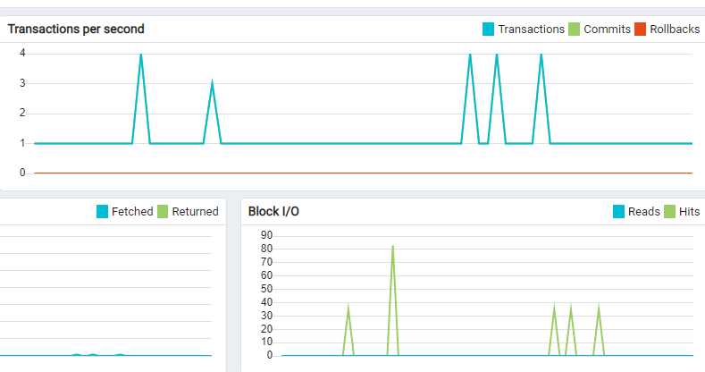

Программа выполнилась без ошибок. Теперь стоит немного разобраться с тем, что мы сделали, что такое **интерфейс Connection** и как он работает.

### Интерфейс Connection
Интерфейс Connection является элементом JDBC API и необходим нам для взаимодействия с БД. Мы его можем представить как **средство для создания сессий**. Он отвечает за физическое подключение к базе данных.

Улучшим предыдущий пример под PostgreSQL, написав теперь переменную интерфейса нормально, а также перепишем конструкцию *try-catch* как *try-with-resources*:

```java
import java.sql.Connection;
import java.sql.DriverManager;
import java.sql.SQLException;

public class Main {

    private static final String URL = "jdbc:postgresql://localhost/postgres?user=postgres&password=0000000";

    private static String conok="Соединение с бд установлено";
    private static String conerr="Произошла ошибка подключения к бд";

    public static void main(String[] args) {
        try (Connection connection = DriverManager.getConnection(URL)){
            System.out.println(String.format("%s",conok));
        } catch (SQLException e) {
            System.out.println(String.format("%s",conerr));
            e.printStackTrace();
        }
    }
}
```

При удачном подключении к БД появится строка в терминале, показывающая, что всё ок. А при неудачном подключении она покажет, что подключение не прошло и в чем возможная причина. Например, если поменять пароль на несуществующий:

```cmd
Произошла ошибка подключения к бд
org.postgresql.util.PSQLException: ВАЖНО: пользователь "postgres" не прошёл проверку подлинности (по паролю) (pgjdbc: autodetected server-encoding to be windows-1251, if the message is not readable, please check database logs and/or host, port, dbname, user, password, pg_hba.conf)
	at org.postgresql.core.v3.ConnectionFactoryImpl.doAuthentication(ConnectionFactoryImpl.java:613)
```

Ну или попытаться подключиться к базе, которой нет:
```cmd
Произошла ошибка подключения к бд
org.postgresql.util.PSQLException: ВАЖНО: база данных "testpostgres" не существует (pgjdbc: autodetected server-encoding to be windows-1251, if the message is not readable, please check database logs and/or host, port, dbname, user, password, pg_hba.conf)
	at org.postgresql.core.v3.QueryExecutorImpl.receiveErrorResponse(QueryExecutorImpl.java:2553)
```

### Интерфейс Statement
После того как мы поняли, как создавать соединение с базой данных, логично было бы узнать, как можно выполнять в ней запросы. Интерфейс **Statement** позволяет делать запросы к БД, которые определены как константы, и не принимают никаких параметров.

Тут следует пояснить, что под константой имеется ввиду заранее определенная строка типа:

```java
String s = "SELECT * from testtable;";
```

Перед тем как использовать данный интерфейс для наших запросов к БД, нам нужно его создать. Для этого используем метод сonnection.createStatement(). Посмотрим, как он будет выглядеть в коде нашей программы:

```java
Statement statement = connection.createStatement();
```

И теперь, как уже говорили ранее — для того чтобы выполнить запрос, мы должны создать его как строковую константу:

```java
String sql = "SELECT * FROM test";
```

Ну и делаем запрос на выполнение:

```java
statement.execute(sql);
```

Но это немного некрасивый код, корректно будет сделать так:
```java
boolean isExecuted=statement.execute(sql);
if (isExecuted){
    System.out.println("SELECT executed");
}
```

Теперь при выполнении кода уже увидим следующее:

```cmd
Соединение с БД установлено корректно
SELECT executed
Process finished with exit code 0 
```

Прежде чем перейти дальше, обратите внимание на один важный момент. После того как мы выполним наш запрос, чтобы данные сохранились в базе, нам нужно использовать метод close().

```java
statement.close();
connection.close();
```

Создадим тестовую БД — testDB, а в ней тестовую таблицу — testTable:

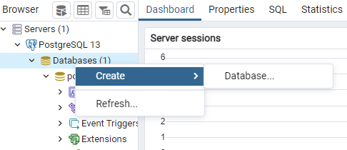

Добавляем таблицу:

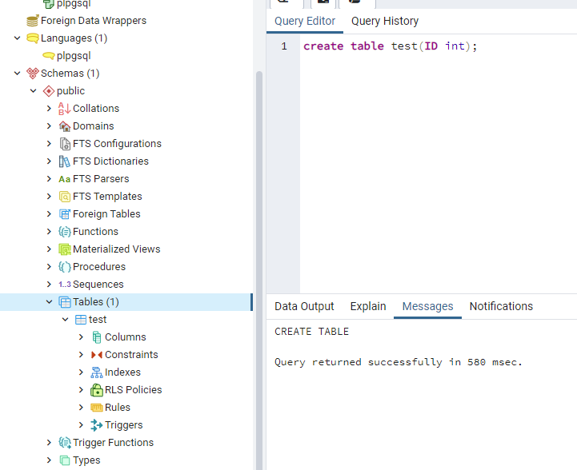

Добавляем в неё тестовые данные:
```sql
insert into test(id) values (2),(9),(10);
```

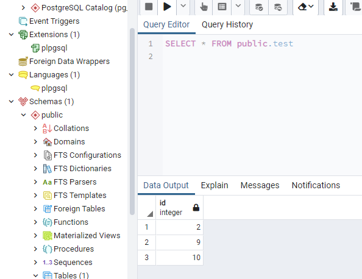

У интерфейса Statement для получения результатов существует три метода:
* boolean execute(String s);
* int executeUpdate(String s);
* ResultSet executeQuery(String s).

Первый, *boolean execute(String SQL)*, возвращает логический ответ true, если метод executeQuery может быть выполнен, в результате чего может быть получено значение ResultSet.

Второй, *int executeUpdate(String SQL)*, возвращает число. Это число показывает, на сколько столбцов в таблице повлиял наш запрос. При вызове с SELECT запросом выдаст ошибку:

```cmd
SQLException : Can not issue SELECT via executeUpdate() or executeLargeUpdate().
```

Третий, *ResultSet executeQuery(String SQL)*, возвращает объект **ResultSet** и используется для получения множества результатов, обычно с SELECT запросом.

Пример кода:
```java
ResultSet resultSet = statement.executeQuery(sql);
System.out.println("ID");
System.out.println("||------------||");
while (resultSet.next()){
   System.out.println(resultSet.getInt("ID"));
}
System.out.println("||------------||");

// Select executed
// ID
// ||------------||
// 2
// 9
// 10
// ||------------||
// Process finished with exit code 0
```

Кстати, также как для метода execute(), перед выходом нужно использовать метод close():

```java
statement.close();
resultSet.close();
connection.close();
```

### Интерфейсы PreparedStatement и CallableStatement
В случае, когда нам нужно передать в выражение какие-нибудь значения, и также требуется несколько раз вызывать один и тот же запрос, мы можем использовать метод PreparedStatement. Рассмотрим небольшой пример:

```java
int count = 2;
String SQL = "Select * from test WHERE id = ?;";
try (PreparedStatement preparedStatement = connection.prepareStatement(SQL)); {
    preparedStatement.setInt(1, count);
    ResultSet resultSet = preparedStatement.executeQuery();

    while (resultSet.next()) {
        System.out.println(resultSet.getInt("ID"));
    }
}
```

Знак вопроса **?** называется **маркером** и способен получать значение. Стоит заметить, что нумерация начинается с единицы, а не с нуля, как в обычных массивах.

Ещё один небольшой пример на добавление данных в таблицу (*таблицы не существует в PostgreSQL и пример скорее для того, чтобы посмотреть, как можно использовать маркеры*):

```java
int ourint = 3;
String ourname = "testname";

String sql = "Insert into test (id, name) Values (?, ?)";
PreparedStatement preparedStatement = connection.prepareStatement(sql);
preparedStatement.setInt(1, ourint);
preparedStatement.setSrting(2, ourname);
int rows = preparedStatement.executeUpdate();
System.out.println(rows + "Строк добавлено");
```

**PreparedStatement**, так же как и **Statement**, обладает методами **execute, executeUpdate, executeQuery**. И так же перед завершением работы с интерфейсом или БД нужно вызвать метод его закрытия **preparedStatement.close();**.

Интерфейс CallableStatement позволяет нашему приложению вызвать хранимую на сервере DB процедуру. Так же как и в PreparedStatement, с помощью маркеров мы можем определить операторы, но есть и отличие — мы можем использовать не только порядковое местоположение, но и указание по имени. Звучит, наверное, сложновато, но на примере сейчас станет понятно.

```java
String SQL= "{call ourpostgresqlProc(?,?,?)}"; 
// Создаем подключение
try(CallableStatement callableStatement = connection.prepareCall(SQL)){
// Добавляем три значения
   callableStatement.setInt(1, 123);
   callableStatement.setString(2, "name");
   callableStatement.setString(3, "surname");
// вызываем функцию, которая лежит у нас в базе
   callableStatement.executeUpdate();
}
```

Ну или в случае, когда мы знаем, как в процедуре называются наши переменные, мы можем обратиться к ним по имени:
```java
String SQL= "{call ourProc(?,?,?)}"; 
try (CallableStatement callableStatement = connection.prepareCall(SQL)){
   callableStatement.setInt("ID", 123);
   callableStatement.setString("NAME", "Ivan");
   callableStatement.setString("SURNAME", "Ivanov");
   callableStatement.executeUpdate();
   callableStatement.close();
}
```

В пакете java sql мы используем методы, часть из которых требует закрытия **close()**, а часть — нет.

|Методы|Описание|Требуется закрытие?|
|---|---|---|
|DriverManager|Подключение драйвера|–|
|Connection|Создание сессии|+|
|Statement|Для вызова статических запросов|+|
|PreparedStatement|Для вызова запросов с параметрами|+|
|CallableStatement|Для вызова функций|+|
|ResultSet|Множество ответов после выполнения запроса|–|

Стоит упомянуть, что конструкция *try-with-resources* имеет приоритет перед методом *close*.

### Практикум
В качестве практики мы создадим базу данных и попробуем к ней подключиться. После этого напишем небольшой код программы.

Но для начала надо определить, как мы скачиваем JDBC драйвер:

либо через Maven:
```xml
<dependencies>
    <dependency>
        <groupId>org.postgresql</groupId>
        <artifactId>postgresql</artifactId>
        <version>42.2.18</version>
    </dependency>
</dependencies>
```
либо скачиваем [тут](https://jdbc.postgresql.org/download/postgresql-42.2.18.jar):

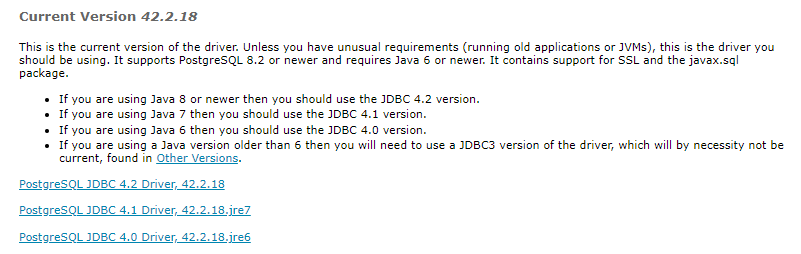

Создаём в нашем рабочем проекте директорию lib и перекладываем туда JAR-файл драйвера из архива. В директории нажимаем правой клавишей мыши и выбираем пункт Add as Library...

Итоговый код выглядит так в обоих случаях:

```java
import java.sql.Connection;
import java.sql.DriverManager;
import java.sql.SQLException;

public class Main {

   private static final String URL = "jdbc:postgresql://localhost/testDB?user=postgres&password=000000";
   private static String conok="Соединение с бд установлено";
   private static String conerr="Произошла ошибка подключения к бд";

   public static void main(String[] args) {
       try (Connection connection = DriverManager.getConnection(URL)){
           System.out.println(String.format("%s",conok));
       } catch (SQLException e) {
           System.out.println(String.format("%s",conerr));
           e.printStackTrace();
       }
   }
}
```
При попытке запустить получаем:

```cmd
Соединение с бд установлено
Process finished with exit code 0
```

## Выполнение запросов средствами JDBC
Давайте попробуем немного углубиться в интерфейс **PreparedStatement**. Мы уже знаем, что маркер **?** позволяет передавать различные переменные в запрос.

На примере мы рассмотрели методы **setInt** и **setString**, но это не все методы, также существуют и другие:

* setBigDecimal — похож на класс float, но имеет более гибкую настройку дробной части и используется для работы с финансами.
* setBoolean;
* setDate — используется для передачи даты, имеет примерно такую конструкцию: setDate(2, new java.sql.Date(System.currentTimeMillis()));
* setDouble;
* setFloat;
* setLong;
* setNull — устанавливает null значение для необходимой нам ячейки, так как если попробовать передать через setInt(1,j), притом ранее мы определим j=null, то возникнет ошибка: s.setNull(10, java.sql.Types.INTEGER);
* setTime — используется как и date, но для передачи времени.

Так как PreparedStatement наследует Statement, он тоже имеет 3 метода для выполнения запроса:

* **boolean execute()**, можно выполнить на любом запросе и он вернёт результат, выполнится ли запрос.
* **ResultSet executeQuery()** выполняет **select** запрос и возвращает искомое множество в виде **resultset** переменной.
* **int executeUpdate()** создан для того, чтобы выполнять **create**, **insert**,**update** и **delete** запросы. Возвращает количество измененных строк.

Стоит сказать, что устанавливать значения параметров не в момент составления запроса, а в момент его выполнения, очень удобно.

```
Интересно знать, что количество маркеров в одном запросе не бесконечно и имеет ограничение в две тысячи.
```
```cmd
Caused by: java.sql.SQLException: Prepared or callable statement has more than 2000 parameter markers.
       at net.sourceforge.jtds.jdbc.SQLParser.parse(SQLParser.java:1139)
       at net.sourceforge.jtds.jdbc.SQLParser.parse(SQLParser.java:156)
       at net.sourceforge.jtds.jdbc.JtdsPreparedStatement.<init>(JtdsPreparedStatement.java:107)
Caused by: java.sql.SQLException: Prepared or callable statement has more than 2000 parameter markers.
```

А теперь немного о том, почему стоит использовать **PreparedStatement** вместо **Statement**.

Метод Statement складывает строки значений и строки запроса. А вот **PreparedStatement** имеет по сути шаблон запроса, и данные в него вставляются с учётом кавычек. Данный метод позволяет защититься от SQL инъекций.

Рассмотрим на простом примере. Есть у нас такая таблица:

```
+-----------+----+--------+
| user      | id |password|
+-----------+----+--------+
| admin     |  1 |  admin |
| user      |  2 |  pass  |
| guest     |  3 |  guest |
+-----------+----+--------+
```

В таблице 3 столбца: имя пользователя, его id и его пароль. Сделаем запрос пользователя в программе.

Значения user.name и user.pass определяем заранее и передаем в нашу программу через консоль:
```
enter user : admin
enter password : admin
```

```java
String query = "SELECT user, id, password FROM users WHERE user='" + user.name + "' AND password = '" + user.pass + "'";
System.out.println(query);
ResultSet resultSet = statement.executeQuery(query);

while (resultSet.next()) {
    System.out.println("User: id=" + resultSet.getInt("id") +
        "name=" + resultSet.getString("user") +
        "password=" + resultSet.getString("password"));

}
```
Ответ программы будет таким:
```java
User: id=1 name=admin pass=admin
```

Итоговый запрос в базу данных будет выглядеть следующим образом:
```sql
select user, id, password 
from users 
where user = 'admin' and password ='admin';
```

Если комбинация логин и пароль не совпадают с теми, что указаны, то и данные о пользователе мы не получим.

Теперь попробуем немного изменить имя и пароль.
```
enter user : admin
enter password : nevermind' or '1' = '1
```

Пробуем запустить программу. Что мы видим в качестве результата?
```java
User: id=1 name=admin password=admin
User: id=2 name=user password=user
User: id=3 name=guest password=guest
```

Несмотря на неверный пароль, запрос выдал результат. Притом выдал вообще все данные по пользователям с паролями. Стоит более детально разобраться в логике нашего запроса, который мы передали на сервер:

```sql
select user, id, password 
from users 
where user = 'admin' and password = 'nevermind' or '1' = '1';
```

Логика итогового запроса подсказывает, что нам нужно выбрать из таблицы users строки, у которых значение поля user равно admin, значение поля password равно nevermind, или если один равно одному. Очевидно, что при переборе всех строк и сравнении значений с условиями, логин и пароль могут не совпадать, а вот один всегда равно одному для каждой строки, поэтому в результирующей выборке будут содержаться все строки таблицы users.

Давайте попробуем теперь заменить в коде метод Statement на PreparedStatement. Код при этом меняется не сильно:

```java
String query = "SELECT user, id, password FROM users WHERE user=? AND password=?";
try(PreparedStatement statement = connect.prepareStatement(query)){
    statement.setString(1, user.name);
    statement.setString(2, user.pass);
    System.out.println(statement);
    ResultSet resultSet = statement.executeQuery();
}
```

А вот результат отличается более чем. Понятно, что при правильном логине и пароле вернутся правильные значения. Давайте лучше рассмотрим пример SQL-инъекции. Передаём в консоли:

```
enter user : admin
enter password : nevermind' or '1' = '1
```

И ответа в консоль не приходит, так как логин и пароль не совпадают. Ну и чтобы понять, что произошло, следует посмотреть на итоговый запрос к базе данных:

```sql
SELECT user, id, pass 
FROM users 
WHERE user=admin
AND password='nevermind\' or\'1\'=\'1';
```

То есть метод setString экранировал кавычки, и пользователя с паролем nevermind\' or\'1\'=\'1 действительно не оказалось. Как подытог можно сказать, что лучше использовать метод PreparedStatement вместо Statement, и крайне внимательно относиться к данным в Statement.

Инициализация метода PreparedStatement крайне простая. Мы уже видели в примерах выше, как это выглядело. Вот минимальная конструкция:

```java
try (Connection connection = DriverManager.getConnection(url, username, password)) {
    String SQL = "Select * from test;";
    try (
        PreparedStatement preparedStatement = connection.prepareStatement(SQL)
    ) {}
}
```

Также можно после выполнения действий переинициализировать интерфейс, вначале закрыв его методом close(), а потом заново создав через connection.prepareStatement(SQL), но до выполнения метода connection.close().

Инициализация параметров (setInt(1,1), например) также была в нескольких примерах выше. Выполняется всегда после connection.prepareStatement(SQL) и перед preparedStatement.executeQuery(), ну или аналогичных методов запуска execute(), executeUpdate().

Интерфейс ResultSet представляет собой итоговый набор данных. Доступ к нему осуществляется построчно. Доступ к данным в нём происходит благодаря набору get методов, а переход к следующей строке происходит через метод next().

**Полученный набор ResultSet можно не закрывать методом close(), это делается родительским элементом preparedStatement, или если начинает использоваться повторно.*

Метод wasNull() возвращает true, если в последнем считанном столбце было SQL NULL значение. Этот момент следует объяснить более детально. Считывание происходит в момент вызова get-метода. Например, есть условная БД:

```sql
select * from test;
+------+
| ID   |
+------+
|    2 |
|    9 |
|   10 |
| NULL |
|    0 |
+------+
5 rows in set (0.00 sec)
```

Перебор классический построчный while (resultSet1.next()){}. Так вот, допустим, стоит такая задача — вывести в консоль результаты БД, а так как resultSet1.getInt("ID"), если наткнется на null, значение станет равным 0 и поменяет флаг в wasNull() на true.

Поэтому логично было в таком случае не сразу выводить System.out.println(resultSet1.getInt("ID"));, а с каким то промежуточным шагом, как показано ниже:

```java
while (resultSet1.next()){
   int i = resultSet1.getInt("ID");
   if (resultSet1.wasNull()){
      System.out.println("NULL");
   } else {
      System.out.println(i);
   }
}
```

Кстати, в различные get-методы возвращают различные null-значения:

* fasle в методе getBoolean;
* 0 в методах getByte, getShort, getInt, getLong, getFloat, и getDouble;
* null — во всех остальных случаях getString, getBigDecimal, getBytes, getDate, getTime, getTimestamp, getAsciiStream, getUnicodeStream, getBinaryStream, getObject.

Также помимо уже известного метода навигации next() существует ещё ряд методов:

|Метод|	Описание|
|---|---|
|beforeFirst()|	Перемещает указатель на место перед первым рядом.|
|afterLast()|	Перемещает указатель на место после крайнего ряда.|
|first()|	Перемещает указатель на первый ряд.|
|last()|	Перемещает указатель на крайний ряд.|
|previous()|	Перемещает указатель на предыдущий ряд. Возвращает false, если предыдущий ряд находится за пределами множества результатов.|
|next()|	Перемещает указатель на следующий ряд. Возвращает false, если следующий ряд находится за пределами множества результатов.|
|absolute (int| row)	Перемещает указатель на указанный ряд.|
|relative (int| row)	Перемещает указатель на указанное количество рядов от текущего.|
|getRow()|	Возвращает номер ряда, на который в данный момент указывает курсор.|
|moveToInsertRow()|	Перемещает указатель на ряд в полученном множестве, который может быть использован для того, чтобы добавить новую запись в БД. Текущее |положение указателя запоминается.
|moveToCurrentRow()|	Возвращает указатель обратно на текущий ряд в случае, если указатель ссылается на ряд, в который в данный момент добавляются данные.|

Когда мы немного разобрались с тем, что и как перемещается по БД средствами JDBC, самое время понять, как правильно формировать список всех сущностей БД.

Тут тоже ничего сложного нет. Так как считывание результатов происходит построчно, то каждая новая сущность — это строка, а каждый столбец в этой строке — это атрибут сущности.

В плане кода это тоже будет выглядеть просто. Создаем перед началом работы лист объектов. ```List<LoadModel> data```, где LoadModel выглядит так:

```java
public class LoadModel {
    int i;
}
```

Итоговый код выглядит так:
```java
import java.sql.*;
import java.util.ArrayList;
import java.util.List;

public class Main
{
    private  final static String  HOST     = "localhost";  // сервер базы данных
    private  final static String  DATABASENAME = "testDB"; // имя базы
    private  final static String  USERNAME = "postgres";   // учетная запись пользователя
    private  final static String  PASSWORD = "000000";     // пароль
    public  static void main(String[] args)
    {
        List<LoadModel> data = new ArrayList<>();
        String url="jdbc:postgresql://"+HOST+"/"+DATABASENAME+"?user="+USERNAME+"&password="+PASSWORD;
        try (Connection connection = DriverManager.getConnection(url, USERNAME, PASSWORD)) {
            if (connection == null)
                System.err.println("Нет соединения с БД!");
            else {
                System.out.println("Соединение с БД установлено корректно");
                String SQL = "Select * from test;";
                //Запрос на получение всех данных
                try (PreparedStatement preparedStatement = connection.prepareStatement(SQL)) {
                    try (ResultSet resultSet = preparedStatement.executeQuery()) {
                        while (resultSet.next()) {
                            int i = resultSet.getInt("ID");
                            if (resultSet.wasNull()) {
                                System.out.println("NULL");
                            } else {
                                System.out.println(i);
                            }
                            //Добавляем каждый полученный элемент в наш лист
                            LoadModel loadModel = new LoadModel();
                            loadModel.i = i;
                            data.add(loadModel);
                        }
                    }
                }
            }
        } catch (SQLException throwables) {
            throwables.printStackTrace();
        }
    }
}
```

### Практикум
Создадим простой метод для взаимодействия с БД: 

```java
public static boolean checkvalue(int checkedvalue) {
    String SQL = "Select * from test where ID=?;";
    try (PreparedStatement statement = connection.prepareStatement(SQL)) {
        statement.setInt(1, checkedvalue);
        ResultSet resultSet = statement.executeQuery();
        while (resultSet.next()) {
            return true;
        }
    } catch (SQLException throwables) {
        throwables.printStackTrace();
        return false;
    }
    return false;
}
```

Данный запрос выводит все строки, где есть искомое число с клавиатуры. Весь код будет выглядеть так:
```java
package main.java;

import java.sql.*;
import java.util.Scanner;

public class Main {
    private  final static String  HOST     = "localhost"  ; // сервер базы данных
    private  final static String  DATABASENAME = "testDB"  ;// имя базы
    private  final static String  USERNAME = "postgres"; // учетная запись пользователя
    private  final static String  PASSWORD = "000000"; // пароль пользователя
    static Connection connection;

    public static void main(String[] args){

        //Строка для соединения с бд
        String url="jdbc:postgresql://"+HOST+"/"+DATABASENAME+"?user="+USERNAME+"&password="+PASSWORD;
        try {
            connection = DriverManager.getConnection(url, USERNAME, PASSWORD);
             if (connection == null)
                System.err.println("Нет соединения с БД!");
             else {
                 System.out.println("Соединение с БД установлено корректно");
                 if(checkvalue(new Scanner(System.in).nextInt())){
                     System.out.println("Число есть в таблице");
                 }else{
                     System.out.println("Число отсутствует в таблице");
                 }
             }

        } catch (ClassNotFoundException | SQLException e) {
            e.printStackTrace();
        }
    }
    public static boolean checkvalue(int checkedvalue){
        String SQL = "Select * from test where ID=?;";
            try(PreparedStatement statement = connection.prepareStatement(SQL)){
            statement.setInt(1, checkedvalue);
            ResultSet resultSet = statement.executeQuery();
            while (resultSet.next()) {
                return true;
            }
            } catch (SQLException throwables) {
                throwables.printStackTrace();
                return false;
            }
        return false;
    }
}
```

```
Соединение с БД установлено корректно
11
Число отсутствует в таблице

Process finished with exit code 0

Соединение с БД установлено корректно
10
Число есть в таблице

Process finished with exit code 0
```

Всё корректно, наш метод работает.


## Изменение данных средствами JDBC
### Вставка и обновление данных

Вставка в БД происходит посредством использования insert запросов. Хм. Ранее мы рассматривали момент вставки через prepareStatement. Рассмотрим теперь случай, когда нам нужно изменить данные в нашей таблице.

Первый случай изменения данных — это изменение структуры таблицы. Имеем всю ту же таблицу. Добавим в неё ещё один столбец:
```java
import java.sql.*;
public class Main 
{
        private final static String HOST = "localhost"; // сервер базы данных
             private final static String DATABASENAME = "testDB"; // имя базы
             private final static String USERNAME = "postgres"; // учетная запись пользователя
             private final static String PASSWORD = "000000"; // пароль
             public static void main(String[] args) 
             {
                String url = "jdbc:postgresql://" + HOST + "/" + DATABASENAME + "?user=" + USERNAME + "&password=" + PASSWORD;
                try (Connection connection = DriverManager.getConnection(url, USERNAME, PASSWORD)) {
                        if (connection == null)
                                System.err.println("Нет соединения с БД!");
                        else {
                                System.out.println("Соединение с БД установлено.");
                                String SQL = "ALTER TABLE test ADD name varchar(255);"; // Добавление столбца name
                                try (PreparedStatement preparedStatement = connection.prepareStatement(SQL)) 
                                {
                                        preparedStatement.executeUpdate();
                                }
                        }
                } catch (SQLException throwables) {
                        throwables.printStackTrace();
                }
        }
}
```

Сам запрос:
```sql
ALTER TABLE test ADD COLUMN name varchar(255);
```

В итоге в таблице видим:

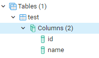

Изменим запрос так, чтобы добавить имя пользователя под ID = 9;.
Весь код будет таким же, кроме строки SQL-запроса:

```java
String SQL = "UPDATE test set name='Nick' where ID=9;";
```

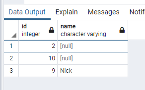

### Управление транзакцией средствами интерфейса Connection
Когда мы работаем с JDBC в обычном режиме, все SQL-запросы будут выполнены, а результаты выполнения сохранены. Такой режим работы называется **auto-commit**.

Если наше приложение небольшое, то это очень удобная модель. Но если нам нужно увеличить производительность, или требуется использовать бизнес-логику, то такой режим необходимо отключить, **для того чтобы обрабатывать запросы поблочно**. Ну, и по правилам транзакции, если один запрос из блока не пройдёт, то отменяется весь блок.

Доступ к управлению транзакциями JDBC в коде можно получить с помощью команды:

```java
connection.setAutoCommit(false); 
```

Теперь после использования ряда SQL-запросов, чтобы наши данные сохранились, надо использовать метод commit():

```java
connection.commit();
```

Если мы обнаружим, что какой-то из запросов не прошел (нам вернулась ошибка), то нужно откатить транзакцию методом rollback():

```java
connection.rollback();
```

Пример ошибки:
```java
package main.java;

import java.sql.*;

public class Main {
   private  final static String  HOST     = "localhost"  ; // сервер базы данных
    private  final static String  DATABASENAME = "testDB"  ;// имя базы
    private  final static String  USERNAME = "postgres"; // учетная запись пользователя
    private  final static String  PASSWORD = "000000"; // пароль
    static Connection connection;

    public static void main(String[] args) throws SQLException {

        //Строка для соединения с бд
        String url="jdbc:postgresql://"+HOST+"/"+DATABASENAME+"?user="+USERNAME+"&password="+PASSWORD;
        try {
            connection = DriverManager.getConnection ( url, USERNAME, PASSWORD);
            connection.setAutoCommit(false);
            if (connection == null) {
                System.err.println("Нет соединения с БД!");
            }
            else {
                System.out.println("Соединение с БД установлено корректно");
            }

            String SQL = "ALTER TABLE test ADD user varchar(255);";
            //Запрос на получение всех данных
            try (PreparedStatement preparedStatement = connection.prepareStatement(SQL)) {
                preparedStatement.executeUpdate();
                connection.commit();
                System.out.println("Транзакция прошла");
            }
        } catch (ClassNotFoundException | SQLException e) {
            connection.rollback();
            System.err.println("Транзакция не прошла");
            e.printStackTrace();
        }
    }
}
```

Можем увидеть ошибку в терминале.
```cmd
Соединение с БД установлено корректно
Транзакция не прошла
java.sql.SQLSyntaxErrorException: Duplicate column name 'user'
```
Ошибка говорит о том, что нельзя добавить столбец с названием user, так как уже такой есть.

Если мы используем JDBC 3.0 и выше, мы можем использовать сэйвпоинты (savepoint) и откатываться до них, а не целиком откатывать всю транзакцию.

Есть два метода для управления ими:

* Savepoint savePoint = connection.setSavepoint("MysavePoint"); — устанавливает точку сохранения.
* releaseSavepoint(Savepoint savePoint); — удаляет точку сохранения.

Для того чтобы откатить транзакцию до точки сохранения, можно использовать такую конструкцию:

```java
connection.rollback(savePoint);
```

### Batch processing, метод addBatch
**Batch processing**, а именно пакетная обработка, позволяет значительно сократить нагрузку на БД, накапливая SQL и отправляя их в БД одной пачкой (пакетом).

Чтобы включить такую обработку, необходимо использовать метод *DatabaseMetaData.supportBatchUpdates()*. Данный метод возвращает *true*, если наш JDBC драйвер способен так делать

Интерфейсы (*Statement*, *PrepparedStatement* и *CallableStatement*), через которые мы создавали запросы, имеют метод *addBatch()*, который добавляет каждый SQL-запрос в пакет.

После добавления мы используем метод *executeBatch()*, который выполняет все наши запросы. После использования метод возвращает массив с целыми числами, где каждое число сопоставляется с каждым нашим запросом и является показателем изменений.

Также мы можем удалять запросы из пакета методом *clearBatch()*. Стоит учитывать, что отдельные запросы из пакета мы удалить не можем. Всё или ничего.

Есть простой алгоритм создания пакета:

1. Выключить функцию **auto-commit** ```connection.setAutoCommit(false);```.
1. Создать *PreparedStatement*.
1. С помощью метода *addBatch()* добавить все наши запросы.
1. Запустить выполнение запросов методом *executeBatch()*.
1. Сохранить все изменения с помощью метода **connection.commit();**.

Небольшой пример кода.

Есть исходная таблица:
```sql
+------+------+
| ID   | user |
+------+------+
|    2 | NULL |
|    9 | Nick |
|   10 | NULL |
| NULL | NULL |
|    0 | NULL |
|   15 | NULL |
+------+------+
6 rows in set (0.00 sec)
```

Код целиком:
```java
package main.java;
import java.sql.*;
public class Main {
    private final static String HOST = "localhost"; // сервер базы данных
    private final static String DATABASENAME = "testDB"; // имя базы
    private final static String USERNAME = "postgres"; // учетная запись пользователя
    private final static String PASSWORD = "000000"; // пароль
    static Connection connection;
    public static void main(String[] args) throws SQLException {
        //Строка для соединения с бд
        String url = "jdbc:postgresql://" + HOST + "/" + DATABASENAME + "?user=" + USERNAME + "&password=" + PASSWORD;
        connection = DriverManager.getConnection(url, USERNAME, PASSWORD);
        try {
            connection.setAutoCommit(false); //2
            if (connection == null)
                System.err.println("Нет соединения с БД!");
            else {
                System.out.println("Соединение с БД установлено корректно");
            }
            String SQL = "Insert into test(ID,user) VALUES(?,?);";
            //Запрос на получение всех данных
            try (PreparedStatement preparedStatement = connection.prepareStatement(SQL)) { //1
                //Часть кода, в котором мы добавляем несколько запросов для одной отправки данных
                preparedStatement.setInt(1, 10);
                preparedStatement.setString(2, "Olaf");
                preparedStatement.addBatch();   //3

                preparedStatement.setInt(1, 11);
                preparedStatement.setString(2, "Erik");
                preparedStatement.addBatch();   //3

                preparedStatement.setInt(1, 12);
                preparedStatement.setString(2, "Baleog");
                preparedStatement.addBatch();   //3

                int[] count = preparedStatement.executeBatch(); //4
                connection.commit();    //5
                System.out.println("Данные отправлены");
            }
        } catch (ClassNotFoundException | SQLException e) {
            connection.rollback();
            System.err.println("Данные не добавлены");
            e.printStackTrace();
        }
    }
    public static boolean checkvalue(int checkedvalue) {
        String SQL = "Select * from test where ID=?;";
        try (PreparedStatement statement = connection.prepareStatement(SQL)) {
            statement.setInt(1, checkedvalue);
            ResultSet resultSet = statement.executeQuery();
            while (resultSet.next()) {
                return true;
            }
        } catch (SQLException throwables) {
            throwables.printStackTrace();
            return false;
        }
        return false;
    }
    public static boolean insertvalue(int insertedvalue) {
        String SQL = "insert  test(id) values(?)";
        try (PreparedStatement statement = connection.prepareStatement(SQL)) {
            statement.setInt(1, insertedvalue);
            int i = statement.executeUpdate();
            if (i >= 1) {
                return true;
            } else {
                return false;
            }
        } catch (SQLException throwables) {
            throwables.printStackTrace();
            return false;
        }
    }
}
```

Результат:
```cmd
Соединение с БД установлено корректно
Данные отправлены

Process finished with exit code 0
```

```sql
select * from test;
+------+--------+
| ID   | user   |
+------+--------+
|    2 | NULL   |
|    9 | Nick   |
|   10 | NULL   |
| NULL | NULL   |
|    0 | NULL   |
|   15 | NULL   |
|   10 | Olaf   |
|   11 | Erik   |
|   12 | Baleog |
+------+--------+
9 rows in set (0.00 sec)
```

## Эволюционное изменение БД
Основной задачей баз данных является **хранение данных реального мира**. Обычно разработчик старается максимально упорядочить информацию по каким-либо признакам для более удобного поиска. И чтобы поиск был быстрым или, например, можно было производить поиск по нескольким параметрам, БД должна быть очень хорошо *структурирована*.

При интенсивном использовании БД и попутной разработке программы возникает момент, когда какие-либо данные в БД нам уже не нужны, а какие-то наоборот нужно добавить и начать использовать. В ходе этого процесса старые версии приложения могут перестать корректно работать. Возникает вопрос **централизованного управления версией**, и эту проблему версий БД нужно как-то решать.

В принципе, изменение базы данных и является её эволюцией. Есть четыре пункта, отвечающие за ее изменение:

* изменение данных;
* изменение схемы;
* изменение версии программы взаимодействия;
* трансформация модели представления.

Есть такая библиотека — **Flyway**, она нужна для управления миграцией и эволюцией баз данных. Она полностью решает проблему версий любой БД.

Чтобы воспользоваться этой библиотекой, вам нужно создать новый проект под Maven и добавить строчки зависимости в pom.xml файл (файл загрузок всего проекта):

```xml
<dependency>
    <groupId>com.googlecode.flyway</groupId>
    <artifactId>flyway-core</artifactId>
    <version>1.5</version>
</dependency>
```

```xml
<plugin>
   <groupId>org.flywaydb</groupId>
   <artifactId>flyway-maven-plugin</artifactId>
   <version>6.5.5</version>
   <configuration>
      <url>jdbc:postgresql://localhost/flywaytest?autoReconnect=true&amp;useUnicode=true&amp;characterEncoding=UTF-8&amp;connectionCollation=utf8_general_ci&amp;characterSetResults=UTF-8</url>
      <user>root</user>
      <password>root</password>
   </configuration>
</plugin>
```

Далее для поддержания версионности (чтобы библиотека начала работать с нашей базой данных) необходимо запустить строку с консоли:

```cmd
mvn flyway:baseline -Dflyway.baselineVersion=1 -Dflyway.baselineDescription="Base version"
```

В консоли происходит примерно следующее:
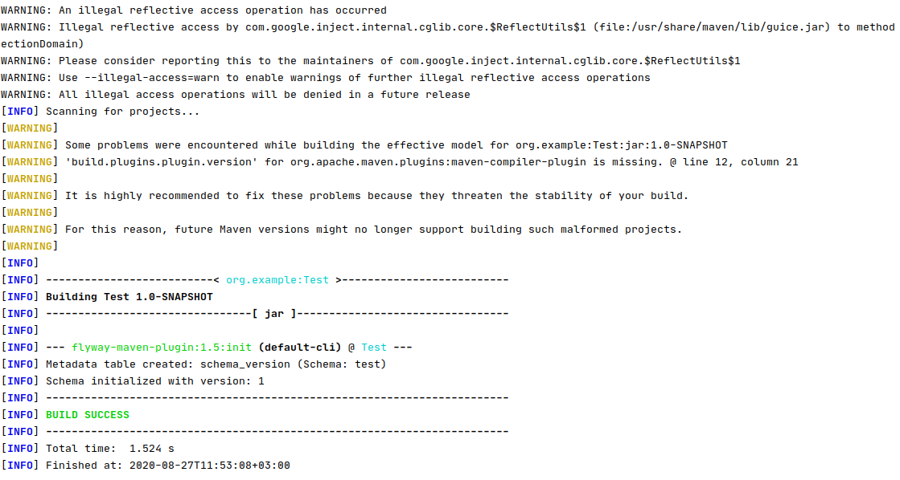

А в базе данных появилась ещё таблица, отвечающая за контроль версий:

```sql
use test;
Reading table information for completion of table and column names
You can turn off this feature to get a quicker startup with -A

Database changed
show tables;
+----------------+
| Tables_in_test |
+----------------+
| schema_version |
| test           |
+----------------+
2 rows in set (0.00 sec)
```

```sql
select * from schema_version;
+---------+--------------+------+--------------+----------+--------------+---------------------+----------------+---------+-----------------+
| version | description  | type | script       | checksum | installed_by | installed_on        | execution_time | state   | current_version |
+---------+--------------+------+--------------+----------+--------------+---------------------+----------------+---------+-----------------+
| 1       | Base version | INIT | Base version |     NULL | root         | 2020-08-27 11:53:08 |              0 | SUCCESS |               1 |
+---------+--------------+------+--------------+----------+--------------+---------------------+----------------+---------+-----------------+
1 row in set (0.00 sec)
```

Внутри содержатся данные (действия, которые происходили с базой, как-то её изменяя) о версии.

Создадим теперь файл, содержащий данные о схеме таблицы, сама таблица будет создана автоматически. Путь по умолчанию, в котором должны лежать наши скрипты /src/main/resources/db/migration/.

Создадим файл V0_0_00__create_table.sql. Важный момент: начало имени файла V и двойной нижний слэш обязательны, без них Flyway игнорирует файлы.

```sql
CREATE TABLE IF NOT EXISTS second_test_table (
  id INT NOT NULL, 
  name varchar(50) NOT NULL, 
  surname varchar(50) NOT NULL, 
  PRIMARY KEY (id)
);
```

Создадим файл V0_0_00__create_table.sql для заполнения таблицы.
```sql
INSERT INTO second_test_table (id, name, surname) 
VALUES (1, 'Tester', 'Testerov');
```

Теперь нам необходимо перейти в раздел плагина для Maven и запустить миграцию:

* для начала очистим всё;
* используем flyway:clean;
* а потом flyway:migrate.

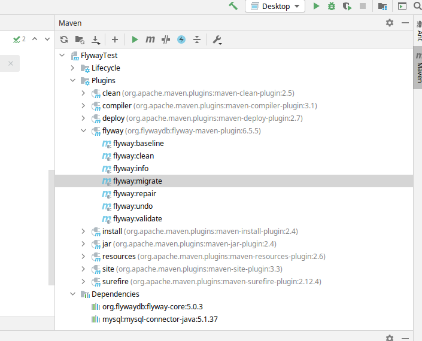

После запуска видим сообщения в терминале:
```cmd
[INFO] Scanning for projects...
[INFO] 
[INFO] -----------------------< org.example:FlywayTest >-----------------------
[INFO] Building FlywayTest 1.0-SNAPSHOT
[INFO] --------------------------------[ jar ]---------------------------------
[INFO] 
[INFO] --- flyway-maven-plugin:6.5.5:migrate (default-cli) @ FlywayTest ---
[INFO] Flyway Community Edition 6.5.5 by Redgate
[INFO] Database: jdbc:postgresql://localhost:3306/flywaytest
[INFO] Successfully validated 2 migrations (execution time 00:00.021s)
[INFO] Creating Schema History table `flywaytest`.`flyway_schema_history` ...
[INFO] Current version of schema `flywaytest`: << Empty Schema >>
[INFO] Migrating schema `flywaytest` to version 0.0.00 - create table
[INFO] Migrating schema `flywaytest` to version 0.0.01 - insert data
[INFO] Successfully applied 2 migrations to schema `flywaytest` (execution time 00:00.082s)
[INFO] ------------------------------------------------------------------------
[INFO] BUILD SUCCESS
[INFO] ------------------------------------------------------------------------
[INFO] Total time:  1.014 s
[INFO] Finished at: 2020-09-16T14:41:02+03:00
[INFO] ------------------------------------------------------------------------
```

Переходим в нашу базу и смотрим, что там появилось:
```sql
select * from second_test_table;
+----+--------+----------+
| id | name   | surname  |
+----+--------+----------+
|  1 | Tester | Testerov |
+----+--------+----------+
1 row in set (0.00 sec)
```

В итоге мы создали базу версии 0.0.01. Стоит отметить, что вначале выполняется файл с именем V0_0_00, а потом уже V0_0_01.

## Прочие средства взаимодействия с БД
### ORM
**ORM** (*Object-Relational Mapping*) — это технология, благодаря которой можно провести связь между базой данных и объектно-ориентированным языком программирования. В итоге получается виртуальная объектная база данных. Со стороны программиста логично, что база данных должна хранить данные, если данные — это объект, то она должна хранить объекты «без лишних заморочек». Также ORM позволяет избежать написания большого куска однообразного кода. В принципе, у такого подхода можно найти свои плюсы и минусы.

**Плюсы**:

* Наличие схемы базы данных в коде программы (ну или другом месте, например, в конфигурационных файлах), благодаря чему она хранится в одном месте и её удобно редактировать.
* Возможно управлять моделями ООП, а не элементами базы данных.
* Наличие автоматических SQL-запросов
* Код, созданный через ORM, написан достаточно оптимально
* Разработка идёт на порядок быстрее.

**Минусы**:

* Достаточно большая нагрузка на программиста, которому помимо ООП и БД нужно знать промежуточный уровень ORM.
* Ошибки, которые крайне трудно исправить, если они допущены в самой ORM.
* ORM рассчитаны на большие системы и использование их в небольших проектах зачастую замедляет работу программ.

### Spring JDBC Template
Главная задача Spring JDBC Template — это упростить логику. В Spring имеется стандартный класс JDBCTemplate для работы. Пример такого упрощения с использованием JDBC Template можно увидеть ниже:

```java
@Configuration
@ComponentScan("com.test.jdbc")
public class SpringJdbcConfig {
    @Bean
    public DataSource postgresqlDataSource() {
        DriverManagerDataSource dataSource = new DriverManagerDataSource();
        dataSource.setUrl("jdbc:postgresql://localhost:3306/test");
        dataSource.setUsername("root");
        dataSource.setPassword("root");
        return dataSource;
    }
}
```

Без Spring JDBC данная конструкция выглядела бы так:
```java
import java.sql.*;
import java.util.ArrayList;
import java.util.List;

public class Main
{
       public  static void main(String[] args)
    {
        List<LoadModel> data = new ArrayList<>();
        String url  = "jdbc:postgresql://localhost/test";
        try ( Connection connection = DriverManager.getConnection(url, "root", "root")) {
        } catch (SQLException throwables) {
            throwables.printStackTrace();
        }
    }
}
```

Данный компонент для подключения к нашей БД написан с использованием Spring JDBC:

```java
int result = jdbcTemplate.queryForObject("select count(*) from test", Integer.class);
```

Достаточно простой запрос вернёт количество строк в нашей таблице:
```java
public int addID(int id) {
    return jdbcTemplate.update("insert into test values (?)", id);
}
```

На примере видно, как Spring JDBC позволяет выполнить запрос всего в «три» строчки.

Ещё один простой запрос на добавление данных в таблицу. Знаки ? работают так же маркерами, как и в PrepareStatement.

JdbcTemplate обладает удобными средствами маппирования. И, так же как JDBC, может создавать пакеты SQL- запросов. Более подробная информация по тому, как это можно сделать [тут](https://www.baeldung.com/spring-jdbc-jdbctemplate).

### Hibernate
Также достаточно популярный фреймворк для решения задач ORM. И, как большинство ORM, предоставляет всё те же возможности. Удобный маппинг результатов, быстрая разработка. Hibernate позволяет создавать CRUD (Create,Read,Update,Delete) приложения.

Hibernate обеспечивает отображение классов Java в таблицы баз данных. Кроме того, он предоставляет средства запроса и поиска данных. Это может значительно сократить время разработки, которое в противном случае тратится на ручную обработку данных в SQL и JDBC. Использование Hibernate состоит из двух частей: сохранение объектов в базу и чтение объектов из базы.

Официальная документация [тут](https://hibernate.org/orm/documentation/5.4/).

### Spring Data
**Spring Data JPA** упрощает разработку JPA-приложений.

Реализует слой доступа к данным, который может быть достаточно громоздким. Spring Data JPA призван улучшить реализацию доступа к данным. Как разработчик вы пишете интерфейс репозитория, а также свои собственные методы для поиска, а Spring их автоматически реализует.

Пример документации [тут](https://spring-projects.ru/guides/accessing-data-jpa/).


# Модуль 23. Обзор NoSQL
## NoSQL как подход к разработке систем хранения данных

Из предыдущих занятий мы узнали, что существует два основных подхода к базам данных: реляционные и нереляционные, **SQL** и **NoSQL**. Различия между ними заключаются в том, как они спроектированы, какие типы данных поддерживают, как хранят информацию.

Мы уже знаем что реляционные БД хранят данные, которые представляют объекты реального мира, например, имена и фамилии, банковские счета, перечень продуктов на складе. *Это обычно данные, собранные в виде таблиц*.

А нереляционные БД устроены по другому. Например, в документоориентированных БД информация хранится в виде JSON-моделей. Тут идёт речь о том, что *у одного объекта произвольный набор атрибутов*.

Внутреннее устройство различных систем управления базами данных влияет на особенности работы с ними. Например, нереляционные базы лучше поддаются масштабированию. Ключевым фактором развития нереляционных БД стал планомерный рост объема баз данных, в связи с этим появилась проблема быстрого доступа к ним. И на фоне этого появилась концепция новой модели БД, которая будет больше нацелена на **скорость доступа и масштабируемость**.

В реляционных базах данных разработчики сосредоточились на выполнении по принципам модели **ACID** (**Atomicity** — атомарность, **Consistency** — согласованность, **Isolation** — изолированность, **Durability** — стойкость).

Модель базы данных NoSQL не использует высокоструктурированную модель (подобную той, что используется в реляционных базах данных), а использует *гибкий подход* ключ/хранилище значений. Этот неструктурированный подход к данным требует альтернативы модели ACID: модель BASE. Модель **BASE** не расшифровывается, так как термин был противопоставлен классической системе ACID. С английского ACID — кислота, BASE — щелочь.

**Существует четыре основных принципа модели ACID**

* Атомарность транзакций гарантирует, что каждая транзакция базы данных является единым блоком. Если какой-либо шаг в транзакции не выходит, вся транзакция откатывается.
* Реляционные базы данных также обеспечивают согласованность каждой транзакции с логикой БД. Если элемент транзакции нарушит целостность базы данных, вся транзакция завершится неудачно.
* БД обеспечивает изолированность транзакций, которые выполняются одновременно (на самом деле такие транзакции происходят по очереди). Ни одна транзакция не видит то, что делает другая транзакция.
* Долговечность гарантирует, что после выполнении транзакции в БД, результаты постоянно сохраняются с помощью резервных копий и журналов транзакций. В случае сбоя они используются для восстановления данных через зафиксированные транзакций.

**BASE состоит из трёх принципов:**

* **Базовая доступность**. Подход к базе данных NoSQL фокусируется на доступности данных даже при наличии множества сбоев. Это достигается путем использования распределенного подхода к управлению базами данных: вместо того, чтобы поддерживать одно большое хранилище данных и сосредоточиться на отказоустойчивости этого хранилища, базы данных NoSQL распределяют данные по многим системам хранения с высокой степенью репликации (копирования сегментов или целых кластеров данных). В маловероятном случае, если сбой нарушает доступ к сегменту данных, это необязательно приводит к полному отключению базы данных, потому что данные из этого сегмента дублируются в её других сегментах.
* **Мягкое состояние**. Концепция звучит так: «Согласованность данных является проблемой разработчика и не должна обрабатываться базой данных».
* **Возможная последовательность**. Этот принцип означает, что в какой-то момент в будущем предполагается, что данные конвертировались бы в согласованное состояние. Однако никаких гарантий относительно того, когда это произойдет, не даётся. Это полная противоположность требования немедленной согласованности ACID, которое запрещает выполнение транзакции до тех пор, пока предыдущая транзакция не будет завершена и база данных не приблизится к согласованному состоянию.

Модель BASE подходит не для каждой ситуации, но она, безусловно, является гибкой альтернативой модели ACID для баз данных, которые не требуют строгого соблюдения табличной формы представления данных.

Мы уже знаем что существует четыре основных типа систем: «ключ — значение» (англ. key-value store), документоориентированные (document store), «семейство столбцов» (column-family store), графовые

Но в этом модуле мы разберем более детально, как работают следующие хранилища:
* **Redis** (от англ. remote dictionary server) — система управления базами данных, работающая с данными ключ-значение (key-value). Используется как для баз данных, так и для реализации кэшей.
* **MongoDB** — документоориентированная система управления базами данных, не требующая описания схемы таблиц. Использует JSON-подобные документы и схему базы данных.
* **Hazelcast** — система управления базами данных, которая управляет данными в оперативной памяти.

## Redis
**Redis** — это хранилище структур данных в памяти с открытым исходным кодом (под лицензией BSD). Данные в Redis хранятся как пара ключ-значение (ключ — это указатель, по которому в базе данных можно найти значение), но значение может быть сложной структурой с дополнительными операциями.

Он использует всего пять структур (типов) данных:

* строка (пара ключ-значение);
* словарь или хэш (пара ключ-словарь, который сам состоит из набора пар ключ-значение);
* набор (неупорядоченный набор строк, служит для работы с множествами);
* отсортированный набор (имеет дополнительный параметр score, указывающий на порядок расположения);
* список (хранит данные в порядке времени добавления).

Чтобы достичь высокой производительности, он работает с данными в оперативной памяти, но есть возможность сохранить данные на жесткий диск. Размер БД ограничен объемами оперативной памяти. В каждом сервере Redis может содержаться до 16 независимых пространств ключей, которые принято называть базами данных.

docker-compose for redis:
```yaml
#how to start: docker-compose -f docker-compose-radis.yml up -d
#how to stop: docker-compose -f docker-compose-radis.yml down
version: "3.7"

services:
    redis:
        image: "redis:latest"
        ports:
            - 6379:6379
```

<div style="page-break-after: always"></div>

# Система сборки Gradle (Modul 24)
## Знакомство с Gradle
### Исторический экскурс
Gradle — инструмент автоматизации сборки, появившийся в 2007 году. До этого существовало два инструмента, выполняющих аналогичные задачи: Apache Ant и Apache Maven. Каждый из этих инструментов использует свой подход.

Apache Ant использует императивный подход. Процесс сборки проекта представляется в виде набора целей (target), каждая из которых содержит одну или несколько задач: копирование файлов, компиляция, создание jar-архива и т.д. Цели могут иметь зависимости от других целей.

Ant был разработан как замена утилиты make в мире Java. Make использует непосредственно команды операционной системы, в то время как Ant использует xml для описания задач, которых в составе дистрибутива около 150. Это позволяет собирать проекты на любой операционной системе, где установлена JVM.

Зависимости в Ant никак не разрешаются — программист сам должен собрать все jar-файлы, которые будут использованы в проекте.

В 2004 году появился инструмент Apache Ivy — менеджер транзитивных зависимостей. Чаще всего, когда говорят об Ant, подразумевается связка Ant + Ivy.

Основными недостатками Ant являются:
* растущий по мере развития проекта файл с описанием проекта (по умолчанию имеет имя build.xml, но может быть произвольным);
* отсутствие каких-либо стандартов организации проекта.
В результате каждый новый проект требует от программиста какого-то времени для того, чтобы разобраться, как он собирается, но в большом проекте это довольно нетривиальная задача.

Чтобы решить эту проблему, в 2002 году был создан другой инструмент автоматизации сборки — Apache Maven. В отличие от своего предшественника, Maven использует декларативный подход. То есть программист описывает, что он хочет получить в результате, а не как будет получен результат.

Вместе с тем, Maven стандартизирует структуру проекта. Например, стандартное расположение исходного кода в проекте — папка src/main/java, тестов — src/test/java.

Maven включает в себя механизм управления зависимостями. Зависимости хранятся в специальных сетевых хранилищах — репозиториях. При сборке проекта все зависимости скачиваются из репозиториев и сохраняются в локальном репозитории (внутри папки .m2 в домашней папке пользователя, если в настройках не указано иное). Структура локального репозитория повторяет структуру сетевых репозиториев.

Функционал Maven расширяется путем использования подключаемых модулей — плагинов. Конфигурация плагинов прописывается в файле проекта (pom.xml), который так же, как и у Ant, представляет собой xml-файл.

Maven подходит для большинства проектов. Сложности появляются, когда при сборке появляются нестандартные требования, которые мы не можем решить с использованием имеющихся плагинов. Разработка собственного плагина — довольно трудоёмкая задача. Кроме того, при выполнении сборки фактически вся работа каждый раз выполняется заново, что влечёт затраты времени простоя разработчика. Для сокращения времени сборки нужен подход, при котором анализируются произведённые изменения и выполняется только полезная работа.

Сборка, которая использует результаты предыдущих сборок, называется инкрементальной. К сожалению, при использовании Maven мы не можем использовать преимущества инкрементальной сборки.

Чтобы решить проблемы обеих систем сборки, был разработан Gradle. Инструмент объединил как императивный подход (возможность использовать существующие цели из Ant), так и декларативный подход (расположение файлов и использование плагинов), но в качестве языка описания использует не xml, а язык программирования Groovy или Kotlin. Написание плагинов облегчено путём использования DSL (англ. domain-specific language — «язык, специфический для предметной области»).

В настоящее время система сборки Gradle получает всё большее распространение. Она используется для сборки Android-приложений, проектов экосистемы Spring Framework и многих других проектов. Gradle уже давно зарекомендовал себя как профессиональный инструмент с большим сообществом, и современному Java-разработчику просто необходимо знать его принципы работы и уметь им пользоваться.

### Получение и установка дистрибутива
Для получения дистрибутива необходимо перейти на официальный сайт Gradle на страницу релизов и скачать последнюю версию.

Установка:

Есть два варианта дистрибутива:

binary-only — только двоичные файлы, достаточные для работы;
complete — то же, что и в первом варианте, плюс документация и исходный код.
Тут выбор зависит от вас.

Для установки достаточно скачать дистрибутив (zip-архив) и распаковать содержимое в любую доступную папку.

Этого достаточно. Для запуска достаточно указать в командной строке полный путь до файла gradle (для Linux и MacOS) или gradle.bat (для Windows).

Для более простого использования нужно создать переменную окружения GRADLE_HOME, указывающую путь с распакованным дистрибутивом, и добавить папку $GRADLE_HOME/bin/ (для Linux и MacOS) или %GRADLE_HOME%\bin\ (для Windows) к переменной PATH.

После установки Gradle запустим команду для отображения текущей версии.

```cmd
% gradle -v

------------------------------------------------------------
Gradle 6.8.2
------------------------------------------------------------

Build time:   2021-02-05 12:53:00 UTC
Revision:     b9bd4a5c6026ac52f690eaf2829ee26563cad426

Kotlin:       1.4.20
Groovy:       2.5.12
Ant:          Apache Ant(TM) version 1.10.9 compiled on September 27 2020
JVM:          1.8.0_241 (Oracle Corporation 25.241-b07)
OS:           Mac OS X 10.15.7 x86_64
```

* gradle download [hier](https://gradle.org/releases/) (binary-only)
* archive open
* create environment variables
    * JAVA_HOME must be created
    * GRADLE_HOME same way like with java
    * Update Path-system variable insert **%JAVA_HOME%\bin** and **%GRADLE_HOME%\bin**

### Основные понятия и термины
Центральным понятием в Gradle является проект (project). Проект может состоять как из одного модуля (одномодульный проект), так и из нескольких подмодулей (многомодульный проект). В многомодульном проекте каждый подмодуль можно рассматривать как самостоятельный Gradle-проект. Данную информацию пока нужно просто запомнить. Примеры проектов будут показаны позднее.

Вторым фундаментальным понятием является задача (task) — набор действий, выполняемых над проектом. Задачи могут быть связаны друг с другом. Под сборкой проекта понимается выполнение одной или нескольких связанных задач.

Проект считается успешно собранным, когда выполняется задача или набор связанных задач. Как правило, в результатом сборки является получение набора артефактов, дистрибутивов, их размещение в репозитории артефактов, установка и запуск на другом компьютере в сети.

В ходе сборки могут быть использованы как внешние зависимости (dependencies) — библиотеки, разработанные третьими сторонами (чаще всего разработчиками со всего мира) и расположенные в сетевых хранилищах — репозиториях (repositories), так и внутренние зависимости (подмодули в многомодульных проектах) — библиотеки, разработанные внутри текущего проекта и оформленные в виде подмодуля. Как с ними работать и как их подключать — рассмотрим позднее.

Описание проекта находится в файле build.gradle, настройки указываются в файле gradle.settings. Функциональность скрипта build.gradle может быть расширена за счёт использования служебного подпроекта buildSrc внутри проекта, а также при помощи подключаемых модулей — плагинов. Плагины подразделяются на встроенные (core) и сторонние. Подробнее со сторонними плагинами можно ознакомиться на [сайте](https://plugins.gradle.org/).

Подробнее задачи и плагины будут рассмотрены позднее в соответствующем разделе.

ВАЖНО!
В этом модуле мы будем считать, что:
* у пользователя на компьютере создана папка module_gradle (эта папка будет использоваться для размещения всех проектов этого модуля, её можно разместить в любом удобном месте, например, в домашней папке пользователя);
* пользователь может перемещаться по файловой системе в консоли и может зайти в эту папку;
* при описании команд, выполняемых в MacOS/Linux, в приглашении используется знак доллара ($) (если у вас эта система, используйте эти команды);
* при описании команд, выполняемых в Windows, используется знак «больше» (>);
* если в приглашении используется знак процента (%), эта команда будет выполнена на любой ОС.

Давайте создадим новую папку tasks_test внутри папки module_gradle (cоздать папку можно как в файловом менеджере, так и в консоли, но так как gradle — консольная утилита, все дальнейшие действия будем выполнять в консоли и перейдём в неё):

```cmd
% cd module_gradle
% mkdir tasks_test
% cd tasks_test
```

Запустим gradle без аргументов:

```cmd
% gradle
```

По умолчанию выполняется задача help (мы могли бы запустить эту задачу, указав gradle help). Информацию о любой задаче можно получить, вызвав gradle help --task ``<task>``, где ``<task>`` — название задачи. Попробуйте самостоятельно посмотреть информацию о таких задачах, как, например, help и tasks.

```cmd
% gradle tasks
```

То есть gradle предоставляет набор задач без какой-либо конфигурации. Как вы можете заметить, задачи сгруппированы в две группы: Build Setup и Help. В этом списке мы видим ранее выполненные задачи — help и tasks. Приведём краткое описание дефолтных задач.

|Название задачи|Что делает|
|---|---|
|init|Как правило, вызывается в пустой папке при начале разработки нового проекта|
|wrapper|Выполнение задачи позволяет добавить в проект файлы для использования Gradle wrapper|
|buildEnvironment|Выводит информацию обо всех файлах сборки внутри проекта|
|dependencies|Выводит информацию о зависимостях проекта|
|dependencyInsight|Позволяет получить дополнительную информацию о зависимостях|
|help|Отображает справку по использованию|
|javaToolchains|Отображает обнаруженные JDK|
|outgoingVariants|Отображает варианты вывода (наборов зависимостей и генерируемых артефактов)|
|projects|Отображает все подпроекты (модули) основного проекта|
|properties|Отображает свойства проекта|
|tasks|Отображает список задач, доступных для проекта|

В следующих двух разделах мы рассмотрим задачи группы Build Setup: сначала задачу wrapper, а затем init.

### Gradle Wrapper
У каждого программиста своё собственное окружение для разработки. Допустим, есть три программиста, и все они работают в одной команде. Один программист установил версию Gradle v5.0, когда она была актуальна. Другой программист более продвинутый и обновляет Gradle при выходе минорных версий — сейчас у него стоит v6.8. Третий программист — приверженец Maven и не сталкивался с проектами на Gradle до этого. И вот пришёл момент, когда для работы им нужно внести изменения в проект, использующий последнюю версию Gradle v6.8.3. Как им поступить?

Первый собирает проект, используя v5.0 — проект не собирается, так как в нём используются вещи, которые появились в версии v6.8. Второй программист успешно собирает проект. Третий чешет затылок и думает почитать литературу про Gradle (что, кстати, никогда не вредно разработчику).

Но, возможно, в этом проекте нужно сделать совсем мелкие изменения и вернуться к работе над основным проектом, который может использовать для сборки Maven или даже Ant. Как в этом случае поступить?

На помощь приходит Gradle Wrapper — да-да, слово wrapper переводится с английского как «обёртка». Команда, разрабатывающая проект на Gradle, может указать используемую ей версию.

Рассмотрим работу с wrapper. Откроем окно консоли (далее подразумевается работа в оболочке bash — знак доллара указывает на приглашение оболочки, его набирать не нужно).

```cmd
REM Создадим папку wrapper_test:
% mkdir wrapper_test

REM Перейдём в эту папку:
% cd wrapper_test

REM Вызовем задачу wrapper:
% gradle wrapper --console=plain
> Task :wrapper

Deprecated Gradle features were used in this build, making it incompatible with Gradle 7.0.
Use '--warning-mode all' to show the individual deprecation warnings.
See https://docs.gradle.org/6.8.3/userguide/command_line_interface.html#sec:command_line_warnings

BUILD SUCCESSFUL in 579ms
1 actionable task: 1 execute
```
После того как задача выполнена, посмотрим, какие файлы появились в папке, с помощью команды tree:

```cmd
REM Команда для MacOS/Linux
$ tree -a

REM Команда для Windows
> tree /f

REM Вывод команды tree
Структура папок
Серийный номер тома: 76F6-9AB9
C:.
│   gradlew
│   gradlew.bat
│
├───.gradle
│   ├───6.8.3
│   │   │   gc.properties
│   │   │
│   │   ├───executionHistory
│   │   │       executionHistory.bin
│   │   │       executionHistory.lock
│   │   │
│   │   ├───fileChanges
│   │   │       last-build.bin
│   │   │
│   │   ├───fileHashes
│   │   │       fileHashes.bin
│   │   │       fileHashes.lock
│   │   │
│   │   └───vcsMetadata-1
│   ├───buildOutputCleanup
│   │       buildOutputCleanup.lock
│   │       cache.properties
│   │       outputFiles.bin
│   │
│   ├───checksums
│   │       checksums.lock
│   │
│   ├───configuration-cache
│   │       gc.properties
│   │
│   └───vcs-1
│           gc.properties
│
└───gradle
    └───wrapper
            gradle-wrapper.jar
            gradle-wrapper.properties
```

Это папка gradle (в ней содержатся jar-файл для работы wrapper и файл с настройками gradle-wrapper.properties) и два файла gradlew и gradlew.bat (первый для вызова wrapper в операционных системах Unix/Linux/MacOS, второй — для вызова задачи в Windows; теперь для этих ОС вместо команды gradle можно использовать команды ./gradlew и gradlew, соответственно, независимо от того, установлен ли Gradle вообще).

Попробуем вызвать gradlew. Обратим внимание на содержимое папки .gradle в домашней папке пользователя до и после команды:

```cmd
REM Для MacOS/Linux
$ tree -L 1 ~/.gradle
/Users/18328123/.gradle
├── caches
├── daemon
├── native
└── notifications

4 directories, 0 files
$ ./gradlew
Downloading https://services.gradle.org/distributions/gradle-6.8.3-bin.zip
..........10%..........20%..........30%...........40%..........50%..........60%..........70%...........80%..........90%..........100%

> Task :help

Welcome to Gradle 6.8.3.

To run a build, run gradlew <task> ...

To see a list of available tasks, run gradlew tasks

To see a list of command-line options, run gradlew --help

To see more detail about a task, run gradlew help --task <task>

For troubleshooting, visit https://help.gradle.org

Deprecated Gradle features were used in this build, making it incompatible with Gradle 7.0.
Use '--warning-mode all' to show the individual deprecation warnings.
See https://docs.gradle.org/6.8.3/userguide/command_line_interface.html#sec:command_line_warnings

BUILD SUCCESSFUL in 12s
1 actionable task: 1 executed
$ tree -L 1 ~/.gradle
/Users/18328123/.gradle
├── caches
├── daemon
├── native
├── notifications
└── wrapper

5 directories, 0 files

REM Для Windows
> tree %HOMEPATH%\.gradle
Структура папок
Серийный номер тома: 76F6-9AB9
C:\USERS\USER\.GRADLE
├───caches
│   ├───6.8.3
│   │   ├───executionHistory
│   │   ├───file-changes
│   │   ├───fileHashes
│   │   ├───generated-gradle-jars
│   │   ├───md-rule
│   │   └───md-supplier
│   ├───jars-8
│   ├───journal-1
│   ├───modules-2
│   └───transforms-3
├───daemon
│   └───6.8.3
├───native
│   ├───12488b8bf47d2d4c9fbf2f6322a914ad602e24e48041cd04a747c6da556b65c4
│   │   └───windows-amd64
│   ├───fdc75f09e3144964f2cf3f50f0aa648679c211496f362492102eb8c894070792
│   │   └───windows-amd64
│   └───jansi
│       └───1.18
│           └───windows64
└───notifications
    └───6.8.3
> gradlew
Downloading https://services.gradle.org/distributions/gradle-6.8.3-bin.zip
..........10%..........20%..........30%...........40%..........50%..........60%..........70%...........80%..........90%..........100%

> Task :help

Welcome to Gradle 6.8.3.

To run a build, run gradlew <task> ...

To see a list of available tasks, run gradlew tasks

To see a list of command-line options, run gradlew --help

To see more detail about a task, run gradlew help --task <task>

For troubleshooting, visit https://help.gradle.org

Deprecated Gradle features were used in this build, making it incompatible with Gradle 7.0.
Use '--warning-mode all' to show the individual deprecation warnings.
See https://docs.gradle.org/6.8.3/userguide/command_line_interface.html#sec:command_line_warnings

BUILD SUCCESSFUL in 15s
1 actionable task: 1 executed
> tree %HOMEPATH%\.gradle
Структура папок
Серийный номер тома: 76F6-9AB9
C:\USERS\USER\.GRADLE
├───caches
│   ├───6.8.3
│   │   ├───executionHistory
│   │   ├───file-changes
│   │   ├───fileHashes
│   │   ├───generated-gradle-jars
│   │   ├───md-rule
│   │   └───md-supplier
│   ├───jars-8
│   ├───journal-1
│   ├───modules-2
│   └───transforms-3
├───daemon
│   └───6.8.3
├───native
│   ├───12488b8bf47d2d4c9fbf2f6322a914ad602e24e48041cd04a747c6da556b65c4
│   │   └───windows-amd64
│   ├───fdc75f09e3144964f2cf3f50f0aa648679c211496f362492102eb8c894070792
│   │   └───windows-amd64
│   └───jansi
│       └───1.18
│           └───windows64
├───notifications
│   └───6.8.3
└───wrapper
    └───dists
        └───gradle-6.8.3-bin
            └───7ykxq50lst7lb7wx1nijpicxn
                └───gradle-6.8.3
                    ├───bin
                    ├───init.d
                    └───lib
                        └───plugins
```
При вызове wrapper скачивается версия Gradle, указанная в файле gradle-wrapper.properties (у нас 6.8.3). И, как вы поняли, сохраняется она в папку ~/.gradle/wrapper.

```cmd
> tree %HOMEPATH%\.gradle\wrapper
Структура папок
Серийный номер тома: 76F6-9AB9
C:\USERS\USER\.GRADLE\WRAPPER
└───dists
    └───gradle-6.8.3-bin
        └───7ykxq50lst7lb7wx1nijpicxn
            └───gradle-6.8.3
                ├───bin
                ├───init.d
                └───lib
                    └───plugins
```
Получая проект с wrapper, программисту не нужно заботиться об установке Gradle вообще. Поэтому использование wrapper — это рекомендуемый способ вызова gradle. Именно этот способ используется по умолчанию при создании gradle-проекта в Intellij IDEA.

Для использования любой другой версии Gradle нужно только изменить её в файле gradle-wrapper.properties (таким образом можно установить более старые версии Gradle вплоть до версии 0.9; версии 0.7 и 0.8 скачиваются, но в скаченном архиве почему-то не обнаруживается дистрибутив Gradle). Для изменения версии также можно использовать команду (для использования более ранней версии).

```cmd
REM Команда для MacOS/Linux
$ ./gradlew wrapper --gradle-version=6.8.2

REM Команда для Windows
>> gradlew wrapper --gradle-version=6.8.2
```

### Инициализация проекта Gradle
После того как мы познакомились с задачей wrapper, давайте познакомимся с другой задачей из группы Build Setup — задачей init.

Создадим папку init_test в папке >module_gradle и зайдём в неё:

```cmd
% cd module_gradle
% mkdir init_test
% cd init_test
```

Выполним задачу init с опцией --dry-run (запускает сборку с отключенными действиями для всех задач):

```cmd
% gradle init --dry-run
:wrapper SKIPPED
:init SKIPPED

BUILD SUCCESSFUL in 792ms
```
Задача init зависит от рассмотренной в предыдущем разделе задачи. То есть при инициализации проекта выполняется задача wrapper, и генерируются соответствующие папки и файлы. Получим справочную информацию по задаче init:
```cmd 
% gradle help --task init
```
Задачу init можно вызвать, как указав все опции при вызове, так и в интерактивном режиме. Первый вариант предполагает, что пользователь уже знает, что хочет получить в результате (использование этого варианта мы оставляем в качестве самостоятельной работы, попробуйте различные наборы опций и посмотрите, что получится в итоге). Во втором варианте пользователю предлагается ряд вариантов для выбора. Выбор осуществляется либо просто нажатием клавиши Enter (вариант по умолчанию), либо вводом цифры из указанного диапазона.

Давайте используем второй вариант с опциями по умолчанию:

```cmd
% gradle init

Select type of project to generate:
  1: basic
  2: application
  3: library
  4: Gradle plugin
Enter selection (default: basic) [1..4] 

Select build script DSL:
  1: Groovy
  2: Kotlin
Enter selection (default: Groovy) [1..2] 

Project name (default: init_test): 

> Task :init
Get more help with your project: Learn more about Gradle by exploring our samples at https://docs.gradle.org/6.8.2/samples

BUILD SUCCESSFUL in 6s
2 actionable tasks: 2 executed
```

Кроме рассмотренных в предыдущем разделе файлов, появилось ещё два файла: build.gradle (пустой) и settings.gradle (с указанием имени корневого проекта, совпадающего с именем папки — init_test). Полученная структура проекта базовая — система сборки Gradle не ограничена сборкой только Java-проектов.

Для сборки Java-проекта необходимо использовать Java-плагин Gradle. Для подключения плагина нужно добавить в файл build.gradle строчки:

```cmd
plugins {
  id 'java'
}
```
Добавим исходный код. Создадим папку ``src/main/java/ru/skillfactory/``.

```cmd
REM Команда для MacOS/Linux
$ mkdir -p src/main/java/ru/skillfactory

REM Команда для Windows
>> mkdir src\main\java\ru\skillfactory
```
Создадим файл Hello.java со следующим содержимым:
```java
package ru.skillfactory;

public class Hello {
  public static void main(String[] arg) {
    System.out.println("Hello");
  }
}
```
После подключения плагина Java у нас добавился ряд задач в группах Build, Documentation, Verification, и появился набор правил (Rules), которые стали применимы к задачам.

```cmd
REM Команда для MacOS/Linux
$ ./gradlew tasks

REM Команда для Windows
>> gradlew tasks
```
Для сборки используем задачу build. Для понимания связи между задачами снова используем опцию --dry-run.

```cmd
REM Команда для MacOS/Linux
$ ./gradlew build --dry-run

REM Команда для Windows
>> gradlew build --dry-run
```

Далее без опции.

```cmd
REM Команда для MacOS/Linux
$ ./gradlew build --console=plain

REM Команда для Windows
>> gradlew build --console=plain
```
В папке build/lib сгенерировался jar-архив init-test.jar со следующим содержимым.

```cmd
REM Команда для MacOS/Linux
$ jar -tf build/libs/init_test.jar

REM Команда для Windows
>> jar -tf build\libs\init_test.jar
```
Давайте выполним класс Hello.

```cmd
REM Команда для MacOS/Linux
$ java -cp build/libs/init_test.jar ru.skillfactory.Hello
Hello

REM Команда для Windows
>> java -cp build\libs\init_test.jar ru.skillfactory.Hello
Hello
```
ВАЖНО!

У плагина java есть расширение — плагин application, в котором содержится задача для выполнения (run), позволяющая запустить проект.

## Плагины и задачи
В предыдущем юните мы установили и попробовали начать работу с Gradle. Теперь давайте познакомимся с задачами и плагинами.

Как уже отмечалось в прошлом юните, Gradle — это инструмент для автоматизации сборки проекта.  Единицей такой автоматизации в Gradle выступает понятие задачи (task) внутри проекта — какой-то именованный набор действий. Задачи могут иметь зависимости друг от друга, причём такие зависимости могут быть только односторонними, то есть первая задача может быть зависима от второй, но вторая задача не может быть при этом зависима от первой. Схематично это можно изобразить так:


На схеме выше задача 1 зависит от выполнения задачи 2. На практике это значит, что перед выполнением задачи 1 сначала выполняется задача 2.

Ситуация, показанная на схеме ниже, невозможна.


Для выполнения задачи 1 необходимо, чтобы выполнилась задача 2, но для выполнения задачи 2 необходимо, чтобы выполнилась задача 1. Это приводит к появлению цикла, когда ни одна задача не может выполниться. Поэтому о наборе задач в Gradle говорят, что это направленный ациклический граф (то есть такой граф, в котором отсутствуют циклы) . И Gradle использует этот граф для определения порядка выполнения задач.

Давайте создадим папку gradle_tasks внутри папки module_gradle, перейдём в неё:

```cmd
% cd module_gradle
% mkdir gradle_tasks
% cd gradle_tasks

REM Инициализируем Java-приложение:
% gradle init

REM Выберем второй пункт — application:
Select type of project to generate:
  1: basic
  2: application
  3: library
  4: Gradle plugin
Enter selection (default: basic) [1..4] 2

REM Выберем третий пункт — Java:
Select implementation language:
  1: C++
  2: Groovy
  3: Java
  4: Kotlin
  5: Scala
  6: Swift
Enter selection (default: Java) [1..6] 3

REM Выберем первый пункт — no:
Split functionality across multiple subprojects?:
  1: no - only one application project
  2: yes - application and library projects
Enter selection (default: no - only one application project) [1..2] 1

REM Выберем первый пункт — Groovy:
Select build script DSL:
  1: Groovy
  2: Kotlin
Enter selection (default: Groovy) [1..2] 1

REM Выберем первый пункт — JUnit 4:
Select test framework:
  1: JUnit 4
  2: TestNG
  3: Spock
  4: JUnit Jupiter
Enter selection (default: JUnit 4) [1..4] 1

REM На двух пунктах просто нажмём Enter:
Project name (default: gradle_tasks): 
Source package (default: gradle_tasks): 

> Task :init
Get more help with your project: https://docs.gradle.org/6.8.3/samples/sample_building_java_applications.html

BUILD SUCCESSFUL in 49s
2 actionable tasks: 1 executed, 1 up-to-date
REM Посмотрим полное содержимое папки.

>> tree /f
Структура папок
Серийный номер тома: 76F6-9AB9
C:.
│   .gitattributes
│   .gitignore
│   gradlew
│   gradlew.bat
│   settings.gradle
│
├───.gradle
│   ├───6.8.3
│   │   │   gc.properties
│   │   │
│   │   ├───executionHistory
│   │   │       executionHistory.bin
│   │   │       executionHistory.lock
│   │   │
│   │   ├───fileChanges
│   │   │       last-build.bin
│   │   │
│   │   ├───fileHashes
│   │   │       fileHashes.bin
│   │   │       fileHashes.lock
│   │   │
│   │   └───vcsMetadata-1
│   ├───buildOutputCleanup
│   │       buildOutputCleanup.lock
│   │       cache.properties
│   │       outputFiles.bin
│   │
│   ├───checksums
│   │       checksums.lock
│   │
│   ├───configuration-cache
│   │       gc.properties
│   │
│   └───vcs-1
│           gc.properties
│
├───app
│   │   build.gradle
│   │
│   └───src
│       ├───main
│       │   ├───java
│       │   │   └───gradle_tasks
│       │   │           App.java
│       │   │
│       │   └───resources
│       └───test
│           ├───java
│           │   └───gradle_tasks
│           │           AppTest.java
│           │
│           └───resources
└───gradle
    └───wrapper
            gradle-wrapper.jar
            gradle-wrapper.properties
```

Кроме файлов wrapper, появились файлы:

отвечающие за работу с системой контроля версий git — .gitattributes, .gitignore;
settings.gradle — файл с настройками gradle;
.gradle — служебная папка gradle;
папка app с самим приложением — модуль, который также является проектом.

Попробуем собрать проект (задача build) с опцией -m (она же  --dry-run), при этом действия всех задач запрещаются, но мы увидим все задачи, от которых зависит выполняемая задача:

```cmd
>> gradlew -m build
```

Помните, в начале раздела мы говорили о графе задач? Вот часть графа для Java-приложения:

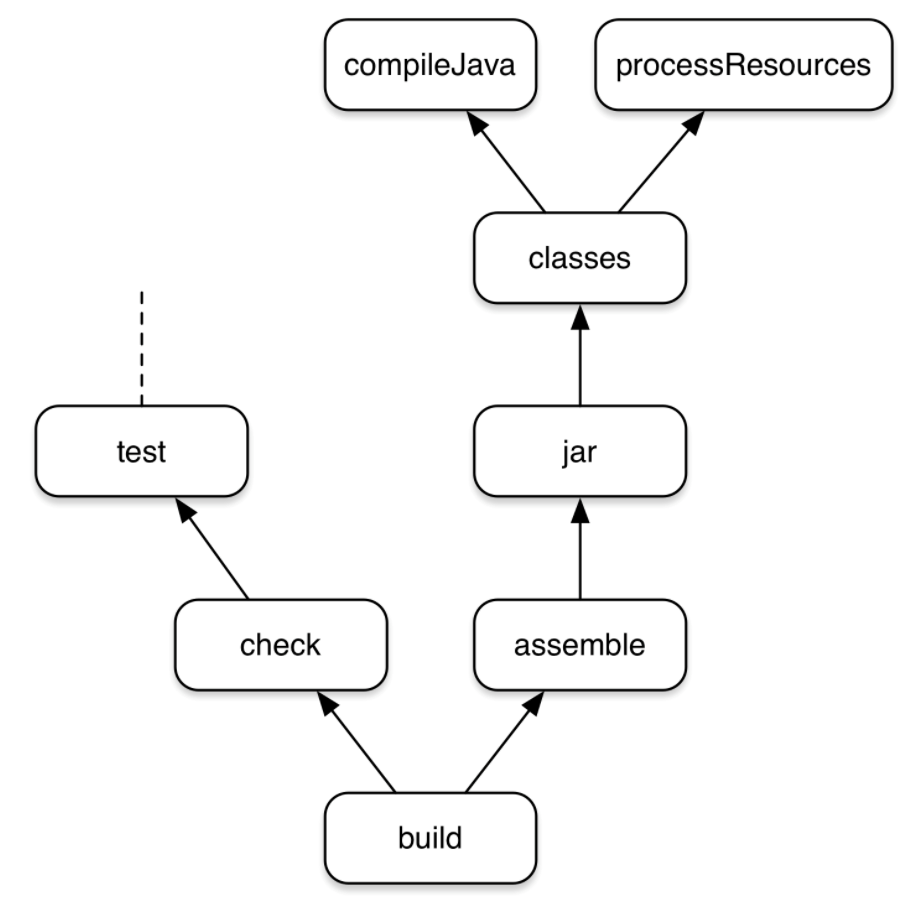

Теперь давайте запустим наше приложение. Используем задачу run (сначала с параметром -m).

```cmd
REM для Windows
>> gradlew -m run

:app:compileJava SKIPPED
:app:processResources SKIPPED
:app:classes SKIPPED
:app:run SKIPPED

BUILD SUCCESSFUL in 657ms

>> gradlew run

> Task :app:run
Hello World!

BUILD SUCCESSFUL in 1s
2 actionable tasks: 2 executed
```

Но каким же образом у gradle появились новые задачи после выполнения ./gradlew init?

Давайте посмотрим содержимое файла app/build.gradle.

В файле есть секция plugins. Именно в этой секции подключается плагин application. Этот плагин упрощает создание исполняемого приложения. Он позволяет легко запускать приложение во время разработки и упаковать приложение в tar- и/или zip-архив со скриптами запуска, специфичными для операционной системы. Новые задачи появляются после подключения плагина.

Следующие задачи добавляются при использовании плагина application (задачи по умолчанию были заменены многоточиями).

```cmd
REM Команда для Windows
>> gradlew tasks

Application tasks
-----------------
run - Runs this project as a JVM application

Build tasks
-----------
assemble - Assembles the outputs of this project.
build - Assembles and tests this project.
buildDependents - Assembles and tests this project and all projects that depend on it.
buildNeeded - Assembles and tests this project and all projects it depends on.
classes - Assembles main classes.
clean - Deletes the build directory.
jar - Assembles a jar archive containing the main classes.
testClasses - Assembles test classes.

...

Distribution tasks
------------------
assembleDist - Assembles the main distributions
distTar - Bundles the project as a distribution.
distZip - Bundles the project as a distribution.
installDist - Installs the project as a distribution as-is.

Documentation tasks
-------------------
javadoc - Generates Javadoc API documentation for the main source code.

...

Verification tasks
------------------
check - Runs all checks.
test - Runs the unit tests.
```

Но нельзя поставить равенство между плагином и простым набором задач. Кроме задач, плагин может содержать определённую конфигурацию и набор соглашений. Например, плагин application неявно использует плагин java и его задачи:

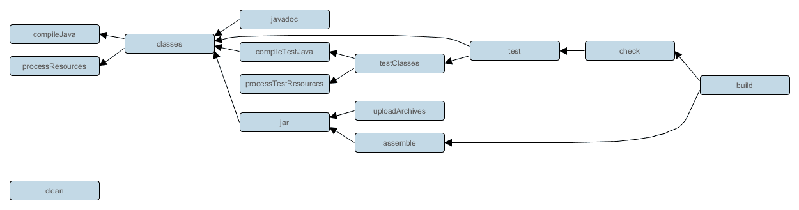

От него же плагин application получает соглашения о расположении кода и тестов (src/main/java и src/test/java).

|Название задачи|Что делает|
|---|---|
|assemble|Собирает вывод проекта|
|build|Собирает и тестирует проект|
|buildDependents|Собирает и тестирует данный проект и все проекты, которые от него зависят|
|buildNeeded|Собирает и тестирует данный проект и все проекты, от которых он зависит|
|classes|Собирает main-классы|
|clean|Удаляет директорию build|
|jar|Сборка|
|testClasses|Собирает test-классы|
|assembleDist|Сборка дистрибутива|
|distTar|Сборка tar-дистрибутива|
|distZip|Сборка zip-дистрибутива|
|installDist|Установка дистрибутива|
|javadoc|Генерирует документацию|
|check|Выполняет все проверки|
|test|Запускает все модульные тесты|

### Наиболее важные плагины с позиции разработчика
Список основных (core) плагинов приведён на [странице](https://docs.gradle.org/current/userguide/plugin_reference.html).

Их можно подключить аналогично плагину java, как мы сделали выше. Кроме того, существует [коллекция плагинов от сообщества](https://plugins.gradle.org/).

### Пробуем написать свою задачу
Попробуем сами написать задачу. Добавим в конец файла app/build.gradle следующий код (редактировать можно любым текстовым редактором):

```groovy
task hello {
   doLast {
    println 'Hello from Skillfactory'
   }
}
```

Выведем полный список задач.

```cmd
REM Команда для Windows
>> ./gradlew tasks --all

REM Задача появилась в выводе для группы Other task (сюда попадают все задачи без группы):

...
Other tasks
-----------
...
app:dependentComponents - Displays the dependent components of components in project ':app'. [deprecated]
app:hello
model - Displays the configuration model of root project 'exercise'. [deprecated]
...

REM Добавим группу и описание для задачи в файл app/build.gradle:
task hello {
   group 'Skillfactory'
   description 'Display hello message.'

   doLast {
    println 'Hello from Skillfactory'
   }
}

REM Вывод gradlew tasks:
...

Skillfactory tasks
------------------
hello - Display hello message.

...
REM Добавим ещё одну задачу bigHello и сделаем её зависимой от hello:

task hello {
   group 'Skillfactory'
   description 'Display hello message.'

   doLast {
    print 'Hello '
   }
}

task bigHello {
   group 'Skillfactory'
   description 'Display big hello message.'

   doLast {
    println 'from Skillfactory'
   }
}

bigHello.dependsOn hello
```

Выполним задачу bigHello.

```cmd
REM Команда для Windows
>> gradlew bigHello

> Task :app:hello
Hello 
> Task :app:bigHello
from Skillfactory

BUILD SUCCESSFUL in 715ms
2 actionable tasks: 2 executed
```

Видим, что сначала выполнилась задача hello, затем — bigHello.

Теперь давайте сделаем что-то полезное. При разработке часто бывает необходимо сопоставить используемый артефакт (нерелизную версию и хэш коммита в системе управления версиями, на основе которого был собран артефакт). Давайте добавим эту информацию в файл version.txt, который будет создан в процессе сборки.

```groovy
task buildInfo {
    doLast {
        def cmd = "git rev-parse --short HEAD"
        def proc = cmd.execute()
        def revision = proc.text.trim()
        print revision
        file(buildDir.path + "/classes/java/main/revision.txt").text = revision
    }     
}

jar.dependsOn 'buildInfo'
```

Для выполнения этой задачи необходимо создать Git-репозиторий в папке gradle_tasks, выполнив команду git init и создав хотя бы один коммит.

Соберем проект и посмотрим содержимое получившегося JAR-файла:

```cmd 
REM Команда для Windows
>> gradlew build
>> jar -tf app\build\libs\app.jar

META-INF/
META-INF/MANIFEST.MF
revision.txt
exercise/
exercise/App.class
```

В архиве содержится файл revision.txt.

```cmd
REM Команды для Windows
>> cd app\build\libs
>> jar xf app.jar 
>> dir

META-INF	
app.jar	
exercise
revision.txt

>> type revision.txt 
64a0e51

REM Вывод совпадает с выводом команды git:

$ git log
commit 64a0e512a2a6b98ed8d3acd364d89b89c69e9b1b (HEAD -> master)
Author: Мое имя <мой email>
Date:   Sun Feb 14 19:55:20 2021 +0300

    Initial commit
```

В этом юните мы рассмотрели работу работу с задачами и плагинами. Далее мы познакомимся с механизм зависимостей.

## Управление зависимостями
Мы изучили центральный подход работы с Gradle — использование задач и возможности расширения путём использования плагинов. Сейчас мы рассмотрим механизм зависимостей.

В современном мире ни один проект не разрабатывается изолированно. Программисту не нужно каждый раз изобретать велосипед. Большая часть кода, которая позволяет делать обыденные рутинные вещи, вероятно, уже написана другими программистами и сохранена в виде библиотек (jar-артефактов) в сетевом хранилище (репозитории), что позволяет разработчику сосредоточиться на бизнес-логике самого приложения. Результатом такого подхода становится сокращение времени разработки и предоставление клиенту новых возможностей использования продукта. Кроме сторонних библиотек, со временем у команды появляются собственные модули, которые также могут использоваться повторно.

Как уже было сказано ранее, все модули хранятся в репозитории. Он может быть как локальным (папка на жёстком диске), так и удалённым, расположенным во внутренней сети предприятия или в Internet.

**Модули, которые используются в приложении называются зависимостями.**

**Во время работы Gradle определяет набор зависимостей и места, откуда их нужно получить. Этот процесс называется разрешением зависимостей.**

Для уменьшения сетевого взаимодействия скачанные однажды зависимости сохраняются в локальном кэше зависимостей и используются при повторных сборках до тех пор, пока файлы в репозитории не изменятся.

Известно, что Gradle не имеет собственных репозиториев, но с успехом использует уже существующие Maven- и Ivy-репозитории.

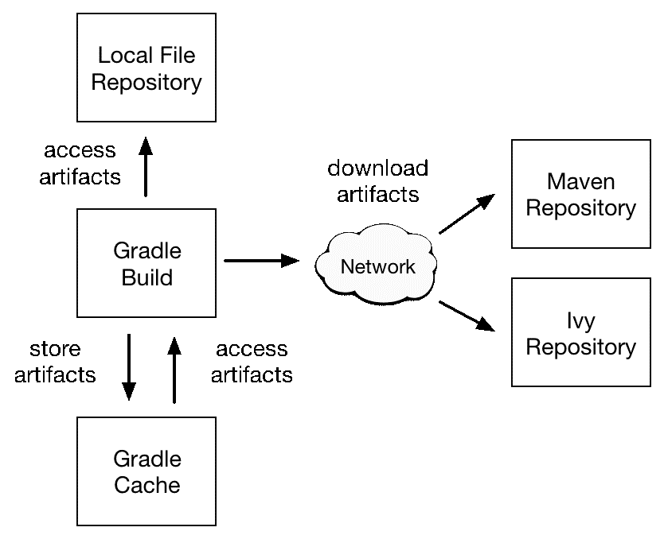

Собственно говоря, управление зависимостями — это не что иное, как метод объявления, разрешения и использования зависимостей.

Давайте рассмотрим этот механизм Gradle более подробно.

### Репозитории и зависимости
За работу с зависимостями в файле проекта (build.gradle) отвечают блоки **repositories** и **dependencies**. В первом блоке описываются репозитории, используемые при сборке.

Существует три типа репозиториев:

* репозитории Maven;
* репозитории Ivi;
* локально расположенные папки.

В коде приведено использование каждого типа репозиториев (блок внутри файла build.gradle):

```groovy
repositories {
    maven {
        url "http://repo.bigcompany.ru/maven2"
    }

    ivy {
        url "http://repo.bigcompany.ru/repo"
    }

    flatDir {
        dirs 'lib1', 'lib2'
    }
}
```

Поиск в репозиториях происходит в соответствии  с порядком их следования внутри блока.

Так как кроме публичных репозиториев существуют и приватные  (доступные только внутри организации), Gradle поддерживает различные типы авторизации.

Зависимости в Gradle определяются на основании тех задач, в процессе выполнения которых они используются. Например, какие-то зависимости могут потребоваться при компиляции исходных файлов, какие-то — на этапе выполнения тестов, какие-то — на этапе выполнения. В таких случаях говорят об области видимости зависимости (scope of dependency). В Gradle это реализовано при помощи конфигураций. Каждый плагин привносит свои конфигурации в проект. Например, плагин java привносит конфигурации, определяющие различные classpath для компиляции и выполнения тестов:

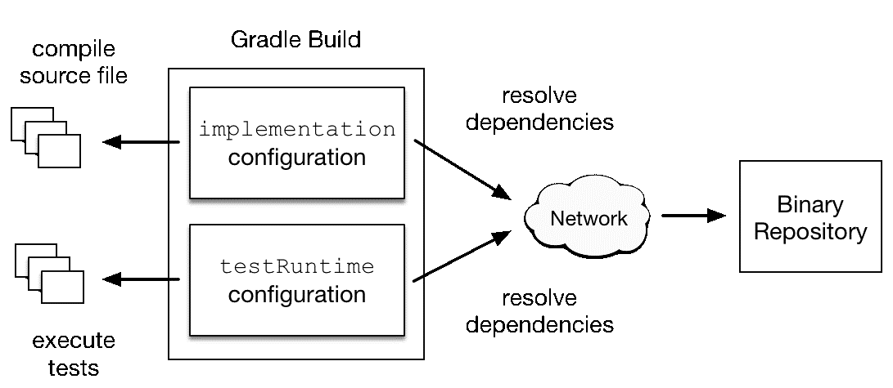

В Gradle широко используется наследование конфигураций. Например, в том же java-плагине конфигурация testImplementation расширяет конфигурацию implementation. Наследование имеет практическую цель: для компиляции тестов требуются зависимости кода, который покрывается тестами, кроме зависимостей, необходимых для написания тестового класса. Проект Java, который использует JUnit для написания и выполнения тестов, также нуждается в Guava, если от него зависит код самого приложения и библиотеки. Без этого тесты просто не скомпилируются.

Конфигурация implementation пришла на смену устаревшей конфигурации compile, а testImplementation — testCompile. Для программиста полезно понимать, что это названия определённых конфигураций, а их конкретное описание идёт в описании плагина. 

Вот два графа зависимостей конфигураций для кода:

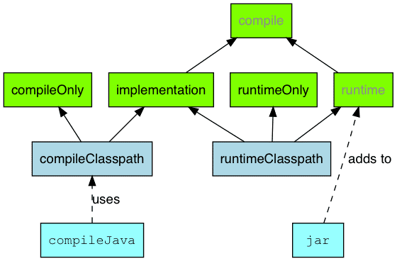

И тестов:

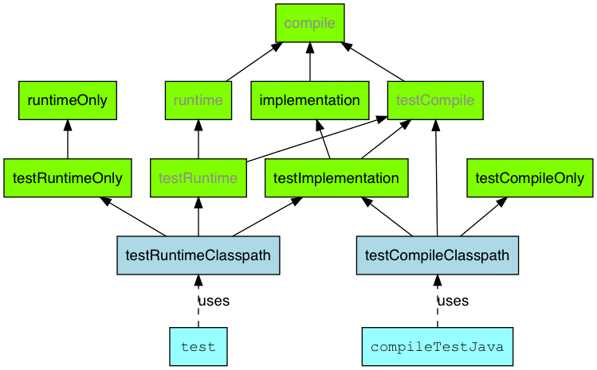

Голубым цветом показаны задачи, использующие конфигурации, серым — classpath, зелёным — иерархию наследования конфигураций (среди них серым цветом показаны устаревшие).

Пример описания зависимостей в файле build.gradle:

```groovy
dependencies {
    // Use JUnit test framework.
    testImplementation 'junit:junit:4.13'

    // This dependency is used by the application.
    implementation 'com.google.guava:guava:29.0-jre'
}
```

Сами зависимости описываются в блоке dependencies в формате:
```
название-конфигурации 'название-группы:название-модуля:версия-модуля'
```

### Gradle Shadow Plugin
Результатом работы программиста является либо создание артефакта с библиотекой, либо артефакта, позволяющего запускать приложение. Давайте подробнее рассмотрим второй вариант.

В папке using_shadow инициализируем Gradle-проект.

Давайте используем что-нибудь из этой библиотеки, например, создание списка. Изменим объявление метода getGreeting() в классе App  и добавим соответствующие импорты (остальная часть класса показана многоточиями):

```java
...
public String getGreeting() {
   List<String> greeting = Lists.newArrayList("Hello", "World", "!");
   return greeting.toString();
}
...
```

Изменив метод, мы явно использовали внешнюю зависимость. 

Теперь соберём проект.

```cmd 
REM Команда для Windows
>> gradlew clean build --console=plain

> Task :app:compileJava
> Task :app:processResources NO-SOURCE
> Task :app:classes
> Task :app:jar
> Task :app:startScripts
> Task :app:distTar
> Task :app:distZip
> Task :app:assemble
> Task :app:compileTestJava
> Task :app:processTestResources NO-SOURCE
> Task :app:testClasses
> Task :app:test
> Task :app:check
> Task :app:build

BUILD SUCCESSFUL in 3s
7 actionable tasks: 7 executed
```

Запустим приложение.

```cmd
REM Команда для Windows
>> gradlew run --console=plain

> Task :app:compileJava UP-TO-DATE
> Task :app:processResources NO-SOURCE
> Task :app:classes UP-TO-DATE

> Task :app:run
[Hello, World, !]

BUILD SUCCESSFUL in 707ms
2 actionable tasks: 1 executed, 1 up-to-date
```

В папке app\build\libs сформировался jar-файл — app.jar. При запуске класса App получим ошибку.

```cmd 
REM Команда для Windows

>> java -jar app\build\libs\app.jar
Exception in thread "main" java.lang.NoClassDefFoundError: com/google/common/collect/Lists
	at ru.skillfactory.shadow.App.getGreeting(App.java:10)
	at u.skillfactory.shadow.App.main(App.java:14)
Caused by: java.lang.ClassNotFoundException: com.google.common.collect.Lists
	at java.base/jdk.internal.loader.BuiltinClassLoader.loadClass(BuiltinClassLoader.java:606)
	at java.base/jdk.internal.loader.ClassLoaders$AppClassLoader.loadClass(ClassLoaders.java:168)
	at java.base/java.lang.ClassLoader.loadClass(ClassLoader.java:522)
	... 2 more
```

То есть мы не можем передать только jar-файл — в таком виде он не является рабочим. Нам на помощь приходит Shadow-плагин — Gradle-плагин для объединения зависимостей проекта и ресурсов классов  в единый JAR (uber или fat JAR). Плюс такой сборки в том, что получившийся jar-файл является исполняемым и включает в себя все зависимости.

Для использование плагина добавим строчку (id 'com.github.johnrengelman.shadow' version '6.1.0') в секцию plugins файла app/build.gradle:
```groovy
plugins {
   // Apply the application plugin to add support for building a CLI application in Java.
   id 'application'
   // Добавьте строчку распложенную ниже
   id 'com.github.johnrengelman.shadow' version '6.1.0'
}
```

Плагин относится к разряду reactive, что означает, что его добавление само по себе никак не повлияет на конфигурацию проекта. Он просто добавляет задачу shadowJar. Для сборки проекта необходимо сконфигурировать эту задачу: укажем класс, содержащий метод main(), — добавим в конец файла app/build.gradle строчки:

```groovy
shadowJar {
   mainClassName = 'ru.skillfactory.shadow.App'
}
```
```cmd
REM Команда для Windows
>> gradlew clean build --console=plain

> Task :app:clean
> Task :app:compileJava
> Task :app:processResources NO-SOURCE
> Task :app:classes
> Task :app:jar
> Task :app:startScripts
> Task :app:distTar
> Task :app:distZip
> Task :app:shadowJar
> Task :app:startShadowScripts
> Task :app:shadowDistTar
> Task :app:shadowDistZip
> Task :app:assemble
> Task :app:compileTestJava
> Task :app:processTestResources NO-SOURCE
> Task :app:testClasses
> Task :app:test
> Task :app:check
> Task :app:build

BUILD SUCCESSFUL in 2s
12 actionable tasks: 12 executed
```

В папке app/build/libs, наряду с файлом app.jar, сформировался файл app-all.jar. Давайте запустим его (главный класс уже можно не указывать — в процессе сборки информация о нём была указана в файле манифеста).

```cmd
REM Команда для Windows
>> java -jar app\build\libs\app-all.jar
[Hello, World, !]
```
Так в чём же преимущества использования Shadow Plugin?

1. Он минимизирует вероятность ошибки путём сокращения рукописного кода. Don't reinvent the wheel.
1. Он добавляет такие вещи, как идентичные билды или выборочное включение файлов в билд.

В этом юните мы рассмотрели работу с репозиториями и зависимостями, подключили к проекту плагин shadow для получения артефакта с включенными зависимостями. Далее мы рассмотрим, как мигрировать существующий Maven-проект на использование Gradle.


# Логирование. JUL, Log4j, Logback, Slf4j. Grep работа с логами (Modul 25)
## Зачем нужно логирование

**Логирование** — это запись результатов работы программы куда-либо. Обычно это место (или файл) называется лог.
Самым простым примером логов является вывод в консоль сообщения через метод System.out.println();.

При создании логов необходимо правильно подходить к системе их вывода. Например, создание системы логирования после написания всего кода программы — весьма сомнительная идея.

Почти невозможно восстановить причины возникновения проблемы у пользователя, если разработчик имеет только описание проблемы от пользователя, у которого она возникла. Пользователь обычно — простой человек, он и не может описать проблему более подробно, а иногда бывают случаи, когда воспроизвести проблему на своей стороне невозможно.

Также при логировании необходимо правильно записывать данные. Если мы будем записывать каждое действие системы, то лог-файл получиться очень большим, например, около 150 гигабайт, и работать с таким файлом и искать в нём ошибки будет достаточно проблематично. Но, если писать в лог только критические ошибки, то мы можем не понять момент их возникновения (какие действия были перед ошибкой). Что именно писать и не писать в лог, определяет сам разработчик. Но существует несколько правильных моментов, которые используются при записи лога почти всегда:

* Запись текущего времени (timestamp) в момент логирования.
* Запись каждого важного шага, а не только начала и конца выполнения функции.
* Запись значений переменных в лог, чтобы повысить его информативность.

Нужно понимать, что система логирования создаётся для того, чтобы разработчику было проще находить ошибки, а не сидеть в дебагере часами над устранением проблемы. Благодаря логам мы можем получать информацию об ошибках уже от пользователя приложения и вести «удаленную отладку».

Ещё одной функцией логирования является снижение нагрузки на разработчика путем перекладывания нагрузки на линию поддержки, которая умеет читать логи и понимает, как решить типовые проблемы, лежащие на поверхности.

Разумеется, логировать всё подряд не стоит. Иногда это и не нужно, и даже опасно. Например, если залогировать чьи-то личные данные, это станет серьезной проблемой (например, данные о банковской карте пользователя).

Но есть и то, что **логировать обязательно**:

* **Начало/конец работы приложения**. Нужно знать, что приложение действительно запустилось, как мы и ожидали, и завершилось также ожидаемо.
* **Вопросы безопасности**. Здесь хорошо логировать попытки подбора пароля, логирование входа юзеров.
* **Некоторые состояния приложения**. Например, переход из одного состояния в другое в бизнес процессе.
* Некоторая **информация для дебага** с соответственным уровнем логирования.
* **Некоторые SQL-скрипты**.
* **Выполняемые нити (Thread)** могут быть логированы в случаях с проверкой корректной работы.

Также можно выделить несколько самых популярных **ошибок в логировании**:

* Избыток логирования. Не стоит логировать каждый шаг, который чисто теоретически может быть важным.
* Логирование всех данных в один файл. Это приведет к тому, что в определённый момент чтение/запись в него будет очень сложной, не говоря о том, что есть ограничения по размеру файлов в определенных системах.
* Использование неверных уровней логирования. У каждого уровня логирования есть четкие границы, и их стоит соблюдать.

Стоит теперь разобраться, что такое уровни логирования. Уровень задаётся в приложении. Если запись относится к уровню ниже обозначенного, она не вносится в лог.

Например, у нас есть логи, с помощью которых делают дебаг приложения. В нормальной работе на продакшене (когда приложение используют по назначению) такие логи не нужны. Поэтому уровень логирования будет выше, чем для дебага.

Давайте рассмотрим уровни на примере Log4j (библиотека логирования в Java-программах). Остальные решения, кроме JUL (Java Util Logging — логгер, который появился изначально в Java), используют такие же уровни.

Вот они в порядке уменьшения 8 уровней:
|||
|---|---|
|OFF|никакие логи не записываются, все они будут проигнорированы|
|FATAL|ошибка, после которой приложение уже не сможет работать и будет остановлено|
|ERROR|уровень ошибок, когда есть проблемы, которые нужно решить. Ошибка не останавливает работу приложения в целом|
|WARN|обозначаются логи, которые содержат предостережение, которое может быть проигнорировано, если не вызывает других проблем|
|INFO|лог, который записывает важные действия в приложении|
|DEBUG|логи, необходимые для отладки приложения|
|TRACE|менее приоритетные логи для отладки с наименьшим уровнем логирования|
|ALL|уровень, при котором будут записаны все логи из системы|


## Stacktrace
Stacktrace (трассировка стека) — это список методов, которые были вызваны до момента, когда в приложении произошло исключение. Функция, вызванная последней, должна быть записана самой первой.

```cmd
Exception in thread "main" java.lang.NullPointerException
       at com.example.myproject.Book.getTitle(Book.java:16)
       at com.example.myproject.Author.getBookTitles(Author.java:25)
       at com.example.myproject.Bootstrap.main(Bootstrap.java:14)
```
Например, здесь мы видим строчку, где произошла ошибка. Это самая первая строка:

```cmd
at com.example.myproject.Book.getTitle(Book.java:16)
```

Далее мы в нашем коде переходим на 16 строчку и смотрим, что там происходит:

```java
public String getTitle() {
    System.out.println(title.toString()); // <-- line 16
    return title;
}
```
Очевидно, что в такой момент наш объект title не существует или равен *null*.

Программисты обычно используют трассировку стека во время интерактивной отладки. Конечные пользователи могут видеть трассировку стека, отображаемую как часть сообщения об ошибке, о которой пользователь может затем сообщить программисту.

Трассировка стека позволяет отслеживать последовательность вызываемых вложенных функций от начала стека до той точки, в которой была вызвана трассировка стека.

Вывести текущий стек можно и без создания ошибки. Это позволит нам посмотреть текущий класс и метод, которые выполняются. И так же можно получить информацию по всей цепочке до основного метода main(). Стэктрейс в Java представлен как массив. Пример кода для того, чтобы получить значения:
```java
StackTraceElement[] stack= Thread.currentThread().getStackTrace();
```
Метод currentThread() возвращает текущий поток программы, а метод getStackTrace() — её стектрейс.

```java
// метод, который всегда будет выкидывать исключение в стэктрейс.
package com.company.test;

public class Main {

    public static void main(String[] args) {
        StackTraceElement[] stack= Thread.currentThread().getStackTrace();
       try {
            int i = 25 / 0;
        }
       catch(Exception e) {
            for (StackTraceElement element :stack) {
                System.out.println(element);
            }
       }    
    }
}
```

## Просмотр и поиск по логам
Обычно логи представлены текстовыми файлами, и у них может быть очень большой объём, который не позволяет их открывать через текстовые редакторы (на самом деле открыть наверно можно, но это займет много времени и памяти).

В Linux системах существует утилита командной строки, которая сильно упрощает поиск по логам. Утилита называется **grep** (от англ. search **g**lobally for lines matching the **r**egular **e**xpression, and **p**rint them).

В современных версиях Windows можно воспользоваться, например, встроенным Linux-ядром для выполнения тех же самых команд. По умолчанию в Windows их, к сожалению, нет. В случае MacOS, как правило, команды, идентичные Linux-системам, уже имеются.

Допустим, у нас есть log.txt файл, в котором мы храним результаты обработки нашей программы. Программа отвечает за передачу и сохранение файлов по сети и сохраняет в лог время и действия с файлом (тут стоит сказать, что все эти данные достаточно условные). Тогда вывод информации по 1 файлу будет выглядеть так:
```cmd
grep "mydoc" log.txt

12.10.2020 12:34:32.124 [192.168.2.25]  mydoc.docx loaded
12.10.2020 12:34:32.437 [192.168.2.25]  mydoc.docx saved
12.10.2020 12:34:33.514 [192.168.2.70]  mydoc.docx sended
12.10.2020 12:34:41.289 [192.168.2.70]  mydoc_status.docx resended
```
Команда tail позволяет просмотреть файл с конца. А при использовании -f ключа показывает данные, которые были добавлены в файл уже после запуска команды. Очень удобно использовать, например, для того, чтобы найти недавние ошибки или ошибки, которые вот-вот возникнут. При этом команды grep и tail можно использовать вместе.

```cmd
tail -f | grep "error" log.txt

12.10.2020 13:21:19.212 [192.168.2.24]  mypic.png error
grep mypic.png -A 1 log.txt

12.10.2020 13:21:19.112 [192.168.2.24]  mypic.png loaded
12.10.2020 13:21:19.212 [192.168.2.24]  mypic.png error
12.10.2020 13:21:21.191 [192.168.2.24]  user 192.168.2.24 can't send images
```
Мы искали mypic.png, но в последней строчке такой фразы нет, но она появилась в поиске из-за ключа -А1, который говорит о том, что нужно вывести искомую строку и одну строку ниже. Команда -B1 выполняет противоположное действие: выводит искомую строку и одну строку до. Команда -C1 выведет искомую строку и по одной строке сверху и снизу до искомой.

Команда taif работает так же, как и tail -f, но выводит так же десять последних строк в файле перед её вызовом.

В командной строке Windows (CMD) эквивалентом grep является команда findstr.

```cmd
2013-06-19 10:00:19|Удаляем старые лог файлы
2013-06-19 10:00:19|Удаление старых лог файлов завершено
2013-06-19 10:00:19|Запуск LinkOnAvt версия 1.10
2013-06-19 10:00:19|Время запуска 19-06-2013 10:00:19
2013-06-19 10:00:19|Используем расширенный API sape
2013-06-19 10:00:19|Авторизация в sape
2013-06-19 10:00:19|Авторизация в sape прошла успешно
2013-06-19 10:00:19|Начало запроса проектов с sape
2013-06-19 10:00:19|Проекты получены
2013-06-19 10:00:19|Проекты сохранены
2013-06-19 10:00:19|Загружаем проекты из файла
2013-06-19 10:00:19|Начало запроса новых заявок по проекту 1671173 с sape
2013-06-19 10:00:20|Получено новых заявок: 95
2013-06-19 10:00:20|Начало запроса размещенных заявок по проекту 1671173 с sape
2013-06-19 10:00:20|Получено размещенных заявок: 5
2013-06-19 10:00:20|Сохраняем заявки в файл ./data/urls_1671173.txt
2013-06-19 10:00:20|Заявки сохранены
2013-06-19 10:00:20|Начало проверки заявок по xtool
2013-06-19 10:00:20|Проверка максимально допустимого числа принятых заявок за все время
2013-06-19 10:00:20|Максимально допустимое число принятых заявок за все время не достигнуто и равняется 0
2013-06-19 10:00:20|Проверка максимально допустимого числа принятых заявок за день
2013-06-19 10:00:20|Максимально допустимое число принятых заявок за день не достигнуто и равняется 0
2013-06-19 10:00:20|Авторизация в xtool
```
Выполним команду поиска в CMD, находясь на рабочем столе:
```cmd
C:\Users\Admin\Desktop>findstr "data" log.txt
2013-06-19 10:00:20|╨б╨╛╤Е╤А╨░╨╜╤П╨╡╨╝ ╨╖╨░╤П╨▓╨║╨╕ ╨▓ ╤Д╨░╨╣╨╗ ./data/urls_1671173.txt
```
Как видно, нужная строка нашлась, а вот поддержка русского шрифта в командной строке — нет. Выполним тот же запрос из Windows PowerShell (встроенная программа в Windows 10).

В Windows PowerShell эквивалентом команды grep выступает команда **Select-String**.

```powershell
PS C:\Users\Admin> cd Desktop
PS C:\Users\Admin\Desktop> Select-String "data" log.txt
log.txt:16:2013-06-19 10:00:20|Сохраняем заявки в файл ./data/urls_1671173.txt

PS C:\Users\Admin\Desktop> Select-String "1671173" log.txt
log.txt:12:2013-06-19 10:00:19|Начало запроса новых заявок по проекту 1671173 с sape
log.txt:14:2013-06-19 10:00:20|Начало запроса размещенных заявок по проекту 1671173 с sape
log.txt:16:2013-06-19 10:00:20|Сохраняем заявки в файл ./data/urls_1671173.txt
```
В Windows PowerShell, как видим, всё работает корректно.

## JUL
Одно из ключевых преимуществ это решения — JUL включен в JDK (Java Development Kit). К сожалению, при его разработке за основу взяли не популярный log4j, а решение от IBM, что и повлияло на его развитие. По факту, на данный момент JUL есть, но им никто не пользуется, так как возникают проблемы, если выводить данные различными логерами в различные файлы (ну или консоли) с различным форматированием (настройки вывода задаются для целого класса, а не единичного объекта). JUL появился в Java 1.4.

Взаимодействие с ним происходит через класс java.util.logging.Logger. С помощью метода getLogger() мы создаём экземпляр для работы:

```java
Logger logger = Logger.getLogger(Test.class.getName());
```

Test — это имя основного класса программы.

```java
public class Test{
    public static final Logger logger = Logger.getLogger(Test.class.getName());
    
    public static void main(String[] args){
       logger.log(Level.INFO, "Hello world");
    }
}
```
Данный код выведет в терминал сообщение:
```cmd
Oct 14, 2020 7:24:11 PM Test main
INFO: Hello world.
```
В JUL есть несколько уровней логирования. Всего их 7:

* SEVERE (ошибка);
* WARNING (предупреждение);
* INFO (информационное сообщение);
* CONFIG (настраиваются по желанию пользователя);
* FINE (сообщение об успешной операции);
* FINER;
* FINEST.

Обычно хватает 4 уровней логирования, без CONFIG, FINER и FINEST. Также для каждого из уровней логирования есть перегруженные методы (метод переинициализирован и может использоваться по разному).

```java
logger.info("Test string.");
logger.log(Level.INFO,"Test string.");
```

Метод log говорит о том, что уровень записи нужно указывать внутри него. Видно, что в этом примере первым задается уровень записи, а потом содержание записи.

Также в лог можно передать исключение возникшее в результате работы программы.

```java
try {
    //...throw error;
} catch (IOException e) {
    logger.log(Level.SEVERE , "Error message", e);
}
```

Лог можно выводить не только в консоль, но и в текстовый файл, для этого необходимо изменить файл конфигурации JUL.

Пример файла конфигурации:

```
# Настройки глобального логгера
handlers =java.util.logging. FileHandler
.level=ALL
# Конфигурация файлового хендлера
java.util.logging.FileHandler.level =ALL
java.util.logging.FileHandler.formatter =java.util.logging.SimpleFormatter
java.util.logging.FileHandler.limit = 1000000
java.util.logging.FileHandler.pattern   = log.txt
# Конфигурация консольного хендлера
java.util.logging.ConsoleHandler.level = ALL
java.util.logging.ConsoleHandler.pattern = log.log
java.util.logging.ConsoleHandler.formatter =java.util.logging.SimpleFormatter
```

Теперь, чтобы запустить JUL с этой конфигурацией, необходимо передать параметр при запуске приложения:

```
Djava.util.logging.config.file=<путь к файлу конфигурации>
```

Или можно выполнить следующий код в начале вашего приложения:
```java
LogManager.getLogManager().readConfiguration(Main.class.getResourceAsStream("Имя файла конфигурации"));
//Main - основной класс программы
```

## Log4j
Log4j — это библиотека, необходимая для ведения журналов логирования. Настроить его возможно с помощью внешних файлов конфигурации.

Что бы установить Log4j, необходимо:

* Скачать [последнюю версию Log4j](https://logging.apache.org/log4j/2.x/).
* Распаковать архив.
* Переместить log4j-X.X.XX.jar в директорию с нашей программой.
* Подключить как библиотеку (правая кнопка мыши => Run as library).

Также *Log4j* можно установить с помощью *Maven* или *Gradle*.

Зависимость для Maven:
```xml
<dependencies>
  <dependency>
    <groupId>org.apache.logging.log4j</groupId>
    <artifactId>log4j-api</artifactId>
    <version>2.13.3</version>
  </dependency>
  <dependency>
    <groupId>org.apache.logging.log4j</groupId>
    <artifactId>log4j-core</artifactId>
    <version>2.13.3</version>
  </dependency>
</dependencies>
```

Зависимость для Gradle:
```groovy
dependencies {
  compile group: 'org.apache.logging.log4j', name: 'log4j-api', version: '2.13.3'
  compile group: 'org.apache.logging.log4j', name: 'log4j-core', version: '2.13.3'
}
```
Файл *log4j2.xml* — это файл конфигурации *Log4j*.

Пример:
```xml
<?xml version="1.0" encoding="UTF-8"?>
<Configuration status="INFO">
    <Appenders>
        <Console name="console" target="SYSTEM_OUT">
            <PatternLayout
                    pattern="[%-5level] %d{yyyy-MM-dd HH:mm:ss.SSS} [%t] %c{1} - %msg%n"/>
        </Console>
        <File name="MyFile" fileName="C://TMP/log_file.log">
            <PatternLayout
                pattern="[%-5level] %d{yyyy-MM-dd HH:mm:ss.SSS} [%t] %c{1} - %msg%n" />
        </File>
    </Appenders>
    <Loggers>
        <Root level="debug" additivity="false">
            <AppenderRef ref="console" />
            <AppenderRef ref="MyFile"/>
        </Root>
    </Loggers>
</Configuration>
```

Тег PatternLayout отвечает за формат сообщения для вывода:

* %d{yyyy-MM-dd HH:mm:ss} — выводит дату в формате 2014-01-14 23:55:57.
* %-5p — выводит уровень лога (ERROR, DEBUG, INFO …), цифра 5 означает, что всегда используется 5 символов, остальное дополняется пробелами, а минус (–) — что позиционирование по левой стороне.
* %c{1} — категория, в скобках указывается сколько уровней выдавать. Так как у нас 1 уровень, то писаться будет только имя класса.
* %L — номер строки, в которой произошел вызов записи в лог.
* %m — сообщение, которое передали в лог.
* %n — переход на новую строку.

В теге Appenders описывается место, куда выводить лог. В теге console описано, как выводить записи в консоль. А в теге file — как выводить запись в файл, и где лежит в файл.

Код основной программы:

```java
import org.apache.log4j.Logger;
public class TestLog{
private static final Logger log = LogManager.getLogger(TestLog.class);
public static void main(String[] args){
	log.info("Это информационное сообщение!");
	log.error("Это сообщение ошибки");
   }
}
```
Результат выполнения, который лежит в файле C:\\TMP\\log_file.log:

```log
2020-10-16 11:25:57 INFO  TestLog:5 - Это информационное сообщение!
2020-10-16 11:25:57 ERROR TestLog:6 - Это сообщение ошибки
```

## Logback
Logback создан тем же разработчиком, что и Log4j. Отличия в том, что в logback улучшена производительность, добавлена нативная поддержка slf4j и расширена опция фильтрации.

Logback создан тем же разработчиком, что и Log4j. Отличия в том, что в logback улучшена производительность, добавлена нативная поддержка slf4j и расширена опция фильтрации.

```xml
<dependency>
    <groupId>ch.qos.logback</groupId>
    <artifactId>logback-core</artifactId>
    <version>1.2.3</version>
</dependency>	
<dependency>
    <groupId>ch.qos.logback</groupId>
    <artifactId>logback-classic</artifactId>
    <version>1.2.3</version>
</dependency>
```
Далее необходимо создать файл конфигурации в папке src. Создадим и назовём его logback.xml. И сразу добавим в него следующие данные:

```xml
<configuration>
  <appender name="STDOUT" class="ch.qos.logback.core.ConsoleAppender">
    <encoder>
      <pattern>%d{HH:mm:ss.SSS} %-5level [%thread] %logger{36} - %msg%n</pattern>
    </encoder>
  </appender>
  <root level="debug">
    <appender-ref ref="STDOUT" />
  </root>
</configuration>
```
С помощью тега root мы подключаем описанные аппендеры (можно не все, если их объявлено несколько, но не все нужны) и уровень логирования. Тег pattern в logback имеет такую же логику, как тег patternLayout в log4j.

Приведём ещё раз слова для форматирования сообщения лога:

* %d{yyyy-MM-dd HH:mm:ss} — выводит дату в формате 2014-01-14 23:55:57.
* %-5level — выводит уровень лога (ERROR, DEBUG, INFO …), цифра 5 означает, что всегда используется 5 символов, остальное дополняется пробелами, а минус (–) — то что позиционирование по левой стороне.
* %thread — выводит нить потока.
* %logger{36} — количество символов для вывода.
* %L — номер строки в которой произошел вызов записи в лог.
* %msg — сообщение, которое передали в лог.
* %n — переход на новую строку.

Запустить логгер достаточно просто, для этого нужно создать основной класс и в нём через фабрику логгера создать логгер, и использовать его методы для вывода результата.

```java
public class Test{
 
    private static final Logger logger = LoggerFactory.getLogger(Test.class);
 
    public static void main(String[] args) {
        logger.info("Test log from {}", Test.class.getSimpleName());
    }
}
```
Результатом выполнения логгера будет:
```log
13:23:22.136 [main] INFO Test - Test log from Test
```

## Slf4j
**Slf4j** является обёрткой для остальных систем ведения журналов. Таким образом, он позволяет пользователю работать с любой из сред ведения журналов, таких как Log4j, Logback и JUL.

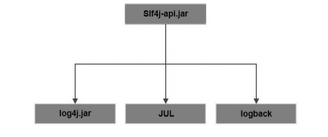

Уровни предупреждений:

|||
|---|---|
|Фатальный (Fatal)|Серьезная проблема, которая приводит к завершению приложения.|
|Ошибка (Error)|Ошибки во время выполнения.|
|Предупреждение (Warn)|В большинстве случаев ошибки связаны с использованием устаревших API.|
|Информация (Info)|События, которые происходят во время выполнения.|
|Debug|Информация о потоке системы.|
|Trace|Более подробная информация о работе системы.|

Уровни предупреждений:

Фатальный (Fatal)	Серьезная проблема, которая приводит к завершению приложения.
Ошибка (Error)	Ошибки во время выполнения.
Предупреждение (Warn)	В большинстве случаев ошибки связаны с использованием устаревших API.
Информация (Info)	События, которые происходят во время выполнения.
Debug	Информация о потоке системы.
Trace	Более подробная информация о работе системы.

С англоязычными терминами и описанием рекомендуется ознакомиться в официальной документации по [ссылке](https://www.slf4j.org/api/org/apache/log4j/Level.html).

### Подключить slf4j можно так:

* Для log4j
    ```xml
    <dependencies>
        <dependency>
            <groupId>org.apache.logging.log4j</groupId>
            <artifactId>log4j-api</artifactId>
            <version>2.7</version>
        </dependency>
        <dependency>
            <groupId>org.apache.logging.log4j</groupId>
            <artifactId>log4j-core</artifactId>
            <version>2.7</version>
        </dependency>
        <dependency>
            <groupId>org.apache.logging.log4j</groupId>
            <artifactId>log4j-slf4j-impl</artifactId>
            <version>2.7</version>
        </dependency>
    </dependencies>
    ```
* Для logback
    ```xml
    <dependency>
        <groupId>ch.qos.logback</groupId>
        <artifactId>logback-classic</artifactId>
        <version>1.1.7</version>
    </dependency>
    ```
Фактически конфигурация в программе совпадает с log4j:
```java
public class TestSlf{

    private static Logger logger = LoggerFactory.getLogger(TestSlf.class);
    public static void main(String[]args) {
        logger.debug("Debug log message");
        logger.info("Info log message");
        logger.error("Error log message");
    }
}
```
Единственное отличие в том, что объекты Logger и LoggerFactory должны принадлежать к пакету org.slf4j.

## Бизнес-логи и тех-логи
С развитием технологий задача хранения логов становится всё более тяжелой. Со временем из одного приложения у корпоративного клиента (или сервиса, например) формируется целая инфраструктура приложений (в случае с сервисами — целый набор сервисов или микросервисов).

Некоторые приложения хранят логи (бизнес-логи) о протекающих в себе бизнес-процессах, а другие хранят логи (тех-логи) о выполнении каких-то своих технических действий (например, 1С).

Некоторые приложения хранят логи (бизнес-логи) о протекающих в себе бизнес-процессах, а другие хранят логи (тех-логи) о выполнении каких-то своих технических действий (например, 1С).

Притом с ростом различных систем и разнообразием заказчиков меняется и задача логирования:

* Кому-то достаточно хранить только логи безопасности, входа и выхода из системы.
* Кому-то необходимо хранить логи всей структуры.
* Или кому-то достаточно хранить только логи одного приложения из всей системы.

А еще некоторые логи необходимо хранить, например, 3 месяца, а другие — 4 года. Из-за этого в системе логирования нужно использовать компонент фильтрации.

Со временем в системе логирования хранилища логов тоже совершили развитие. С хранения файлов перешли в реляционные БД, а потом уже в реляционные документо-ориентированные БД (например, ElasticSearch).

На данный момент самые популярные сборки систем логирования это:

* Стек EFK (Elasticsearch, Fluentd, Kibana).
* Или Fluentd, ClickHouse, Loghouse.

|||
|---|---|
|Fluentd|Это инструмент больших данных для полу- или неструктурированных наборов данных. Он анализирует журналы событий, прикладные журналы и маршрут передвижения.|
|Elasticsearch|Тиражируемая свободная программная поисковая система.|
|Kibana|Тиражируемая свободная программная панель визуализации данных. Как правило, Kibana используется для мониторинга и анализа ИТ-инфраструктуры в составе Elastic.|
|ClickHouse|Это колоночная аналитическая СУБД с открытым кодом, позволяющая выполнять аналитические запросы в режиме реального времени на структурированных больших данных, разрабатываемая компанией Яндекс.|
|Loghouse|Open Source-система для работы с логами в Kubernetes.|
|Kubernetes|Это инструмент оркестровки приложений, работающих в контейнерах, по типу Docker.|

Как это выглядит:
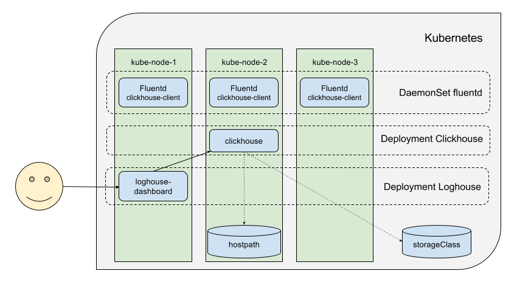

Соответственно, как это работает:

* Fluentd берет логи записывает их в ClickHouse или в Elasticsearch.
* А уже Kibana или Loghouse дают возможность что-то в них удобно искать или следить за какими-нибудь метриками, которые потом, например, будут переданы в Zabbix.

Zabbix — свободная система мониторинга и отслеживания статусов разнообразных сервисов компьютерной сети, серверов и сетевого оборудования.


Но, например, следить за метриками можно и через Kibana, если правильно настроить интерфейс.

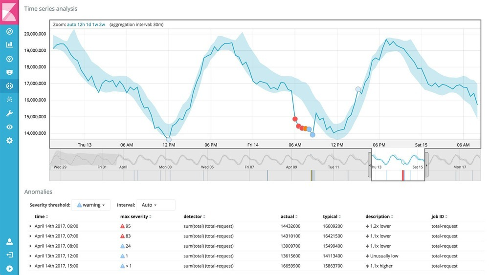

Также существует возможность подключения ноды машинного обучения в эластике, которая разбирает аномалии.

Машинное обучение — платная функция условно-бесплатного Elastic Stack, она входит в пакет X-Pack. Для проведения анализа алгоритм машинного обучения использует данные, хранящиеся в индексах Elasticsearch. Создавать задания для анализа можно как из интерфейса Kibana, так и через API. Если делать это через Kibana, то некоторые вещи знать необязательно. Например, дополнительные индексы, которые использует алгоритм в процессе работы.

График с явной аномалией:

Дополнительно
Java Client Elasticsearch [документация](https://www.elastic.co/guide/en/elasticsearch/client/java-rest/7.9/java-rest-low-usage-maven.html).
[Подключение к Clickhouse](https://habr.com/ru/post/332112/) с помощью JDBC.
[Получение Fluentd](https://docs.fluentd.org/language-bindings/java) логгера в Java.
