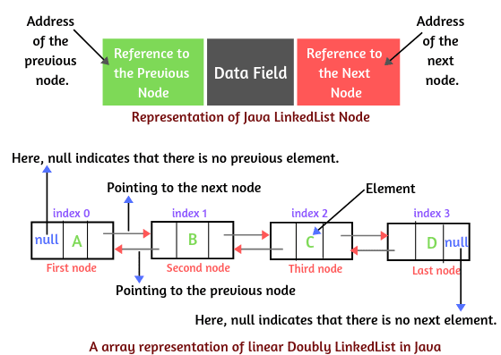

# <u>Java</u>

### JDK


### JRE


Abstraction

Incapsulation

Polymorphism - mehrere Formen. Ist eine Fähigkeit mithilfe eines Interfaces

Inheritance - ist ein Prozess bei dem ein Objekt bekommt Eigenschaften eines anderen Objektes. 

## Datatypes
|Type|Value|
|---|---|
|byte| min: -128|
|    | max:127
|short| min: -32 768
|     | max: 32 767
|int | min: -2 147 483 648
|     | max: 2 147 483 647
|long | min: -9 223 372 036 854 775 808
|     | max: 9 223 372 036 854 775 807
|float | min: -3.4E+38
|     | max: 3.4E+38
|double| min: -1.7E+308
|      | max: 1.7E+308
|char| min: 0
|     | max: 65536
|boolean| min: false
|       | max: true

### _if statement_
```java
if(statement) {

} else if (statement) {

} else {

}
```

### _switch statement_
```java
switch(statement) {
    case [check value]:
        ...
        break;
    case [check value]
        ...
        break;
    case[]:
    case[]:
    case[]:
        ...
        break;
    defautl:
        ...
        break;
}
```

## Datenstrukturen
__Datenstruktur__ - Daten werden in einer bestimmten Art und Weise angeordnet. Es gibt dabei verschiedene Datenstrukturen, jede hat Vor-und Nachteile. Eine bekannte Datenstruktur ist zum Beispiel das Array. Dort werden die Daten quasi in einer Tabelle hinterlegt. Zugriff auf die Daten erfolgt über den Index.

__Algorithmus__ - Ein Algorithmus ist eine Kette von Anweisungen um ein Problem zu lösen. Zum Beispiel, sobald man etwas bei google suchst, sucht ein Algorithmus die Informationen. Im Grunde ist ein Algorithmus eine Funktion / Methode, welches ein bestimmtes Problem löst.

__O-Notation__ - Die O-Notation sagt etwas über die Performance eines Algorithmus aus. Die Performance gibt Auskunft darüber wie lange ein Algorithmus braucht um ein bestimmtes Problem / Aufgabe zu lösen.

__BubbleSort__
Beim Bubblesort Algorithmus wird ein Array – also eine Eingabe-Liste – immer paarweise von links nach rechts in einer sogenannten Bubble-Phase durchlaufen. Man startet also mit der ersten Zahl und vergleicht diese dann mit ihrem direkten Nachbarn nach dem Sortierkriterium. Sollten beide Elemente nicht in der richtigen Reihenfolge sein, werden sie ganz einfach miteinander vertauscht. Danach wird direkt das nächste Paar miteinander verglichen, bis die gesamte Liste einmal durchlaufen wurde. Die Phase wird so oft wiederholt, bis der gesamte Array vollständig sortiert ist.

__Rekursion__
Eine Methode, die sich selbst aufruft.

### Komplexität O-Notation
 - O(1) Konstant
 - O(n) Linear
 - O(log_2 n) Logarithmisch
 - O(n^2) Quadratisch
 - O(n^3) Kubisch
 - Ο(n log n) n log n


### Collection Übersicht


### __List__
__ArrayList__
ArrayList ist im Inneren ein Array. Der Unteschied von Array lieg daran, dass ArrayList das Array intern erweitert, wenn wir mehr Platz für neue Elemente benötigen. Bei dem ausruf
```java
List<String> list = new ArrayList<>();
```
wird intern ein Array mit der Größe 10 erstellt. Wenn man die Größe beeinflußen möchte, kann man eine Überladung des Konstruktors aufrufen.
```java
List<String> list = new ArrayList<>(25);
```
Außer dem ist es auch möglich bei der Initialisierung gleich eine Collection zu übergeben
```java
Queue<String> queue = new LinkedList<>();

queue.add(“John”);
queue.add(“Sam”);
queue.add(“Mary”);
queue.add(“Smith”);
queue.add(“Adam”);

List<String> list = new ArrayList<>(queue);
```
Bei der Arbeit kann man nicht auf inneres Array zugreifen. Man arbeitet nur mit den Daten die in ArrayList hinzugefügt wurden. Wenn innere Array volle größe erreicht hat, vergrößert sich das Array automatisch. Normalerweise verdoppelt sich die Größe.

__LinkedList__
LinkedList ist eine Datenstruktur, die gleich zwei Interfaces implementiert: Queue und List. Im Inneren ist es keine Array sondern eine Kette der Objekte der Klasse Node.
```java 
private static class Node<E> {
   E item;        // Referenz zum Objekt in dem Node
   Node<E> next;  // Referenz zum nächsten Objekt der Klasse Node
   Node<E> prev;  // Referenz zum vorherigen Objekt der Klasse Node

   Node(Node<E> prev, E element, Node<E> next) {
       this.item = element;
       this.next = next;
       this.prev = prev;
   }
}
```



Wenn wir ein Element in LinkedList einfügen, prüfen wir, ob die Liste leer ist. Wenn die Liste leer ist, wird ein Node-Objekt erstellt, das keine Verknüpfungen zu den vorherigen und nächsten Node hat. Bei der nächsten Hinzufügung wird jeder vorhandene NOde überprüft, um zu sehen, ob es einen Link zum nächsten Node gibt. Wenn also ein solcher Link für einen bestimmten Node null ist, dann ist der Knoten der letzte in der Sammlung, und das hinzugefügte Element kann daran „angehängt“ werden. Dasselbe passiert mit der Suche, nur vergleichen wir jetzt das gewünschte Element mit dem Element im Knoten und folgen bei Ungleichheit dem Link zum nächsten Knoten.

__Vergleich ArrayList и LinkedList__

|Operation|ArrayList|LinkedList|
|---|---|---|
|Anfügen/Löschen am Anfang|O(n)|O(1)|
|Anfügen/Löschen am Ende|O(1)|O(n)|
|Element per Index|O(1)|O(n)|
|Contains|O(n)|O(n)|

Wenn man Elemente häufig am Anfang ändern möchten, verwendet man LinkedList.
In anderen Fällen ist es besser, ArrayList den Vorzug zu geben.

### Set
Das Hauptmerkmal der Set-Interfaces ist das Fehlen von Duplikaten in dieser Sammlung. Ein einzigartiger Satz von Elementen ist das Hauptmerkmal dieser Datenstruktur. Schnelles Hinzufügen, Entfernen und Finden im Set ist ein ebenso wichtiges „Feature“. Vorteil dieser Struktur besteht darin, schnell zu überprüfen, ob ein Objekt in der Menge vorhanden ist, schnell ein Objekt zu diesert Menge hinzuzufügen und zu entfernen. Die Einzigartigkeit der Elemente hilft uns, alle oben genannten Operationen in einer __konstanten  Zeit__ auszuführen.


Eine Hash-Tabelle ist ein Java-Array. Darin liegen die Elemente des HashSets. Aber unter welchem Index. Um den Index des Objektes zu berechnen wird __hash-function__ benutzt. Sie wird benötigt, um die Objekte  möglichst gleichmäßig über das interne Array zu verteilen. Die __hash-function__ benutzt das Objekt um den Index zu berechnen. Die __hash-function__ kann in jeder Klasse überschrieben werden (geerbt von Object-Klasse -> hashCode). 

 Bei der Generierungs des Indexes für Hash-Table müssen in der __hash-function__ nicht veränderbare Felder eines Objektes benutzt werden. Innerhalb desselben Programms darf sich das Ergebnis eines hashCode()-Aufrufs nicht ändern. Wenn die Methode equals() true zurückgibt, müssen Aufrufe von hashCode() für diese beiden gleichen Objekte dasselbe Ergebnis zurückgeben. Dies bedeutet, dass hashCode() entweder alle oder weniger der in equals() verwendeten Variablen zum Vergleich verwenden kann. Wenn equals() false zurückgibt, sind hashCode()-Aufrufe nicht erforderlich, um unterschiedliche Ergebnisse zurückzugeben.

__Kollisionen in einer Hash-Tabelle__

In dem Fall, wenn zwei verschiedene Objekte zufällig gleichen _hash code_ liefern, kann es zu einer Kollision kommen. Das erste Element passt problemlos in die Tabelle, aber das zweite geht am selben Index vorbei und sieht, dass die Zelle bereits belegt ist. In diesem Fall vergleicht Java das Objekt in der Tabelle am Index mit dem Objekt, das wir einfügen möchten. Wenn die Elemente gleich waren, ist alles einfach - Sie müssen nichts eingeben.


In dieser Abbildung sehen wir, dass hashCode() für John Smith und Sandra Dee gleich berechnet wurde. Dies sind verschiedene Objekte, und jetzt muss die Implementierung der Hash-Tabelle selbst bestimmen, wo das neue Element platziert werden soll. In diesem Beispiel sehen wir, dass wir den nächsten Index der Reihe nach genommen und dort platziert haben. Wenn in diesem Fall der nächste Index bereits ein Objekt enthält, wird die Operation wiederholt (Vergleich und Auswahl des nächsten Index). Als Ergebnis stellt sich heraus, dass wir bei einer Kollision in der Tabelle beim Füllen und Suchen iterativ vorgehen müssen, was die Laufzeit des Algorithmus verschlechtert.

Daher ist eine gute Hash-Tabelle eine, die ein gutes Verhältnis zwischen gefüllten Zellen und leeren Zellen aufweist, die Verteilung der Elemente gleichmäßig ist und keine langen Gruppen benachbarter Indizes gibt, in denen keine freien Zellen vorhanden sind.

Wie korreliert die berechnete Hash-Funktion mit dem Index der Hash-Tabelle? Schließlich kann das Ergebnis der Funktion beispielsweise die Zahl 725 sein, und die Größe der Tabelle ist auf 50 Elemente begrenzt.

In diesem Fall kann __%__ benutzt werden, dabei wird das Ergebnis auf die Länge geteilt mit __%__.

Es gibt mehrere Möglichkeiten, die Anzahl der Kollisionen zu reduzieren. Eine davon besteht darin, die berechnete Funktion mit einer Primzahl (z. B. 7 oder 13) zu multiplizieren. Eine andere besteht darin, einen anderen Tabelleniterationsschritt zu verwenden, wenn eine Kollision auftritt (z. B. nicht 1, sondern 5).

__HashSet__

HashSet ist die am häufigsten verwendete Implementierung der Set-Schnittstelle, es arbeitet mit einer internen HashMap (es unterscheidet sich von einer Hash-Tabelle durch die Möglichkeit, Null hinzuzufügen, und durch fehlende Synchronisation). Aus diesem Grund ist es nicht garantiert, dass die Reihenfolge beibehalten wird, in der die Elemente hinzugefügt wurden (aufgrund derselben Hash-Tabelle).

```java
//Ein leerer Satz wird erstellt, und darin wird ein hashMap-Objekt mit einer Anfangsgröße von 16 und einem standardmäßigen (Standard-)Füllfaktor von 0,75 erstellt. Wenn 75% der Größe belegt ist verdoppelt sich die Größe
Set<String> set = new HashSet<>();

//Eine leere Menge wird mit einer Anfangsgröße gleich dem übergebenen Argument erstellt.
Set<String> set = new HashSet<>(25);

//Ein leerer Satz wird mit der anfänglichen Größe und dem Füllfaktor gleich den übergebenen Argumenten erstellt.
Set<String> set = new HashSet<>(25, 0.9);

//Mit anderen Collection
List<String> list = new ArrayList<>();
list.add("John");
list.add("Sam");
list.add("Mary");
list.add("Smith");
list.add("Adam");

Set<String> set = new HashSet<>(list);
```

__LinkedHashSet__

LinkedHashSet — Implementierung einer Hash-Tabelle und einer LinkedList zur gleichen Zeit bewahrt dieses Objekt zusätzlich zu Funktionen wie in HashSet die Reihenfolge der hinzugefügten Elemente.

__TreeSet__

TreeSet — Implementierung von NavigableSet, ermöglicht es Ihnen, die Elemente in der Reihenfolge zu speichern, die der "normalen Sortierung" entspricht. Was sehr wichtig zu wissen ist: nicht alle Objekte können dem Set dieser Implementierung hinzugefügt werden, sondern nur Objekte der Klassen, die das Interface __java.lang.Comparable__ implementieren.


<hr><hr>

### Map
Map - speichert Key-Value - Paar

__HashMap__

Meist benutzte Implementierung der Map ist HashMap.


Links (table[]) ist die Hash-Tabelle. Beim Hinzufügen eines Schlüssel-Wert-Paares zur Map wird der HashCode für den Schlüssel berechnet, daraus der Index des internen Arrays berechnet und das Node-Objekt dort platziert:
<hr><hr>

## DateTime API
_java.util.Date_ ist Deprecated dafür muss man jetzt _java.time_ benutzen. 

|Typ|Beschreibung|
|---|---|
|LocalDate| Objekt des Types enthält nur Datum (ohne Uhrzeit)|
|LocalTime| Objekt des Types enthält nur Uhrzeit (ohne Datum)|
|LocalDateTime| Objekt des Types enthält Datum und Uhrzeit|
|ZonedDateTime| Objekt des Types enthält Datum, Uhrzeit und Zeitzone|

Für das erstellen der Objekt der Klassen werden _static_ - Methonden benutzt:

|Estellen|Beispiel|
|---|---|
|LocalDate.now()|2007-12-03|
|LocalTime.now()|10:15:30|
|LocalDateTime.now()|2007-12-03T10:15:30|
|ZonedDateTime.now()|2007-12-03T10:15:30+01:00 Europe/Paris|

Andere Konstruktoren der Klassen:

|Konstruktor|Beispiel|
|---|---|
|public static LocalDate of(int year, int month, int dayOfMonth)|LocalDate.of(2013, 2, 22)|
|public static LocalDate of(int year, Month month, int dayOfMonth)|LocalDate.of(2013, Month.February, 22)|
|public static LocalTime of(int hour, int minute)|LocalTime.of(6, 15)|
|public static LocalTime of(int hour, int minute, int second)|LocalTime.of(6, 15, 54)|
|public static LocalDateTime of(int year, int month, int dayOfMonth, int hour, int minute)|LocalDateTime.of(2013, 2, 22, 6, 15)|
|public static LocalDateTime of(int year, int month, int dayOfMonth, int hour, int minute, int second)|LocalDateTime.of(2013, 2, 22, 6, 15, 54)|
|public static ZonedDateTime of(LocalDate date, LocalTime time, ZoneId zone|ZonedDateTime.of(LocalDate.of(2013, 2, 22), LocalTime.of(6, 15), ZoneId.of("US/Eastern"))|
|public static ZonedDateTime of(LocalDateTime localDateTime, ZoneId zone)|ZonedDateTime.of(LocalDateTime.of(2013, 2, 22, 6, 15), ZoneId.of("US/Eastern"))|

Für alle verfügbare TimeZones - _ZoneId.getAvailableZoneIds()_

|Methonden für mathematische Operationen mit der Zeit (gibt auch mit _minus_):|
|---|
|LocalDate plusDays(long days)|
|LocalDate plusMonths(long months)|
|LocalDate plusWeeks(long weeks)|
|LocalDate plusYears(long years)|
|LocalTime plusHours(long hours)|
|LocalTime plusMinutes(long minutes)|
|LocalTime plusSeconds(long seconds)|
|LocalTime plusNanos(long nanos)|
|LocalDateTime plusYears(long years)|
|LocalDateTime plusNanos(long nanos)|
|ZonedDateTime plusYears(long years)|
|ZonedDateTime plusNanos(long nanos)|

|Methoden für das Setzen der einzelne Werte:|
|---|
|LocalDate withDayOfMonth(int day)|
|LocalDate withDayOfYear(int day)|
|LocalDate withMonth(int month)|
|LocalDate withYear(int year)|
|LocalTime withHour(int hour)|
|LocalTime withMinute(int minute)|
|LocalTime withSecond(int second)|
|LocalTime withNano(int nano)|
|LocalDateTime withYear(int year)|
|LocalDateTime withNano(int nano)|
|ZonedDateTime withYear(int year)|
|ZonedDateTime withNano(int nano)|

Objekte der Typen sind Immutable - alle Änderungen müssen einer neuen Variable zugebwiesen werden.

### _Period und Duration_
_java.time.Period_ 
|Konstruktoren|Beispiel|
|---|---|
|public static Period ofYears(int years)|Period.ofYears(1) - 1 Jahr|
|public static Period ofMonths(int months)|Period.ofMonths(10) — 10 Monate|
|public static Period ofWeeks(int weeks)|Period.ofWeeks(3) — 3 Wochen|
|public static Period ofDays(int days)|Period.ofDays(11) — 11 Tage|
|public static Period of(int years, int months, int days)|Period.of(3, 4, 16) — 3 Jahre, 4 Monata und 16 Tage|

_java.time.Duration_
|Konstruktoren|Beispiel|
|---|---|
|public static Duration ofHours(long hours)|Duration.ofHours(21) — 21 Stunden|
|public static Duration ofMinutes(long minutes)|Duration.ofMinutes(30) — 30 Minuten|
|public static Duration ofSeconds(long seconds)|Duration.ofSeconds(45) — 45 Sekunden|

Diese Klasse werden für das Ändern der Objekte der Klassen _LocalDate_, _LocalTime_, _LocalDateTime_, _ZonedDateTime_ verwendet.

_Konvertierung zwischen alten und neuen API_

Dafür wurde in der neuen API ein klasse _java.time.Instant_ implementiert

|Konstruktor|Beschreibung|
|---|---|
|public static Instant now()|Instant now = Instant.now(); Estellt ein Objekt mit aktueller Zeit|
|public ZonedDateTime atZone(ZoneId object)|Instant -> ZoneDateTime|
|Instant toInstant()| ZonedDateTime -> Instant|
|Instant toInstant()| Date -> Instant|

Convert Date to LocalDateTime:
```java
public LocalDateTime convertToLocalDateTimeViaInstant(Date dateToConvert) {
    return dateToConvert.toInstant()
      .atZone(ZoneId.systemDefault())
      .toLocalDateTime();
}
```

## Lambda-Function
 
Lambda-Funktionen bauen auf _Functional-Intefaces_ auf. _Functional-Inteface_ ist ein Interface, das nur eine abstrakte Methode enthält.

### Lambda syntax 
```java
//Concise
n -> System.out.print(n);
//Expanded
(String n) -> System.out.print(n);
//Verbose
(String n) -> { System.out.print(n); }
```
Link sind Parameter des _Functional-Interface_, Rechts ist die Logik.

|Fall|Regel|Beispiel|
|---|---|---|
|Keine Parameter|Immer Klammer|() -> new Integer(12)|
|Eine Variable ohne Typ|mit oder ohne Klammern| s -> s.contains("m");|
|||(s) -> s.contains("m")|
|Variable mit Typ|immer Klammern|(String s) -> s.length()|
|mehrere Parameter (gleicher Typ)|immer klammern|(s, t) -> s + t|
|mehrere Parameter mit Typ|immer Klammern|(String a, int b) -> a.substring(b)|
|Eine Code Zeile|Kann vereinfacht werden|(int b) -> b + 12|
|||(int b) -> System.out.print(b)|
|||(int b) -> {return b + 12;}|
|Mehrere Zeilen|Nur im Block|(String s) -> {return s.length();}
|||(String s) -> {
|||    System.out.print(s); 
|||    return s;
|||}

!Wichtig:
- Parameter (links) dürfen nicht neudefiniert werden
- Lambda hat zugang zu den Variablen und Parameter der Funktion, in der diese definiert ist. Aber die müssen faktisch _final_ sein. Also man könnte die Variablen/Parameter _final_ setzen und es kommt kein Fehler.

### Standart _functional-intefaces_ (java.util.function)
|Name|Parameter|Return|Methode|Beschreibung|
|---|---|---|---|---|
|Supplier<T>|0|T|get|Liefert Werte. 
|Consumer<T>|1 (T)|void|accept|Consumer, In 1 return 0
|BiConsumer<T, U>|2 (T, U)|void|accept|
|Predicate<T>|1 (T)|boolean|test| 1 параметр и возвращает true-false («проверяльщик»)
|BiPredicate<T, U>|2 (T, U)|boolean|test|принимает 2 параметра и возвращает true-false («двойной проверяльщик»)
|Function<T, R>|1 (T)|R|apply| 1 параметр и возвращает результат другого типа («функция»)
|BiFunction<T, U, R>|2 (T, U)|R|apply|	принимает 2 параметр и возвращает результат другого типа («двойная функция»)
|UnaryOperator<T>|1 (T)|T|apply|	принимает 1 параметр и возвращает результат такого же типа («оператор»)
|BinaryOperator<T>|2 (T, T)|T|apply|	принимает 2 параметра и возвращает результат такого же типа («двойной оператор»)

Method reference - Vereinfachter Lambdaausdruck.

## Interface Default und static-Methoden

Default - Methode ist normale Methode. Die Befindet sich im Interface und hat Schlüsselwort _default_. _Default_ Methoden sind für alle Objekte der Klassen (die dierekt oder indierekt das Interface implementi) verfügbar. Die Methoden könn überschrieben werden und die Methode muss nicht implementiert werden. Wie jede _static_ Methode werden diese über _Interface.methode_ aufgerufen. Wie jede Statische-Methode kann die nicht geerbt werden.

## _Optional< T >_
Ein Optional ist eine Objekt, das man sich als Datenbehälter vorstellen kann, der entweder einen Wert enthält oder leer (empty) ist. Leer ist hier auch nicht gleichbedeutend mit null!

```java
Optional<String> oe = Optional.empty();              // leeres Optional
Optional<String> os = Optional.of("Hallo Welt!");    // enthält den String "Hallo Welt!"

Optional<String> on = Optional.of(null);             // NullPointerException
Optional<String> onb = Optional.ofNullable(null);    // leeres Optional

Optional<Double> optional = Optional.of(22.4d);      // erstellt Optional ohne null Möglichkeit
Optional<Double> optional = Optional.ofNullable(22.4d);  //erstellt Optional mit null Möglichkeit
Optional<Double> optional = Optional.ofNullable(null);
Double nullDouble = null;
Optional<Double> optional = Optional.ofNullable(nullDouble);

// Beispiel
import java.util.Optional;

public class Main {
   public static Optional<Double> average(int... scores) {
       if (scores.length == 0) {
           return Optional.empty();
       }
       int sum = 0;
       for (int score : scores) {
           sum += score;
       }
       return Optional.of((double) sum / scores.length);
   }
}
```

|Methoden|Wenn Optional.empty()|Wenn Optional.of(value)|
|---|---|---|
|get()|throw Runtime| return value|
|ifPresent(Consumer c)||call Consumer with value|
|isPresent()|return false|return true|
|orElse(T other)|return other| return value|
|orElseGet(Supplier s)|return call Supplier|return value|
|orElseThrow(Supplier s)|throw exception of Supplier|return value|

## Stream API

Streams sind aufeinander folgende Bearbeitung einer Collection.
Stream pipeline besteht aus 3 Operationen:
- Source
- Intermediate operations
- Terminal operation

Stream kann nur 1 MAL benutzt werden. Wenn Terminal operation abgeschlossen ist, kann stream nicht noch mal gestartet werden. 

Stream verfolgt lazy Prinzip. Intermediat operations werden nur dann ausgeführt, wenn Terminal operation definiert ist.

### Stream erstellen
```java
Stream<String> empty = Stream.empty(); // leerer Stream
Stream<Integer> singleElement = Stream.of(1); 
Stream<Integer> anyElements = Stream.of(1, 2, 3); 
Stream<Integer> fromArray = Arrays.stream(new Integer[] {1, 2, 3});

List<String> list = Arrays.asList("a", "b", "c");
Stream<String> listStream = list.stream();
```

### Source
Source kann beliebige Collection sein.

### Intermediate operations
```java
// gibt Element zurück, die dem Predicate entsprächen
Stream<T> filter(Predicate<? super T> predicate);

// liefert Stream mit uniq Werten zurück
Stream<T> distinct();

// verkürzt den Stream
Stream<T> limit(long maxSize);
Stream<T> skip(long n);     //überspring die ersten n Elemente

// transformiert die Stream-Elemente
<R> Stream<R> map(Function<? super T, ? extends R> mapper);
<R> Stream<R> flatMap(Function<? super T, ? extends Stream<? extends R>> mapper);

// Stream sortieren
Stream<T> sorted();
Stream<T> sorted(Comparator<? super T> comparator);
```

### Terminal operations
```java
// prüft ob alle Elemente dem Predicate entsprächen
boolean allMatch(Predicate<? super T> predicate);

// prüft ob ein Element dem Predicate entspricht
boolean anyMatch(Predicate<? super T> predicate);

// prüft ob alle Elemente dem Predicate nicht entsprächen
boolean noneMatch(Predicate<? super T> predicate);

// kombiniert alle stream-Elemente in mutable-Objekt
<R, A> R collect(Collector<? super T, A, R> collector);

// gibt Anzahl der Elemente in Stream
long count();

// gibt ein Element aus dem Stream zur+ck
Optional<T> findAny();
Optional<T> findFirst();

// macht etwas mit jedem Stream-Element
void forEach(Consumer<? super T> action);

// gibt min/max Stream-Element
Optional<T> min(Comparator<? super T> comparator);
Optional<T> max(Comparator<? super T> comparator);

// Kombiniert alle Elemente zu einem Primitiv oder Objekt
<R> R collect(Supplier<R> supplier, BiConsumer<R, ? super T> accumulator,  BiConsumer<R, R> combiner);

// reduce Kombiniert alle Elemente
int[] numbers = {1, 2, 3, 4, 5, 6, 7, 8, 9, 10};

// 1st argument, init value = 0
int sum = Arrays.stream(numbers).reduce(0, (a, b) -> a + b);

System.out.println("sum : " + sum);
```

- IntStream - arbeitet mit int, short, byte, char
- LongStream - arbeitet mit long
- DoubleStream - arbeitet mit double

```java 
// erstellt ein Stream von ... bis ... obere Grenze nicht eingeschlossen
public static IntStream range(int startInclusive, int endExclusive)

public static LongStream range(long startInclusive, final long endExclusive)

// Stream, obere Grenze mit eingeschlossen
public static IntStream rangeClosed(int startInclusive, int endInclusive)

public static LongStream rangeClosed(long startInclusive, final long endInclusive)

// erstellt Stream nach Builder-Prinzip
public static Builder builder()

DoubleStream ds = DoubleStream.builder()
.add(3d)
.add(5.6d)
.add(8d)
.build(); // 3 5.6 8

// erstellt eine Summe von allen Streamelementen
int sum();
long sum();
double sum();

IntStream range = IntStream.range(1, 5);
range.sum(); // 10

// erstellt einen Type ähnlich wie Optional
OptionalDouble average();
DoubleStream ds = DoubleStream.of(2d, 4d, 6d);
ds.average().orElse(Double.NaN); // 4
```

```java
//Collectors
Stream<String> ohMy = Stream.of("lions", "tigers", "bears");
String result = ohMy.collect(Collectors.joining(", ")); // lions, tigers, bears

Stream<String> ohMy = Stream.of("lions", "tigers", "bears");
Double result = ohMy.collect(Collectors.averagingInt(String::length)); // 5.33333333333333333

Stream<String> ohMy = Stream.of("lions", "tigers", "bears");
TreeSet<String> result = ohMy
       .filter(s -> s.startsWith("t"))
       .collect(Collectors.toCollection(TreeSet::new)); // [tigers]

Stream<String> ohMy = Stream.of("lions", "tigers", "bears");
Map<String, Integer> map = ohMy.collect(Collectors.toMap(
       s -> s, String::length
)); // {lions = 5, bears = 5, tigers = 6}
```

## NIO.2 - Non-bloking I/O

- Java 1.4 -> NIO
- Java 1.7 -> NIO.2

### Path
Neu Path alt File
```java
// erstellt relativ Pfad
Path path1 = Paths.get("pandas/cuddly.png");

// erstellt absolut Pfad
Path path2 = Paths.get("c:\\zooinfo\\November\\employees.txt");

// erstellt absolut Pfad bei UNIX
Path path3 = Paths.get("/home/zoodirector");
```

```java
//URI
Path path1 = Paths.get(new URI("file:///c:/zooinfo/November/employees.txt"));
Path path2 = Paths.get(new URI("http://www.wiley.com"));
```

Alt in neu konvertieren
```java
File file = new File("pandas/cuddly.png");
Path path = file.toPath(); // in Path

Path path2 = Paths.get("cuddly.png");
File file2 = path2.toFile(); // in File
```

### Files
```java
// prüfet ob File existiert
boolean exists1 = Files.exists(Paths.get("/ostrich/feathers.png"));
boolean exists2 = Files.exists(Paths.get("/ostrich"));

// prüft ob Filelink stimmt
try {
   Files.isSameFile(Paths.get("/user/home/cobra"), Paths.get("/user/home/snake")); // true
   Files.isSameFile(Paths.get("/user/tree/../monkey"), Paths.get("user/monkey")); // true
} catch (IOException e) {
   // Handle file I/O exception
}

// create directory
try {
   Files.createDirectory(Paths.get("bison/field"));
   Files.createDirectories(Paths.get("bison/field/pasture/green"));
} catch (IOException e) {
   // Handle file I/O exception
}

// copy files
try {
   Files.copy(Paths.get("/panda"), Paths.get("/panda-save"));
   Files.copy(Paths.get("panda/bamboo.txt"), Paths.get("panda-save/bamboo.txt"));
} catch (IOException e) {
   // Handle file I/O exception
}

// verschieben der Files/Ordner
try {
   Files.move(Paths.get("c:\\zoo"), Paths.get("c:\\zoo-new"));
   Files.move(Paths.get("c:\\zoo\\addresses.txt"), Paths.get("c:\\zoo-new\\addresses.txt"));
} catch (IOException e) {
   // Handle file I/O exception
}

// löschen
try {
   Files.delete(Paths.get("vulture/feathers.txt"));
   Files.deleteIfExists(Paths.get("pigeon"));
} catch (IOException e) {
   // Handle file I/O exception
} 

// Files lesen und schreiben
Path path = Paths.get("/animals/gopher.txt");
try (BufferedReader reader = Files.newBufferedReader(path, StandardCharsets.US_ASCII)) { // Выбираем кодировку файла
   // читаем со стрима
   String currentLine = null;
   while ((currentLine = reader.readLine()) != null) {
       System.out.println(currentLine);
   }
} catch (IOException e) {
   // Handle file I/O exception
}

// File lesen
Path path2 = Paths.get("/animals/gorilla");
List<String> data = new ArrayList<>();
try (BufferedWriter writer = Files.newBufferedWriter(path2, Charset.defaultCharset())) {
   writer.write("Hello World");
} catch (IOException e) {
   // Handle file I/O exception
}

// file lesen allLines
Path path = Paths.get("fish/sharks.log");
try {
   List<String> lines = Files.readAllLines(path); // сохраняем строки из файла в лист
   for (String line : lines) {
       System.out.println(line); // выводим содержимое на консоль
   }
} catch (IOException exception) {
   // Handle file I/O exception
}
```

<hr><hr>

## Memory model und Garbage Collection
Speicher einer Anwendung, welche mit _JVM_ gestartet wurde, wird als _native memory_ bezeichnet. Die besteht aus verschiedenen Bereichen. Zwei davon sind __heap__ und __stack__.

__Heap__ ist für Objekte und Klassen vorgesehen:
- alle Threads haben den globalen Zugang zu _heap_ - jeder Thread kann auf jeden Objekt im _heap_ bekommen
- _heap_ wird mit dem Start einer Anwendung erstellt und mit dem Beenden der Anwendung gelöscht
- _heap_ Größe kann sich wehrend der Laufzeit ändern

__Stack__ wird für das Speichern der Ausführungsreihenfolge der Threads benutzt. Jeder _stack_ funktioniert nach dem __LIFO__ Prinzip .
- _stack_ wird bei Thread initialisierung erstellt
- vor jeder Aufruf einer Methode wird ein _stack frame_ erstellt, dieser wird für das Speichern der lokalen Variablen/Parameter (Primitiv) und Links auf Objekt in _heap_
- nach dem Beenden einer Methode wird _stack frame_ gelöscht und Speicher kann für andere Methoden benutzt werden
- nach dem Beenden eines Threads wird auch sein _stack_ gelöscht

__stack__ und __heap__ manuel angeben:
- -Xms{size}, -Xmx{size} - min bis max Größe für _heap_, wenn zuwenig Speicher _java.lang.OutOfMemoryError_
- -Xss{size} - max Größe für _stack_, wenn zuwenig Speicher _java.lang.StackOverflowError_
- size kann in Gigabyte (G/g) oder Megabyte (M/m) oder Kilobyte (K/k) angegeben werden (Beispiel: -Xmx3g / -Xmx3072m /-Xmx3145728)

Beispiel:
```java
//heap
import java.util.*;

public class OOMExample {
   public static void main(String[] args) {
       List<Object> objects = new LinkedList<>();
       for (int i = 0; i < 100; i++) {
           objects.add(new byte[1024 * 1024]);
       }
       System.out.println("Success!");
   }
}

//stack
public class SOExample {
   public static void main(String[] args) {
       // рекурсивный вызов глубиной в
       // 50 тысяч фреймов
       loop(50_000);
       System.out.println("Success!");
   }

   public static void loop(int repeats) {
       if (repeats > 0) {
           loop(repeats - 1);
       }
   }
}
```
```shell
% javac OOMExample.java
% java -Xmx100m OOMExample
Exception in thread "main" java.lang.OutOfMemoryError: Java heap space
       at OOMExample.main(OOMExample.java:7)
% java -Xmx200m OOMExample
Success!

% javac SOExample.java
% java -Xss1m SOExample    
Exception in thread "main" java.lang.StackOverflowError
       at SOExample.loop(SOExample.java:8)
       at SOExample.loop(SOExample.java:8)
       at SOExample.loop(SOExample.java:8)
       ...
% java -Xss3m SOExample
Success!
```

## Native Memory
__Native Memory Tracking ([NMT](https://docs.oracle.com/en/java/javase/14/troubleshoot/diagnostic-tools.html#GUID-1F53A50E-86FF-491D-A023-8EC4F1D1AC77))__ - Tool für das Beobachten des Speicherverbrauchs
-XX:NativeMemoryTracking={mode} (mode - ditalisierung der Ausgabe, _off_, _summary_ und _detail_)
Mit dem Tool _jps_ kann man Prozessindentifikator erfahren. Dieser wird für den Tool [_jcmd_](https://docs.oracle.com/en/java/javase/14/docs/specs/man/jcmd.html) benötigt um damit einen Bericht für den Prozess aufzurufen.

```cmd
Prozess kompilieren und starten mit NTM
% javac NMTExample.java
% java -XX:NativeMemoryTracking=detail NMTExample

Prozess ID abrufen
% jps
19248 NMTExample
22225 Jps

Bericht für NMTExample ansehen
% jcmd 19248 VM.native_memory

9248:

Native Memory Tracking:

Total: reserved=5620109KB, committed=667801KB
-                 Java Heap (reserved=4061184KB, committed=561152KB)
                           (mmap: reserved=4061184KB, committed=561152KB)  
 
-                     Class (reserved=1056879KB, committed=4975KB)
                           (classes #474)
                           (  instance classes #401, array classes #73)
                           (malloc=111KB #574)  
                           (mmap: reserved=1056768KB, committed=4864KB)  
                           (  Metadata:   )
                           (    reserved=8192KB, committed=4352KB)
                           (    used=141KB)
                           (    free=4211KB)
                           (    waste=0KB =0.00%)
                           (  Class space:)
                           (    reserved=1048576KB, committed=512KB)
                           (    used=8KB)
                           (    free=504KB)
                           (    waste=0KB =0.00%)
 
-                    Thread (reserved=31947KB, committed=1599KB)
                           (thread #31)
                           (stack: reserved=31808KB, committed=1460KB)
                           (malloc=105KB #188)  
                           (arena=34KB #60)
 
-                      Code (reserved=247725KB, committed=7585KB)
                           (malloc=37KB #398)  
                           (mmap: reserved=247688KB, committed=7548KB)  
 
-                        GC (reserved=208309KB, committed=78425KB)
                           (malloc=23809KB #14174)  
                           (mmap: reserved=184500KB, committed=54616KB)  
 
-                  Compiler (reserved=239KB, committed=239KB)
                           (malloc=74KB #66)  
                           (arena=165KB #5)
 
-                  Internal (reserved=578KB, committed=578KB)
                           (malloc=542KB #998)  
                           (mmap: reserved=36KB, committed=36KB)  

-    Native Memory Tracking (reserved=502KB, committed=502KB)
                           (malloc=176KB #2497)  
                           (tracking overhead=326KB)
```
- _reserved_ - reservierter Speicher
- _committed_ - benutzter Speicher

## Garbage Collector
Solange ein Thread am Leben ist, alle Objekte, die in seinem _stack frame_ verlinkt sind, werden nicht gelöscht. In dem Kontext werden Threads und deren _stack frames_ als __gc roots__.

Codeblock ist Code, der von geschweiften Klammern umgeben ist. Sobald der Thread die Ausführung im verschachtelten Block beendet hat, stehen die Variablen dem äußeren Block nicht mehr zur Verfügung. Wenn die lokale Variable Referenztyp ist, hat die JVM nachdem die Variable den Gültigkeitsbereich verlassen hat, das Recht, die Referenz zu löschen (aber nicht das Objekt, auf das sie zeigt).

Ein Objekt, das den Root-Status hat, wird automatisch als erreichbar betrachtet, und der Garbage Collector hat nur dann das Recht, es zu löschen, wenn dieser Status verloren geht.
Die vollständige Liste der __gc roots__ lautet wie folgt:
- Aktive Threads und Referenzen, die auf ihrem _stack frame_ liegen (sowohl lokale Variablen als auch Methodenparameter).
- Vom Systemklassenloader geladene Klassen.
- Objekte, auf die von Low-Level-Code verwiesen wird, der mit nativer Schnittstelle (JNI) geschrieben oder von der virtuellen Maschine selbst verwendet wird (implementierungsspezifisch).

Der Garbage-Collection-Prozess kann in zwei Phasen unterteilt werden:
- Erstellen eines Erreichbarkeitsdiagramms, ausgehend von den Wurzeln, mit dem Markieren von Objekten als erreichbar (Mark) 
- Das Löschen aller Objekte, die nicht in diesem Diagramm enthalten sind (Sweep).


### Stop The World
Eine der häufigsten Nebenwirkungen der Garbage Collection ist das Anhalten der Welt (Stop The World oder stw-pause). In verschiedenen Phasen der Arbeit des Sammlers muss er die Anwendung möglicherweise unterbrochen werden. Die Pausen selbst sind nicht notwendig, aber sie vereinfachen das Leeren des _heaps_ erheblich. Die meisten Java Virtual Machines können keine Pausen verarbeiten. Der Grund für Pausen ist die Dynamik des Erreichbarkeitsgraphen. Während seiner Durchquerung können zuvor markierte Objekte unzugänglich werden, und der Garbage Collector entfernt möglicherweise nicht, was gerade zu Garbage wurde. Oder umgekehrt – die Wurzel kann auf ein neues Objekt verweisen und der Garbage Collector muss dies berücksichtigen, um die verwendeten Objekte nicht versehentlich zu löschen.

__Generationshypothese__
Der einfachster Weg die Zeit zu sparen ist weniger sinnlose Arbeit zu erledigen. Im Falle der Garbage Collection kann nutzlose Arbeit als unnötiges Durchlaufen von Objekten angesehen werden, die höchstwahrscheinlich kein Garbage sind. Basierend auf empirischen Beobachtungen für objektorientierte Sprachen wurde die sogenannte Generationshypothese formuliert. Im Allgemeinen enthält diese Hypothese zwei Axiome:
- Die Lebensdauer der meisten Objekte ist extrem kurz und sie „sterben jung“.
- Die Zahl der Verweise auf „junge“ Objekte von „alten“ ist gering.


__Der Algorithmus der Arbeit von Garbage Collectors, der auf der Hypothese von Generationen basiert, kann wie folgt beschrieben werden:__

- Alle Objekte sind Eden zugeordnet.
- Wenn in Eden nicht genügend Speicherplatz vorhanden ist, wird der Garbage Collector ausgelöst. Alle verbleibenden Live-Objekte werden auf S0 kopiert. Das gesamte Eden-Gebiet wird geräumt.
- Wenn in S0 nicht genügend Speicherplatz vorhanden ist, findet ein Garbage Collector unter den verbleibenden Objekten statt. Alle verbleibenden Objekte von S0 werden nach S1 verschoben, S0 wird gelöscht und diese Bereiche werden umgekehrt.
- Wenn Objekte im Survivor Space genügend Bauzyklen durchlaufen haben, um als alt zu gelten, werden sie in die alte Generation verschoben.
- Wenn in der alten Generation nicht genügend Speicherplatz vorhanden ist, findet dort ein Garbage Collector statt. Zusätzlich zum Löschen von Objekten können sie komprimiert werden, um die Speicherfragmentierung zu beseitigen.
- Wenn keine Objekte mehr in die alte Generation platziert werden können, tritt ein Speicherfehler (java.lang.OutOfMemoryError) auf. Denken Sie daran, dass dieser Fehler bei Threads auftritt, die versucht haben, ein Objekt zuzuweisen.

_Es ist erwähnenswert, dass es Situationen gibt, in denen junge Objekte vorzeitig in die alte Generation fallen können. Wenn beispielsweise die Größe eines Objekts die Größe von Eden überschreitet, kann es sofort in der alten Generation zugewiesen werden. Dasselbe gilt für Survival._

Bei einigen Garbage Collectors kann ein Speichermangel nicht nur dann auftreten, wenn es physikalisch unmöglich ist, ein Objekt zuzuordnen, sondern auch, wenn der Garbage Collector die meiste Zeit der Anwendung in Anspruch nimmt, wenn die Anzahl der zu löschenden Objekte gering ist . Diese Situation wird _gc overlimit_ genannt und tritt normalerweise auf, wenn der Garbage Collector mehr als 98 % der Zeit in Anspruch nimmt und nicht mehr als 2 % des Heapspeichers durch der Garbage Collector freigegeben werden.

## Memory leak. Heapdump
Ein Speicherleck ist eine Situation, in der sich Objekte auf dem Heap befinden, die nicht mehr verwendet werden, der Garbage Collector sie jedoch nicht entfernen kann, was zu einer Verschwendung von Speicher führt.

Lecks sind ein Problem, da sie Speicherressourcen sperren, was mit der Zeit zu einer Verschlechterung der Performance führt. Und wenn es nicht behoben wird, erschöpft die Anwendung ihre Ressourcen und wird mit einem __java.lang.OutOfMemoryError__-Fehler beendet.

Es gibt zwei Arten von Heap-basierten Objekten: solche, die aktive Referenzen in der Anwendung haben, und solche, auf die von keiner Variablen des Referenztyps verwiesen wird.
Der Garbage Collector entfernt regelmäßig Objekte, die keine aktiven Verweise mehr haben, entfernt jedoch niemals Objekte, auf die verwiesen wird.

### Memory leak durch Inner-Class

None static inner Klassen (anonym) erfordern immer eine Instanz der äußeren Klasse, um initialisiert zu werden. Jede nichtstatische innere Klasse hat standardmäßig einen impliziten (verborgenen) Verweis auf die Klasse, in der sie sich befindet. Wenn wir dieses Objekt der inneren Klasse in unserer Anwendung verwenden, wird es auch nach Abschluss der Arbeit des Objekts der äußeren Klasse nicht vom Garbage Collector zurückgefordert.

### Memory leak durch Static-Fields

Systemloader/Classloader ist __root__ für GC und initialisierte static fields der geladenen Klassen sind aus dem Classloader erreichbar, also darf der GC die nicht entsorgen, weil es immer noch ein Link auf die Felder existiert.

### Memory leak durch nicht geschloßen Resource

Immer wenn men eine neue Verbindung erstellt oder einen Thread öffnet, weist die JVM Speicher für diese Ressourcen zu. Dies können Datenbankverbindungen, eingehende Streams oder Sitzungsobjekte sein. Indem man vergisst, diese Ressourcen zu schließen, kann man Speicher sperren, wodurch sie für den Garbage Collector nicht verfügbar sind. Dies kann selbst dann passieren, wenn eine Ausnahme auftritt, die das Programm daran hindert, den Code auszuführen, der für das Schließen der Ressourcen verantwortlich ist.

